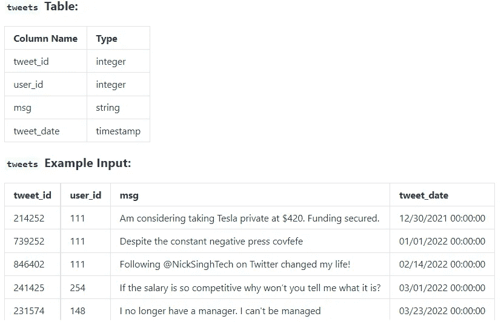

# 每日 SQL ~第 2 天

> 原文：<https://blog.devgenius.io/daily-sql-day-2-e2f9a1016770?source=collection_archive---------4----------------------->

## 提问由[的大狐猴](https://datalemur.com/)、[的标量](https://www.scaler.com/topics/sql/sql-query-execution-order/)进行练习


要快速修改 SQL 子句，请访问[***SQL cheat sheet***](https://medium.com/@imabhi1216/sql-revision-part-1-fed9b4106b82)

# [**1。推文直方图**](https://datalemur.com/questions/sql-histogram-tweets)

假设您收到了包含 tweet 数据的下表。编写一个查询来获得 2022 年每个用户发布的 tweets 的直方图。输出每个用户的 tweet 计数作为 bucket，然后输出落入该 bucket 的 Twitter 用户数。



***解决方案:***


# [**2。第二天确认**](https://datalemur.com/questions/second-day-confirmation)

新抖音用户用他们的电子邮件注册，每个用户都会收到一条确认激活他们账户的短信。假设你得到了下面关于电子邮件和短信的表格。

编写一个查询来显示在注册的第一天没有确认，但在第二天确认的用户的 id。

假设:

*   `action_date`是用户激活账户并通过文本确认注册的日期。


***解决方案:***


> ***注:***
> 
> `INNER JOIN`关键字选择在两个表中都有匹配值的记录。

```
SELECT *column_name(s)*
FROM *table1*
INNER JOIN *table2* ON *table1.column_name* = *table2.column_name*;
```

> [***来源***](https://www.w3schools.com/sql/sql_join_inner.asp)

# [3。 **Apple Pay 卷**卷](https://datalemur.com/questions/apple-pay-volume)

Visa 正试图分析其应用支付合作伙伴关系。计算通过 Apple Pay 进行交易的每个商家的总交易量。

按商家输出商家 ID 和总交易。对于没有 Apple Pay 交易的商户，输出其总交易量为 0。

按交易量降序显示结果。


***解决方案:***


> ***注:***
> 
> `CASE`表达式遍历所有条件，并在满足第一个条件时返回值(类似于 if-then-else 语句)。所以，一旦条件为真，它将停止读取并返回结果。如果没有条件为真，则返回`ELSE`子句中的值。
> 
> 如果没有`ELSE`部分并且没有条件为真，则返回 NULL。

```
CASE
 WHEN *condition1* THEN *result1*
 WHEN *conditionN* THEN *resultN*
 ELSE *result*
END;
```

> [***来源***](https://www.w3schools.com/sql/sql_case.asp)

# [**4。团队超级用户**](https://datalemur.com/questions/teams-power-users)

编写一个查询，查找 2022 年 8 月在微软团队中发送消息最多的前 2 名超级用户。显示这两个用户的 id 以及他们发送的邮件总数。以递减的消息数输出结果。

假设:

*   没有两个用户在 2022 年 8 月发送了相同数量的消息。


***解决方案:***


> ***注:***
> 
> 函数的作用是:从给定的日期中提取一个部分。
> 
> I/P:选择提取(从“2017–06–15”开始的月份)；
> 
> O/P: 6
> 
> [***来源***](https://www.w3schools.com/mysql/trymysql.asp?filename=trysql_func_mysql_extract)

# [5。**最高产品数量**](https://datalemur.com/questions/sql-highest-products)

假设您收到了下表，其中包含易贝客户的各种订单信息。编写一个查询来获取前 3 名客户购买的产品的用户 id 和数量；这些顾客总共至少花了 1000 美元。

以降序输出用户 id 和产品数量。为了打破平局(例如，如果两个顾客都购买了 10 件产品)，花费更多的用户应该优先。


***解决方案:***


> ***注:***
> 
> SQL 中 having 和 where 子句的区别在于，where 子句不能*或*用于聚合，但是 having 子句可以。
> 
> **where** 子句作用于行的数据，而不是聚合数据
> 
> [***来源***](https://www.geeksforgeeks.org/having-vs-where-clause-in-sql/)

# 参考资料:

# [数据狐猴](https://datalemur.com/)