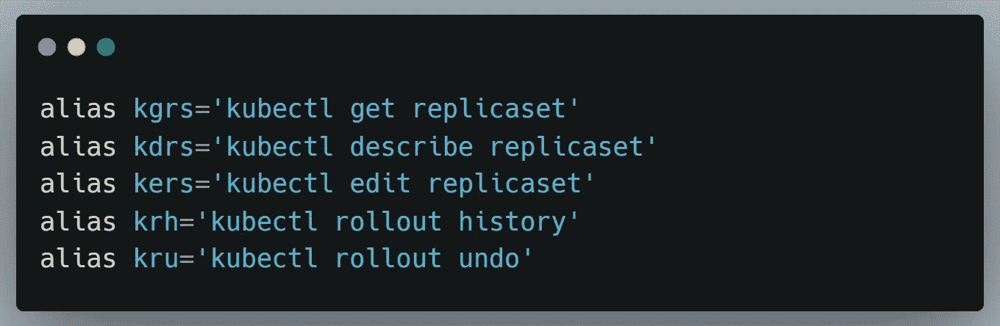

# 每日有用的 Kubernetes 别名

> 原文：<https://blog.devgenius.io/daily-useful-kubernetes-aliases-c35f7f411f39?source=collection_archive---------3----------------------->

在本文中，我将与您分享一些别名，这些别名将显著加快您与 k8 的交互。

下面是我使用过并且变得越来越有用的别名…

> 这个命令在日常生活和日常生活中经常用到。

> 对所有名称空间执行 **kubectl** 命令

> 应用 YML 文件

> 放入容器上的交互式终端

> 快速管理配置，在本地、开发和转移之间切换上下文

> 列出所有上下文

> 强制删除或删除

> Pod 管理。

> 通过标签获取 pod

> 按名称空间获取 pod

> 服务管理。

> 入口管理

> 配置地图管理

> 秘密管理

> 部署管理

> 推广管理

> Statefulset 管理。

> 端口转发

> 用于访问所有信息的工具

> 日志

> 存档原件

> 节点管理

> 聚氯乙烯管理

> 服务帐户管理

> DaemonSet 管理

> CronJob 管理

> 劳动管理

您可以从下面复制并粘贴所有别名。

谢谢你阅读这篇文章，❤

如果我做错了什么？让我在评论中。我很想进步。

拍手声👏如果这篇文章对你有帮助。