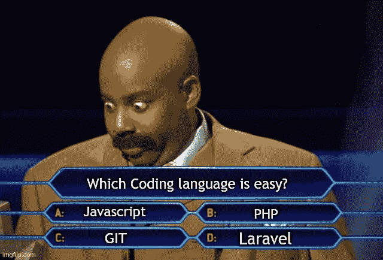

# 对 PHP 中严格类型的不必要的恐惧

> 原文：<https://blog.devgenius.io/dangerous-and-unnecessary-fears-of-strict-types-in-php-c24e5a3d240e?source=collection_archive---------2----------------------->

## 让我来说服你为什么你应该在 PHP 中拥抱严格类型，而不是害怕它！

图片由 Andrea Piacquadio 拍摄

因为您正在阅读这篇文章，所以您可能没有在 PHP 中使用“*严格类型*”声明。

你试过吗？也许你做了，但是错误的数量太多了。不用担心；没关系。但是我建议你尽快开始尝试**。**

**在 Medium.com 上，我们可以找到很多 PHP 代码片段。然而，我很少在头文件中看到有意识地使用类型或“严格类型”声明。这是为什么呢？**

**对我来说，这些程序员没有意识到他们正在剥夺自己的优点！几年前我们曾经这样编程；**现在是 PHP8.1，是时候继续前进了**！**

# **关于 PHP 的几句话**

**你知道 PHP 最强大的优势是什么，同时也是它最大的缺点是什么吗？是**动力型**系统**。****

**例如，在 PHP 中，这样的比较不成问题:**

**曾经在我看来是这种语言的好处，现在我认为它是纯粹的邪恶。这被称为“类型强制”或“类型杂耍”:**

# **救援的有意识程序**

**如何在 PHP 中启用“严格类型化”？没什么难的，只是过了**

**The beginnings might be tough. It’s because even the tiniest error in the types of variables will result in a TYPE_ERROR exception and application failure.**

**Forget running the snippet below. Code that used to run smoothly, won’t execute this time:**

**Types in PHP are something you might have ignored so far. From now on, you will need to know everything about the type of data that the variable stores; on each line. Int, string, boolean? Does the variable accept null values?**

**Variable types are dynamic in PHP. In the example below, the “foo” function cannot know in advance what data type it will be operating on.**

**The function will accept most of the data we pass on and perform the conversion gracefully:**

# **Advantages of strict types in PHP**

**The biggest bonus of using strict types in PHP will be **就少了**的 bug！**

**在开发过程中，您将很快发现代码没有正常运行的地方。**

**在像 C ++或 Java 这样的编译语言中，程序员可以避免基本的代码错误，因为编译器负责验证代码。变量类型之间的错误会导致编译错误。**

**PHP 是一种可解释的语言。我们在运行时了解解释错误，可能是在生产服务器上。第一个发现问题的人将是我们的客户(当然。)**

**我宁愿避开它，你呢？我希望我的代码是最高质量的，没有错误，没有漏洞。我是一名专业人士，我希望我的客户能够依赖我。**

> **我们客户的成功就是我们的成功。**

# **样本迁移**

**当前代码的迁移必须一个文件一个文件地开始。途中大概会有很多空隙。考虑一个示例控制器:**

**我们能说这个代码在任何情况下都会工作吗？我们几乎知道它在这一点上是可行的。毕竟，我们测试了这段代码，并且“它对我有效。”**

**一周后，我们突然接到一个电话。我们系统的销售转换率下降到几乎为零。**

**经过一个小时的调试，原来是前端开发人员在表单中犯了一个小错误，停止发送“用户名”字段。**

**该应用程序有一个附加的错误监控系统。错误数量的增加会生成一个警告，并向管理员发送一封警告电子邮件。在这种情况下，没有发生类似的事情，也没有发出警报。**

**为什么？LoginService 的“authenticate”方法接受字符串。由于作者没有声明“严格类型”，PHP 引擎很高兴地假定传递的“null”值是一个空字符串。**

**导致客户无法登录个人账户！**

********

**同一个开发人员昨天正在阅读一本关于 Medium 的出版物，并决定有意识地开始**编程**。**

**他检查了控制器中使用的每个方法和类，验证了所有的输出和输入，记录了它们，并进行了修正。**

**重构后的方法如下所示:**

**程序员“浪费”了一些时间记录代码，但是得到了一个在任何情况下都无法破解的代码**。****

**PHP 中的严格类型初看起来可能有问题。对于程序员新手来说，这似乎完全没有必要。**

**它需要花更多的时间阅读文档。**

**必须验证函数和方法的输入和输出，并对变量进行注释。**

**然而，这样的**防御性编程**很快就会成为**一种你会很快喜欢上的习惯**。相信我！记住这是一项有回报的投资。**

**我敢肯定，你不会想要一栋由粗心的建筑商建造的房子，或者驾驶一辆由易腐材料设计的汽车。**

**我们毕竟是软件工程师，我们构建代码。让我们确保它是高质量的。让我们有意识地开始**编程**。**