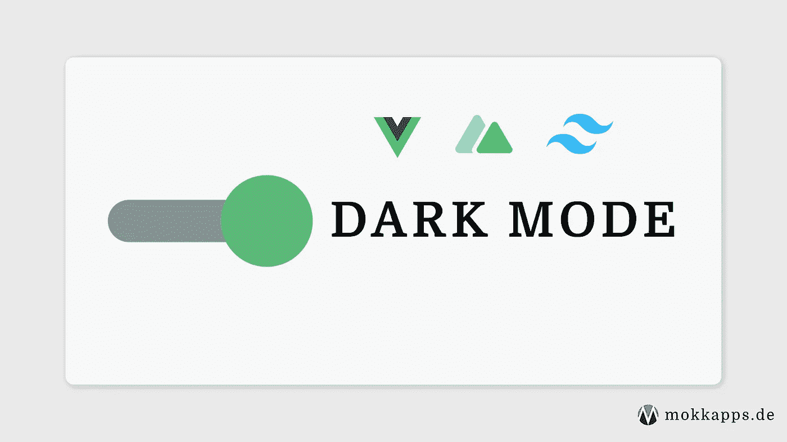
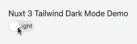

# 带顺风 CSS 和 Nuxt 3 的黑暗模式开关

> 原文：<https://blog.devgenius.io/dark-mode-switch-with-tailwind-css-nuxt-3-2a8f313a3925?source=collection_archive---------12----------------------->



我目前正在用仍处于测试阶段的 Nuxt 3 重写我的作品集网站。在这篇文章中，我想向你展示我是如何使用 [Tailwind CSS](https://tailwindcss.com/) 在 Nuxt 3 中实现黑暗模式切换的，我将在我的新作品集网站中使用它。

# 创建 Nuxt 3 项目

要创建一个新的 Nuxt 3 项目，我们需要在终端中运行这个命令:

```
npx nuxi init nuxt3-app
```

# 添加顺风 CSS 3

接下来，我们添加了 [nuxt/tailwind](https://tailwindcss.nuxtjs.org) 模块，它提供了一个支持 Nuxt 3 和 Tailwind CSS v3 的[预发布版本](https://tailwindcss.nuxtjs.org/releases/#Nuxt%203%20and%20Tailwindcss%203%20support):

```
npm install --save-dev @nuxtjs/tailwindcss@5.0.0-4
```

然后我们需要将这个模块添加到`nuxt.config.js`中的`buildModules`部分:

```
import { defineNuxtConfig } from 'nuxt3';

// https://v3.nuxtjs.org/docs/directory-structure/nuxt.config
export default defineNuxtConfig({
  // highlight-next-line
  buildModules: ['@nuxtjs/tailwindcss'],
});
```

现在，我们可以通过运行以下命令来创建顺风配置文件`tailwind.config.js`:

```
npx tailwindcss init
```

让我们在`./assets/css/tailwind.css`添加一个基本的 CSS 文件(更多配置选项参见[正式文档](https://tailwindcss.nuxtjs.org/setup#tailwind-files)):

```
@tailwind base;
@tailwind components;
@tailwind utilities;

.theme-light {
  --background: #f8f8f8;
  --text: #313131;
}

.theme-dark {
  --background: #313131;
  --text: #f8f8f8;
}
```

我们为黑暗和光明主题定义了两个 CSS 类。 [CSS 变量](https://developer.mozilla.org/en-US/docs/Web/CSS/Using_CSS_custom_properties)(用`--`表示)用于根据选择的主题动态改变 CSS 值。

因此，我们需要在我们的`tailwind.conf.js`中定义这些颜色:

```
module.exports = {
  content: [
    `components/**/*.{vue,js,ts}`,
    `layouts/**/*.vue`,
    `pages/**/*.vue`,
    `app.vue`,
    `plugins/**/*.{js,ts}`,
    `nuxt.config.{js,ts}`,
  ],
  theme: {
    extend: {
      colors: {        themeBackground: 'var(--background)',        themeText: 'var(--text)',      },    },
  },
  plugins: [],
};
```

# 实现主题切换

让我们开始实现一个主题切换，将这个简单的模板添加到我们的`app.vue`组件中:

```
<template>
  <div
    :class="{
      'theme-light': !darkMode,
      'theme-dark': darkMode,
    }"
    class="h-screen bg-themeBackground p-5"
  >
    <h1 class="text-themeText">Nuxt 3 Tailwind Dark Mode Demo</h1>
    <Toggle v-model="darkMode" off-label="Light" on-label="Dark" />
  </div>
</template>
```

在`div`容器元素上，我们基于反应性`darkMode`变量值动态设置`theme-light`或`theme-dark` CSS 类，我们将在组件的`script`部分稍后实现。

`h1`和容器`div`元素使用我们的 Tailwind CSS 类`bg-themeBackground`和`text-themeText`来使用特定于主题的颜色作为背景和文本颜色。

此外，我们使用 [Vue 3 Toggle](https://github.com/vueform/toggle) 库在我们的主题之间切换。

我们来看看`app.vue`的`script`部分:

```
<script setup lang="ts">
import Toggle from '@vueform/toggle';
import { useState } from '#app';
import { onMounted, watch } from '@vue/runtime-core';

type Theme = 'light' | 'dark';

const LOCAL_STORAGE_THEME_KEY = 'theme';

const darkMode = useState('theme', () => false);

const setTheme = (newTheme: Theme) => {
  localStorage.setItem(LOCAL_STORAGE_THEME_KEY, newTheme);
  darkMode.value = newTheme === 'dark';
};

onMounted(() => {
  const isDarkModePreferred = window.matchMedia(
    '(prefers-color-scheme: dark)'
  ).matches;

  const themeFromLocalStorage = localStorage.getItem(
    LOCAL_STORAGE_THEME_KEY
  ) as Theme;

  if (themeFromLocalStorage) {
    setTheme(themeFromLocalStorage);
  } else {
    setTheme(isDarkModePreferred ? 'dark' : 'light');
  }
});

watch(darkMode, selected => {
  setTheme(selected ? 'dark' : 'light');
});
</script>
```

我们将选定的主题值存储在本地存储器[中，并使用](https://developer.mozilla.org/en-US/docs/Tools/Storage_Inspector/Local_Storage_Session_Storage)[使用状态](https://v3.nuxtjs.org/docs/usage/state)来定义一个名为`darkMode`的反应变量:

```
const darkMode = useState('theme', () => false);
```

如果组件已安装，我们首先通过使用[CSS 媒体功能“prefers-color-scheme”](https://developer.mozilla.org/en-US/docs/Web/CSS/@media/prefers-color-scheme)检测用户请求的是浅色还是深色主题:

```
const isDarkModePreferred = window.matchMedia(
  '(prefers-color-scheme: dark)'
).matches;
```

然后，我们根据本地存储值设置主题值:

```
const setTheme = (newTheme: Theme) => {
  localStorage.setItem(LOCAL_STORAGE_THEME_KEY, newTheme);
  darkMode.value = newTheme === 'dark';
};

onMounted(() => {
  const isDarkModePreferred = window.matchMedia(
    '(prefers-color-scheme: dark)'
  ).matches;

  const themeFromLocalStorage = localStorage.getItem(    LOCAL_STORAGE_THEME_KEY  ) as Theme;  if (themeFromLocalStorage) {    setTheme(themeFromLocalStorage);  } else {    setTheme(isDarkModePreferred ? 'dark' : 'light');  }});
```

这是完整的`app.vue`组件代码:

```
<template>
  <div
    :class="{
      'theme-light': !darkMode,
      'theme-dark': darkMode,
    }"
    class="h-screen bg-themeBackground p-5"
  >
    <h1 class="text-themeText">Nuxt 3 Tailwind Dark Mode Demo</h1>
    <Toggle v-model="darkMode" off-label="Light" on-label="Dark" />
  </div>
</template>

<script setup lang="ts">
import Toggle from '@vueform/toggle';
import { useState } from '#app';
import { onMounted, watch } from '@vue/runtime-core';

type Theme = 'light' | 'dark';

const LOCAL_STORAGE_THEME_KEY = 'theme';

const darkMode = useState('theme', () => false);

const setTheme = (newTheme: Theme) => {
  localStorage.setItem(LOCAL_STORAGE_THEME_KEY, newTheme);
  darkMode.value = newTheme === 'dark';
};

onMounted(() => {
  const isDarkModePreferred = window.matchMedia(
    '(prefers-color-scheme: dark)'
  ).matches;

  const themeFromLocalStorage = localStorage.getItem(
    LOCAL_STORAGE_THEME_KEY
  ) as Theme;

  if (themeFromLocalStorage) {
    setTheme(themeFromLocalStorage);
  } else {
    setTheme(isDarkModePreferred ? 'dark' : 'light');
  }
});

watch(darkMode, selected => {
  setTheme(selected ? 'dark' : 'light');
});
</script>

<style src="@vueform/toggle/themes/default.css"></style>
```

现在，我们可以使用运行以下命令在开发模式下启动我们的 Nuxt 应用程序:

```
npm run dev
```

最后，我们可以在`[http://localhost:3000](http://localhost:3000:)` [:](http://localhost:3000:) 测试我们的黑暗模式主题开关



# StackBlitz 演示

我的简单演示是交互式 StackBlitz 演示:

[https://stackblitz.com/github/bnmipwkmo?embed=1](https://stackblitz.com/github/bnmipwkmo?embed=1&file=package-lock.json)

或者，您也可以使用支持 Nuxt Bridge 和 Nuxt 3 的[颜色模式](https://color-mode.nuxtjs.org/)模块。

# 结论

本文向您展示了如何使用 Tailwind CSS v3 在 Nuxt 3 中创建一个简单的黑暗模式开关。在接下来的几个月里，你可以期待更多的 Nuxt 3 帖子，因为我计划写一些我重写作品集网站时发现的有趣话题。

如果你喜欢这篇文章，请在 Twitter 上关注我，从我这里获得关于新博客文章和更多内容的通知。

或者(或者另外)，你也可以[订阅我每周的 Vue.js 简讯](https://mokkapps.de/newsletter)。

*原载于*[*https://mokkapps . de*](https://mokkapps.de/blog/dark-mode-switch-with-tailwind-css-and-nuxt-3/)*。*