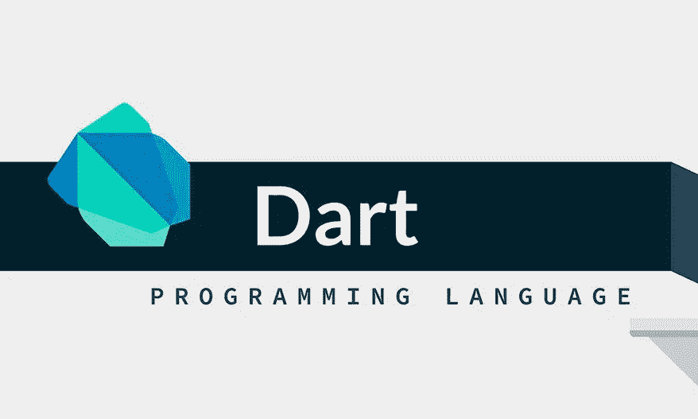

# 飞镖:基础

> 原文：<https://blog.devgenius.io/dart-the-basics-1e9bee78c644?source=collection_archive---------3----------------------->

照片由[索加特·哈尔德](https://datafloq.com/user/saugat-halder)

# Dart 是什么？

Dart 是一种客户端优化编程语言，适用于移动、Web、桌面和服务器等多种平台上的应用程序。

Dart 由 Google 开发，2011 年 10 月 10 日至 12 日，Dart 在丹麦 GOTO 大会上亮相。这个项目是由*拉斯巴克*和*卡斯伯隆德*创立的。Dart 版本于 2013 年 11 月 14 日发布。

Dart 是一种面向对象、垃圾回收、基于类的语言，具有 C 风格的类型语法。它还可以编译成本机代码或 javascript。

从 Reddit/Giphy 得到的

# 镖柱

1.  **针对用户界面进行了优化**

*   对于包含事件驱动代码的用户界面，它已经成熟并完成了 ***async-await*** ，并与基于隔离的并发进行了比较
*   编程语言在构建具有特性的用户界面方面进行了优化(扩展操作符和用于定制 UI 的集合)。
*   因为熟悉语法，所以很容易学。

**2。生产发展**

*   通过热重新加载，对代码的更改会迭代进行，以便立即看到正在运行的应用程序上的更改。
*   具有丰富静态分析和强大配置工具的灵活类型系统。

**3。在所有平台上都很快**

*   提前(AOT)应用程序到本地代码的即时启动。
*   完整、成熟、快速的 javascript 编译器。
*   后端代码也支持应用程序，用单个代码库编写。

# **编码时间到了！！！**

哈克农/吉菲

对于编码部分，我们将只处理像 ***变量******条件语句*** 和**更多的基础知识！**

以防你的设备上没有安装 dart。你可以去这个[**链接**](https://dart.dev/get-dart) 或者你可以用这个 [**标板**](https://dartpad.dev/) 。

1.  先拿我们的`Hello World`节目吧！

*   **main()** 函数是 Dart 中预定义的方法，它充当应用程序的入口点。
*   **print()** 是预定义的功能，显示特定值到终端/命令提示符的输出。

2.数据类型

*   **Integer (int)** 表示为非小数值。
*   **Double(双精度)**支持小数值。
*   **字符串**代表一个字符序列。
*   **布尔(bool)** 表示为*真*或*假*

3.变量

*   变量是存储值的“内存中的名称空间”。换句话说，它是价值的容器。
*   变量也被称为**标识符**。
*   ***int*** ， ***double*** ， ***String*** 和 ***bool*** 是语法的类型， ***var*** 自动检测是什么数据类型。

4.条件语句

*   **如果..**语句是验证或者用另一个术语来说，它是选项。

> *如果* **反整数恰好为零** *，则执行输出* `*Got it*` *。*

输出:`Got it`

*   如果..其他..声明
*   **如果..**是验证或者用另一个术语来说，是选项。
*   **别的..**如果在验证上 if 不匹配，else 就默认执行，简而言之，最后选择或不选择。

> *如果* **反整数恰好为一个** *，则执行* `*Got it*` *，但如果* **不是** *，则执行* `*No Choice*` *。*

输出:`No Choice`

*   如果..埃尔塞夫..else 语句
*   **如果..**是验证或者用另一个术语来说，是选项。
*   **埃尔塞夫..**是验证还是用另一个术语来说，它是另一个选项。
*   **目不斜视..**如果在验证上 if 不匹配，else 就默认执行，简而言之，最后选择或不选择。

> *如果* **反整数恰好等于一个** *，则执行* `*Got it*` *，对于选项二，如果* **反整数恰好等于零** *，则执行* `*Got it 1*` *，但如果* **与两个选项** *相邻，则执行* `*No Choice*`

*输出:`Got it 1`*

*注意:您可以添加更多的`else if {}`语句。*

*今天就到这里吧！我希望你喜欢这篇文章，你会学到新的东西！敬请关注下一篇文章！❤*

*Chuber 频道/giffy*