# 基于 Python 的新年决心数据分析

> 原文：<https://blog.devgenius.io/data-analysis-of-new-years-resolution-using-python-63e98bb50f92?source=collection_archive---------6----------------------->

## 分析来自卡格尔的公共数据集


照片由:蒂姆·莫斯霍尔德在 unsplash.com 拍摄

二月就要到了，这是新年决心失败的正式月份。话虽如此，这是一个分析我们可以从新年决心数据集中学到什么的好季节。

我们将在这里使用的是来自卡格尔的药物。这是下载数据集的[链接](https://www.kaggle.com/andrewmvd/new-years-resolutions)。根据文件上传者，数据集包含 5011 条关于 2015 年新年决心的推特。从挖掘的数据中瞥一眼，你会得到一个大致的想法，即高音用户来自美国。

在这个真实世界的练习中，我们将解决以下问题:

*   将 csv 文件转换为数据帧。
*   对一些简单错误进行故障诊断。
*   检查缺失的值。
*   基于不同特征的分组数据。
*   根据不同因素找到新年决心的最高次数。
*   获得从最高到最低的最高推特，反之亦然。
*   创建线图。
*   创建条形图。

> **重要提示:**我在这里使用了 **jupyter 笔记本**来运行代码。本教程假设您知道如何用 python 编码。如果是第一次，这个 [**链接**](https://arc-sosangyo.medium.com/list/introduction-to-python-programming-80e79264dcad) 可以帮你建立你的 python 基础。

# 导入库

所需的库如下:

*   **大熊猫**用于操作和分析。
*   **Matplotlib** 和 **Seaborn** 进行数据可视化。

```
import pandas as pd
import matplotlib.pyplot as plt
import seaborn as sns%matplotlib inline
```

# 加载数据集

我们将使用 *read_csv* 函数读取 csv 文件，并将其存储在名为 df 的[变量](https://medium.com/dev-genius/introduction-to-python-programming-variables-and-data-types-ef29710fad9e)中。

```
df = pd.read_csv('new_year_resolutions_dataset.csv')
```

我这么早打开 csv 文件时出错了。

```
ParserError: Error tokenizing data. C error: Expected 4 fields in line 18, saw 5
```

根据显示的错误，我们在这里看到了一个解析器问题。让我们调查并打开文件，看看数据是什么样子的。

如果您打开文件，您会注意到 csv 文件的分隔符不是逗号，而是分号(数据集的上传者也指出了这一点)。所以解析器很难知道它应该使用什么分隔符。让我们这样指定分隔符:

```
df = pd.read_csv('new_year_resolutions_dataset.csv', *sep*=';')
```

太好了，错误消失了。

# 数据审计

让我们看看数据框是什么样子的。

```
df
```

执行上述命令后，我们对将要处理的数据有了一个大致的了解。现在让我们得到一些关于数据帧的更详细的信息。从它的形状开始。

```
df.shape
```

输出为:

```
(5002, 14)
```

根据输出，数据帧由 5002 行和 14 列组成。到目前为止，这意味着我们有 5002 条推文可以处理和分析。这个数字离 5011 并不遥远。

得到形状后，让我们得到关于数据框的一般信息。

```
df.info()
```

这是输出的屏幕截图:

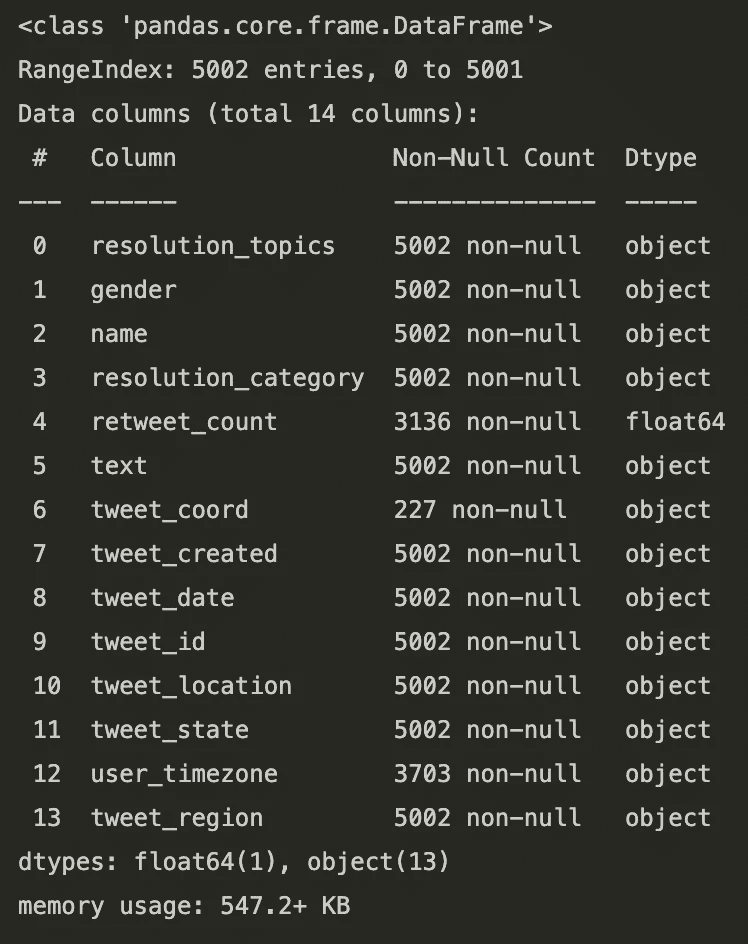

图一。数据框信息

这些信息告诉我们，这里有许多缺失的值。让我们得到这个数据集中所有缺失值的总和。

```
df.isnull().sum()
```

这是输出的屏幕截图:

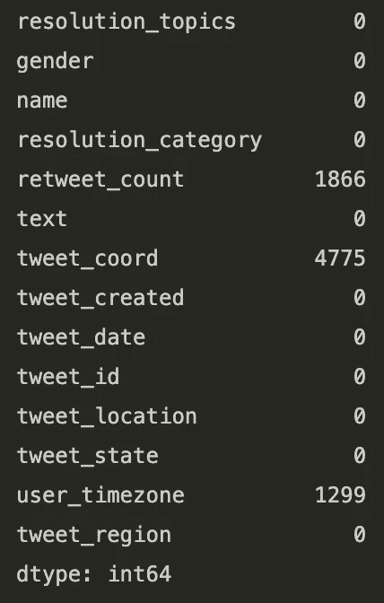

图二。每列所有缺失值的总和

根据上述结果，其中 3 列缺少数千个值。

# 删除列

在我们处理丢失的值之前，让我们再次查看一下数据框，并删除我们不需要的列。

> **重要提示:**如果这是您第一次学习数据科学。删除哪些列没有对错之分。这是基于与需要什么信息相关的个人偏好。

出于对用户隐私的考虑，我将删除用户名和 tweet_id。然后，我将不再需要 retweet_count、text、tweet_coord、tweet_created、tweet_id 和 user_timezone，所以我也将删除这些列。

```
dataFrame = df.drop(*columns*=['name', 'retweet_count', 'text', 'tweet_coord', 'tweet_created', 'tweet_id', 'user_timezone'])
```

我将结果存储在一个新变量中。我们来验证一下。

```
dataFrame
```

这是输出的屏幕截图:

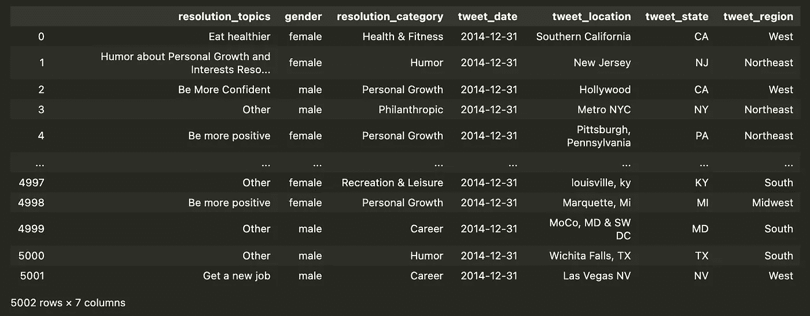

图 3。验证数据帧

让我们再检查一下是否还有缺失的数据。

```
dataFrame.isnull().sum()
```

这是输出的屏幕截图:

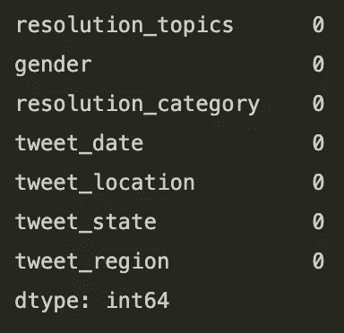

图 4。如果有丢失的数据，请再次验证

很好。不再需要处理丢失的值。

在我们完成清洁之后，是时候分析我们可以从数据中学到什么了。个人的新年决心在“决心 _ 主题”栏中。所以让我们数一数我们在数据集中有多少新年决心。

```
dataFrame['resolution_topics'].count()
```

输出仍然是 5002，这与我们最初从数据帧的第一个版本中获得的结果相同。

# 按日期发布推文

我想知道每天的推文数量。让我们通过对所有相同的日期进行分组，然后计算总数，来关注 tweet_date 列。

```
tweetDate = dataFrame.groupby('tweet_date').count()
```

之后重置索引是很重要的。

```
tweetDate.reset_index(*inplace*=True)
```

然后验证数据处理后的样子。

```
tweetDate[['tweet_date', 'resolution_topics']]
```

这是输出的屏幕截图:

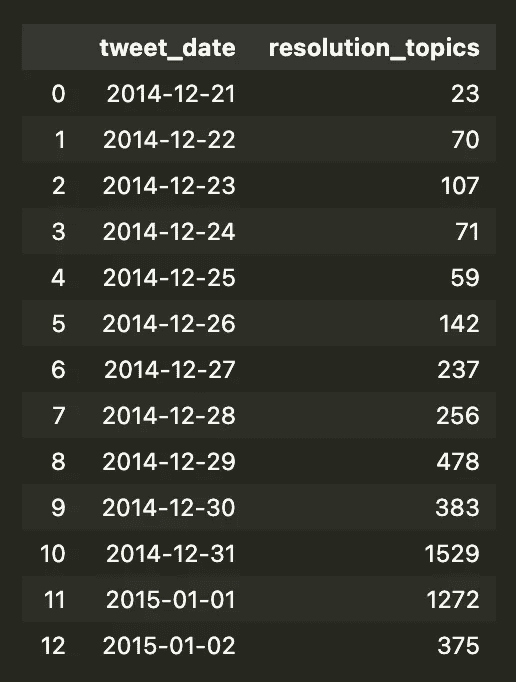

图 5。每天的决议数量

来看看最早的推文。

```
tweetDate['tweet_date'].min()
```

输出是:

```
'2014-12-21'
```

最后一条微博怎么样？

```
tweetDate['tweet_date'].max()
```

输出是:

```
'2015-01-02'
```

然后让我们来看看按日期排列的前 5 条最高推文。

```
tweetDate.sort_values(*ascending*=False, *by*=['resolution_topics']).head(5)[['tweet_date', 'resolution_topics']]
```

这是输出的屏幕截图:

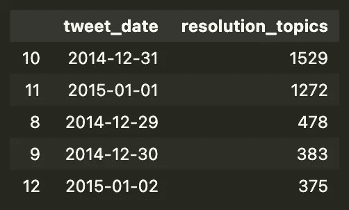

图 6。按日期排列的前 5 条最高推文

最后，让我们通过创建图表来可视化数据。

```
plt.figure(*figsize*=(10,5)) # Adjust the size of the graphtweetDatePlot = sns.lineplot(*data*=tweetDate, *x*='tweet_date', *y*='resolution_topics') # Creates the graphtweetDatePlot.tick_params(*axis*='x', *rotation*=90) # turn the xlabel to 90 degrees.  Or else, the labels will be on top of one another.
```

我在每一行都加了注释来解释它的目的。

图表看起来是这样的:

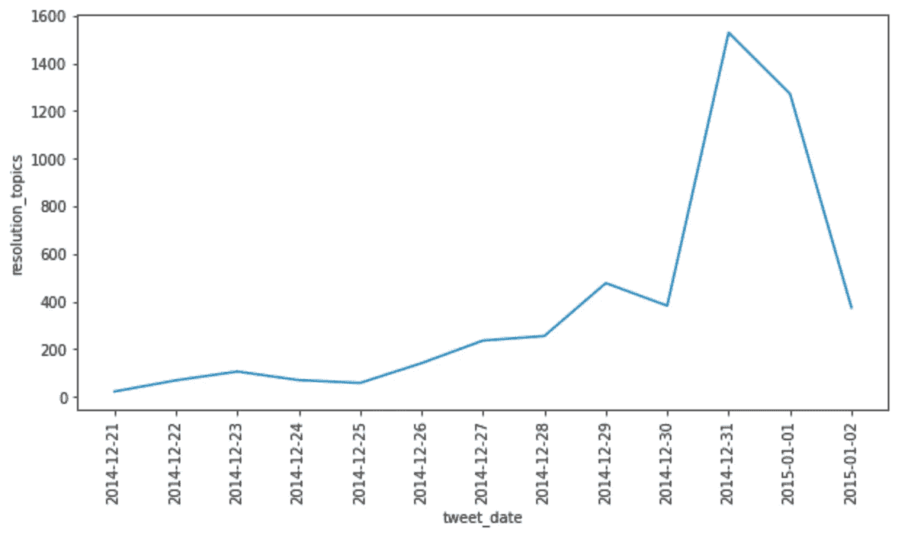

图 7。每天的推文数量

# 各州的推文

我想知道每个州的推文。所以先把 tweet_state 分组，然后统计每个状态的总分辨率。

```
tweetState = dataFrame.groupby('tweet_state').count()
```

之后重置索引是很重要的。

```
tweetState.reset_index(*inplace*=True)
```

然后验证数据处理后的样子。

```
tweetState[['tweet_state', 'resolution_topics']]
```

让我们来看看各州的最高推文数量。

```
tweetState[tweetState.resolution_topics == tweetState.resolution_topics.max()][['tweet_state', 'resolution_topics']]
```

下面的图 8 显示它是有 739 条 tweets 的 CA。

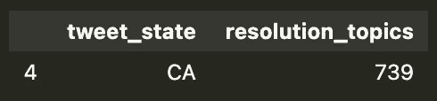

图 8。各州最高的推文数量

各州最低的推文数量怎么样？

```
tweetState[tweetState.resolution_topics == tweetState.resolution_topics.min()][['tweet_state', 'resolution_topics']]
```

下面的图 9 显示了只有 3 条 tweets 的 ND。

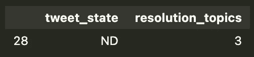

图 9。各州最低的推文数量

现在我们来看看各州排名前五的推文。

```
tweetState[['tweet_state', 'resolution_topics']].sort_values(*by*='resolution_topics', *ascending*=False).head(5)
```

这是输出的屏幕截图:

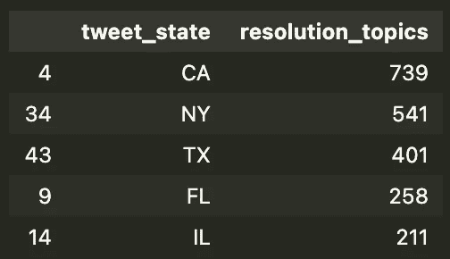

图 10。五大州

各州最少的 5 条微博怎么样？

```
tweetState[['tweet_state', 'resolution_topics']].sort_values(*by*='resolution_topics').head(5)
```

这是输出的屏幕截图:

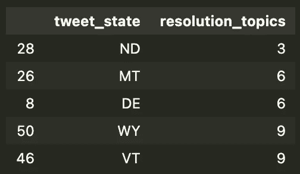

图 11。各州最少的五条推文

最后，让我们通过创建图表来可视化数据。

```
plt.figure(*figsize*=(20,5))sns.barplot(*data*=tweetState, *x*='tweet_state', *y*='resolution_topics')
```

图表看起来是这样的:

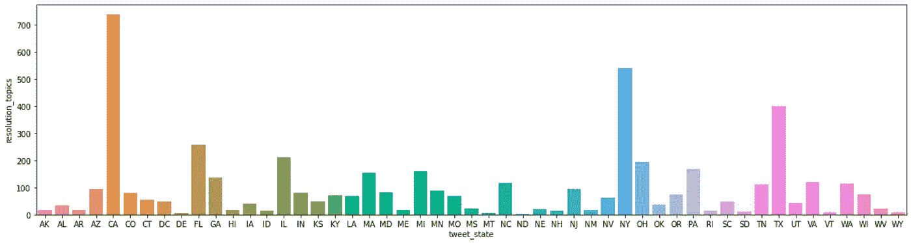

图 12。每个州的推文数量

# 每个地区的推文

这一次，我想知道每个地区的推文。将 tweet_region 分组，然后计算每个区域的总分辨率。

```
tweetRegion = dataFrame.groupby('tweet_region').count()
```

之后重置索引是很重要的。

```
tweetRegion.reset_index(*inplace*=True)
```

然后验证数据处理后的样子。

```
tweetRegion[['tweet_region', 'resolution_topics']]
```

这是输出的屏幕截图:

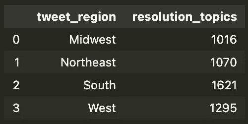

图 13。每个区域的分辨率数量

让我们从最高数字到最低数字排列它。

```
tweetRegion[['tweet_region', 'resolution_topics']].sort_values(*by*='resolution_topics', *ascending*=False)
```

这是输出的屏幕截图:

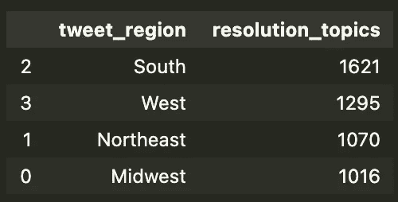

图 14。从最高到最低排列

现在让我们用图表来显示数据。

```
plt.figure(*figsize*=(10,5))sns.barplot(*data*=tweetRegion, *x*='resolution_topics', *y*='tweet_region')
```

图表看起来是这样的:

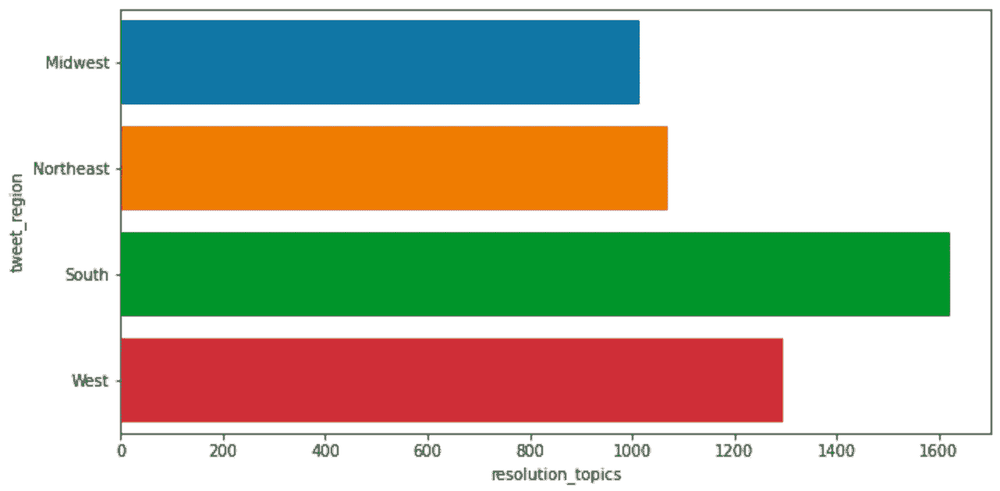

图 15。每个地区的推文数量

# 按性别分类的推文

我想知道谁发的新年决心微博最多(女性或男性)。将数据按性别分组，然后计算每个性别的总分辨率。

```
tweetGender = dataFrame.groupby('gender').count()
```

之后重置索引是很重要的。

```
tweetGender.reset_index(*inplace*=True)
```

然后验证数据处理后的样子。

```
tweetGender[['gender', 'resolution_topics']]
```

这是输出的屏幕截图:

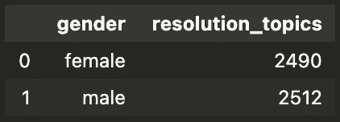

图 16。按性别分列的决议数量

最后，可视化数据。

```
sns.barplot(*data*=tweetGender, *x*='gender', *y*='resolution_topics', *order*=['male', 'female'])
```

图表看起来是这样的:

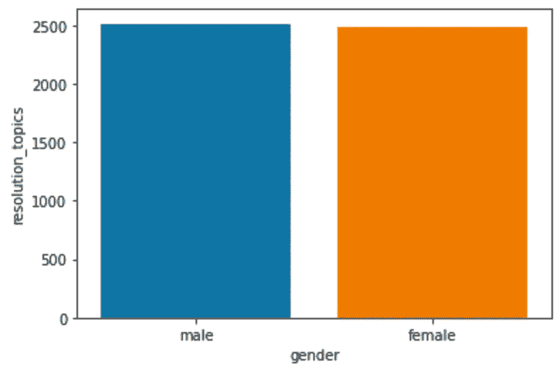

图 17。按性别分列的推文数量

# 分类推文

我想知道推文的分类。按 resolution_category 对数据分组，然后按类别计算总分辨率。

```
tweetCategory = dataFrame.groupby('resolution_category').count()
```

之后重置索引是很重要的。

```
tweetCategory.reset_index(*inplace*=True)
```

然后验证数据处理后的样子。

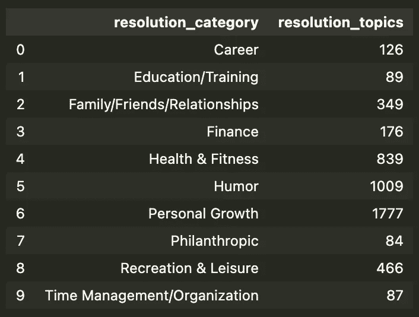

图 18。每个类别的解决方案数量

我们来看看按类别分类的最高推文数量。

```
tweetCategory[tweetCategory.resolution_topics == tweetCategory.resolution_topics.max()][['resolution_category', 'resolution_topics']]
```

这是输出的屏幕截图:

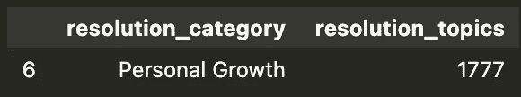

图 19。按类别分类的最高推文

最低的怎么样？

```
tweetCategory[tweetCategory.resolution_topics == tweetCategory.resolution_topics.min()][['resolution_category', 'resolution_topics']]
```

这是输出的屏幕截图:

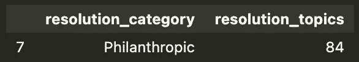

图 20。按类别分类的最少推文

我有兴趣看看前 3 名。

```
tweetCategory[['resolution_category', 'resolution_topics']].sort_values(*by*='resolution_topics', *ascending*=False).head(3)
```

这是输出的屏幕截图:

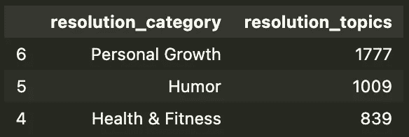

图 21。按类别排列的前 3 条推文

我还想知道分类中最少的 3 条推文。

```
tweetCategory[['resolution_category', 'resolution_topics']].sort_values(*by*='resolution_topics').head(3)
```

这是输出的屏幕截图:

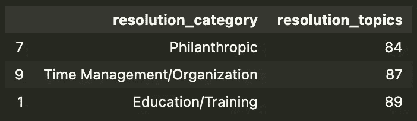

图 22。分类中最少的 3 条推文

最后，让我们看看如果我们将数据可视化会是什么样子。

```
plt.figure(*figsize*=(10,7))tweetRegionPlot = sns.barplot(*data*=tweetCategory, *x*='resolution_category', *y*='resolution_topics')tweetRegionPlot.tick_params(*axis*='x', *rotation*=90)
```

图表看起来是这样的:

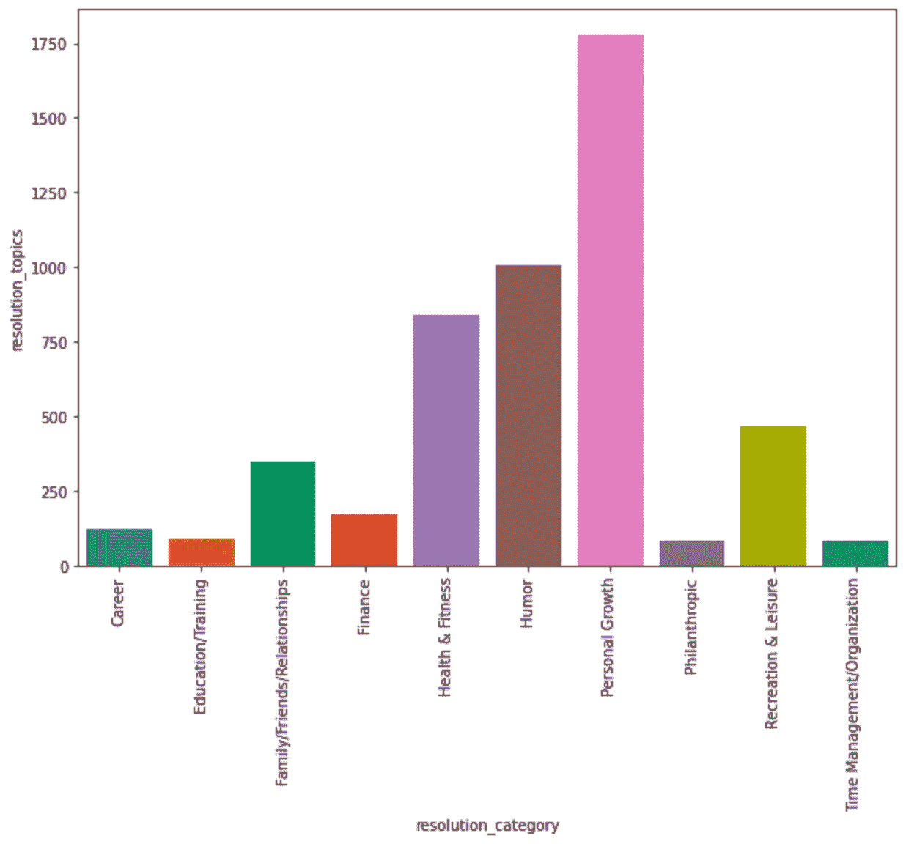

图 23。按类别分类的推文数量

# 我们从数据中学到了什么

2015 新年决心。基于收集的 5002 条推文。以下是我们学到的要点:

早在 2014 年 12 月 21 日，人们就开始在推特上发布他们的新年决心。这种趋势一直持续到 2015 年 1 月 2 日。

2014 年 12 月 31 日，与新年决心相关的推文数量最高。

最高的 3 条推文日期:
1。2014–12–31
2。2015–01–01
3。2014–12–29

加利福尼亚州的新年决心推特数量最多。纽约排名第二，其次是得克萨斯州第三。

根据处理后的数据，我们可以假设前 3 个州的高音用户数量最多。

南部地区的推文总量最高。与东北部和中西部地区相比高出约 50%。

男性和女性用户的推文差别很小。所以这不是一个很好的指标来衡量谁发的微博最多。关于这个因素，我们需要更多的数据。

根据分类排名前三的推文:大多数人对改善个人成长更感兴趣，包括健康和健身。但大量用户只是想拿新年决心开玩笑。

特别感谢以下用于本文的数据集。

[](https://www.crowdflower.com/data-for-everyone/) [## 数据集资源中心

### 我们的高质量可授权数据集为启动您的人工智能项目，我们提供了一个广泛的“现成”目录…

www.crowdflower.com](https://www.crowdflower.com/data-for-everyone/) [](https://www.kaggle.com/andrewmvd/new-years-resolutions) [## 新年的决心

### 5011 条包含新年决心的推文。

www.kaggle.com](https://www.kaggle.com/andrewmvd/new-years-resolutions) 

愿法典与你同在，

-电弧