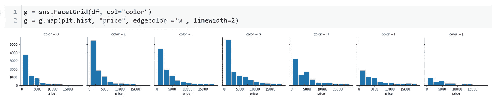

# 使用 Seaborn 的 FacetGrid 可视化进行数据分析

> 原文：<https://blog.devgenius.io/data-analysis-using-facetgrid-visualization-of-seaborn-882606408c39?source=collection_archive---------0----------------------->


[麦凯文](https://unsplash.com/@kivenage?utm_source=medium&utm_medium=referral)在 [Unsplash](https://unsplash.com?utm_source=medium&utm_medium=referral) 上的照片

让我们讨论在使用 Seaborn 的 Facetgrid 方法分析数据时可用的不同可视化技术。

Facetgrid 是一种方法，在这种方法中，我们可以以网格状结构的形式绘制数据。根据需要，我们可以达到三个层次的细节，即行、列和色调。

对于创建简单的绘图，我们只需要声明行和列信息，但是如果我们需要向图表添加更多的细节，我们可以使用 hue 参数。

色调参数的目的是使用颜色作为工具在图表中插入第三维细节，这使我们能够研究数据集中各列的相互作用。

为了理解这一点，让我们以 seaborn 的钻石数据集为例，应用不同的参数。

第一步是将数据加载到我们的环境中。

我们可以通过运行以下命令来实现这一点:

```
df = sns.load_dataset('diamonds')
```

接下来，我们将查看前五个条目来理解数据。我们可以使用“head”方法来实现这一点，如下所示:

```
df.head()
```


作者图片

我们可以看到数据有三个分类变量。*对于 FacetGrid 图，我们应该使用分类变量来定义行和列。*

让我们执行一个例子来理解这一点。我们将绘制克拉和价格之间的散点图，但是刻面网格将包含放置在列和行参数中的切割和颜色。

首先，让我们在数据框上运行该方法，并查看生成的输出。

我们可以运行以下命令来达到上述要求:

```
sns.FacetGrid(df)
```


作者图片

我们观察到整个图表是空白的，x 轴和 y 轴的值从 0 到 1。起初，输出可能会令人困惑，因为我们已经将整个数据框传递给了面格网。

现在，让我们将行和列参数详细信息添加到前面的命令中，如下所示:

```
sns.FacetGrid(df, col='cut', row='color')
```

当我们运行上面的命令时，我们看到生成了一个空图矩阵作为输出，如下所示:


作者图片

让我们计算唯一值的数量，以交叉检查生成的矩阵的数量。

我们可以通过在所需的列上使用“nunique”方法来做到这一点，如下所示的
:

```
df['color'].nunique()df['cut'].nunique()
```


作者图片

我们可以看到，我们有 7 乘以 5，即 35 个不同的组合生成。
我们观察到，在先前运行的面网格命令的输出中，我们有相同数量的矩阵。

现在，我们将添加一个散点图到刻面网格与克拉和价格之间的绘图。

我们可以通过以下方式实现这一点:

```
g = sns.FacetGrid(df, col='cut', row='color')
g.map(sns.scatterplot, "carat", "price")
```

我们来分解一下上面的代码，了解一下步骤。首先，我们将刻面网格命令分配给变量‘g’。
接下来，我们使用 map 方法对生成的组合应用克拉与价格散点图。

上述代码生成以下输出:


作者图片

让我们在上面的代码中应用 hue 参数，看看输出。我们可以通过运行以下命令来实现这一点:

```
g = sns.FacetGrid(df, col='cut', row='color', hue='clarity')
g.map(sns.scatterplot, "carat", "price")
```

我们得到以下输出:


作者图片

我们可以只使用一个参数来创建自定义图表。假设我们想要为特定的钻石颜色创建价格直方图。

我们可以通过运行以下命令来达到上述要求:

```
g = sns.FacetGrid(df, col="color")
g = g.map(plt.hist, "price", edgecolor ='w', linewidth=2)
```

执行上述代码后，我们得到了下面的图表:



作者图片

如果你仔细看看上面的代码，你会发现我们在 map 方法中添加了一些参数，比如边缘颜色和线宽。

与我们到目前为止编写的常规代码的另一个变化是定义的直方图来自 matplotlib 的 pyplot。

类似地，我们可以通过提供所需颜色的十六进制代码来改变生成的条形的颜色。例如，如果我需要红色条，我们在 map 方法的颜色参数中传递' #ff0000 '作为十六进制代码，如下所示:

```
g = sns.FacetGrid(df, col="color")
g = g.map(plt.hist, "price", edgecolor ='w', 
linewidth=2, color='#ff0000')
```


作者图片

现在，让我们从一元图切换到二元图。
我们将使用散点图而不是直方图。

我们将绘制之前的散点图，但这次使用 matplotlib 的 pyplot，如下所示:

```
g = sns.FacetGrid(df, col='cut', row='color', height=4, aspect=1)
g.map(plt.scatter, "carat", "price")
```

这里，我们在小平面网格中使用了高度和纵横比参数，其中高度参数为我们提供了每个小平面的高度，高度乘以纵横比的值提供了小平面网格的宽度。

我们可以使用名为“s”的参数来改变分散点的大小，如下所示:

```
g = sns.FacetGrid(df, col='cut', row='color', height=4, aspect=1)
g.map(plt.scatter, "carat", "price", s=90, color = '#00ff00')
```

在上面的代码中，我们传递了绿色的十六进制代码，如下所示:


作者图片

我们可以使用边框颜色来区分上图中的气泡。我们可以使用如下所示的边缘颜色参数来实现这一点:

```
g = sns.FacetGrid(df, col='cut', row='color', height=4, aspect=1)
g.map(plt.scatter, "carat", "price", s=100, 
color = '#00ff00',edgecolor="black")
```


作者图片

接下来，我们可以分配一个特定的调色板，我们希望在面网格中使用，像热图或任何其他我们之前讨论过的图。

在我们的示例中，我们将使用“冷暖”调色板，如下所示:

```
g = sns.FacetGrid(df, col='cut', row='color', 
hue='clarity', palette='coolwarm')
g.map(plt.scatter, "carat", "price", s=70)
```

我们还可以根据行元素定义调色板的颜色。我考虑用随机的十六进制颜色来绘制下面这个例子的图表。

```
pal1 = ["#ff7315","#8cba51", '#00ff00', '#00ff11', '#00ff22']
g = sns.FacetGrid(df, col='cut', row='color', 
hue='clarity', palette=pal1)
g.map(plt.scatter, "carat", "price", s=70)
```


作者图片

现在，让我们根据色调参数将分散点的形状从气泡更改为另一种类型的形状。

```
kws1 = dict(height=3, aspect=1 , 
hue_kws=dict(marker=["^", "v", "*", "o", '+', 's','p','1']))
g = sns.FacetGrid(df, col='cut', row='color', hue='clarity', **kws1)
g.map(plt.scatter, "carat", "price", s=70)
g.add_legend()
```


作者图片

查看图表，由于重叠，我们可能希望拆分数据并更好地进行分析。

让我们根据清晰度列过滤数据，如下所示:

```
my_filtered_df = df[df['clarity'].isin(['IF',  'VVS1', 'I1'])]
```

现在，让我们用过滤后的数据运行上面的代码，看看结果。

```
kws1 = dict(height=3, aspect=1 , 
hue_kws=dict(marker=["^", "v", "*", "o", '+', 's','p','1']))
g = sns.FacetGrid(my_filtered_df, col='cut', row='color', hue='clarity', **kws1)
g.map(plt.scatter, "carat", "price", s=70)
g.add_legend()
```


作者图片

上面的结果就好分析多了。因此，使用上述过滤方法，我们可以根据特定的要求拆分数据，使您的分析更加准确。

最后，我们有“legend_out”参数来改变图例的位置。

默认情况下，该参数为 True，我认为这很好，但是如果您想要在绘图中绘制图例，可以将其声明为 False，如下所示:

```
g = sns.FacetGrid(df, col='cut', hue='clarity', 
palette='coolwarm', col_wrap=3, legend_out=False)
g.map(plt.scatter, "carat", "price", s=70)
g.add_legend()
```


作者图片

下次见！