# 使用 DHTMLX JavaScript 库进行数据分析

> 原文：<https://blog.devgenius.io/data-analysis-with-dhtmlx-javascript-libraries-64910157464f?source=collection_archive---------8----------------------->

在当今的数字时代，我们只需点击几下鼠标，就能获取无限量的信息。它为开展业务带来了巨大的机遇，但同时也带来了有效使用数据的挑战。这就是数据分析派上用场的地方。它是以结构良好的形式收集、清理、转换和可视化数据的过程。数据分析的主要目标是为数据驱动的决策发现有价值的见解。

许多公司投资开发促进这一过程的 web 应用程序。如果你的情况属实，这篇博文可能会非常有用。DHTMLX 提供了 Grid、TreeGrid、Chart、Spreadsheet 和 Pivot 库，旨在实现数据分析所需的核心功能。

让我们仔细看看来自 DHTMLX 的每个 JavaScript 数据分析库，并更详细地考虑它们的主要功能。

# DHTMLX 网格

当从事一个旨在进行数据分析的 web 项目时，没有数据表是很难做到的。这个 UI 元素也称为数据网格，广泛用于以表格格式排列信息。DHTMLX Grid 不仅允许以行和列的形式呈现大量数据，还提供了许多有用的特性，使得与数据的交互更加方便有效。

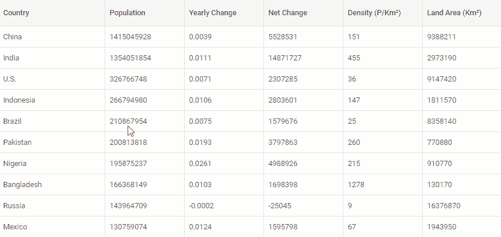

[检查样本>](https://snippet.dhtmlx.com/zwc91d50)

例如，您可以让最终用户通过拖放操作轻松地对任何行和列进行重新排序，冻结一列或多列，执行筛选和排序操作，同时选择多个单元格，调整列的大小，添加多行单元格内容，等等。如果必须对表格数据进行修改，我们的网格组件附带了一系列内置的列编辑器，用于根据内容指定编辑网格单元格的方式。

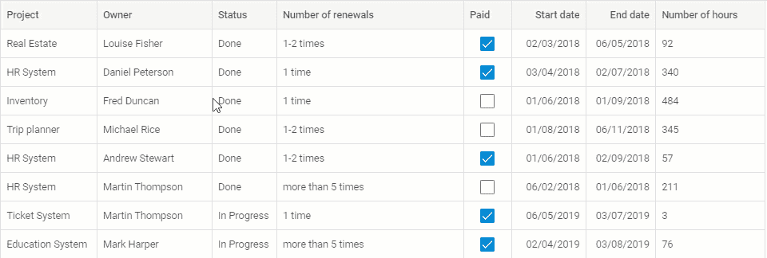

[检查样品>](https://snippet.dhtmlx.com/w2cdossn)

正确显示任何类型的数值也不成问题，因为我们的 [JavaScript 网格库](https://dhtmlx.com/docs/products/dhtmlxGrid/)支持各种数字格式。我们的网格组件的 API 提供了多种定制机会，可以改变网格样式，用自己的 HTML 内容、工具提示、单元格标记、页眉/页脚过滤器来补充表格。

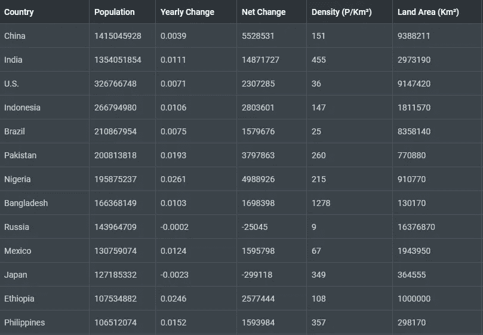

[检查样品>](https://snippet.dhtmlx.com/c5tr3s5r)

DHTMLX 网格的另一个优点是，在处理大型数据集时，您不必担心任何性能限制。您可以轻松上传包含数千行的表的 JSON 文件。我们的网格使用延迟加载技术，通过只加载在给定时间预期会看到的那部分 web 内容来提高应用程序的性能。除此之外，您还可以将[分页小部件](https://dhtmlx.com/docs/products/dhtmlxPagination/)集成到网格表中，以便将大数据分成多个页面，从而实现更好的导航。

**有用资源:** [指南](https://docs.dhtmlx.com/suite/grid/#guides)，[现场样品](https://snippet.dhtmlx.com/luh8d0vv?text=grid)，[免费试用版](https://dhtmlx.com/docs/products/dhtmlxGrid/download.shtml)

# DHTMLX 树形网格

如果有必要显示和编辑分层数据，DHTMLX TreeGrid 正是您所需要的。这个 JavaScript 组件允许您构建具有可扩展/可折叠节点的树状数据结构。它是 DHTMLX 网格的扩展版本，继承了它的 API、特性集和使用原则。为了增强您对分层数据的体验，我们的 [JavaScript TreeGrid 组件](https://dhtmlx.com/docs/products/dhtmlxTreeGrid/)提供了按列或按计算结果分组数据的能力。

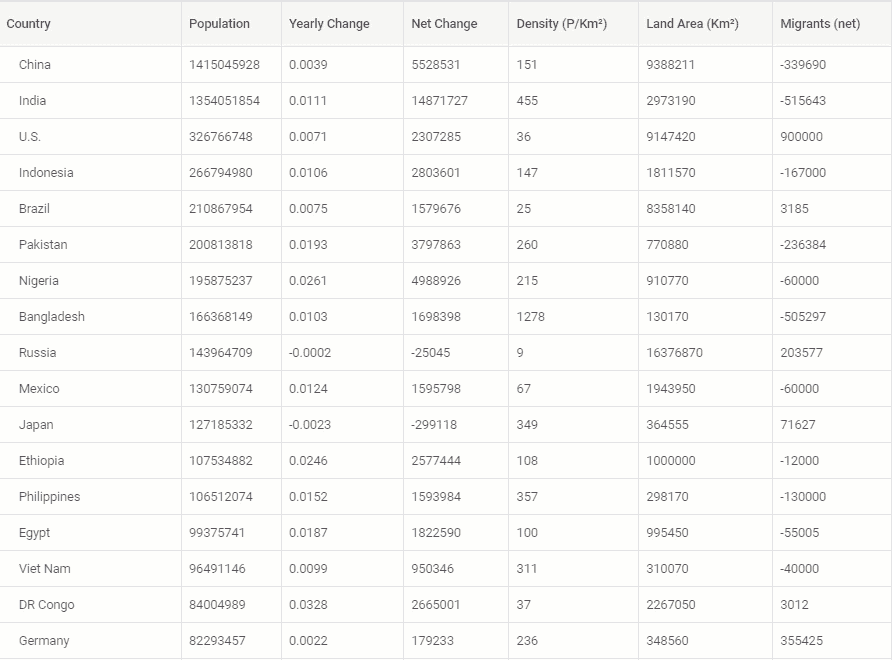

[检查样品>](https://snippet.dhtmlx.com/bue6zm6w)

使用 DHTMLX TreeGrid，您可以创建在数据分析中经常遇到的具有父/子关系的复杂数据结构，并以清晰的方式呈现它们。

**有用资源:** [指南](https://docs.dhtmlx.com/suite/treegrid/#guides)，[现场样品](https://snippet.dhtmlx.com/kob9385v?text=treegrid)，[免费试用版](https://dhtmlx.com/docs/products/dhtmlxTreeGrid/download.shtml)

# DHTMLX 图表

以表格形式排列大量数据有助于保持事物有序，但仍然会遗漏一些模式或不一致之处。在这种情况下，您可以依赖 JavaScript 数据可视化库，如 DHTMLX Chart。该工具将帮助您使用流行的图表类型(如条形图、饼图、样条图、面积图、圆环图、散点图、雷达图、树状图等)来可视化任何复杂程度的数据集。此外，您还可以将几个图表合并成一个图表(例如，[线条+样条+面积图](https://snippet.dhtmlx.com/eti3i33o))。

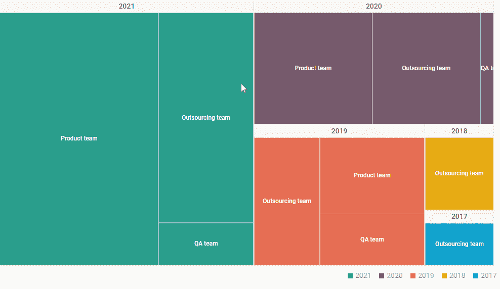

[检查样本>](https://snippet.dhtmlx.com/fmgnlue4)

我们的[数据可视化 JS 库](https://dhtmlx.com/docs/products/dhtmlxChart/)的灵活 API 允许以您喜欢的方式设置任何可用图表类型的主要属性(刻度、系列、图例)。您肯定会喜欢用各种有用的特性来丰富图表的可能性，例如网格线、基线、对数刻度、工具提示、标签等等。由于 DHTMLX Chart 还支持实时更新，因此您可以实时可视化不断变化的数据。

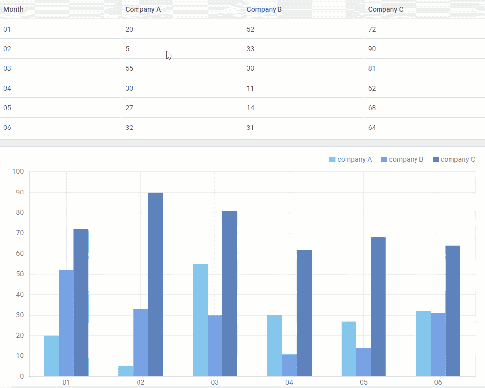

[检查样品>](https://snippet.dhtmlx.com/gdeqtev4)

就像我们的网格组件一样，我们的图表库与套件库中包含的其他 UI 小部件一起打包提供，或者作为独立工具提供。我们的团队创建了多个[演示应用程序](https://dhtmlx.com/docs/products/demoApps/)，生动地展示了所有三个组件与其他 DHTMLX 小部件相结合的实际使用场景。

**有用资源:** [指南](https://docs.dhtmlx.com/suite/chart/#guides)，[现场样品](https://snippet.dhtmlx.com/dpz4w5nr?text=chart)，[免费试用版](https://dhtmlx.com/docs/products/dhtmlxChart/download.shtml)

# DHTMLX 电子表格

为了在更高层次上显示和操作数据，DHTMLX 提供了 [JavaScript 电子表格组件](https://dhtmlx.com/docs/products/dhtmlxSpreadsheet/)。它允许您在网页上紧凑地放置一个类似 Excel 的表格，并使用可以动态编辑的数据填充它。

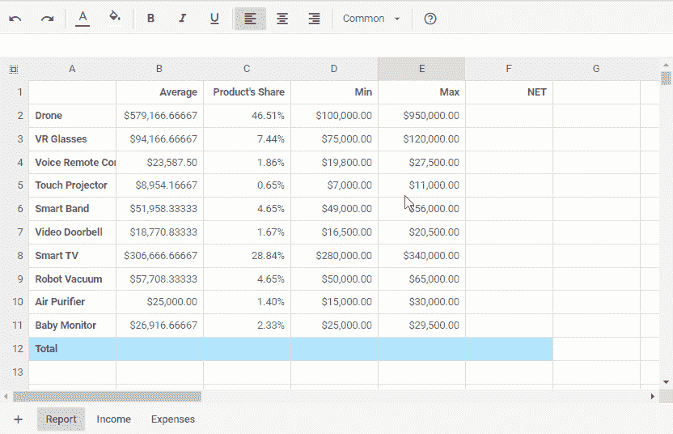

[检查样品>](https://snippet.dhtmlx.com/afxi1wvx)

DHTMLX 电子表格附带了一组预定义的公式(170+)，用于执行不同类型的操作、格式化字符串数据以及使用布尔运算符检查条件。它们都可以在 Excel 和 Google Sheets 中使用。您还可以创建多个工作表，将数据分为不同的类别，如果需要，可以使用所需的公式通过交叉引用合并多个工作表中的特定信息。

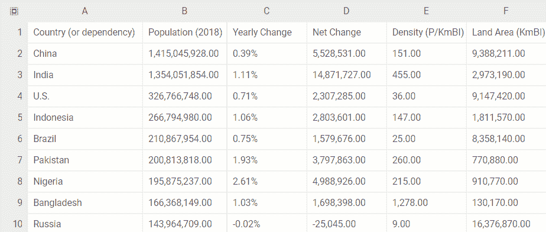

[检查样品>](https://snippet.dhtmlx.com/iazmc27w)

我们的电子表格有一个用户友好的界面，带有许多内置功能，如撤销/重做操作、冻结列、锁定和解锁单元格、添加和删除列和行、更改行高等等。它还提供了一个相当大的热键列表，用于简化电子表格导航。

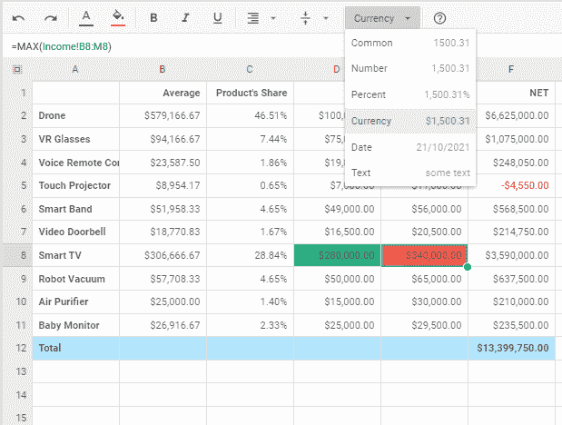

[查样>](https://snippet.dhtmlx.com/iowl449t)

有六种可自定义的默认数据类型(通用、日期、文本、数字、货币、百分比)用于在单元格中显示数值。如果这还不够，你还可以添加[自定义格式](https://snippet.dhtmlx.com/4c0c0zm7)。此外，还可以修改电子表格或其元素的外观和感觉，以适应项目需求。

**有用资源:** [指南](https://docs.dhtmlx.com/spreadsheet/guides/)，[现场样品](https://snippet.dhtmlx.com/atl9gd4h?text=Spreadsheet)，[免费试用版](https://dhtmlx.com/docs/products/dhtmlxSpreadsheet/download.shtml)

# DHTMLX 透视

如果您需要一个除了存储和表示数据之外还包括求和和报告功能的工具，DHTMLX Pivot 是一个合适的选择。与网格和电子表格不同，我们的 [JavaScript pivot 组件](https://dhtmlx.com/docs/products/dhtmlxPivot/)使您能够在所选聚合函数和众多过滤/排序参数的帮助下快速创建信息丰富的数据摘要。

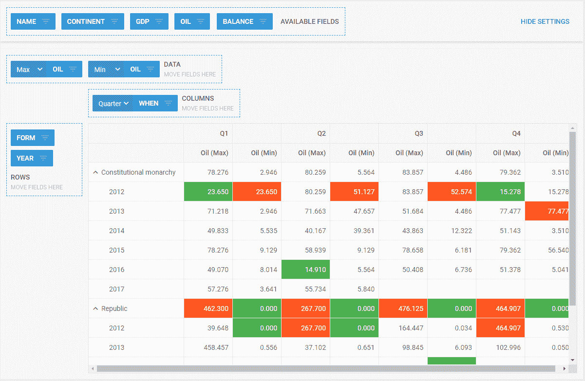

[检查样品>](https://snippet.dhtmlx.com/lvvrn4f2)

默认情况下，我们的 JavaScript pivot 支持四种常见类型的数据操作(最小值、最大值、总和、计数)。但是，您也可以添加自定义工具，为最终用户提供更多选项来分析数据和得出一些有价值的见解。

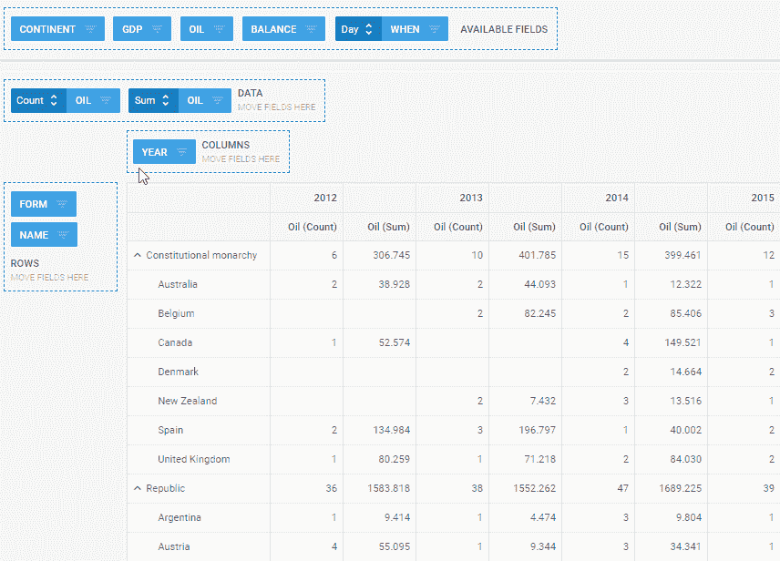

[检查样品>](https://snippet.dhtmlx.com/e1810c4d)

数据过滤是我们 pivot 的另一项重要资产。它使您能够直接从 UI 或通过相应的 API 根据数据类型(字符串、数字、日期)指定过滤器。您可以利用一个全局过滤器将多个过滤规则应用于数据集，或者一次移除所有现有过滤器。为了使数据透视表在视觉上更具吸引力，可以用特定的值对单元格进行着色，并以所需的方式设置行和列的标题。

**有用资源:** [指南](https://docs.dhtmlx.com/pivot/guides.html)，[现场样品](https://snippet.dhtmlx.com/3xqkml4u?text=Pivot)，[免费试用版](https://dhtmlx.com/docs/products/dhtmlxPivot/download.shtml)

本文中讨论的所有用于数据分析的 JavaScript 库都有一系列非常需要的特性:

*   大型数据集的高性能
*   全界面定制
*   与顶级 JavaScript 框架集成(React、Angular、Vue)
*   跨浏览器和多平台兼容性
*   类型脚本支持
*   数据导出为 Excel 和 CSV 格式
*   完整的 UI 本地化

利用我们功能丰富的 JS 数据分析库，您可以构建满足您数据分析需求的 web 应用程序。

# 结论

正如您所看到的，DHTMLX 产品是对用于数据分析的 web 应用程序的一个很好的补充。我们用于数据可视化和数据管理组件的 JS 库将帮助您显著加快开发过程并避免不必要的错误。详细的文档和大量的实例将帮助您快速开始使用我们的组件，并在您的项目中充分利用它们。作为奖励，有一个有用的[视频教程](https://www.youtube.com/watch?v=bI_yypO7JF0)解释了如何更有效地使用 JavaScript 库的代码片段。

如果您仍然不确定 DHTMLX 是生产性数据分析的正确选择，请下载任何产品的免费 30 天试用版[来对其适用性进行个人评估。](https://dhtmlx.com/docs/download.shtml)

***本文原载于*** [***DHTMLX 博客***](https://dhtmlx.com/blog/data-analysis-dhtmlx-javascript-libraries/)***2022 年 4 月 26 日。***