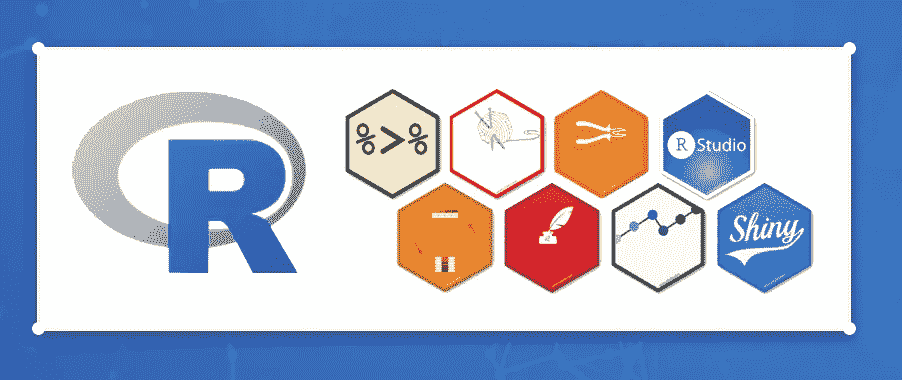

# 成为数据分析师所需的 7 大技能

> 原文：<https://blog.devgenius.io/data-analyst-skills-83ec0b0b00f4?source=collection_archive---------4----------------------->

数据分析师负责分析大型数据集，包括结构化和非结构化数据集。

图像通过[保持编码](https://unsplash.com/@keepcoding_school?utm_source=medium&utm_medium=referral)在[上不飞溅](https://unsplash.com?utm_source=medium&utm_medium=referral)

数据分析师是熟练的从业者，他们利用自己的技术知识，通过使用各种方法和智能业务工具进行更深入的分析，来执行与清理、分析、解释和显示数据相关的任务。

数据分析是商业、金融、刑事司法、科学、医学和政府等行业中需求最高的工作之一。这种对数据分析技能的需求继续扰乱就业市场，因为数据科学和机器学习的进步使世界变得更好。

大多数数据分析师的工作角色通常涉及数据提取、分析、解释和可视化，但诱人的薪酬和福利仅反映了这一工作角色的关键需求，这一需求还在不断增长。

你可能已经掌握了其中的一些技能，而其他的可能对你来说是新的。无论哪种方式，您都有几种选择来发展您的数据分析师技能。你的学习努力会让你在求职时获得竞争优势。

在本文中，我们将讨论您应该在您的[数据科学作品集](https://kanger.dev/how-build-data-science-portfolio/)中展示的数据分析师技能。让我们仔细看看与入门级数据分析师工作角色相关的所有基本技能，并讨论您需要学习什么来支持您的职业前景。

> **子堆栈**👉🏾[数据科学资源](https://kanger.dev/stacks/data-science/)

# 数据库(SQL 和 NoSQL)

数据分析师提取和分析存储在数据库中的数据。

公司根据他们的需求使用不同的数据库管理系统。随着知识的增长，深入了解数据库的工作原理会非常有帮助。

在数据分析师的面试中，你会遇到关于 SQL 和 NoSQL 数据库的问题。你还需要展示你的数据库知识，为你的项目收集数据。

> *学习* ***基本概念*** *将帮助你建立分析技能以执行分析。*

## — SQL

SQL 很好学，即使你没有任何编程或计算机科学的背景。

作为数据分析师，您应该能够编写 SQL 查询来处理各种数据分析任务。

*   学习 SQL 的基础知识
*   学习提取数据、将表连接在一起以及执行聚合。
*   学习如何过滤、排序和汇总数据以解决问题。
*   学习使用子查询、临时表和窗口函数进行更复杂的分析和操作。

有了这些来自**世界级**数据科学教育家的[数据科学课程](https://kanger.dev/learn-best-sql-courses-data-science/)，即使你以前没有编码经验，你也可以发展 SQL 流畅性。

## — NoSQL

作为数据分析师，您将使用 NoSQL 数据库。NoSQL 数据库适合通过 SQL 处理大数据，因为它们灵活的模式需求和现代的**数据**架构。

像 [MongoDB](https://www.mongodb.com/) 、 [Cassandra](https://cassandra.apache.org/_/index.html) 、 [ElasticSearch](https://www.elastic.co/) 、Amazon [DynamoDB](https://aws.amazon.com/dynamodb/) 和 [HBase](https://hbase.apache.org/) 这样的 NoSQL 数据库可以与数百个不同的数据源集成。

您必须做好充分准备，才能从非关系数据库执行各种甚至复杂的数据分析任务。因此，首先学习不同 NoSQL 数据库的基本概念，然后熟悉数据分析工具，包括编程，以保持领先地位。

以下是您需要学习的内容…

*   基于文档的数据库
*   键值数据库
*   基于宽列的数据库
*   基于图形的数据库

**对这个技能感兴趣？**查看[**NoSQL 概念**](https://kngr.me/nosql1) by DataCamp

# 统计数字

统计学是复杂的数据科学模型和机器学习算法的核心，捕捉和翻译数据模式。

统计方法在数据分析中的应用主要包括从数据中收集、描述、分析和推断结论。

有了描述性和推断性统计的坚实基础，您将能够:

*   使用统计公式和计算机算法来识别数据中的模式、关系和趋势。
*   使用统计技术，通过收集和分析大量结构化和非结构化数据，找到可行的见解。
*   在你的分析中避免逻辑错误、谬误甚至偏见。
*   提供准确可信的结果

数据分析师使用统计数据来收集、审查、分析数据并从中得出结论。

**学习基本统计学概念**了解基本原理。我们创建了一些学习指南，解释最基本的概念。

*   数据科学的基本[统计](https://kanger.dev/basic-statistics-for-data-science-concepts-guide/)(初学者学习指南)
*   数据科学课程的概率和[统计](https://kanger.dev/learn-statistics-for-data-science-courses/)(非程序员)

如果你已经掌握了一些编程知识，那就通过学习资源来学习应用技能的具体方法。

*   [用 Python 统计](https://kanger.dev/computational-statistics-python-courses/)
*   [带 R 的统计](https://kanger.dev/data-science-statistics-r-programming/)

# 编程；编排

统计编程语言，如 Python 和 R，使您能够对大型数据集执行高级数据分析和预测分析。

作为数据分析师，您需要编程技能来更有效地清理、分析和可视化大型数据集。

这两种编程语言在数据清理、争论和分析方面都做得很好。

## — Python

Python 是一种更容易学习的语言，被数据科学家、数据工程师和研究人员广泛使用。

您需要精通使用提供数据清理、准备、分析、探索等功能的库。

您应该能够使用以下软件包:

*   **Numpy** 和 **SciPy** :基础科学计算
*   **熊猫**:数据处理和分析
*   **Matplotlib** :绘图和可视化
*   **StatsModels** :统计建模、测试和分析
*   Seaborn :统计数据可视化

如果你以前从未写过代码，那就学习 Python 吧。这些著名的教育家提供技术指导和职业支持。

*   [使用 Python 的数据分析师](https://kngr.me/rd3) — DataCamp
*   [成为数据分析师](https://kngr.me/rd4)(纳米学位)— Udacity

## — R 编程

r 编程是一种用于统计计算或图形的开源语言。它非常适合于统计分析和数据挖掘。

基于可伸缩性、性能、集成等，r 编程在许多方面被认为是数据分析的更好选择。

它被广泛用于数据分析和统计建模。

R 的图像

您应该能够使用以下软件包:

*   RMySQL 和 **RSQLite** :学习使用数据库驱动程序从数据库中读取和分析数据。
*   **stringr** :使用处理字符串和正则表达式的工具。
*   **dplyr** : 学习创建和使用用于汇总、连接和重新排列数据集的函数。
*   **lubridate** : 用于处理不同时期的日期和时间。
*   **ggplot2** :用于创建视觉上吸引人的绘图和图形。
*   **rgl** :
*   ****random forest**:**用于无监督学习。****
*   ******脱字符号** : 用于训练、分类和回归模型。****
*   ******闪亮** : 用于创建 web 应用。****
*   ******ggmap:** 用于空间数据并与 ggplots 集成。****
*   ******xts** :用于处理时间序列数据集。****
*   ******XML** : 用于处理 XML 文档。****

******有兴趣学 R？查看以下职业轨迹。******

*   ****[R](https://kngr.me/rd6)的数据分析师——Data camp****

# ****提取、转换和加载(ETL)****

****在从事项目工作时，数据分析师训练机器学习模型进行预测分析，以解决业务问题。ETL 过程支持模型开发。****

****提取、转换和加载有三个独特的过程。****

******提取:**数据分析师首先以几种格式从选定的源中提取原始数据，比如关系数据库、XML、JSON 等等。****

******转换**:这个过程包括在将数据加载到数据库之前对其进行标准化、清理、映射和扩充。****

******加载**:这最后一个过程涉及交付数据用于分析或共享，以使其对其他利益相关者可用。****

****数据分析师应该具备 ETL 工具的知识，能够自动执行提取、转换和加载过程，以整合来自多个数据源或数据库的数据。****

# ****基础数学****

****基础数学知识对数据分析师来说很重要。数据分析师需要数学的主要原因是，高价值的预测可以改善决策，让他们意识到选择是如何影响结果的。****

****线性代数和微积分经常用于数据分析。****

*   ****线性代数在预测分析的机器和深度学习中有应用，它支持向量、矩阵和张量运算。****
*   ****微积分用于预测函数和构建函数，这些函数训练算法来实现它们的目标。****

****解决复杂问题时，基本的数学技能派上了用场。它们至关重要，以至于大多数公司都需要统计、制图、代数、概率、优化技术等实用知识。****

****您可以在我们的[数据科学基础数学](https://kanger.dev/learning-math-for-data-science-mathematics/)初学者指南中学习您需要学习的基础知识。**T3:适合数据分析师的职业道路。******

# ****机器学习****

****机器学习对于数据科学中的精确预测非常重要。它支持数据分析过程，以产生更好的见解，鼓励更强的决策。****

****您应该对机器学习的概念、算法和工具有基本的了解，以便在人群中脱颖而出。****

****数据分析师需要知道如何构建预测性分析解决方案，以便从数据中提供描述性和投射性的结果。这些解决方案是利用现有数据开发的，用于从未来数据中生成结果。****

****数据分析师需要了解大量的 ML 算法，包括:****

*   ****监督学习算法****
*   ****无监督学习算法****
*   ****强化学习(针对金融)****

****我们使用机器学习算法处理的数据越多，产生具有可操作价值的见解就越有利可图。****

# ****数据可视化****

****数据可视化已经彻底改变了数据分析师处理数据的方式。****

****数据分析师使用引人注目、有趣的图表以清晰简洁的方式展示他们的发现，帮助业务决策者一目了然。****

****数据是黄金，为了评估其价值，大数据与机器学习相结合，以创建预测性分析，从而揭示数据的价值。****

****它不是一种软技能，它植根于深厚的技术研究。您还必须能够以即使是那些没有足够技术知识的人也能理解的方式解释您的发现。****

****数据分析师的一些顶级数据可视化技能包括:****

*   ****能够处理大型数据集****
*   ****批判性思维和统计直觉。****
*   ****了解目标受众、人口统计和兴趣。****
*   ****使用清晰简洁的语言，包括保持注意力的元素****
*   ****数据讲述****

## ****—数据可视化工具****

****这些数据可视化工具可以提高数据分析师的效率。****

*   ****[**Tableau**](https://www.tableau.com/) : Tableau 被认为是行业标准的分析工具。它很容易学习，并且有一个干净直观的用户界面。****
*   ****[**QlikView**](https://www.qlik.com/us/products/qlikview):QlikView 是一款商业智能软件，允许您开发导向分析应用程序和仪表盘。****
*   ****[**Datawrapper**](https://www.datawrapper.de/) :这是一个在线数据可视化工具，可以用来在各种上下文中创建图表、地图和表格。它很容易使用，非常用户友好。****
*   ****[**PowerBI**](https://powerbi.microsoft.com/en/) :适用于报告、自助服务分析和预测分析。****
*   ****[**Plotly**](https://plotly.com/) :使用 Plotly，您可以在更短的时间内创建数据集的可视化。它很容易使用，你可以创建美丽的图形，图表和地图。****
*   ****[**Sisense**](https://www.sisense.com/) :您可以使用 Sisense 创建广泛的信息仪表板，以便更好地了解您的数据。****
*   ****[**Excel**](https://support.microsoft.com/en-us/office/analyze-data-in-excel-3223aab8-f543-4fda-85ed-76bb0295ffc4#:~:text=Simply%20select%20a%20cell%20in,it%20in%20a%20task%20pane.) :您可以使用 Microsoft Excel 来分析各种用途的统计、科学和经济数据。****

****对于数据分析师来说，学习使用这些数据可视化工具非常重要。****

******Learn Tableau:** 它是数据科学行业最流行的数据可视化工具之一。****

******结论******

****有很多方法可以培养这些技能，从而过渡到分析职业。利用课程、书籍和其他免费资源真的很有帮助。****

****如果您对数据科学(包括 SQL、统计编程和数据可视化)很感兴趣，我们可以为您提供一些实用的资源。****

*   ****面向初学者的 Python——一本轻松的职业指南****
*   ****7 [数据科学家技能](https://kanger.dev/data-scientist-skills/)让你在 2022 年被聘用****
*   ****基础[数据科学数学](https://kanger.dev/basic-math-for-data-science-mathematics-courses/)(学习指南)****
*   ****Top [Python for Data Science 课程](https://kanger.dev/learn-python-data-science-courses/)****
*   ****[MLOps 工程师认证](https://kanger.dev/mlops-machine-learning-engineer-certifications-ml/)指南****
*   ****[面向数据科学](https://kanger.dev/tensorflow-courses/)和机器学习的 TensorFlow****

> ****[*kanger.dev*](https://kanger.dev) *受到广大观众的支持。我们可以通过购买这篇文章中的链接赚取会员佣金。*****