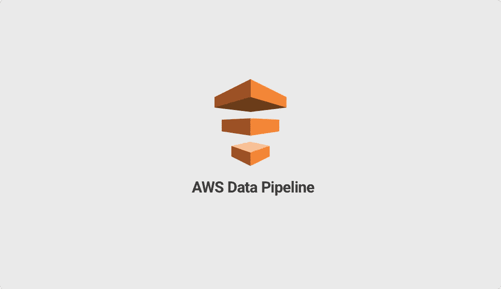
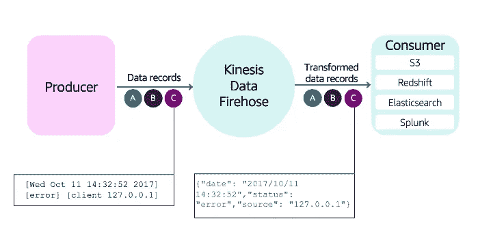
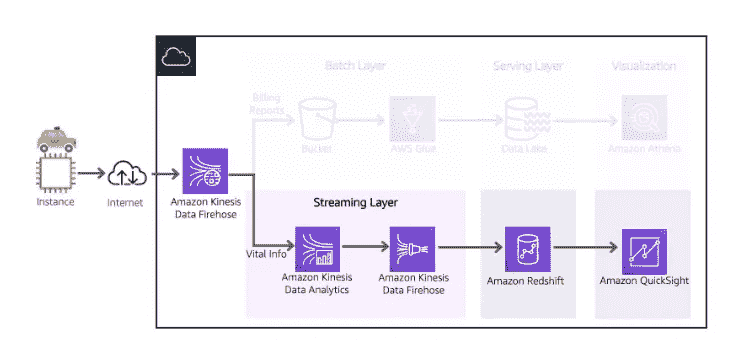
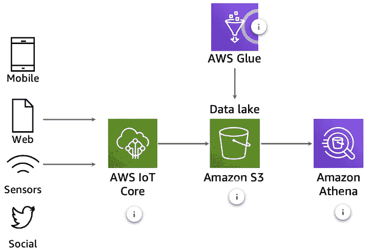
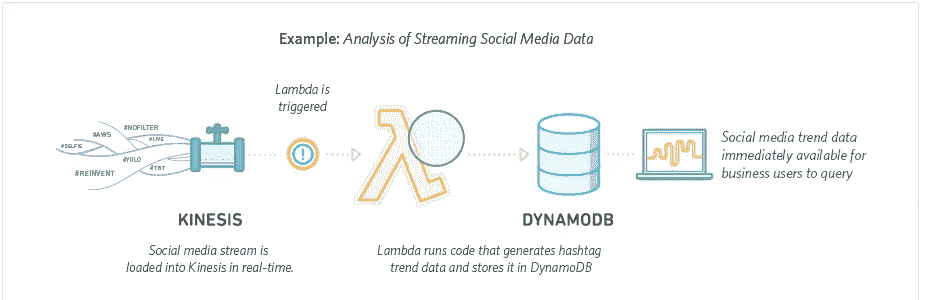
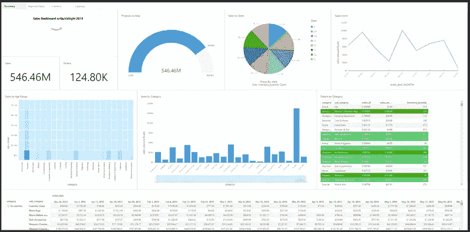
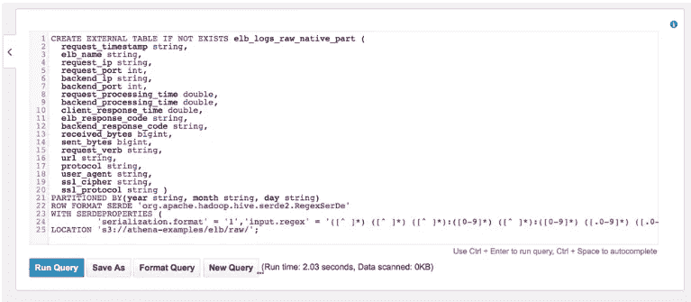
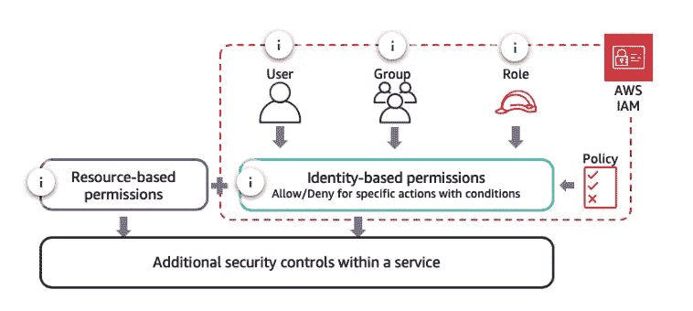
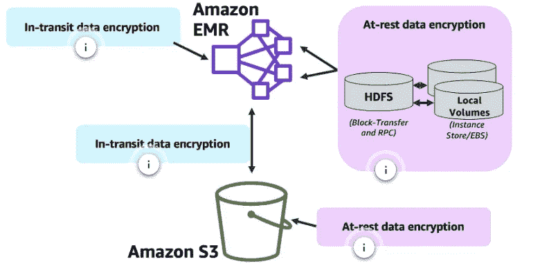

# AWS 中的数据分析管道

> 原文：<https://blog.devgenius.io/data-analytics-pipeline-in-aws-4d04329cd6cb?source=collection_archive---------15----------------------->

P 数据分析中的 ipeline 是从数据源获取数据以使用分析流程的步骤，这些分析流程使用数据分析、即席和机器学习等概念。[【1】](https://books.google.com.tr/books?id=SxgcEAAAQBAJ&printsec=frontcover&dq=data+analytics+pipeline+introduce+pdf&hl=en&sa=X&ved=2ahUKEwjknbfGkd77AhU5cfEDHaA1AoIQ6AF6BAgNEAI#v=onepage&q&f=false)通常，大数据架构包括几个主要步骤，即数据收集、存储、处理和数据可视化。同样重要的一步是数据安全。因此，数据分析管道涵盖了从数据源到消费层的接收(请求事务)，消费层是 BI 仪表板和一些机器学习操作。

电子商务中的大量冷数据、来自 IOT 传感器的更快的实时数据或近实时摄取数据、欺诈检测数据、日志、一些机器学习主题和即席交互式仪表板概念通常用于数据分析领域，以及执行这些概念的管道使用。

在这篇文章中，我介绍了亚马逊网络服务(AWS)的流水线步骤，以及使用 area 和 AWS 工具的例子。在这种情况下，its 的流程和示例将进行演示。

# 内容

1.  数据收集
2.  数据存储
3.  数据处理
4.  分析和可视化
5.  安全性

1.  **数据采集**

D 数据采集提供从数据源摄取数据，即生成数据放置和准备，以便为其他步骤做准备。另一个步骤从数据仓库中数据存储和按数据类型的数据湖开始。你也可以访问这个网站。[【2】](https://explore.skillbuilder.aws/learn/course/51/play/66349/exam-readiness-aws-certified-data-analytics-specialty;lp=917)

在 AWS 中，生产者是用于从 IOT、网站日志、文本、结构化数据等数据源捕获数据事务的硬件。然后生产者发送到 Kinesis 数据消防站的一些安排格式，如 JSON (java 脚本对象符号)格式。最后一个是消费者，即捕获适合执行格式的完整数据。存储在 AWS S3 桶和 AWS 红移等工具中的数据。

EC2 是 AWS 中虚拟机的生产者。它提供服务器首选项硬件，如 CPU、RAM、磁盘。如下图所示，EC3 启动了这个过程，并通过互联网连接将数据发送到 Amazon Kinesis Data Firehose。其他步骤由批处理和流式处理分开。这个过程取决于数据类型。如果有连续的流数据，如 IOT、日志，流层将随之而来。另一个偏好是批量分层那些流量较慢的大数据，比如电子商务数据集。[【3】](https://aws.amazon.com/what-is/batch-processing/)

使用 AWS 工具，以便收集数据亚马逊 Kinesis Data Firehouse、AWS Snow 系列、AWS Glue、AWS Transfer 系列和 AWS 数据库迁移服务。[【4】](https://docs.aws.amazon.com/whitepapers/latest/building-data-lakes/data-ingestion-methods.html)

**2。数据存储**

数据存储是 AWS 中的存储库处理。这是在 AWS 中用云解决方案执行的。数据存储的逻辑是通过更快、持久和一致的数据收集步骤来捕获数据。

按数据类型(结构化、半结构化和非结构化数据)划分数据存储。结构化数据涉及 SQL 数据，即使用关系数据库服务(RDS)的数据集。非结构化数据包括视频、日志、文本和音频数据。半结构化数据涉及 XML、HTML、JSON 格式。

此外，您可以看到下面的模式，这是流处理的例子。有两种数据存储方式。数据仓库和数据湖。数据湖的使用是为了在机器学习中制定计划。有连续的流处理数据，如下面的模式。另一方面，数据仓库用于一些计算聚集功能和批处理。比如电商销售报表，经销商物流报表。

其他重要参数是热、暖、冷数据的特征。热特征代表高数据流、微秒和毫秒级延迟、低数据量大小和低保留。例如，IOT 传感器数据和欺诈检测。冷特征表示大量数据和低摄取量存储。比如日常销售，预算。有必要降低工作时间表的频率，如每天一次或每天两小时一次。介于热和冷之间的温暖特性。

另一方面，数据存储主要出现两种类型。OLTP 和 OLAP。OLAP 是联机事务处理。它提供了复杂的查询操作和一些聚合函数操作。OLTP 是联机事务处理。它向数据库提供快速存储的事务。没有一些聚合操作。[【5】](https://aws.amazon.com/what-is/olap/)

OLAP 的示例工具有亚马逊红移和亚马逊简单存储服务(S3)。

OLTP 数据存储示例有 Amazon RDS、Amazon DynamoDB、Amazon ElastiCache、Amazon Neptune。[【6】](https://aws.amazon.com/products/storage/)

**3。数据处理**

D ata 处理步骤编排数据流水线。它通过 ETL 操作(即提取、转换、加载)提供获取数据、转换和准备分析&的可视化步骤。

ETL 操作的目的是:

*   处理万亿字节和千兆字节的数据
*   简化不同数据集的查询
*   将现有和遗留数据与现代数据集相结合
*   为机器学习准备数据【T6【7】

如下图所示，Amazon Lambda 在 Kinesis 和 DynamoDB 之间使用。这个模式例子是关于摄取社交媒体数据，并由 DynamoDB 存储在存储库中。因此，插图涵盖了分析和结果。

其他数据处理工具有 AWS Glue、Amazon EMR 和 Amazon Kinesis-enable。

Amazon EMR (Elastic Map Reduce)使用 EC2 和开源工具(如 Apache Spark、Apache Hive、Apache HBase、Apache Flink、Apache 胡迪和 Presto)从数据源收集数据。

Amazon Glue 在 AWS 中提供了无服务器 ETL 操作。创建作业计划和一些 ETL 处理在那里使用。

> Amazon Kinesis 可以轻松收集、处理和分析实时流数据，因此您可以获得及时的见解，并对新信息做出快速反应。[【9】](https://aws.amazon.com/kinesis/)

**4。分析&可视化**

分析和可视化步骤包括使用交互式仪表盘进行特别分析、机器学习操作和计算聚合功能。这一步的目的是从大数据中获得评估，并为业务发展做出一些决策。在 AWS 中，有一些工具用于从数据中获取结果。例如，亚马逊使用 QuickSight 来制作 BI(商业智能)项目。此外，还有一些强制测试操作。

通过图表中的日期和时间评估总销售额，通过饼图对销售产品进行分类，并通过分层表和矩阵表查看销售明细。所有这些功能都可以在 QuickSight 工具中使用。此外，还有一些工具，以便进行分析和预测。

[https://AWS . Amazon . com/blogs/big-data/evolve-your-analytics-with-Amazon-quick sights-new-APIs-and-theming-capabilities/](https://aws.amazon.com/blogs/big-data/evolve-your-analytics-with-amazon-quicksights-new-apis-and-theming-capabilities/)

> [**数据湖**](https://aws.amazon.com/big-data/datalakes-and-analytics/) 让您无需将数据转移到另一个系统即可运行分析。
> 
> 您可以直接从针对您的 [**Amazon Redshift 数据仓库**](https://docs.aws.amazon.com/redshift/latest/mgmt/query-databases.html) 运行的查询中生成报告。
> 
> 你可以使用 [**亚马逊 Athena** 和 **AWS Glue**](https://docs.aws.amazon.com/athena/latest/ug/glue-athena.html) 来查询亚马逊 S3 上存储的数据。
> 
> 您还可以使用[**亚马逊红移光谱**](https://docs.aws.amazon.com/redshift/latest/dg/c-getting-started-using-spectrum.html) 将亚马逊 S3 数据包含在您的亚马逊红移查询中。
> 
> 您可以使用 [**Jupyter 笔记本**](https://jupyter-notebook.readthedocs.io/en/stable/) 和类似 [**scikit-learn**](https://scikit-learn.org/stable/) 的数据可视化框架，直接分析和创建您在 **Amazon EMR** 集群或 Amazon SageMaker 实例上的数据的可视化。

[https://AWS . Amazon . com/blogs/big-data/analyzing-data-in-S3-using-Amazon-Athena/](https://aws.amazon.com/blogs/big-data/analyzing-data-in-s3-using-amazon-athena/)

**5。安全性**

他的步骤提供了一些对问题的预防，一些建立了角色和凭证。我认为基于身份的权限包括三个概念。用户包括用户凭证，组涉及一些凭证特定团队、角色和凭证类型。

另一个安全主题是加密。一些编排需要加密。如模式下、区间 EMR 中的数据加密和亚马逊 S3。一些使用的工具是 AWS KMS，CloudHSM 和亚马逊红移加密

一些证书是:

> **SSE-S3 认为亚马逊 S3 管理数据和主加密密钥**
> 
> **SSE-KMS AWS 管理数据密钥，而您在 AWS KMS 管理客户主密钥(CMK)。**
> 
> **SSE-C 你管理的加密密钥。**
> 
> **CSE-KMS 表示，对象在上传到亚马逊 S3 之前会被加密，客户端使用 AWS KMS 提供的密钥。**
> 
> **CSE-Custom 对象在上传到亚马逊 S3 之前被加密，客户端使用一个提供客户端主密钥的自定义 Java 类。**

****结论****

**在这篇文章中，为了通过商业智能工具从数据中获取价值，机器学习和聚合操作编排了管道数据分析。为此，通过数据收集步骤从数据源调用数据。从发送到存储的源获取的数据。由结构化、半结构化和非结构化数据类型创建的存储库。此外，由流或池处理选择的数据湖或数据仓库。然后用 ETL 工具处理数据，以便用分析&可视化工具获得价值。此外，所有这些管道进程的执行都有一些安全规则。在所有步骤中使用凭据 IAM(角色、用户、组)、令牌化、加密操作。**

****参考****

**[1]数据管道袖珍参考，2021 年。[https://books.google.com.tr/books?id=SxgcEAAAQBAJ&printsec = front cover&dq = data+analytics+pipeline+introduce+pdf&HL = en&sa = X&ved = 2 ahukewjknbfgkd 77 AHU 5 cfedhaa 1 aoiq 6 af 6 bagneai # v = one page&q&f = false](https://books.google.com.tr/books?id=SxgcEAAAQBAJ&printsec=frontcover&dq=data+analytics+pipeline+introduce+pdf&hl=en&sa=X&ved=2ahUKEwjknbfGkd77AhU5cfEDHaA1AoIQ6AF6BAgNEAI#v=onepage&q&f=false)**

**[2][https://explore . skill builder . AWS/learn/course/51/play/66349/exam-readiness-AWS-certified-data-analytics-specialty；lp=917](https://explore.skillbuilder.aws/learn/course/51/play/66349/exam-readiness-aws-certified-data-analytics-specialty;lp=917)**

**[https://aws.amazon.com/what-is/batch-processing/](https://aws.amazon.com/what-is/batch-processing/)**

**[4][https://docs . AWS . Amazon . com/white papers/latest/building-data-lakes/data-ingestion-methods . html](https://docs.aws.amazon.com/whitepapers/latest/building-data-lakes/data-ingestion-methods.html)**

**[5][https://aws.amazon.com/what-is/olap/](https://aws.amazon.com/what-is/olap/)**

**[6]https://aws.amazon.com/products/storage/**

**[7][https://explore . skill builder . AWS/learn/course/51/play/66349/exam-readiness-AWS-certified-data-analytics-specialty；lp=917](https://explore.skillbuilder.aws/learn/course/51/play/66349/exam-readiness-aws-certified-data-analytics-specialty;lp=917)**

**[https://www.amazonaws.cn/en/elasticmapreduce/](https://www.amazonaws.cn/en/elasticmapreduce/)**

**[https://aws.amazon.com/kinesis/](https://aws.amazon.com/kinesis/)**

**[10][https://explore . skill builder . AWS/learn/course/51/play/66349/exam-readiness-AWS-certified-data-analytics-specialty；lp=917](https://explore.skillbuilder.aws/learn/course/51/play/66349/exam-readiness-aws-certified-data-analytics-specialty;lp=917)**