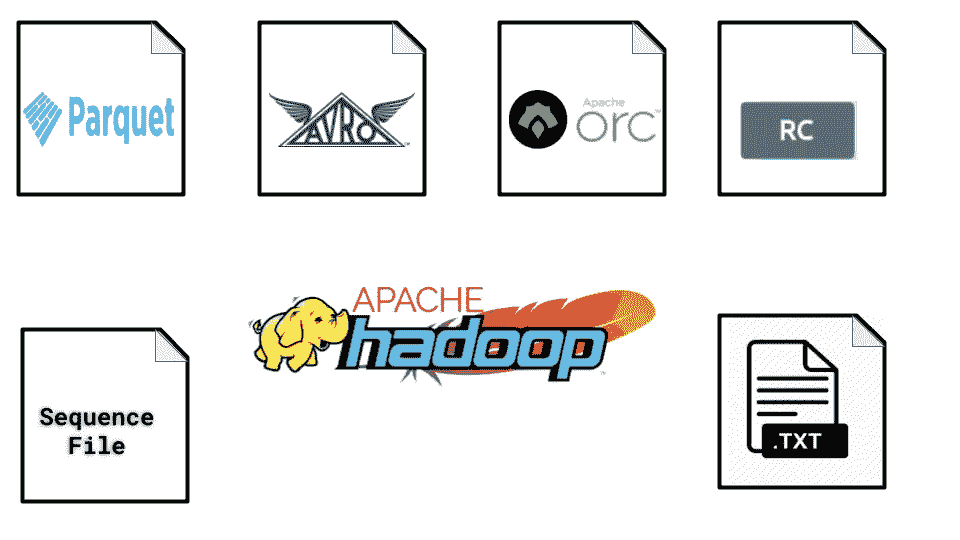

# Hadoop 中的数据和文件存储

> 原文：<https://blog.devgenius.io/data-and-file-storage-in-hadoop-4659eb3b28a6?source=collection_archive---------9----------------------->

## Hadoop 存储格式是什么？

> 存储格式定义了信息如何存储在文件或数据库中。文件的扩展名表明了这一点。不同的大数据堆栈使用不同的数据/文件格式，包括 Spark、Hadoop、Hive 等。本文将概述不同的 Hadoop 存储格式。

## 标准 Hadoop 存储文件格式

一些标准文件格式是文本文件(CSV、XML)或二进制文件(图像)。

**文本数据—** 这些数据以 CSV 或非结构化数据(如 twitters)的形式出现。常用于在 Hadoop 和外部系统之间交换数据的 CSV 文件。

**结构化文本数据—** 这是一种更加专门化的文本文件形式，比如 XML 或 JSON。JSON 处理比 XML 更具挑战性，因为在 JSON 中没有标记来标记记录的开始或结束。

**序列文件—** 这些文件以二进制格式存储数据，结构类似于 CSV。序列文件只存储数据。序列文件支持块压缩。

## Hadoop 存储序列化格式

序列化是将数据结构转换成字节流以便存储或通过网络传输的过程。反序列化是将字节流转换为数据结构的过程。可写是 Hadoop 使用的主要序列化格式。可写程序快速而简洁，但是很难从 Java 之外的语言中扩展或使用。一些序列化框架正在 Hadoop 生态系统中使用。

**Thrift —** 为实现服务的跨语言接口而开发。它使用 IDL 文件来生成存根代码，用于执行跨编程语言无缝通信的 RPC 客户端和服务器。它支持 MapReduce。

**协议缓冲区(protobuf) —** 它提供了在用不同语言编写的服务之间交换数据的工具。也是通过类似节俭的 IDL 定义的。它既不可分割，不可压缩，也不支持像节俭的 MapReduce。

**Avro 文件—** 它是一个语言中立的数据序列化系统。Avro 将元数据数据与数据一起存储。Avro 支持 MapReduce。Avro 数据文件被阻止压缩和分裂。Avro 文件支持模式进化，这使得 Avro 比序列文件更好。

## 分栏格式

对于最近现代大数据应用有用的柱状数据格式。与面向行的数据库相比，列格式有几个优点。当需要访问列的一个很小的子集时，那么使用列格式的数据库，但是当需要获得许多列时，那么面向行的数据库更可取。

有一些分栏文件格式——

**RC 文件—** 这是 Hadoop 中使用的第一种柱状文件格式。RCFile 格式是为 MapReduce 应用程序提供高效处理而开发的。开发它是为了提供快速的数据加载、快速的查询处理和高效的存储空间利用。RC 文件适合查询，但是编写 RC 文件比非列式文件格式需要更多的内存和计算。它不支持模式进化。

**ORC 文件—** ORC 文件由 HortonWorks 发明，用于优化 Hive 中的性能。ORC 文件与 RC 文件具有相同的优点和局限性，只是在 Hadoop 上做得更好。ORC 文件比 RC 文件压缩得更好，支持更快的查询。它也不支持模式进化。专为 Hive 设计的 ORC 不能与 Pig 或 Java 或 Impala 等非 Hive MapReduce 接口一起使用。它包含一组称为条带的行数据。

**Parquet 文件—** 是一种柱状数据格式，适用于 Java、Hive、Pig 等不同的 MapReduce 接口。它也非常适合其他处理引擎，如 Impala 和 Spark。Parquet 在性能上与 RC 和 ORC 相当，但是编写其他列格式时速度较慢。Parquet 支持模式进化。拼花支持在结构末端添加新列的功能。目前，Hive 和 Impala 支持 query 添加新列，但 Pig 等其他工具可能会面临挑战。

# 为什么调整 Hadoop 存储格式很重要？

对于 Spark 和 MapReduce 等支持 HDFS 的应用程序来说，一个巨大的瓶颈是在特定位置找到相关数据并将数据写回到另一个位置所花费的时间。管理大型数据集的困难加剧了问题，例如不断变化的存储约束或模式。这里是一些用例中涉及的各种文件格式，作为缓解这些问题的一种方式。

以下是选择适当文件格式的一些重要好处——

*   更快的读取时间
*   更快的写入时间
*   可拆分文件
*   模式进化支持
*   高级压缩支持

有些文件格式是为一般用途而设计的(如 Spark 或 MapReduce)，有些是为更具体的用例而设计的，还有一些是为特定的数据特征而设计的。所以有很多选择。

## 如何采用文件格式？

选择文件格式时，有三种性能需要考虑。

*   写入性能—如何快速写入数据。
*   部分读取性能—如何读取文件中的各个列。
*   完整读取性能—如何读取文件中的每个数据元素。

一种列式压缩文件格式，如 ORC 或 Parquet，用于部分和全部读取性能，但这些格式的写入性能代价很高。未压缩的 CSV 文件写入速度快，但缺少列方向，压缩速度慢读取速度慢。

许多选项可用于存储数据。如果需要存储 MapReduce 作业之间的中间数据，那么序列文件是首选。如果查询性能是最重要的，那么 ORC 或 Parquet 是最佳选择，但是这些文件需要更长的时间来编写。如果模式会随着时间而改变，那么 Avro 是最好的，但是查询性能会比 ORC 或 Parquet 慢。如果从 Hadoop 中提取数据并批量加载到数据库中，CSV 文件是最佳选择。

## 选择正确存储格式的好处

*   更快的读取时间
*   更快的写入时间
*   分割文件
*   模式进化支持(允许您更改数据集中的字段)。
*   高级压缩支持(使用压缩编解码器压缩文件，而不牺牲这些功能)。

## Hadoop 文件存储的最佳实践

*   当只需要访问一个很小的列的子集时，就使用列数据格式。
*   当需要获得许多列时，就使用面向行的数据库，而不是列数据库。
*   如果模式随时间变化，那么使用 Avro 而不是 ORC 或 Parquet。
*   如果需要执行查询，则使用 ORC 或 Parquet，而不是 Avro。
*   如果需要执行列添加操作，则使用 Parquet 而不是 ORC。

# 结束文件存储

对 Hadoop 生态系统上著名存储技术的评估表明，Apache Avro 是结构化数据的快速通用编码器。由于非常高效的序列化和反序列化，这种格式保证了在需要同时访问记录的所有属性(数据传输、暂存区等)时的出色性能。Apache Parquet 和 Apache Kudu 在快速数据接收、快速随机数据查找和可扩展数据分析之间提供了出色的灵活性，同时确保了系统的简单性——仅使用一种技术来存储数据。当 Parquet 优于更快的数据扫描和摄取时，Kudu 优于更快的随机查找。