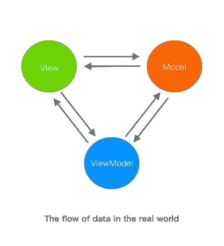
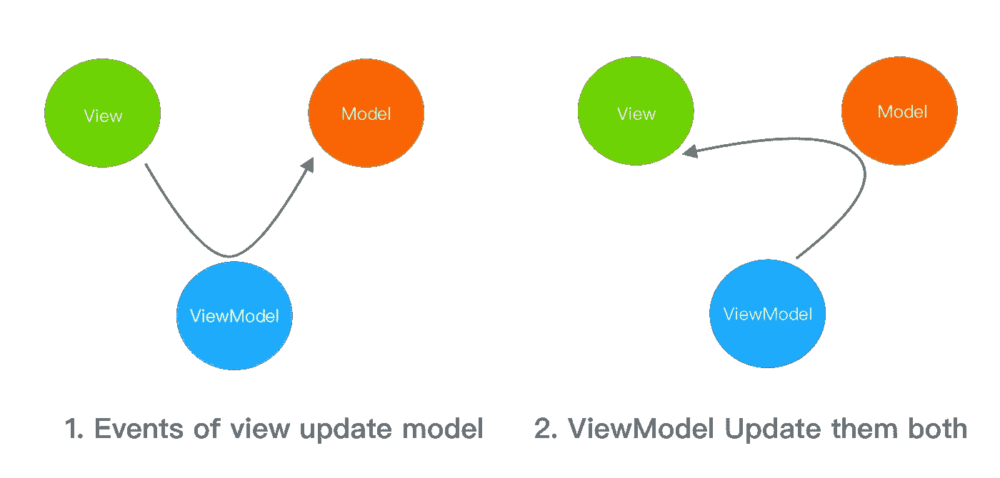
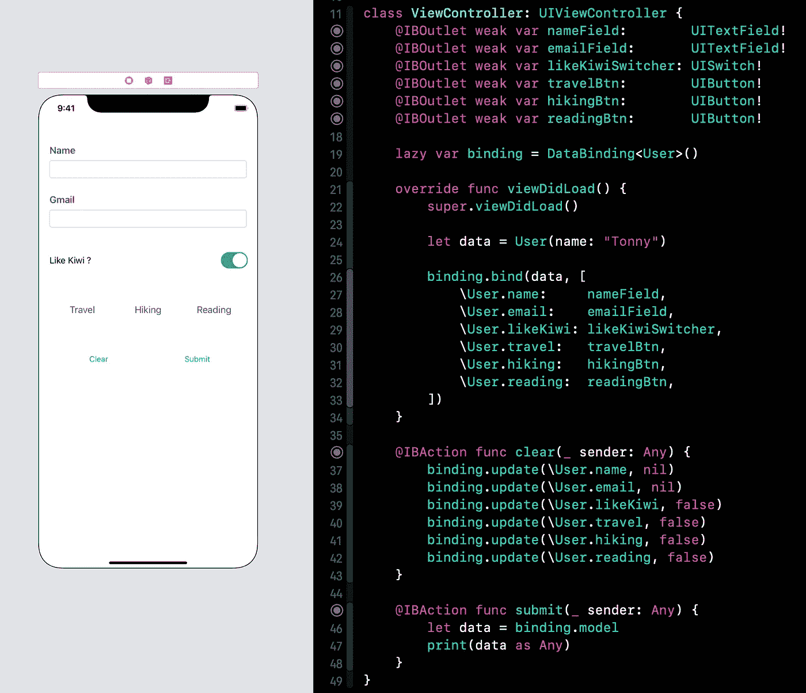

# iOS 上 MVVM 的数据绑定第 1 部分:数据流

> 原文：<https://blog.devgenius.io/data-binding-in-ios-part-1-data-flows-in-mvc-3d182c065e4?source=collection_archive---------10----------------------->

Android 提供数据绑定来监听模型的变化和更新绑定视图。这也是我爱 Android 开发胜过 iOS 开发的地方。在这个故事中，我将使用 Swift KeyPath 实现数据绑定，您可能会有更好的想法。欢迎评论。

从这个表单设计中，你可以很容易地发现有一个数据模型和相关的文本字段和选择按钮。在 Android 中用数据绑定很容易实现:一个***数据类*** *，一个在 **XML** 中用数据*声明的布局，以及几个 ***绑定表达式*** *。*就这样。生成的绑定类会处理剩下的事情。

不过 iOS 好像有点缺点。在实现视图和模型的监听更新时，iOS 开发者比 android 开发者更忙。

## 模型

这里是纯用户模型。您可能会注意到字符串类型是可选的，与 UITextField 文本类型相同，用于在使用 WritableKeyPath <user string="">时消除类型的转换。</user>

用户模型

## 视图

视图

## MVVM 的数据流

在讨论数据绑定之前，让我们回顾一下模型-视图-视图模型中的数据流。

MVC 或 MVVM 在现实世界中的数据流是复杂的。它从一个组件自由地流向另一个组件，没有任何限制。例如，viewmodel 更新视图的外观和模型的属性；视图的子类更新它自己的模型；模型更新视图并通过 *didSet* 或 *KVO* 通知视图模型。

这些流是自然的，但是复杂性带来了烦人的 bug。那种系统只有聪明的开发人员才能维护。

数据绑定的基本思想是保持视图表示和模型数据之间的一致性。视图的显示值应该始终与模型的数据相同。下图将复杂的流简化为两个流，它们都保证了视图和模型的一致性。

MVVM 的数据流

在第一张图所示的人机交互中，如果我们把人物的移动看作数据源的开始，流程大致是这样的:交互> iPhone 系统>视图> viewmodel >模型。下面的代码是这个流最常见的用法。

viewmodel 监听视图并相应地更新模型

NChanged()方法反复重复，违背了 DRY 原则。在 Swift KeyPath 的帮助下，我将这些方法抽象为一个方法。

视图->标签->关键路径->模型

在第二个图中显示的其他场景中，viewmodel 充当接口模式的接口，它是从外部系统更新视图和模型的唯一位置。为了保持一致性，如果 viewmodel 更新视图，它随后更新模型，如果 viewmodel 更新模型，它也更新视图。下面的代码就是关于这个流程的。

记得更新他们两个

当更新视图或模型时，记住更新其他的并不容易。在 Swift KeyPath 的帮助下，我存储了如何成对更新模型和绑定视图的方法。viewmodel 首先更新模型，然后更新视图。为了简化情况，不建议直接更新视图。

更新模式，自动更新视图

## 摘要

数据流有很多种，只注意 2 种:

*   流程 1，viewmodel 监听的事件触发的数据，viewmodel 将其传递给模型，流程:**View>ViewModel>Model**
*   一个关键路径映射，用于减少重复代码，并帮助视图模型知道当事件触发时要更新哪个模型属性:**【视图 Id: PartialKeyPath <模型>】**
*   流程 2，来自其他场景的数据，viewmodel 先将其传递给模型，随后更新视图，流程: **ViewModel >模型和视图**
*   保持视图呈现和模型属性一致性的关键路径映射:**【partial key path<Model>:weak view】**

在两个关键路径映射的帮助下，iOS 中的数据绑定可以如下图所示实现。当视图改变时，模型会自动更新；当 viewmodel 更新模型时，视图也会相应地更新。这也是我爱 iOS 开发胜过安卓开发的地方。在第 2 部分的故事中，我将揭示 DataDinding 类的细节。享受 Swift/Kotlin，敬请期待。

视图自动更新模型。并在视图模型更新模型时重新呈现视图

这个故事的第二部分在这里，它是关于为什么选择 KeyPath 以及如何在集合中存储它们。

 [## iOS 中的数据绑定第 2 部分:关键路径和类型擦除

### 这个故事是关于我如何用 Swift KeyPath 实现单向和双向数据绑定的。

medium.com](https://medium.com/@tonny/data-binding-in-ios-part-2-keypath-and-type-erasure-8f5a5d2d1571)