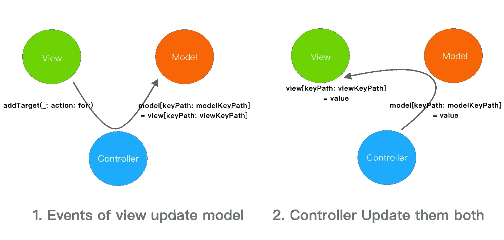
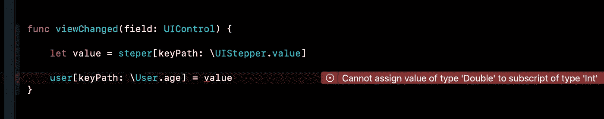
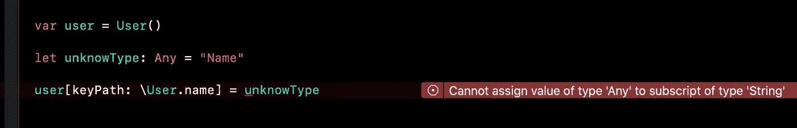
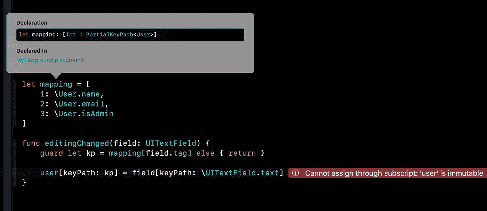
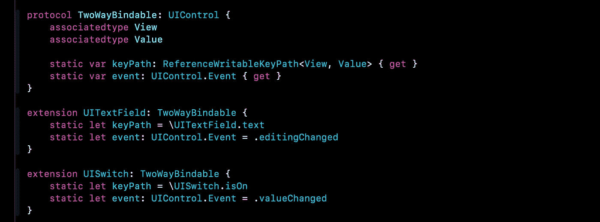
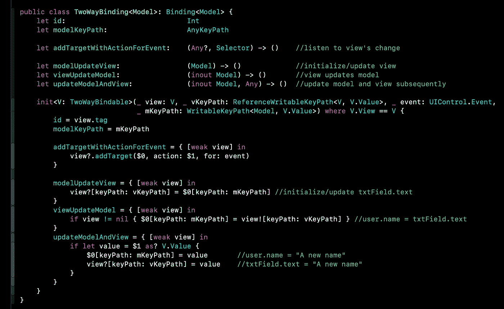
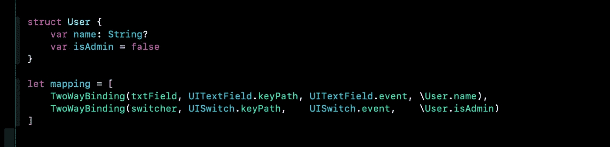
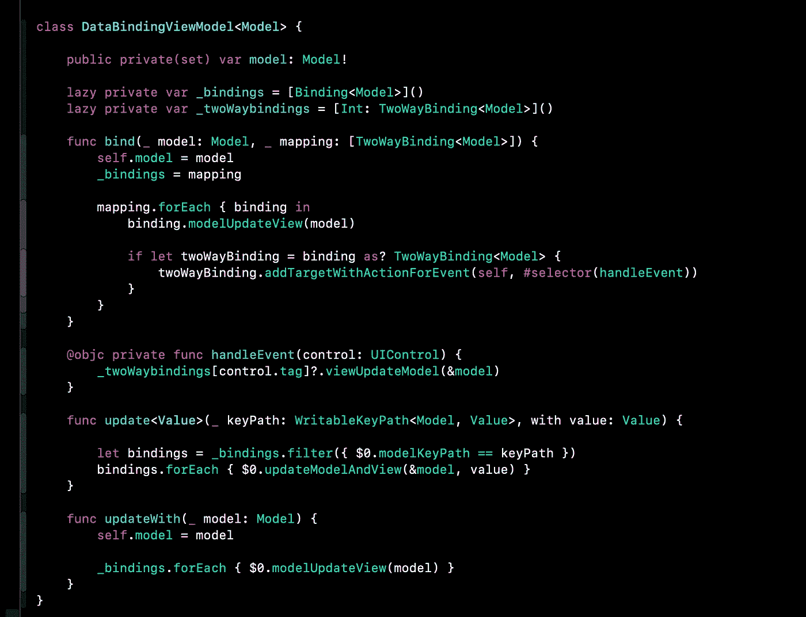
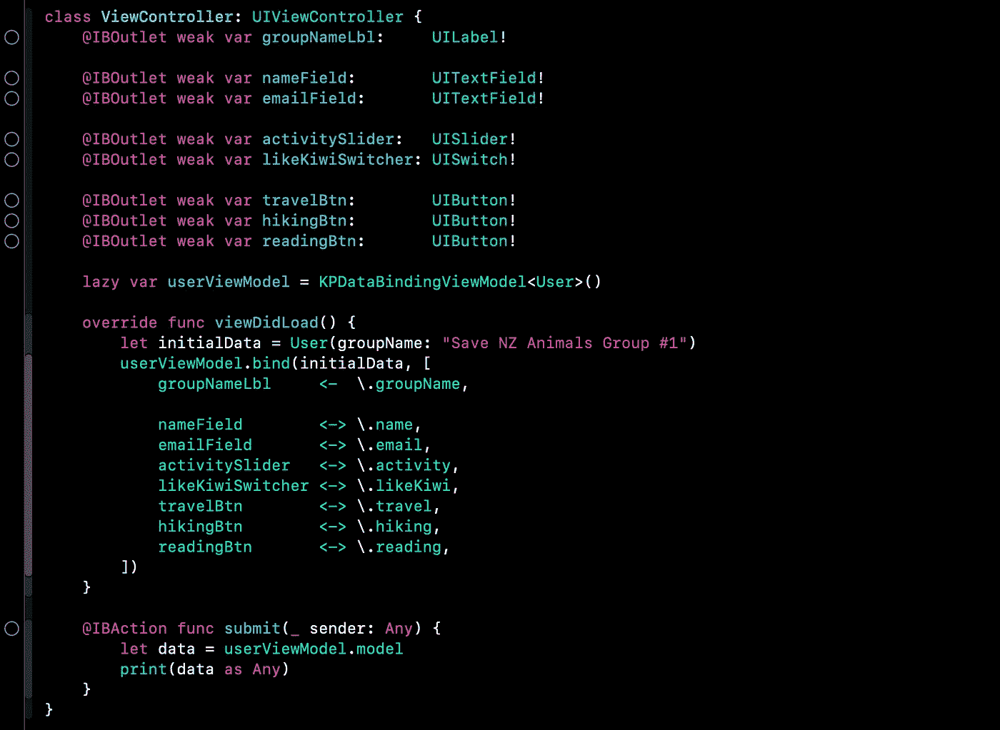

# iOS 上 MVVM 的数据绑定第 2 部分:关键路径和类型擦除

> 原文：<https://blog.devgenius.io/data-binding-in-ios-part-2-keypath-and-type-erasure-8f5a5d2d1571?source=collection_archive---------17----------------------->

这个故事是关于我如何用 Swift KeyPath 实现单向和双向数据绑定的。在阅读这个故事之前，您可能需要查看第 1 部分，以了解我采用的是哪种数据流策略。

[](https://medium.com/dev-genius/data-binding-in-ios-part-1-data-flows-in-mvc-3d182c065e4) [## iOS 中的数据绑定第 1 部分:MVC 中的数据流

### Android 提供数据绑定来监听模型的变化和更新绑定视图。但是如何在…

medium.com](https://medium.com/dev-genius/data-binding-in-ios-part-1-data-flows-in-mvc-3d182c065e4) 

# 为什么选择 KeyPath？

```
\TypeName.path
```

## **1。动态和一致性**

键路径表达式提供了一种动态和一致的方法来访问和更新数据。类型可以是任何具体类型或泛型类型，包括普通的**结构**和 **UI 组件**，这是数据绑定的两个重要端点。

```
var model = User()
var view = UITextField()model[keyPath: \User.name] = “Tonny”
view[keyPath: \UITextField.text] = “Tonny”view[keyPath: \UITextField.text] = model[keyPath: \User.name]
model[keyPath: \User.name] = view[keyPath: \UITextField.text]
```

它还能够访问或更新**嵌入的**属性。

```
model[keyPath: \User.address.country] = “NZ”view[keyPath: \UITextField.text] = model[keyPath: \User.address.country]
```

## **2。摘要如何作为什么**

当实现一个表单 UI 时，有大量的代码来监听视图的变化并更新相关的模型。这个任务仅仅是关于如何从视图中更新模型和从模型中更新视图。关键路径表达式是将那些**如何**视为**什么**的抽象方式，减少了重复监听和更新代码。

*   **如何更新属性？**

```
func textChanged(field: UITextFeild) {
    let tag = field.tag
    let text = field.text

    if tag == 1 {
        user.name = text
    }else if tag == 2 {
        user.email = text
    }else if tag == 3 {
        user.phone = text
    }
}
```

*   **要更新的属性是什么？**

```
func textChanged(field: UITextFeild) {
    let propertyKeyPath = keyPathMapping[field.tag]

    user[keyPath: propertyKeyPath] = value
}
```

# 单向数据绑定

单向数据绑定首先启动视图的呈现，然后帮助视图不断地跟随模型的变化。有几种方法可以监听和通知更改，如 didSet、KVO 或 RxSwift。我只是将所有更新逻辑放在一个 viewModel 中，这是唯一负责模型更新的地方。当 ViewModel 更新模型时，它会随后更新视图。

```
//initial views
lbl[keyPath: \UILabel.text] = user[keyPath: \User.info]
imgView[keyPath: \UIImageView.image] = user[keyPath: \User.image]
textField[keyPath: \UITextField.text] = user[keyPath: \User.name]//help view to follow model's change
func update<V>(_ modelKeyPath: WritableKeyPath<User, V>, _ value: V){

    model[keyPath: modelKeyPath] = value

    let viewKeyPath = mapping[modelKeyPath]
    view[keyPath: viewKeyPath] = value
}
```

单向绑定中的所有视图组件都有自己唯一的 keyPath 来初始化和更新视图。

```
let viewKeyPathes = [
    UILabel: \UILabel.text,
    UIImageView: \UIImageView.image,
]
```

# 双向数据绑定

双向数据绑定比单向数据绑定更进一步。它不仅监听模型的变化，还监听视图的变化并相应地更新模型。UI 组件双向数据绑定最常见的用法是 UITextField。并且**add target(_:action:for:)**方法准备好监听视图的变化。

```
//initial views, same as above one way binding //help view to follow model’s change, same as above one way binding //help model to follow view’s change
field.addTarget(self, #selector(textChanged), for: .editingChanged)func textChanged() { user[keyPath: \User.name] = field[keyPath: \UITextField.text]
}
```

为了支持其他 UIControls，如 UIButton、UISteper、UISwitch、UISlide，侦听器应该是泛型的。

```
let event = type(of: view).bindingEvent
view.addTarget(self, #selector(viewChanged), for: event)func viewChanged(view: UIControl) { let modelKeyPath = mapping[view.tag]
    let viewKeyPath = type(of: view).bindingKeyPath

    model[keyPath: modelKeyPath] = view[keyPath: viewKeyPath]
}
```

所有双向绑定的视图组件不仅有自己的关键路径，而且有相关的事件触发器。

```
let viewKeyPathes = [
    UITextField: \UITextField.text,
    UISteper: \UIStepper.value,
    UISlider: \UISlider.value,
    UISwitch: \UISwitch.isOn,
    UIButton: \UIButton.isSelected,
]let viewEvents = [
    UITextField: UIControl.Event.editingChanged,
    UISteper: UIControl.Event.valueChanged,
    UISlider: UIControl.Event.valueChanged,
    UISwitch: UIControl.Event.valueChanged,
    UIButton: UIControl.Event.touchUpInside,
]
```

## 视图和模型的关键路径映射

数据绑定描述了视图外观和模型属性之间的关系。对于 Swift 关键路径，它本质上是关于视图的关键路径和模型的关键路径。我们需要的只是记录视图和模型的关键路径的映射，这样当视图的事件触发或模型改变时，绑定可以自动发生。考虑到不要强烈引用视图，不要用继承定制视图，视图的**标签**将是记录映射的最好主意。

```
let mapping = [
    txtFieldTag: \User.name,
    labelTag:    \User.email,
    buttonTag:   \User.isAdmin,
    switchTag:   \User.isTermsSelected,
    stepperTag:  \User.degree
]
```

请注意，视图的标签在映射中应该是唯一的**。**

## **数据流**

**关键路径在数据流中的作用如下图所示:**

****

**数据流**

# **关键路径的问题**

**当我用 KeyPath 实现数据绑定时，我遇到了两个问题。**

****第一期。在给定模型的 **Int** 属性和由**\ u stepper . value**检索的值(是 **Double** )的情况下，无法使用不匹配**
类型的值更新模型，更新失败是因为类型不匹配。**

****

**类型不匹配**

****

**类型不匹配**

****问题#2。集合中 KeyPath < Root 的泛型值类型，Value >被擦除。**
如果将所有模型的 keypath 放入一个字典或数组中，keypath 的值类型被擦除。当 WritableKeyPath <用户，字符串？>和 WritableKeyPath <用户，Bool >放入字典，类型将作为 PartialKeyPath <用户>丢失，PartialKeyPath 不再支持更新模型。由于值类型未知，更新失败。**

****

# **类型擦除**

**类型擦除是具有闭包或块特性的语言中的一种编程范式。这是一种主动擦除类型，但存储起来以备后用的机制，尤其适用于集合。看似丢失了类型，实际上保存了类型的信息。以下是一些例子:**

*   **当两个 WritableKeyPath 放入一个数组时，该类型将作为 PartialKeyPath <user>丢失，并且 PartialKeyPath 不再支持更新模型。但使用类型擦除技术，它成功地欺骗了编译器，可以接受任何类型，但只有在类型匹配时才更新模型。</user>**

```
struct AnyWritableKeyPath<Root> { let update: (inout Root, Any) -> () init<Value>(_ kp: WritableKeyPath<Root, Value>) {
        update = {
            guard let value = $1 as? Value else {
                return
            }

            $0[keyPath: kp] = value
        }
    }
}let array = [AnyWritableKeyPath(\User.name), AnyWritableKeyPath(\User.likeKiwi)]array[0].update(&user, dataWithUnknowType)
```

*   **当闭包存储在集合中时，类型的信息会丢失。我们必须主动抹去它，但把它留到以后。**

```
let stringClosure: (String) -> () = {
    //...
}let intClosure: (Int) -> () = {
    //...
}struct AnyClosure {
    let invoke: (Any)->() init<T>(_ closure: [@escaping](http://twitter.com/escaping) (T) -> ()) {
        invoke = { v in
            if let v = v as? T {
                closure(v)
            }
        }
    }
}[AnyClosure(stringClosure), AnyClosure(intClosure)].forEach {
    $0.invoke("a")
}
```

*   **AnyView 引用了包装视图的属性、函数和类型信息。**

```
class AnyView {
    let referToTag: Int
    weak var weakReference: UIView? let referToFunction: (Any, Selector, UIControl.Event)->() init<V: UIView>(_ view: V) {
        referToTag = view.tag
        weakReference = view        referToFunction = {
            if let v = view as? UIControl {
                v.addTarget($0, action: $1, for: $2)
            }
        }
    }
}[AnyView(UIView()), AnyView(UIButton())].forEach {
    $0.referToFunction(viewModel, action, event)
}
```

**注意，类型擦除是对抗强类型特性的一个技巧，有时没有类型约束是不安全的。不要滥用它。**

# **数据绑定在起作用**

**首先，定义双向可绑定视图，它有 keypath 呈现外观和事件来更新模型。**

****

**TwoWayBinding 描述了视图和模型属性的绑定，它使用一个闭包来存储模型的属性类型。通过 Swift KeyPath，它支持从视图更新模型，从模型更新视图，并更新两者。**

****

**双向数据绑定**

**视图和模型属性的映射现在和平地存储在一个集合中，不会丢失类型。**

****

**定义绑定后，ViewModel 承担剩余的工作，它作为**控制器**工作，如上图所示。它负责通知视图对模型的更改，并随后更新模型和视图。**

****

**数据绑定视图模型**

**在中缀操作符的帮助下，绑定变得简单明了。**

****

**到目前为止还不错，但是在某些情况下，当在视图中显示时，您可能需要格式化数据，或者需要转换类型，因为视图的 keyPath 类型与模型的属性类型不匹配。所以运营商需要这样改进。**

```
uiLabel  <- \.text + { "This is $0"}
uiSteper <~ \.age  + { Double($0) } + { Int($0) }
```

**在玩了几天 KeyPath 之后，我创建了一个演示表单应用程序。它侧重于单向和双向数据绑定，包括以下特性:**

**[](https://github.com/tonnylitao/AwesomeKeyPath) [## tonnylitao/AwesomeKeyPath

### Swift KeyPath 非常棒，它可以用于数据绑定、预测和测试。

github.com](https://github.com/tonnylitao/AwesomeKeyPath) 

*   中缀运算符绑定视图和模型的关键路径

```
label <- model's keyPath  //one way
field <-> model's keyPath  //two way
```

*   与 UILabel、UIImageView、UITextField、UISwitch、UIButton、UISlider、UIStepper 的 **KeyPath** 的数据绑定。

```
uiLabel     <-  \.name
uiTextField <-> \.email
```

*   使用**闭包**的数据绑定对于任何视图，它支持从视图到模型的数据格式，反之亦然。

```
uiLabel  <~  (\.text, {
    $0.text = "A prefix $1"
})uiActivityIndicatorView  <~  (\.isLoading, { view, aBool in
    if aBool {
        view.startAnimating()
    }else {
        view.stopAnimating()
    }
})uiSteper <~> (\.aInt, { view, aInt in
    view.value = Double(aInt)
}, { view, _ in
    return Int(view.value)
})
```

*   绑定到一个模型属性的多个视图

```
uiTextField <-> \email
uiLable     <~  (\.email, { $0.text = "Your email: $1" })
```

*   解除视图与模型的绑定

你对 iOS 中的标准表单有什么想法？在 iOS 中如何实现类似的数据绑定呢？欢迎评论，在 Swift 玩得开心。**