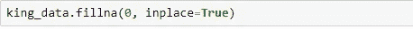

# Python 中的数据清理

> 原文：<https://blog.devgenius.io/data-cleaning-in-python-c9d7808dbeca?source=collection_archive---------1----------------------->

## 了解 Pandas 中的数据清理过程


照片由[在](https://unsplash.com/@thecreative_exchange?utm_source=medium&utm_medium=referral) [Unsplash](https://unsplash.com?utm_source=medium&utm_medium=referral) 上的创意交流

**在本教程中，**我们将学习宝贵的技能，这些技能将成为我们数据处理工作的基础。在我们可以应用机器学习算法或对我们的数据进行不同的分析之前，我们必须清理我们的数据并将其转换为合适的格式。这样的初始数据争论过程通常被称为**提取转换负载(ETL)** 。我们执行 ETL 和基本分析的首选工具是 Pandas 包。

## 熊猫是什么？

Pandas 代表“Python 数据分析库”。在使用 Python 分析数据时，Pandas 非常灵活。Pandas 是由 Wes McKinney 开发的高级数据操作工具。

Pandas 最好的特性之一是它接受数据(CSV 或 TSV 文件，或 SQL 数据库)并创建一个包含行和列的 Python 对象，称为数据框。

为了使用熊猫，你需要首先如下*导入*熊猫库:


***Numpy*** *是一个像熊猫一样的库，帮助用 Python 进行科学计算。现在熊猫可以使用了！*

## 为什么我们需要 ETL？

ETL 是数据分析和数据科学的重要步骤。它构成了**探索性数据分析(EDA)** 的基础。我们经常使用不同的数据集，而我们对这些数据集几乎一无所知。在这种情况下，我们的第一步是探索数据并熟悉它，比如什么是行/列？我们有多少观测值？有缺少的值吗？如果有的话，有哪些异常值？所有这些问题都可以通过应用 ETL 将原始数据集转换成有用的视图来回答。

**加载我们的数据:** *从. csv 文件导入我们的数据*


创建我们的数据框架 king_data

该数据集由 21597 个观测值和 21 个特征组成。

另一种显示数据的方式是使用**。头()和。**尾巴()【命令。


**。head()** 显示前 5 行和**。tail()** 显示最后 5 行

为了更仔细地查看我们的数据，我们可以使用**。info()** 获取数据帧的简明摘要。做 EDA 的时候真的很方便。


**使用 Describe 函数**:计算与 DataFrame 列相关的统计信息的摘要。此函数返回计数、平均值、标准差、最小-最大值和 IQR ( **四分位距)**值。


## 数据可视化:

数据可视化是数据的图形表示，有助于我们理解数据的含义。这将帮助我们了解如何清理我们的数据。一些常见的可视化方法有:

**利用。corr()** —在线性回归中建模时，有必要移除高度相关的变量。我们可以用熊猫“**”来寻找相关性。corr()** ”函数，并可以使用 *seaborn* 中的热图来可视化相关矩阵。

**Seaborn** 是用 **Python** 制作统计图形的库。它构建在 matplotlib 之上，并与 pandas 数据结构紧密集成。

```
**import** **seaborn** **as** **sns**
```

检查数据集中变量之间的相关性:


*   深色代表正相关，而浅色代表负相关。
*   如果设置 annot=True，您将获得格网单元中要素相互关联的值。
*   这里我们可以看到“sqft_living”与“浴室”有很强的正相关性。

**使用配对图** —在数据集中绘制成对关系。Pair plot 创建一个轴网格，这样数据集中的每个数值变量将在 y 轴的一行中共享，在 x 轴的一列中共享。也可以显示变量的子集，或者在行和列上绘制不同的变量，如下所示:


**使用直方图** —直方图是快速检查数据样本分布的一种简单且常用的图表。


## 数据清理:

在可视化数据，并更好地了解它之后，我们现在可以开始清理它了。

**唯一值** —下面是我们如何检查列的唯一值，以及查看每个唯一值的出现次数:


邮政编码的唯一值


每个邮政编码的价值计数

**填充/替换**不需要的值:我们的数据集中有一些不需要的值，比如 NA 和？。我们可以根据自己的意愿填充或删除它们。如果我们只想删除它们，我们可以使用 **df.dropna()** 其中 df 是我们的数据帧的名称。否则，我们可以使用以下命令:



**使用 Groupby** — groupby()函数用于根据某些标准将数据分组。它有助于我们根据特定标准可视化数据。


**删除行或列**:删除不需要的行/列也是清理过程的重要部分。我们可以通过指定标签名和相应的轴，或者直接指定索引或列名来实现。


删除列 date 和 id，指定 axis = 1

**检查空值:**我们应该总是检查数据集中是否有丢失的值，这可以通过使用 pd.isnull()来完成。这将检查空值，并返回一个布尔数组(数组 ***true*** 表示缺失值，数组 ***false*** 表示非缺失值)。

您可以在以下网址查看关于清理和可视化的完整代码:

[](https://github.com/Menonvid/Mod2-Proj/blob/master/student.ipynb) [## Menonvid/Mod2-Proj

### permalink dissolve GitHub 是超过 5000 万开发人员的家园，他们一起工作来托管和审查代码，管理…

github.com](https://github.com/Menonvid/Mod2-Proj/blob/master/student.ipynb) 

## 结论:

在本教程中，我们学习了首字母缩写词 ETL，并使用 pandas 预览了几个 ETL 过程的例子。EDA 还有很多方式和方法，但我已经尝试涵盖了基本的和一些常用的方法。

请随时留下任何意见或建议。感谢您阅读这篇文章。