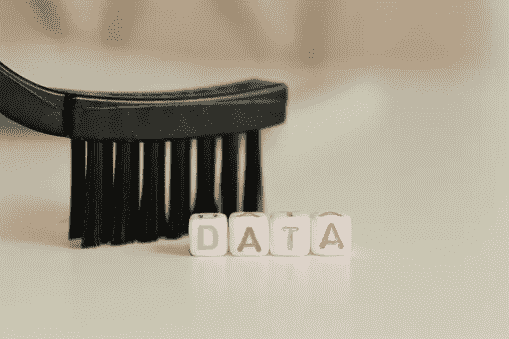

# R 中的数据清理

> 原文：<https://blog.devgenius.io/data-cleaning-in-r-6071e0bc481b?source=collection_archive---------8----------------------->



照片来自 [unsplash](https://unsplash.com/s/photos)

众所周知，数据科学家在数据科学项目中花费 80%以上的时间来清理和准备用于分析和建模的数据，因此，对于数据科学家来说，对数据清理和管理有很好的理解和实践技能是不可或缺的。为此，本文试图将一些基本的数据清理技术应用到杂乱的数据集上。

## 关于数据

分析中使用的数据来自于由 [askamanager](http://askamanager.org) 完成的[薪资调查](https://www.askamanager.org/2021/04/how-much-money-do-you-make-4.html)。当我下载数据的时候，它已经达到了 27k 的记录，我猜现在它已经远远超过了前面提到的记录。

## 加载库

```
library(data.table) # for data wrangling 
library(stringi) # package for string manipulation  
library(dplyr) # for data manipulation/wrangling
```

## 数据导入

我从 google sheets 下载了数据，然后把它放在我的 github 库的一个数据文件夹中。在后面的文章中，我将介绍如何从 googlesheets 直接访问 r。

```
salary_data <- fread("[https://raw.githubusercontent.com/oyogo/data/main/Ask%20A%20Manager%20Salary%20Survey%202021%20(Responses)%20-%20Form%20Responses%201.csv](https://raw.githubusercontent.com/oyogo/data/main/Ask%20A%20Manager%20Salary%20Survey%202021%20(Responses)%20-%20Form%20Responses%201.csv)")
```

## 数据检查

第一步是检查我们的数据。你可能想获得以下信息。
*观察总数
*变量总数
*变量类型
*列名
*看看前几条记录

str()函数返回大量我们想要看到的细节，变量数据类型、列名、观察值和变量的总数。

```
 str(salary_data)
```

您也可以使用 head()函数来查看前几条记录

```
 head(salary_data)
```

## 数据清理

数据清理试图解决的一些关键问题是:
*一致性/统一性
*缺失值
*列名
*拼写问题
*数据类型

如上所示，快速检查我们的数据表明，它需要一些清理。

***首先需要更改*的列名**。大多数都太长，有空格，还有一些包含特殊字符。这将在以后引用列时带来问题。让列名符合以下五种命名约定之一是一个很好的做法:
*全小写
*句点分隔
*下划线分隔
*小写
*大写

***country 列有无数个版本，例如*。**这就带来了一致性和拼写问题。让我们用一个名字来指代美国，而不是美国，美国，美国等等。他们只是指同一个国家。
***我们都知道 salary 应该是整数/浮点数据类型，但是从检查中你会看到它注册为字符类型*** 。这涉及到数据类型。有时在将数据读入 R 时，数字数据被当作字符读取，而实际上它并不是字符。我们绝对应该改变这种状况。
***有些列有很多空条目*** 。这样的词条我们该怎么处理？坚持住，我们会想到的。

## 列名

我们可以使用组合函数 c()创建所需名称的向量，并使用 names()函数将它们分配给数据帧的列名，如下所示。有其他的方法可以做到这一点，你可以探索并决定什么最适合你。

```
names(salary_data) <- c("Timestamp","age","industry","job_title","job_title_context","annual_salary",
                         "Other_monetary_comp","currency","currency_other",
                         "income_context","country","state","city","professional_experience_years","field_experience_years",
                         "highest_edu_level","gender","race
```

## 一致性和拼写问题

教育水平和国家等分类变量需要一些清理，我们需要有一致的值，而不是给定类别的变量。

```
salary_data$highest_edu_level <- gsub("Some college","College degree",salary_data$highest_edu_level)
```

在上面的代码块中，我们已经使用 gsub 进行了字符串替换。我希望我们能探索一些其他的方法来完成类似的任务。
由于有了 ***stringi*** 和 ***string*** r 包，我们可以使用无数的函数来操作数据。
现在我们可以利用 ***stringi*** 中的***stri _ replace _ all _ regex***来做替换。

```
salary_data$country <- stri_replace_all_regex(salary_data$country,
                                  pattern=c('US', 'USA', 'usa',"U.S.","us","Usa","United States of America","united states",
                                            "U.S>","U.S.A","U.S.A.","united states of america","Us","The United States",
                                            "United State of America","United Stated","u.s.","UNITED STATES","united States","USA-- Virgin Islands",
                                            "United Statws","U.S","Unites States","U. S.","United Sates","United States of American","Uniited States",
                                            "Worldwide (based in US but short term trips aroudn the world)","United Sates of America",
                                            "Unted States","United Statesp","United Stattes","United Statea","United Statees","UNited States","Uniyed states",
                                            "Uniyes States","United States of Americas","US of A","United States of america","U.SA","United Status","U.s.",
                                            "U.s.a.","USS","Uniteed States","United Stares","Unites states","Unite States","The US","United states of America",
                                            "For the United States government, but posted overseas","UnitedStates","United statew","United Statues",
                                            "Untied States","USA (company is based in a US territory, I work remote)","Unitied States","Unitied States",
                                            "USAB","United Sttes","united stated","United States Of America","Uniter Statez","U. S","USA tomorrow",
                                            "United Stateds","US govt employee overseas, country withheld","Unitef Stated","United STates","USaa",
                                            "uSA","america","United y","uS","USD","United Statss","UsA","United  States","United States is America",
                                            "United states of United States","United StatesD","United States- Puerto Rico","United Statesaa","United Statest",
                                            "United States govt employee overseas, country withheld","United StatesA tomorrow","United StatesAB",
                                            "United StatesA (company is based in a United States territory, I work remote)","United StatesS",
                                            "United Statesa.","RUnited Statessia","United States of A","United StatesA-- Virgin Islands","United StatesA.",
                                            "United State","United states","United StatesA","United Statess","United StatessA","United States",
                                            "United Statessmerica","United StatUnited Statess","Canada and United StatessA","United States"),
                                  replacement="United States",
                                  vectorize=FALSE)
```

您可能希望按某些关键特征汇总记录的数量。在这种情况下，我想知道我们有多少来自美国以外的国家的提交，这是因为快速检查表明大多数提交来自美国。为了证实这一点，让我们将每个国家的提交内容进行分组，并查看它们之间的比较情况。

```
sal_countrygrouped <- salary_data[,.(count=.N),by=.(country)]
```

我们有美国的两个变体，让我们清理一下，以便我们有一个适当的总结。

使用 gsub 从美国移除 A。

```
salary_data$country <- gsub("United StatesA","United States",salary_data$country)
```

获取按国家列分组的百分比计数。

```
percentage.count <- salary_data[,.(totalcount=.N,country)][,.(count=.N,totalcount,country),by=.(country)][,.(percentage=round(count/totalcount*100)),by=.(count,country)] %>% unique() 
```

在得到每个国家提交的百分比后，我们看到美国占所有提交的 83%。现在，我认为只过滤美国提交的数据会更好。这也将确保我们有相同的货币来处理。考虑来自同一经济体的呈件也是有益的，这样可以排除可能导致工资率差异的其他因素。考虑到这一点，我将只过滤来自美国的提交，好在 83%的原始数据对于我们的下一步分析仍然足够。

```
salary_data_US <- salary_data[country %like% "United States",]
```

还有一件事，另一个**一致性**检查。看到我们只过滤了美国的数据，我们有美元货币吗？

```
unique(salary_data_US$currency) 
```

有趣的是，并不是所有货币列的值都是以美元表示的，有些观察值使用了美元以外的其他货币。这可能来自那些表明他们来自美国，但他们的雇主在美国境外的人，或者可能他们来自美国，但在美国境外工作，因此使用其他货币获得报酬。
我们可能需要转换货币，或者删除那些不是美元货币类型的记录。

等一下，在我们删除非美元货币之前，仔细看一下 currency_other 一栏可以发现，有些人表示他们的货币是其他货币，但后来选择了美元选项。

```
salary_data_US <- salary_data_US[currency_other %in% c("USD","American Dollars","US Dollar"), currency := "USD"]
```

对于上述操作，还有其他方法，比如使用 case_when with mutate 或 if_else with mutate。你可以考虑探索这样的。
现在我们可以只过滤货币为美元的记录。

```
salary_data_US <- salary_data_US[currency == "USD",]
```

## 数据类型

我们都知道 annual_salary 变量应该是数值型的，但是它不在我们的数据中。让我们纠正这一点。

```
salary_data_US$annual_salary <- gsub(",","",salary_data_US$annual_salary)
salary_data_US$annual_salary <- as.numeric(salary_data_US$annual_salary)
```

## 缺少值

有两种处理缺失值的主要方法。
*使用平均值、中间值或众数进行插补。
*删除缺少值的行或列。使用的方法实际上取决于您的数据、数据类型以及缺失值出现的位置。对于这种情况，您会注意到有相当多的变量缺少值，删除这些变量是一个好的选择，至少对我来说，我们可能不会在分析中使用它们。以货币 _ 其他、职位 _ 背景、收入 _ 背景、其他 _ 货币 _ 薪酬变量为例。

```
salary_data_US <- salary_data_US[ highest_edu_level !="",]
salary_data_US <- salary_data_US[!is.na(annual_salary),] 
salary_data_US <- salary_data_US[gender %in% c("Man","Woman")]
salary_data_US$gender <- as.factor(salary_data_US$gender)
```

## 设置数据子集

除了缺少值的要素/列之外，还有其他一些列在分析中可能没有用，例如时间戳和城市。这样的可以放弃。
不需要国家/地区列，因为我们已经过滤了我们的数据。

```
salary_data_US <- salary_data_US[,c("age","annual_salary","professional_experience_years","highest_edu_level","gender","industry","job_title")]
```

## 包扎

我们的数据比最初好得多，至少可以用来做一些分析。
请关注下一篇关于此数据的探索性数据分析的文章，并随时发表您对该主题和数据的评论和建议。