# 使用 SQL 清理数据

> 原文：<https://blog.devgenius.io/data-cleaning-using-sql-eca765259779?source=collection_archive---------1----------------------->

最近我做了一个关于使用 SQL 清理数据的个人项目。在这篇文章中，我将从头到尾解释整个过程。

# 介绍

**数据清理**是纠正或删除脏数据的过程，即数据集或数据库中不正确、损坏、格式不正确、重复或不完整的数据。

**SQL** 代表**结构化查询语言**，是一种用于在关系数据库中查询和操作结构化数据的语言。当我们处理 MS Excel 或 Google Sheets 等电子表格程序无法处理的大量数据时，SQL 是数据分析中非常有用的工具。

有许多 SQL 编辑器，您可以加载数据集或数据库来操作和查询，以获得必要的信息。一些流行的 SQL 编辑器有 MySQL、Microsoft SQL Server、Postgre SQL、Bigquery、SQL Lite 等。所有 SQL 编辑器的基本语法都是相似的，但是在不同的 SQL 编辑器中可能会有一些细微的差别。

对于这个特殊的项目，我使用了微软的 SQL 服务器。

我写的完整查询可以在这里 找到 [***。***](https://bit.ly/3TF7tV3)

## **数据集**

我在这个项目中使用的数据集是我从 [**Kaggle**](https://www.kaggle.com/datasets/tmthyjames/nashville-housing-data) 获得的没有任何 **PII** (个人身份信息)的开源数据。在这个数据集中，有关于热门的纳什维尔住房市场的家庭价值数据的信息。这个数据集中有超过 56000 行和 19 列，标题分别为:UniqueID、ParcelID、LandUse、PropertyAddress、SaleDate、SalePrice、LegalReference、soldas vaitable、OwnerName、OwnerAddress、areas、TaxDistrict、LandValue、BuildingValue、TotalValue、year building、believes、FullBath、HalfBath。该数据集有许多不一致之处，这使得该数据集非常适合进行数据清理。

# 目标

清理该数据集时，我的目标如下:

1.  必要时标准化日期格式。
2.  填充 PropertyAddress 列中存在的空值。
3.  必要时将地址、城市和州分成单独的列。
4.  必要时将缩写转换成它们各自的完整形式。
5.  移除和删除重复值。
6.  删除未使用的列。

# 程序

首先，我调出整个数据集来查看其中的所有行、列和数据。我研究数据，找出数据集中的不一致之处。数据集中存在一些主要错误，例如，在**销售日期**列中，数据类型为**日期-时间**；在数据集的某些重要部分存在许多 **NULL** 值，例如在 **PropertyAddress** 列中；无论哪里有地址，实际的本地地址、城市和州(如果有的话)都集中在一列中，由一个**分隔符**分隔，这将使分析变得困难；**缩写**出现，可能会在后期阶段使利益相关者混淆；存在一些分析不需要的额外列。

## 必要时标准化日期格式

在**销售日期**列中，日期的默认格式为**日期时间**。但是对于分析来说，**时间**组件是不必要的，因此必须删除，只保留**日期**组件。我通过使用以下查询做到了这一点:

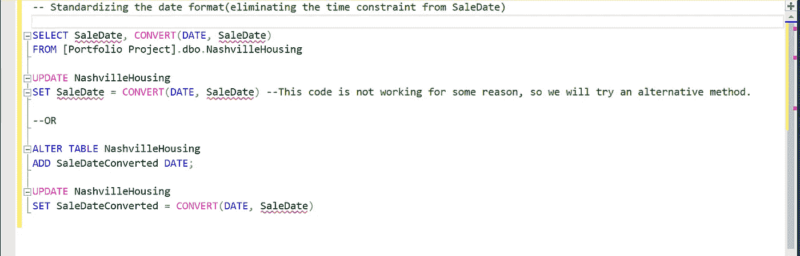

查询 1

消除时间约束的过程可以通过两种方式来完成，如上面的查询所示。在我的例子中，第一个查询由于某种原因没有正常工作，所以我不得不使用 **ALTER TABLE** 命令来代替。在这里，我创建了一个名为 **SaleDateConverted** 的新列并对其进行了转换，并将数据类型设置为 **DATE** 。逐一运行该查询后，结果如下:

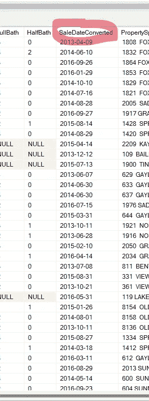

在上图中，可以看到一个名为 **SalesDateConverted** 的新列被创建，并且只保留日期，而不是日期和时间。

## 填充 PropertyAddress 列中存在的空值

在浏览数据时，我发现数据集中有许多字段都有空值。如果不消除这些问题，它们会在执行分析时导致重大问题，并且还会显著改变结果。

其中一个可能导致很多问题的列是 **PropertyAddress** 列，因为没有它的地址就不可能在市场上找到房产。为了找到空值，我编写了以下查询:

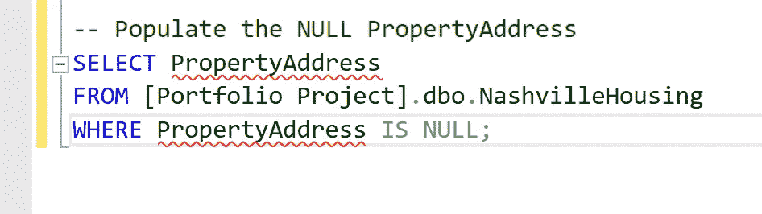

查询 2

运行查询后，结果如下:

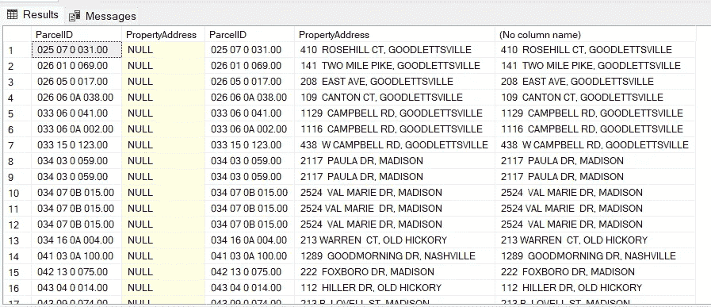

在上图中，可以看到查询提取了所有的空值。总共存在 **104 个空**值。

一旦我发现所有的 **NULL** 值，它们必须用属性地址填充，因为这个字段不能保持空白。如果您仔细观察该表，您会注意到具有**相同 ParcelID** 的**行**具有**相同的属性地址**。为了使这种比较更容易，您可以键入以下查询并运行它(可选)。

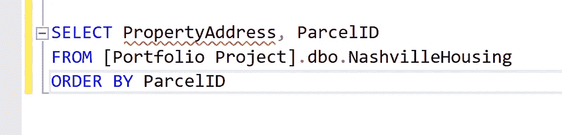

查询 3

因此，当确认对于同一个**ParcelID**,**property address**也是相同的，您可以使用它来填充特定列中的 **NULL** 值。为此，我必须在表上做一个**自连接**，以便使用 **ParcelID** 和 **PropertyAddress** 之间的关系来填充 **NULL** 值。执行此操作的查询如下:

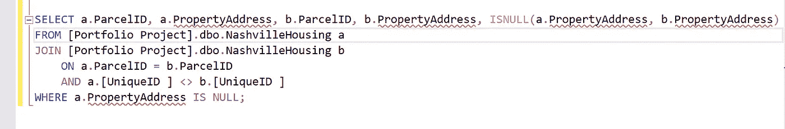

查询 4

在上面的查询中，我只是随机地将连接的表命名为**‘a’**和**‘b’**，以使它们与**连接**不同。 **ISNULL** 的语法是 *ISNULL(我们要寻找一个空值，我们要用什么来填充空值)。*is NULL 查询用地址填充了 **NULL** 单元格，其中 **ParcelID** 是公共的，而 **UniqueID** 不匹配。我使用了 **UniqueID** 来确保相同的 parcel ID 不会被比较两次(因为两个不同行的 parcel id 可能相同，但不是唯一 id)。

现在，我已经编写了这个查询，我必须更新 PropertyAddress 列中的这些新值。为此，查询如下:

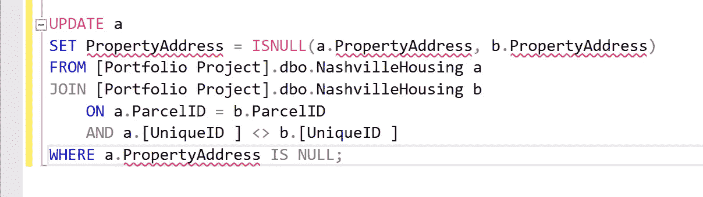

查询 5

更新该列后，如果您再次从上面运行查询 4，它将不会返回任何结果。这是因为所有的**空值**现在都被填充了。

## 必要时将地址、城市和州分成单独的列

如果您查看**属性地址**和**所有者地址**列，您会注意到地址的三个部分，即**实际地址**、**城市**，以及**所有者地址**的情况下**状态**，所有这些都包含在同一列中，并带有**分隔符**。这种格式的问题是，如果您想单独查询地址、城市和州，您将无法这样做。所以，首先，你必须把地址分成两三个单独的类别，然后把它们分别放在不同的栏里。

为此，查询如下:

*   **为物业地址:**

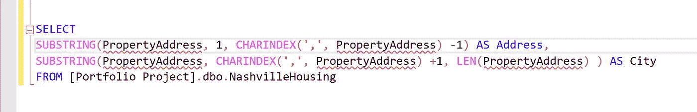

查询 6

在上面的查询中，我们使用了**子串**查询和 **CHARINDEX** 查询。

**SUBSTRING** 查询从字符串中提取一些字符。它的语法是: *SUBSTRING(我们要从哪里提取，从哪里开始，长度)*。

在第一个**子串**查询中，我想从**属性地址**列中提取数据，我想让它从**第一个**位置开始，并使用 **CHARINDEX** 命令插入长度( **-1** 用于消除中间的逗号)，并给它一个别名**“地址”**。

在第二个**子串**查询中，我再次希望从**属性地址**中提取数据，我使用 CHARINDEX ( **+1** 是为了在指定起点时排除逗号后的空格)，并指定**长度**，我使用 **LEN** 查询使用了**属性地址**列中任何内容的长度，并给它一个别名

**现在，随着查询正常工作，我创建了新的列，然后将这些提取的值插入到这些列中。为此，我使用了以下查询:**

**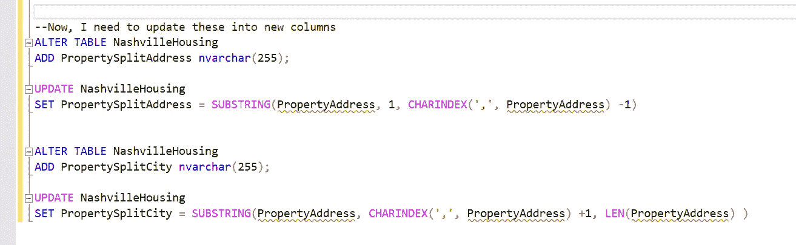**

**查询 7**

**在一个接一个地运行查询后，结果是在表中创建了两个新列，并用我使用前面的查询提取的数据填充。结果如下:**

**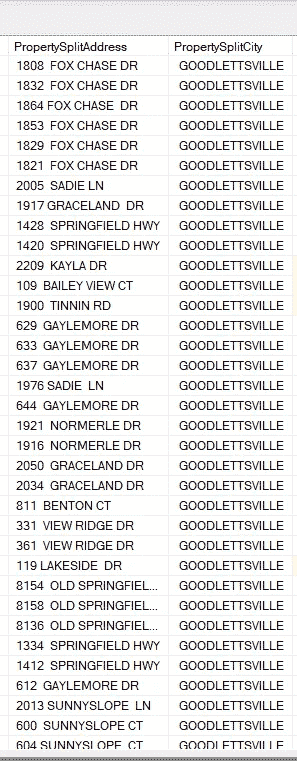**

**在上图中，您可以看到来自 **PropertyAddress** 列的数据现在被分别填充到两个不同的列中。因此，信息按地址和城市拆分，并分别填充到列**propertysplitdaddress**和 **PropertySplitCity** 中。**

*   ****给主人的地址****

**在**拥有者地址**栏中，有**两个分隔符**和**三个部分，即**实际地址**、**城市**和**状态**。如果我像在 **PropertyAddress** 列中那样分割地址，这将变得非常复杂和耗时，并且还可能出现错误。因此，在这种情况下，我使用了另一个查询，如下所示:****

**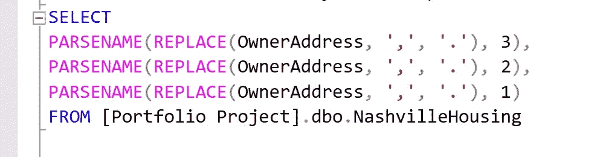**

**查询 8**

**在上面的查询中，我使用了 **PARSENAME** 关键字。它返回指定对象名的指定部分。这个查询**在分隔**分隔的**值时非常有用**，但是它只能检测到“**句点(。)**而不是**逗号(，)**。PARSENAME 查询的语法是:**

***PARSENAME('对象名'，'对象件')*。**

**但是在我的例子中，问题是不同的值由逗号分隔。因此，为了让 **PARSENAME** 查询工作，将**逗号**转换成**句点**非常重要。为此，我使用了**替换**查询，它将**’、**替换为**’**解析名**可以读取的。****

****注意:****PARESENAME**反向读取列中的值，所以我没有按照升序 **(1，2，3)** 来命名 ***object_piece*** ，而是按照降序****(3，2，1)** 来命名，这样它就可以先读取地址，然后是城市，最后是州。****

****运行**查询 8** 后， **OwnerAddress** 列中的值根据分隔符所在的位置被分成三个单独的列，如下所示:****

****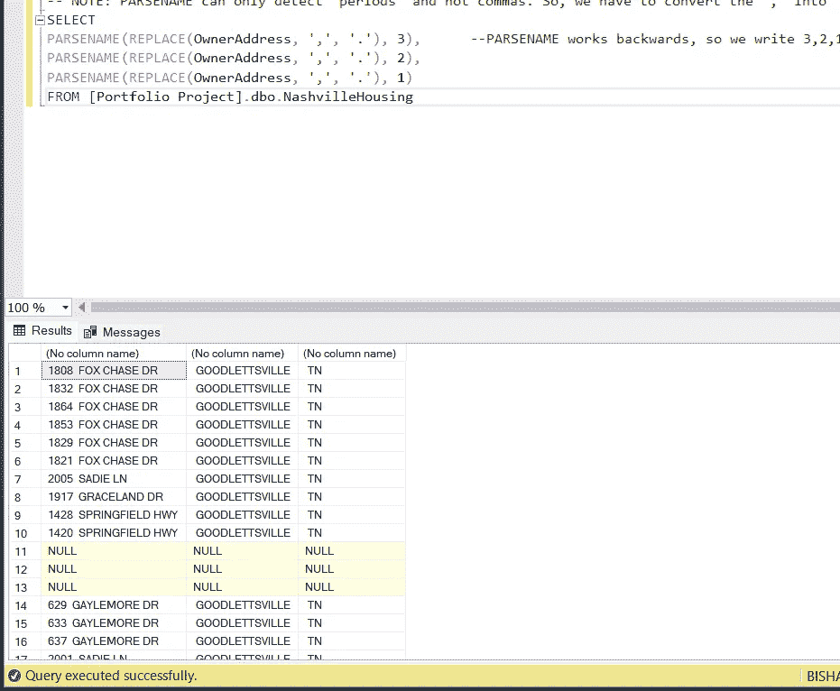****

****现在我有了地址、城市和州的单独值，它们必须被填充到各自的列中。为此，我使用了以下查询:****

****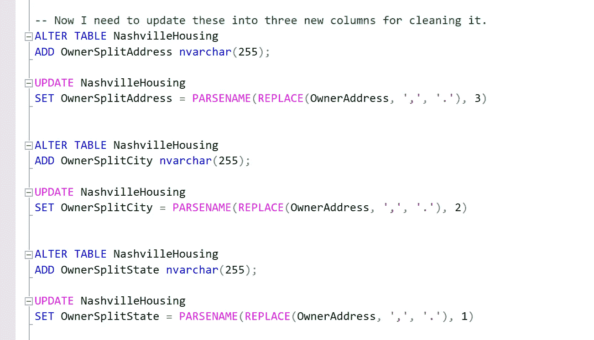****

****查询 9****

****在逐一运行上述查询后，创建了三个新列: **OwnerSplitAddress** 、 **OwnerSplitCity** 和 **OwnerSplitState、**，它们分别由地址、城市和州的独立值填充。****

****现在，如果您查看更新后的表，会发现添加了三个新列，并填充了相应的数据，如下所示:****

****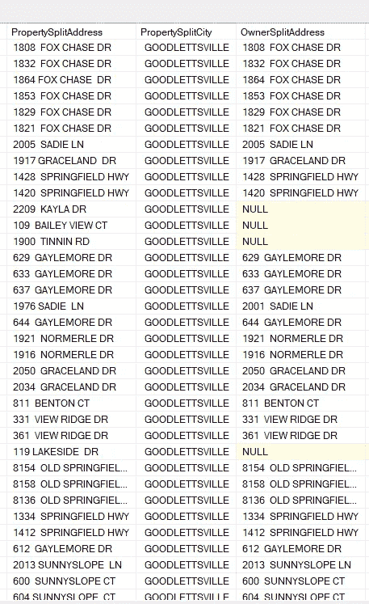****

## ****必要时将缩写转换成它们各自的完整形式****

****如果你看一下**纳什维尔房屋数据集**，在**soldas vacate**列中，数据类型是 **boolean** ，即 **Yes** 和 **No** 。但是如果查询**不同**值的个数，结果是**四个**，分别是**是**、**否**、 **Y** 和 **N** 。要检查这一点，请使用以下查询:****

****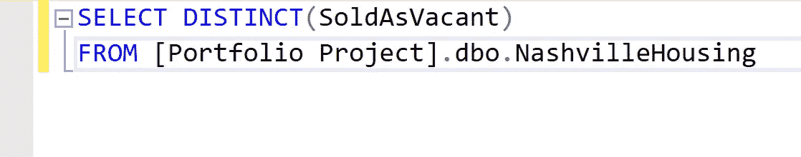****

****查询 10****

****当执行上述查询时，它会给出以下结果:****

****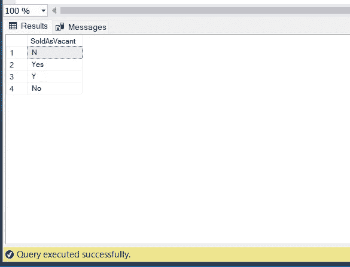****

****你可以看到我之前提到的四个不同的值。****

****如果您想进一步查看每个值的数量，请编写以下查询:****

****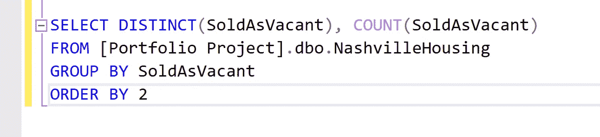****

****查询 11****

****运行上述查询后，它会给出以下结果:****

****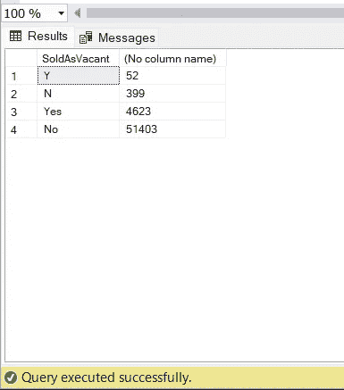****

****上图可以看到，有 **52** **Y** 值和 **399 N** 值，很多。****

****但是这可能会在未来的分析过程中产生问题。于是，我不得不将 **Y** 和 **N** 值分别转换为“**是**”和“**否**”。****

****为此，我编写了以下查询:****

****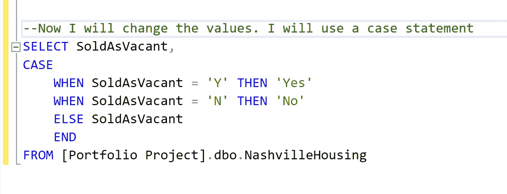****

****查询 12****

****在上面的查询中，我使用了 **CASE** 语句将 **Y** 和 **N** 值分别转换为“ **Yes** 和“ **No** ”。运行上述查询时，结果如下:****

****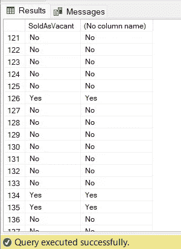****

****如果您仔细观察结果，在新的列中，您会注意到所有的 Y 和 N 值已经分别成功地更改为“Yes”和“No”。****

****现在，由于查询成功，我必须用结果值更新表。为此，我编写了以下查询:****

****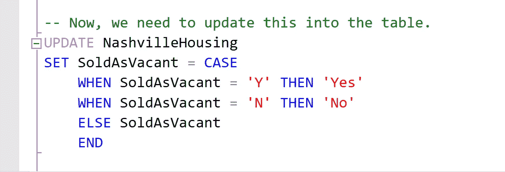****

****查询 13****

****运行上述查询后，如果您取出更新的表并运行**查询 11，**您将注意到没有 **Y** 和 **N** 值，相反， **Yes** 和 **No** 值的数量增加，表明该表已被更新。****

****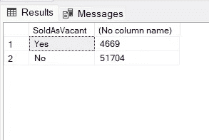****

## ****查找和删除重复值****

****如果您仔细查看数据集，您会发现许多列都有重复的值。这些可能会扭曲后面部分分析的结果。因此，必须找到并替换这些重复的值。****

****为了找出重复的值，我编写了以下查询:****

****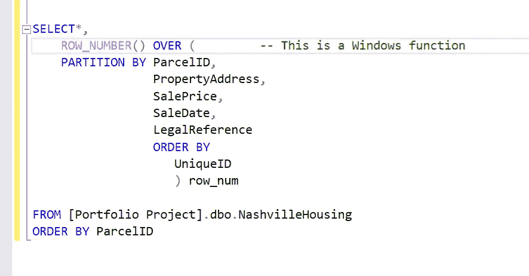****

****查询 14****

****当执行这个查询时， **row_num** 列显示值 1 和 2。如果值为 2，则意味着这些值是重复值。****

******注意:**在上面的查询中，我使用了**窗口函数(** *)一个窗口函数在一组与当前行*有某种关系的表格行中执行计算。您应该对特定行特有的内容进行分区。所以，在这种情况下，我选择了 **ParcelID** 、 **PropertyAddress** 、 **SalePrice** 、 **SaleDate** 和 **LegalReference** 。现在，如果所有这些在两行或更多行中是相同的，那么这意味着“该行是重复的行”。然后我们按**唯一**到**重复值**的东西排序，即**唯一 ID** ，我们将其命名为 **row_num** 。 **ROW_NUMBER** 语句返回结果集分区内某一行的*，从每个分区的第一行的 **1** 开始。*****

*****为了在我获得的值中运行任何进一步的查询，我必须临时存储这些值。为了做到这一点，我使用了 **CTE** ( **公共表表达式**)，它作为带有记录和列的**虚拟表**，在查询执行期间创建，由查询使用，并在查询执行后消除。*****

*****使用 CTE，我使用以下查询过滤掉了所有具有重复值的行:*****

*****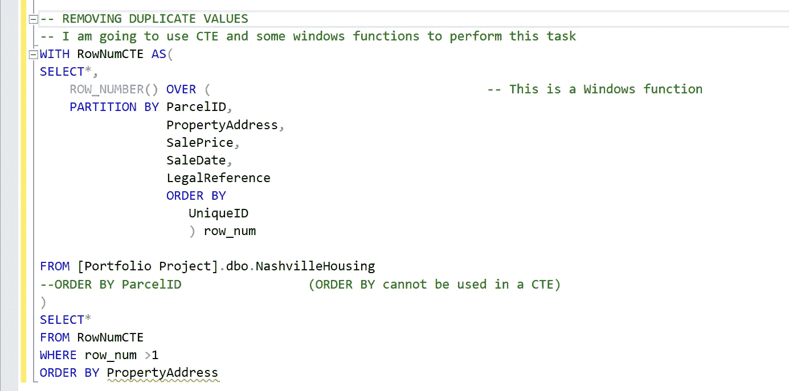*****

*****查询 15*****

*****在上面的查询中，我使用了 **WHERE** 语句来过滤掉 **row_num** 列的值**大于 1** 的行(这意味着它有重复值)。运行查询后，我发现该表有 **104 个重复的**值。*****

*****现在，所有重复值都已找到，我必须删除它们，为此，我只需将上述查询中的第二个 **SELECT** 语句更改为 **DELETE** 语句，以删除所有重复的行，如以下查询所示:*****

*****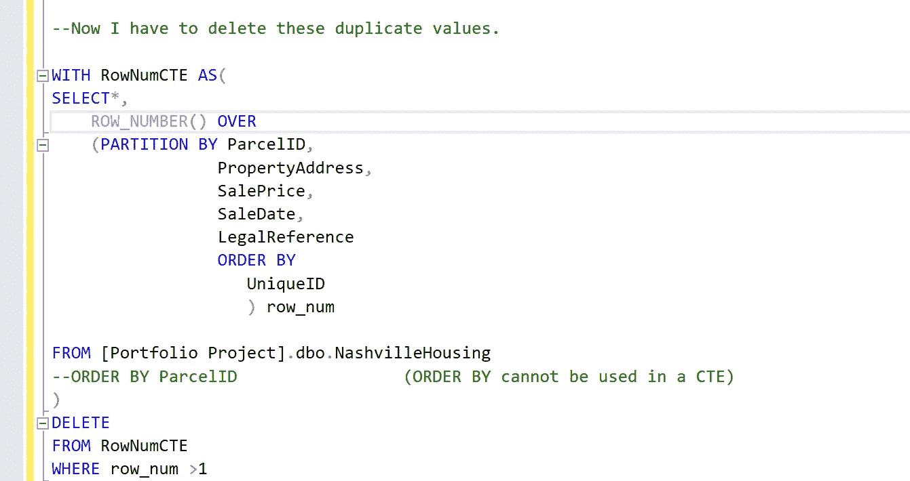*****

*****查询 16*****

*****执行上述查询后，所有的**重复**行都被**删除**，现在如果再次运行**查询 15** ，将不会返回任何值，因为所有的重复都被消除了。*****

## *****删除未使用的列*****

*****现在，如果您查看表中的数据，那么 **PropertyAddress** 和 **OwnerAddress** 对我们不再有用，因为它们的数据已经被拆分到单独的列中。此外， **TaxDistrict** 列对于任何进一步的目的都是无用的。所以，我现在可以删除这些列了。*****

*******注意:**在实践中，您不能从原始数据中删除列，但是这在您保存视图以备后用时很有用。*****

*****为了删除这些列，我使用了以下查询:*****

*****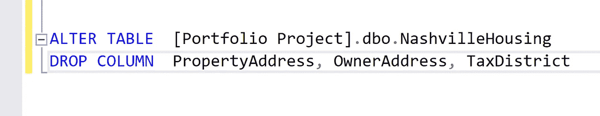*****

*****查询 17*****

*****我还决定删除**销售日期**列，因为我已经创建了**销售日期转换的**列。为此，我使用了上面查询中的 **ALTER TABLE** 和 **DROP TABLE** 语句。如下所示:*****

*****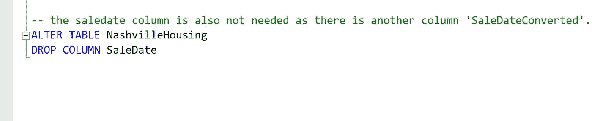*****

*****查询 18*****

*****现在，当我查询拉出整个表时，所做的所有更改都清晰可见。*****

*****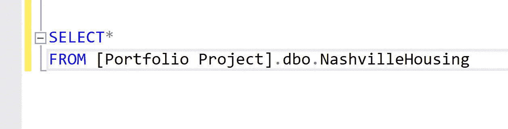*****

*****查询 19*****

*******纳什维尔住宅**数据集，在清理过程结束后，看起来如下:*****

*****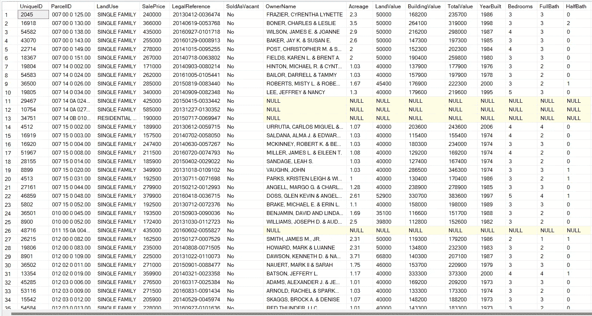**********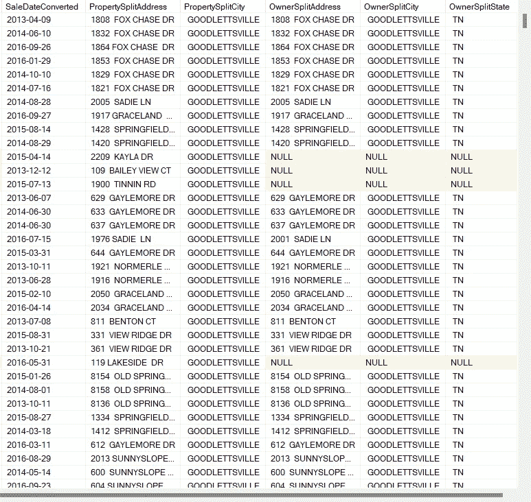*****

## *****未来范围*****

*****可以进一步清理数据(比如填充剩余的空值)，还可以使用 SQL 对清理后的数据进行进一步分析，还可以提取特定的数据，将其保存为视图，稍后可以用于创建可视化效果，以收集关于数据的更多信息。*****

## *******感谢您的阅读！*******