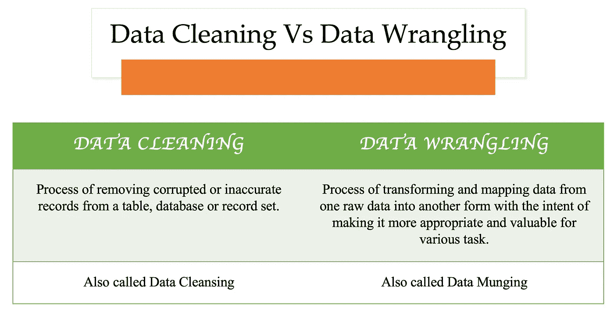

# 数据清理与数据争论

> 原文：<https://blog.devgenius.io/data-cleaning-vs-data-wrangling-3577827e28a7?source=collection_archive---------2----------------------->

**数据**是这个 21 世纪的心脏。它可能是任何领域，如工业、商业、政府、医生、科学家，他们的超能力是通过他们拥有的大量数据来分析的。有了这些数据的帮助，高效的决策支持系统就可以建立起来。

> 每个组织都以不同的形式存储数据。它们以文本、电子表格、XML 格式、数据库和许多其他形式存储数据。来自各种来源的数据根据需要进行合并和分析，以对业务做出预测。总的来说，数据争论和数据清理是两种可以将非结构化数据转化为有用数据的方法。

此外，这是 NLP 流程中最重要的第一步。这些是彼此之间最容易混淆的，这个博客将有助于更清楚地理解它们的区别。

数据清理和数据争论的区别

# 数据争论

数据争论是将数据从一种格式转换和映射到另一种格式的方法。这一过程有助于获得更有意义的数据，并将其用于执行不同的任务，如分析。数据牧马人的工作岗位是执行数据牧马人及相关任务的人。这还包括可视化数据、训练统计模型和数据聚合。

在数据争论中，数据首先以原始格式从数据源中提取。接下来，这些数据被发送到一个算法或解析成一个预定义的数据结构。最后一步是将这些数据存储在存储单元中，以备将来使用。数据科学家和业务分析师分析这些数据以做出业务决策。有不同的数据争论工具，查看参考资料中提供的链接。此外，您可以使用 python 脚本来完成。

# 数据清理

数据清理是从记录集或数据源中查找和删除不正确和不准确的记录，并修改或删除这些数据的方法。例如，一些需要清理的数据是重复值、伪值、缺少数据和矛盾的数据。此外，这种不一致的数据可能由于传输或存储中的损坏而发生。

数据清理可以包括诸如删除印刷错误或根据已知的实体列表验证和更正值之类的活动。它还可以包括协调和标准化数据等任务。总的来说，数据清理有助于清理数据集，并为不同数据源合并的不同数据集提供数据不一致性。

以上两种方法在机器学习和深度学习算法中的数据预处理都有重要作用。

参考资料:

https://www.varonis.com/blog/free-data-wrangling-tools/