# 使用 Python 熊猫库进行数据清理🐼+YT 教程

> 原文：<https://blog.devgenius.io/data-cleaning-with-python-pandas-library-part-1-youtube-tutorial-f1114ece6d5c?source=collection_archive---------8----------------------->

## 第 1 部分:用 YouTube 教程解释导入库、导入数据、数据结构和切片。

大家好，欢迎回到 vegxcodes 频道！今天，我们从 Python 熊猫系列的数据清理的第 1 部分开始。我还会为所有剧集制作一个简短的 YouTube 教程，并将其附在文章中。首先，我们学习如何导入库和数据。此后，我们将学习 Python 中的数据结构。本教程没有先决条件，但建议学习基本的 Python 知识😊。让我们直接进入编码⬇️

克里斯·库里在 [Unsplash](https://unsplash.com?utm_source=medium&utm_medium=referral) 上的照片

# YouTube 教程

这是我为这个系列的第一部分录制的相应的 YouTube 教程。你可以切换到视频或者继续阅读😊

VEGXCODES YOUTUBE 频道

## 导入库⚡️

为了在 Python 中使用一个库，您需要首先安装这个库，然后将其导入到您的脚本中。但是，在使用 Anaconda 环境时，可以选择已经准备好最重要的库。如果你想使用 Anaconda，你应该查看这里的文档来安装它 https://docs.anaconda.com/anaconda/navigator/install/➡️

我还使用 Anaconda 来创建环境。也许将来我会做一个关于设置 Anaconda 的教程，因为这是编码中非常重要的一部分。好了，如果所有东西都安装好了，我们就可以把这个库导入到我们的脚本中了。

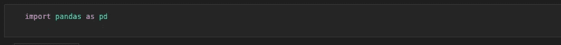

按 vegxcodes

正如你所看到的，这是一个非常简单的部分，也是每个 python 脚本的开始。当我们在这里使用 Jupyter 笔记本时，在我们开始使用它们的时候，导入这些库的诱惑是相当大的。这不是一种干净的编码方式，没有人会阻止你，但是如果你想让其他人阅读你的代码更容易，总是在脚本上面添加库。

## 导入数据⚡️

练习的时候，要用哪些数据？嗯，有很多网站，但我最喜欢的是 https://www.kaggle.com/的卡格尔·➡️。你不仅可以从其他人那里找到数据，还可以找到解决方案代码。你也可以在这个网站上参加竞赛——太棒了🔥

然而，我们选择的数据直接来自 Stack Overflow —是的，你是对的，这是年度调查。你可以在⬇️这里自己下载

 [## 堆栈溢出

### 2021 年，来自 180 多个国家和地区的近 80，000 份回复，我们的年度开发商…

insights.stackoverflow.com](https://insights.stackoverflow.com/survey?_ga=2.83314132.35207981.1644749519-993221112.1644749519) 

或者你可以在⬇️这里下载整个 Github 资源库

 [## GitHub-mitchxxmitch-代码/数据清理-教程

### 此时您不能执行该操作。您已使用另一个标签页或窗口登录。您已在另一个选项卡中注销，或者…

github.com](https://github.com/mitchxxmitch-code/Data-Cleaning-Tutorials) 

下载整个存储库时，您已经有了解决方案代码以及可用的结构化数据。

库被导入，数据被下载并可用——所以让我们继续并将数据导入脚本。⬇️

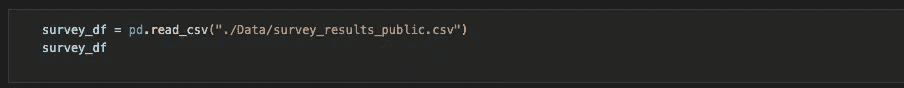

按 vegxcodes

我们使用 pandas read_csv 函数来导入数据。通过使用 Python Pandas，您可以将数据作为 pandas DataFrame 导入。我们将在下面的视频中了解更多细节。但是现在，一个数据帧基本上由行和列组成，因此它是一个二维的标记数据结构。

将数据分配给 survey_df 变量后，我们遇到了使用 Jupyter 笔记本的第一个优点。我们可以显示数据帧，并初步了解数据是如何组织的。下面你只能看到整个⬇️.数据框的一部分

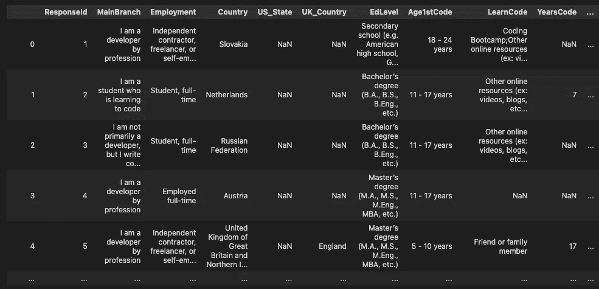

按 vegxcodes 截取调查 _df

然而，还有一些其他的 pandas 方法可以给我们一些关于数据集的信息。让我们从 shape 方法开始，它以元组的形式输出数据帧的行数和列数。第一个数字显示行数(83439)，第二个数字是列数(48)。

有时，在检查数据集时，您可能会遇到无法看到所有列的问题。当然，有一个解决办法，那就是⬇️

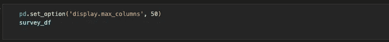

通过 vegxcodes 设置预览的最大列数

在 Jupyter 笔记本中，默认情况下，它将只显示 20 列。我们已经把它从 20 改成了 50。😊

现在我们可以看到数据集的所有列，但是行呢？在调查数据框架中，我们不想显示所有行，因为这是大量数据，但是还有另一个包含与列相关的问题的 csv。让我们通过导入来看看这个 csv，就像我们对第一个 CSV 所做的那样。

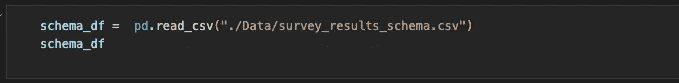

导入结果模式

下面你看到了⬇️调查的一部分问题

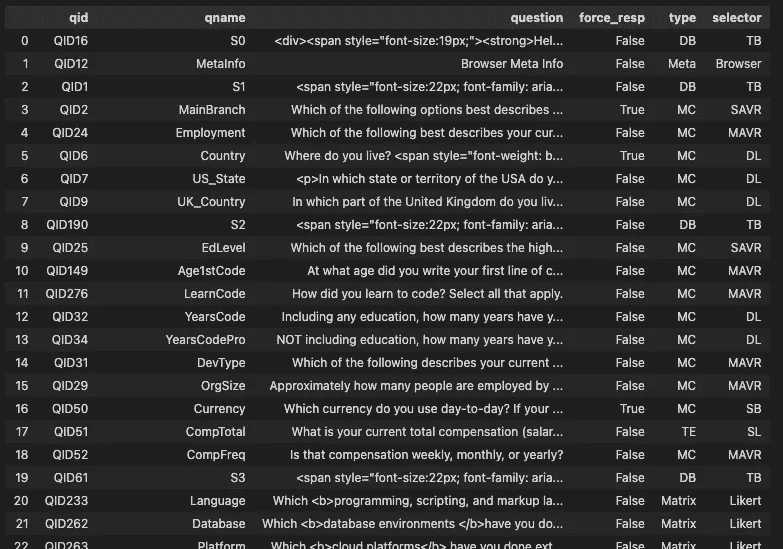

调查结果模式

下面我们将显示的列和显示的行设置为 100 ⬇️.

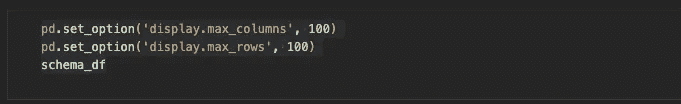

显示选项

另一个有用的方法是 info，它将为您提供关于列的数据类型的信息。稍后我们将更详细地讨论数据类型，但是现在，对象基本上是字符串，整数是没有小数的数字，而浮点数是有小数的数字。

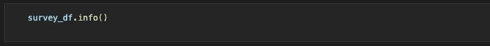

信息方法

下面你可以看到输出⬇️

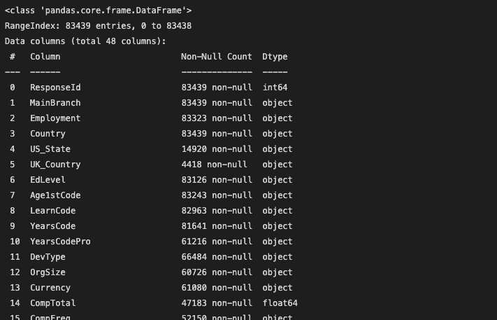

输出 survey_df.info()

这里有两个更重要的熊猫特征，可能对你未来的工作很有帮助。默认情况下，使用 head()可以显示数据帧的前 5 个观察值，使用 tail()可以显示数据帧的后 5 个观察值。但是，您可以在圆括号内输入任何数字(例如 head(15))，然后圆括号就会显示出来。

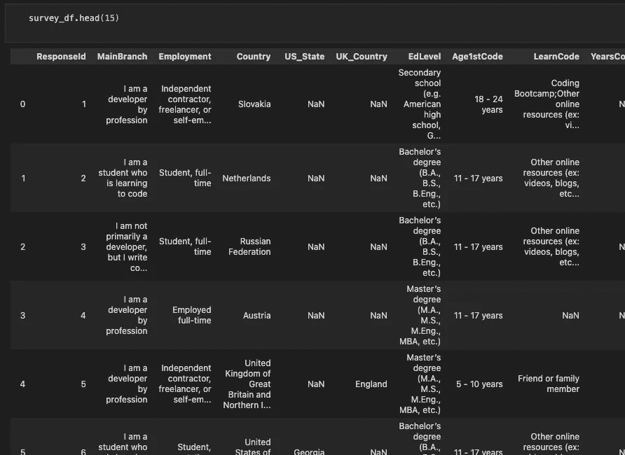

survey_df.head 的输出(15)

# **课后数据结构⚡️**

在下一节中，我将向您展示如何自己创建数据框。如果你已经对熊猫有所了解，可以跳过这一部分。

首先，我们创建了一本字典来和⬇️.练习字典由键和值组成。在下面的示例中，“名字”是一个键，而[“Max”、“John”、“Anna”]是相应的值。

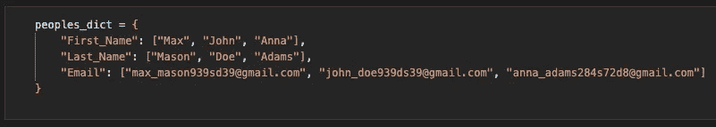

词典

下一步是使用字典中的数据创建数据框。⬇️

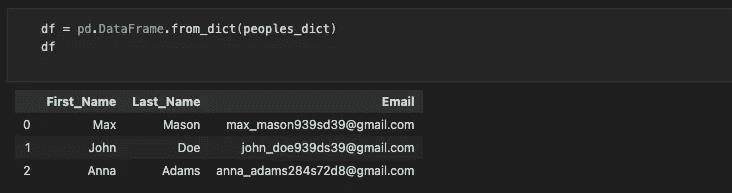

来自字典的数据帧

如您所见，我们已经创建了一个字典，其中每个键基本上是一列，每个值属于一行。

我们现在可以检查电子邮件列的类型。⬇️

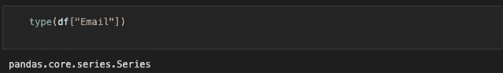

检查类型

正如你所看到的，这是一个熊猫系列。**总结:**一个熊猫数据帧基本上由几个熊猫系列(列)组成。您可以通过创建字典来创建 pandas 数据框，在字典中，您使用关键字作为列名(例如姓氏)和包含对应值的列条目的列表(例如[Mason，Doe，Adams])。因此，我们也可以说熊猫系列基本上是一维数组，而数据帧是二维的。

那么，如何访问数据框中熊猫系列或列的值呢？在将数据框命名为“⬇️”后，将该列放在方括号内的问题中

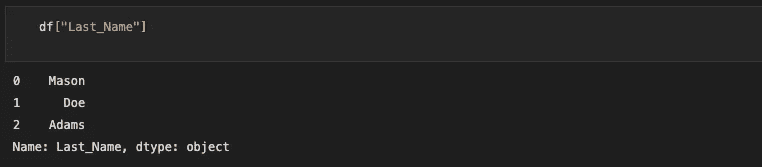

返回 df 的列

您也可以使用点符号。但是，这只适用于不带空格的列名和不像方法那样命名的列名(例如 count)。如果运行 df.count，您将调用方法而不是列。

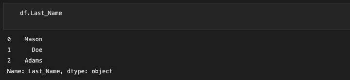

返回 df 列(点符号)

如果我们想一次访问多个列怎么办？你只需要传入一个在括号内的列的列表，就像⬇️

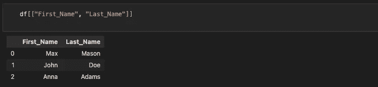

访问多个列

如您所见，输出只是名和姓。请注意，这不再是熊猫系列，相反，它返回另一个数据帧，包括两个熊猫系列。您总是可以使用 type()来检查它。

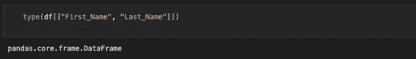

检查类型

你也可以看看列名⬇️

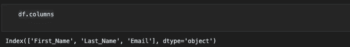

列名

但是在处理数据框时，我们如何访问行呢？我们有两个选项:iloc 和 loc。

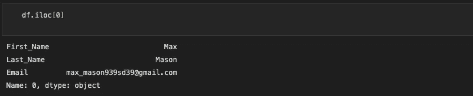

使用 iloc 访问行

这将返回包含名字、姓氏和电子邮件的一系列第一行。您还可以通过添加列索引作为第二个参数来确定一个特定的值。

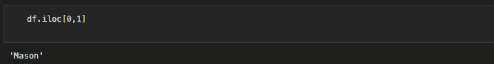

使用 iloc 获取价值

如果我们还决定只返回前两行的姓氏和电子邮件，会怎么样？

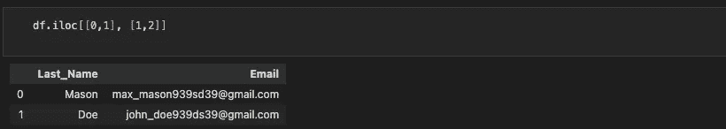

访问多行和多列

第一个列表指定行索引，而第二个列表指定列索引。记住，➡️·伊洛克只处理索引，不处理标签。

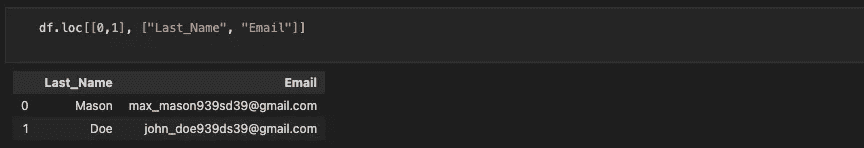

使用 loc 访问多行和多列

loc 方法使我们能够使用列标签。输出与上面的 iloc 相同。但是，有时使用列标签可能更方便，尤其是在处理较大的数据集时。

今天到此为止！体验自己的乐趣🚀

*感谢您阅读这篇文章！如果你想支持我，你可以这样做。请在 Medium 或 Twitter、Instagram、抖音或 YouTube 上关注我。
2。为文章
3 鼓掌。留下短评
我真的很感谢每一种支持！随着时间的推移，您与内容的每一次互动都将帮助我成长并提供更好的内容。🚀*

*谢谢，VEGXCODES*

## **让我们也在其他社交媒体平台上联系⬇️**

**编码👨🏽‍💻**
推特:[https://twitter.com/vegxcodes](https://twitter.com/vegxcodes)
抖音:[https://www.tiktok.com/@vegxcodes](https://www.tiktok.com/@vegxcodes)
YouTube:[https://www.youtube.com/channel/UCcR0truIoCDZsNDOSxeXjLQ](https://www.youtube.com/channel/UCcR0truIoCDZsNDOSxeXjLQ)
insta gram:[https://www.instagram.com/vegxcodes/?hl=en](https://www.instagram.com/vegxcodes/?hl=en)
Hashnode:[https://vegxcodes.hashnode.dev/](https://vegxcodes.hashnode.dev/)

**健身操🤸🏼https://www.tiktok.com/@vegxsthenics
insta gram 健身操:[https://www.instagram.com/vegxsthenics/?hl=en](https://www.instagram.com/vegxsthenics/?hl=en)**

## ⚡️资源

YouTube 教程:[https://www.youtube.com/watch?v=U6wIpFXZVM0](https://www.youtube.com/watch?v=U6wIpFXZVM0)
Github 资源库:[https://Github . com/mitchxxmitch-code/Data-Cleaning-Tutorials](https://github.com/mitchxxmitch-code/Data-Cleaning-Tutorials)

*更多内容请看*[***plain English . io***](https://plainenglish.io/)*。报名参加我们的* [***免费周报***](http://newsletter.plainenglish.io/) *。关注我们关于*[***Twitter***](https://twitter.com/inPlainEngHQ)*和*[***LinkedIn***](https://www.linkedin.com/company/inplainenglish/)*。查看我们的* [***社区不和谐***](https://discord.gg/GtDtUAvyhW) *加入我们的* [***人才集体***](https://inplainenglish.pallet.com/talent/welcome) *。*