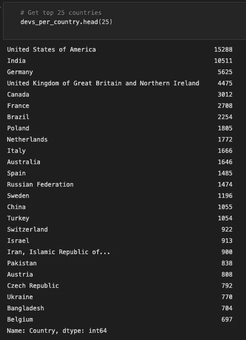

# 使用 Python 熊猫库进行数据清理🐼+YT 教程

> 原文：<https://blog.devgenius.io/data-cleaning-with-python-pandas-library-yt-tutorial-61ed1813faa7?source=collection_archive---------12----------------------->

## **第 2 部分**:采样数据，创建过滤器，获取值计数

我已经指出了我们将在本系列的第 2 部分中讨论的主题。和前一部分一样，我创建了一个简短的 YouTube 教程，你可以在本文的开头找到。非常希望能在媒体和 YouTube 上关注她。😊让我们直接开始编码吧👨🏽‍💻

[斯通王](https://unsplash.com/@stonewyq?utm_source=medium&utm_medium=referral)在 [Unsplash](https://unsplash.com?utm_source=medium&utm_medium=referral) 上拍照

# …首先是 YouTube 教程

正如我所承诺的，你可以在⬇️下面找到我自己创建的 YouTube 教程的链接

按 vegxcodes

# ⚡️样本数据

首先，我们用人头法来看一下数据。

vegxcodes 截图

..现在你知道它看起来像什么了。head 方法很好，但是它显示了最初的观察结果。如果我想取一个样本呢？嗯，你可以很容易地做到这一点如下⬇️

vegxcodes 截图

正如你在索引中看到的，它是随机选取的样本。

# 过滤数据⚡️

因为我来自奥地利，所以让我们只看看奥地利的发展吧😊

第一步是创建一个过滤器，第二步是应用它。当然，你可以一次完成所有的工作，但是你应该习惯于在编码中重用。这可以节省你一拳的时间！

vegxcodes 截图

# 价值决定⚡️

好了，现在我们可以看看每个国家的开发计数。首先，我们需要将行显示选项设置为 200，然后我们可以使用 value_counts()方法获得每个国家的计数。

vegxcodes 截图

出于演示的目的，我们可能只想显示前 25 个值。我们可以很容易地做到这一点，再次使用头的方法，⬇️

vegxcodes 截图

今天到此为止。尽情体验吧！

*感谢您阅读本文！如果你想支持我，你可以这样做。请在 Medium 或 Twitter、Instagram、抖音或 YouTube 上关注我。(我的个人资料页面上的链接)
2。为文章
3 鼓掌。留个短评
真的很感谢每一种支持！随着时间的推移，您与内容的每一次互动都将帮助我成长并提供更好的内容。🚀*

*谢谢，VEGXCODES*