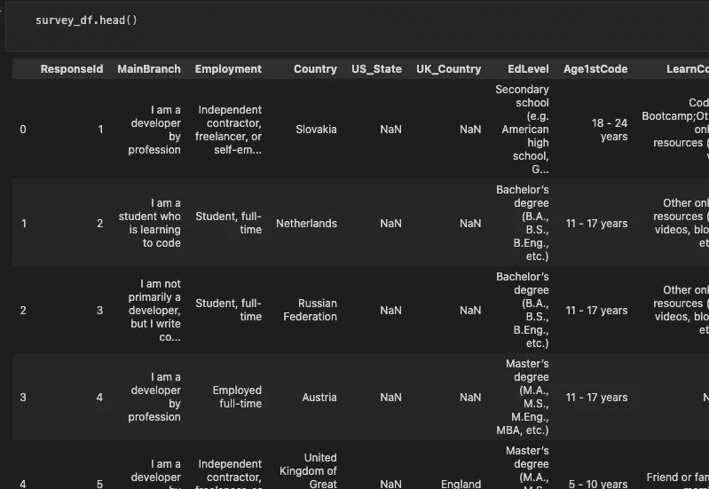
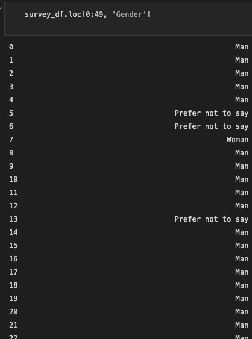
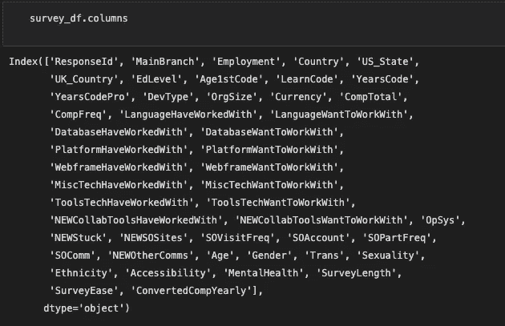
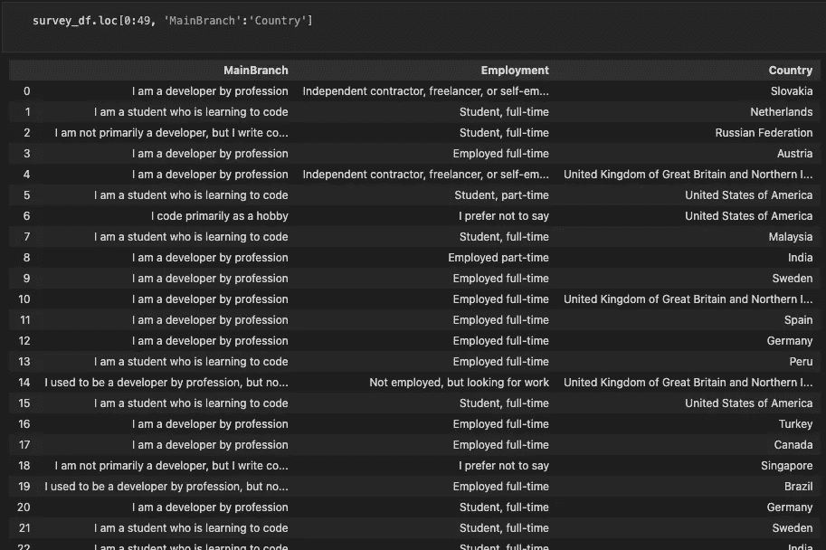
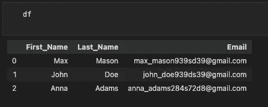
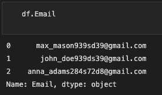
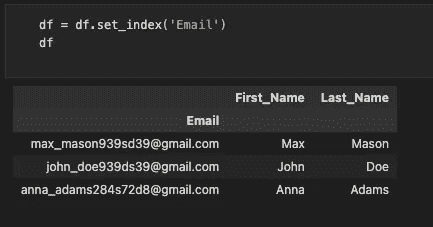
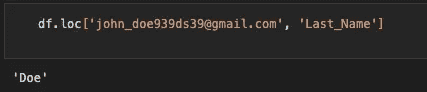
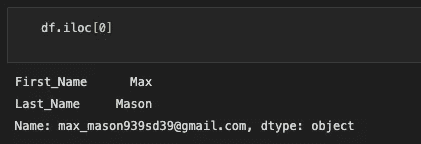

# 使用 Python 熊猫库进行数据清理🐼+YT 教程

> 原文：<https://blog.devgenius.io/data-cleaning-with-python-pandas-library-yt-tutorial-f390424918bd?source=collection_archive---------9----------------------->

## 第 3 部分:切片、索引、iloc()，loc()

欢迎回到我的频道编码朋友。今天我们来看看使用 Python Pandas 库时的切片、索引、iloc()和 loc()。老实说，这个库对所有的数据科学家和数据分析师都至关重要。有一些替代品，但 Pandas 仍然是头号数据操作库。你可以通过阅读教程或者访问我的 YouTube 频道观看视频。让我们开始吧，⬇️

杰伊·温宁顿在 [Unsplash](https://unsplash.com?utm_source=medium&utm_medium=referral) 上的照片

# YouTube 教程

这是我的 YouTube 教程。我将非常感谢你的观点！很短(5 分 43 秒)。但是，你也可以继续阅读文章。玩得开心😊

按 vegxcodes

# 限幅

首先，我们使用 head()方法来看看数据在 dataframe 中是如何组织的。

按 vegxcodes

如果您想在 dataframe 中显示某个范围的值，可以使用 loc()方法，如下所示。注意，Python 使用从零开始的索引，因此，我们使用范围 0:49。使用 loc()方法，需要传入 rows 参数(0:49)和 column 参数(Gender)。如您所见，loc()接受列标签(名称)作为参数。

按 vegxcodes

我们也可以对列参数使用范围吗？—我们当然可以。就像使用 positions 时一样，只需传入 2 个列标签。首先，让我们看看⬇️有哪些栏目可供选择

按 vegxcodes

让我们选择“Mainbranch”和“Country”作为列参数。

这就是我们想要显示的列和行。让我们继续下一部分😊

# 索引

我们使用的是第一集中用过的样本数据帧。这只是向您展示一些基本的索引。基本上，我们有默认的索引号，你可以看到 0，1，2。有时每行都有唯一的标识符是有意义的(比如行标签)。

按 vegxcodes

在我们的例子中，我们可以使用电子邮件地址，因为它们必须是唯一的。让我们详细地看一下电子邮件地址。

按 vegxcodes

让我们将电子邮件地址设置为新的索引，如下所示。

按 vegxcodes

然后，您可以像索引是数字时一样使用 loc。

按 vegxcodes

您仍然可以使用 iloc()，因为它查找位置而不是标签。

按 vegxcodes

今天到此为止！感谢阅读/观看！快乐编码和学习💪

*感谢你阅读这篇文章！如果你想支持我，你可以这样做。请在 Medium 或 Twitter、Instagram、抖音或 YouTube 上关注我。(我的个人资料中的链接)2。为文章
3 鼓掌。留个短评*

我真的很感谢每一种支持！随着时间的推移，您与内容的每一次互动都将帮助我成长并提供更好的内容。🚀

*谢谢你，蔬菜代码*