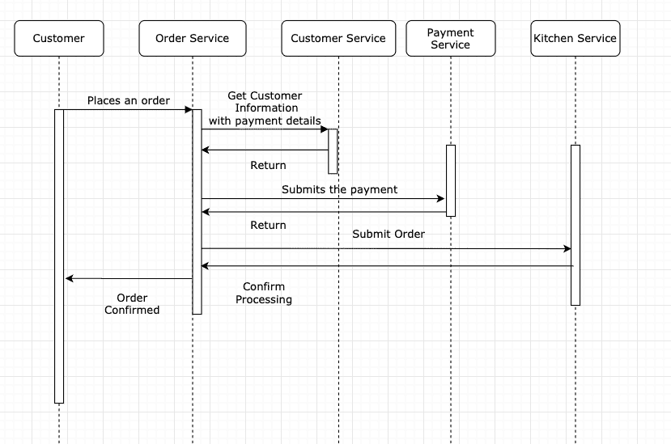

# 微服务架构中的数据一致性

> 原文：<https://blog.devgenius.io/data-consistency-in-a-microservice-architecture-e7d21b6ccdd1?source=collection_archive---------13----------------------->

马文·迈耶在 [Unsplash](https://unsplash.com?utm_source=medium&utm_medium=referral) 上的照片

本文涵盖了微服务架构的数据一致性问题，以及如何使用分布式事务处理数据一致性的早期方法之一。

事务在每个应用程序中都是必不可少的，没有事务，就没有任何数据一致性的保证。事务需要是原子的、一致的、隔离的和持久的。**单片应用程序中的事务管理**非常简单，因为它们保证具有数据库支持的 ACID 属性。然而，现代应用程序是可扩展的，并被分成一组称为**微服务**的小服务。因此，一个事务可以跨越多个服务。

让我们看一个通过使用微服务架构的在线咖啡店订购咖啡的例子。该应用程序由订单服务(创建订单)、支付服务(负责授权订单的支付)、客户服务(确认客户的详细信息)和厨房服务(处理订单)组成。

上图显示了订单处理流程的 UML 图。所有这些操作应该在一个事务中执行。这时我们需要对分布式事务的支持。然而，分布式事务是跨多个服务维护数据一致性的传统方法。分布式事务的主要标准是遵循使用**两阶段提交**的**扩展架构(XA)** 合规性。这种方法的主要缺点是事务**期望在事务**期间所有参与方都是可用的。换句话说，如果其中一个服务关闭，事务就会回滚。这可能会使事务变慢，因为在幕后它使事务同步。该协议依赖于全行级锁，导致**性能低下**。简而言之，XA 从未流行起来。

当构建符合 XA 规范的系统时，系统应该使用数据库、消息代理、数据库驱动程序，它们都符合 XA 规范。大多数**现代消息代理和 NoSQL 数据库不支持 XA 兼容**。因此，为了保持数据一致性，现代应用程序使用 [Sagas](https://microservices.io/patterns/data/saga.html) 来实现。我会在下一篇[帖子](https://medium.com/dev-genius/solving-data-consistency-using-sagas-80c00b311e45)中描述传奇故事。

**参考文献**

[https://blog . yugabyte . com/6-signs-you-may-be-missing-acid-transactions-in-distributed-databases/](https://blog.yugabyte.com/6-signs-you-might-be-misunderstanding-acid-transactions-in-distributed-databases/)