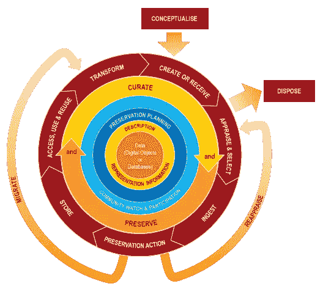
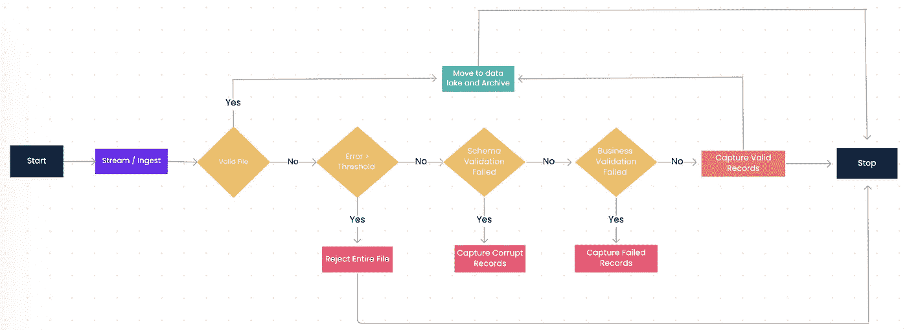

# 数据监管及其生命周期

> 原文：<https://blog.devgenius.io/data-curation-and-its-lifecycle-9146c19615b3?source=collection_archive---------6----------------------->

精心挑选，精心组织或呈现！！

在整个生命周期中管理数据，从各种来源收集数据，将这些数据集成到各种存储库中，并确保数据可以方便地用于未来目的的过程称为数据监管。

数据监管主要涉及维护和管理元数据。这是一个反复的过程，能够增加数据的价值。数据监管比数据库本身更能管理和维护元数据。它包括与组织和整合从各种来源收集的数据相关的各种过程和活动。这是一个积极和持续的过程。

在本文中，我们将讨论与数据监管生命周期相关的几个重要主题:

1.  数据监管过程的阶段。
2.  数据监管生命周期中的组件/层。
3.  重要阶段数据管理生命周期模型。
4.  简单的监管文件生命周期及其最佳实践。

**数据监管流程的阶段:**

首先，让我们看看第一个主题，关于数据监管的各个阶段:

1.  ***保存*** —从各种来源收集数据，然后进行收集和管理，称为保存。
2.  ***共享*** —确保数据可供认证用户将来使用和检索。
3.  ***发现*** —重用不同组合的数据，产生一些新的数据属于发现。

摘自 Witness.org[http://www.witness.org/media-archive/ut-partnership](http://www.witness.org/media-archive/ut-partnership)

**数据监管生命周期中的组件/层:**

它代表了数据生命周期中的所有阶段，从为研究而创建到分发和重用。数据监管生命周期有不同的组成部分。让我们深入了解它的各种组件。

1.  ***数据或数据库或数字对象***——这是数据监管生命周期模型的第一层。数据或数据库或数字对象被视为模型的关键或核心组件。数字对象可以是任何类型的文件或复杂的数字对象。
2.  ***信息的描述与表示*** —这是数据策化生命周期模型的第二层。为了描述元数据，使用适当的标准，以便可以长期控制它。在这一阶段，完成元数据的管理、结构、描述、技术和保存的分配。确保元数据以正确的格式表示和理解。
3.  *—这是第三层数据监管生命周期模型。在此阶段，完成了在整个生命周期中保存数据的规划。保存规划需要在数据的生命周期中管理数据的创建。*
4.  ****社区观察与参与*** —这是数据监管生命周期模型的第四层。在这个阶段，使用各种标准和工具来跟踪各种社区活动。监控数据创建活动，并协助创建标准。这种做法对图书馆员或档案管理员来说是最好的，因为他们可以帮助履行管理职责，确保适当地创建和保存数据。*
5.  **策展和保存——这是数据策展生命周期模型的第五层。行动计划被提升为策展，并在整个生命周期的这一阶段得到保存。采取监督和管理的行政行为，将促进策展和保存。密切关注数据的创建，并通过政策和标准鼓励最佳实践，将改善数据在其整个生命周期中的组织。**
6.  *****摄取、清理和存储*** —这是数据监管生命周期模型的第六层，包括以下阶段:**

*   ***创建和接收* —在此创建各种类型的数据。此外，该阶段接收各种格式的数据。使用描述性和技术性元数据创建数据，并包括保存元数据。制定收集政策，以便为接收来自数据创建者、其他档案和数据中心的数据做好准备。**
*   ***评估和选择* —在此阶段对数据进行评估和选择，以便长期保存。在这个阶段，必须与数据创建者和数据管理者一起创建评估和选择策略。然后建立这个政策，评估。为数据的长期保存和管理做进一步的选择。**
*   ***接收* —数据被传输到档案库、存储库或数据中心。确保此活动已正确完成。**
*   ***保存动作* —数据清理、验证、分配表示信息和确保可接受的数据结构或文件已完成等过程。采取措施确保数据的长期保存。**
*   ***存储* —以非常安全的方式存储数据。**
*   ***访问、使用和重用* —确保数据可供经过身份验证的用户访问，并且在需要时可以轻松检索。**
*   ***转换* —原始数据在这里被转换成用户要求的不同格式。**

****重要阶段数据固化生命周期模型:****

**到目前为止，我们已经介绍了数据监管生命周期的各个阶段和组件，现在让我们进入下一个主题，重点介绍数据监管生命周期模型的其他重要阶段:**

1.  *****概念化*** —概念化数据是指使用各种方法生成数据，存储数据，然后捕获数据。在这个阶段，基本上是收集和创建数据。**
2.  *****处置*** —如果有些数据没有用，那么这个不需要的数据就被丢弃，为这个阶段的新数据腾出空间。**
3.  ***—验证过程失败的数据在本环节退回。***
4.  ******迁移*** —数据被迁移到不同的地方，并根据需要根据新的环境进行转换。***

****简单的文件保管生命周期&其最佳实践:****

**在本节中，我们将研究文件实际上是如何经历各种监管过程的，以及在创建任何数据监管管道时需要记住的可能场景。**

****

1.  *****摄取*** —文件理想情况下与其一起摄取。确定文件，以确保实际文件没有被修改，并有利于进行策展过程。。ok 文件有两个参数—实际文件名及其 md5 值，用于验证实际文件的数据一致性。**
2.  *****有效***——如果实际文件有正确的话。ok 文件以及其中的所有记录都是有效的，那么它将被移动到 Datalake，然后被移动到 archive 文件夹。**
3.  *****Datalake*** —所有有效记录(csv / tsv)都以分区和拼花形式保存在这里。**
4.  *****存档*** —一旦有效记录被移动到 datalake，文件及其。确定已移至存档文件夹。**

6.  *******失败* —** 对于业务验证失败的记录，如任何非空列为空或日期格式错误，且失败记录的百分比小于阈值，则将失败记录移至失败文件夹。****
7.  *******错误阈值*** —对于损坏记录百分比超过阈值的文件，整个文件将被视为拒绝文件，该文件的监管过程将停止。****

****希望它能让你清楚地理解与数据监管及其生命周期相关的几个重要话题。我要感谢 [Namitha Pranesh Rao](https://medium.com/u/da60ea284528?source=post_page-----9146c19615b3--------------------------------) 分享这篇文章，并希望获得更多关于数据质量和数据科学相关主题的信息。敬请关注！！谢了。****

****参考资料:****

****https://www.dcc.ac.uk/guidance/curation-lifecycle-model****

****【https://www.geeksforgeeks.org/data-curation-lifecycle/ ****

****[https://kevinthelibrarian . WordPress . com/2012/07/20/an-introduction-to-the-data-curation-life cycle-model-where-do-librarians-fit-in/](https://kevinthelibrarian.wordpress.com/2012/07/20/an-introduction-to-the-data-curation-lifecycle-model-where-do-librarians-fit-in/)。****

**** [## 通过我的推荐链接加入媒体

### 阅读 Gururaj Kulkarni(以及媒体上成千上万的其他作家)的每一个故事。您的会员费直接…

medium.com](https://medium.com/membership/@guru.nie)****