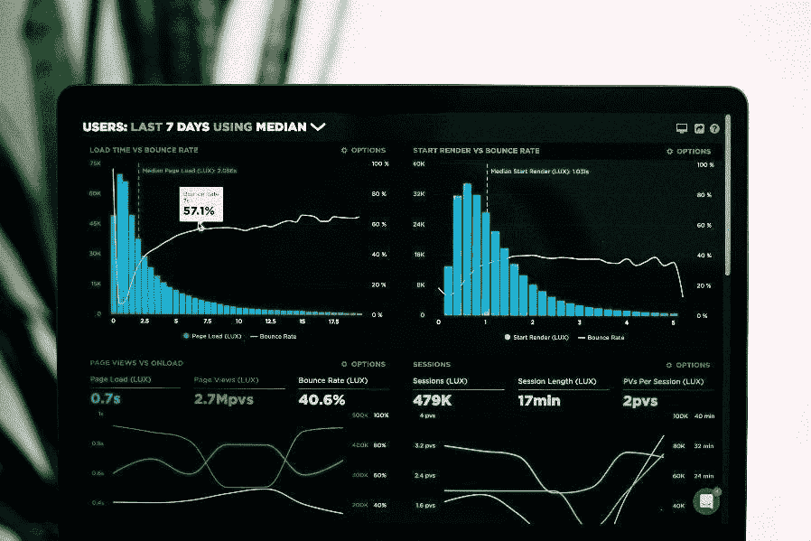

# 数据驱动的决策制定

> 原文：<https://blog.devgenius.io/data-driven-decision-making-f19bee00411e?source=collection_archive---------6----------------------->

简介:

企业如何做出更明智的决策？在越来越多的公司，管理决策是基于数据驱动的分析，而不是领导者的“直觉”与此同时，我们正在经历一场数据革命，企业收集准确的数据并将其传播给客户、供应商、联盟合作伙伴和竞争对手。这种趋势的一部分可归因于企业信息技术系统的广泛采用，如企业资源规划(ERP)、供应链管理(SCM)和客户关系管理(CRM)。所有这些都需要捕获和处理大量数据，作为其日常操作的一部分。

图片来自 Unsplash

这些系统变得越来越具有分析性，而商业智能(BI)系统通过允许将更优秀的数据分析工具应用于运营数据来扩展这些功能。

此外，在业务系统之外收集数据的可能性大大增加。移动电话、汽车、工厂自动化系统和其他设备通常被用来生成关于它们行为的数据流，这使得一个新的“现实挖掘”学科出现了。制造商和商家使用 RFID 标签来跟踪供应链中的单个商品，他们提供的数据用于改善和改造业务流程。同样，从网站上收集的点击流数据和关键词搜索会产生大量信息，使消费者行为和公司互动变得容易理解，而不需要昂贵或专门的焦点小组或客户行为研究。

# 什么是 DDDM？

数据驱动决策(DDDM)是由复杂数据支持的决策，而不是直观的或仅基于观察的决策。近年来，随着行业技术的飞速发展，数据驱动的决策已经成为许多行业更为基础的一部分，包括医药、交通和设备制造等重要领域。

数据驱动决策也称为数据驱动决策管理或数据导向决策，是一种基于数据做出决策的方法。

当企业看到其数据的总价值时，每个人(无论是业务分析师、销售经理还是人力资源专家)都能够每天做出更好的数据驱动型决策。然而，这个决策不能通过选择正确的分析工具来发现下一个战略机会来完成。

通过培养重视批判性思维和好奇心的文化，让数据驱动的决策成为你公司的规范。所有级别的人都参与数据驱动的对话，他们通过实践和应用磨练自己的数据能力。这种文化需要一种用户可以访问数据的自助式范式。

他们需要牢记安全性和治理。它还需要熟练，需要数据培训，以及人员的发展选择。最后，行政倡导和支持并做出数据驱动决策的社区将激励其他人效仿。

建立这些关键能力将在组织的所有级别促进数据驱动的决策，允许业务单位定期查询和探索信息，以发现推动行动的重要见解。

# 数据驱动决策的重要性:

收集的数据量从未如此巨大，但也从未如此复杂。这种复杂的数据使得企业和公司的数据管理和分析充满挑战。根据 NewVantage Partners 的数据，98.6%的高管表示，他们的公司努力建立一种数据驱动的文化，但只有 32.4%的高管表示他们已经成功。根据 2018 年 IDC 的一份报告，企业已经花费了数万亿美元来更新他们的运营，但其中 70%的项目失败了，因为他们优先考虑技术投资，而不是开发一种数据文化来支持他们。

许多企业建立了数据驱动的三个基本特征:数据能力、分析敏捷性和社区。改变公司的决策方式并不容易，但将数据和分析纳入决策周期是你会看到最显著变化的地方。这种变化需要一种专注的方法来开发和改进您的分析程序。

# 数据驱动的决策制定示例:

在做出影响深远的业务决策时，当今最大、最成功的公司会利用数据来获得优势。考虑这些知名公司的成功案例，以更好地了解您的公司如何在决策过程中使用数据分析。

# 谷歌的领导力发展项目:

谷歌继续强调“人员分析”。谷歌从超过 10，000 份绩效评估中收集数据，并将其与员工保留率联系起来，作为其著名的人员分析计划之一 Project Oxygen 的一部分。谷歌分析了这些数据，以确定高绩效经理的共同行为，并构建培训计划来帮助他们发展这些技能。由于采取了这些措施，经理们的平均支持率从 83%上升到了 88%。

图片来自 Unsplash

# 星巴克的房地产决策:

2008 年数百家星巴克门店关闭后，时任首席执行官霍华德·舒尔茨承诺，公司将采用更具分析性的方法来选址新店。

图片来自 Unsplash

星巴克已经与一家位置分析机构合作，根据人口统计和交通趋势确定潜在的商店位置。在做出决定之前，该组织会咨询其区域团队。星巴克在进行新的投资之前，利用这些信息来评估一个地点成功的机会。

# 增加亚马逊销售额

亚马逊根据之前的购买和搜索行为模式，使用数据来确定向客户推荐哪些产品。亚马逊的推荐引擎不是随机推荐一个产品，而是通过数据分析和机器学习来指导。根据麦肯锡的数据，2017 年，亚马逊 35%的消费者购买可能要归功于该公司的推荐算法。

# 数据驱动决策的优势:

# 更自信的决策:

一旦你开始收集和评估数据，你会发现几乎在任何商业情况下做出自信的决定都要容易得多。无论你计划推出或停止一个产品，修改你的营销信息，进入一个新的市场，或做其他事情。

数据有多种用途。一方面，它可以让你比较已经有的东西，让你更好地理解你的每一步行动对公司的影响。

此外，数据具有逻辑性和可触知性，这是直觉和本能所不具备的。通过消除商业决策中的主观因素，你可以建立对自己和整个公司的信心。这种保证有助于您的公司完全致力于一个愿景或计划，而不必担心做出错误的选择。

基于证据的决定并不能保证它是正确的。虽然数据可能揭示趋势或预测特定结果，但如果数据收集程序或解释有错误，基于数据的任何选择都是不正确的。因此，应该定期分析和审查每个业务选择的影响。

# 让自己积极主动:

当数据驱动的决策过程第一次实施时，它很自然地具有反射性。这些数据提供了一个故事，你和你的公司必须对此做出回应。

虽然这本身是必不可少的，但它并不是数据和分析在您的公司中发挥的唯一作用。有了足够的实践和正确的数据种类和数量，你可以利用它变得更加主动，例如在风险变得太严重之前识别风险，或者在竞争对手之前识别商业可能性。

# 成本节约:

一家公司可以决定投资大量数据工作并使其流程更受数据驱动的原因有很多。根据《哈佛商业评论》( Harvard Business Review)的 NewVantage Partners 最近对《财富》1000 名高管的一项研究，这些计划具有不同程度的有效性。

根据调查，利用数据削减成本是最有效的策略之一。超过 49%开始努力削减开支的公司看到了投资回报。另一方面，其他项目产生了更为混杂的结果。

当调查结果公布时，咨询公司 NewVantage Partners 的首席执行官兼管理合伙人 Randy Bean 评论说:“大数据已经被用来提高运营效率。”“根据最新信息做出明智决策的能力正迅速成为常态。”

# 如何成为数据驱动型组织:

你可以采取多种措施来实现你的目标，即在你的商业方法中更多地以数据为导向——一些你如何在日常工作中运用分析思维的例子**。**

# 到处寻找模式:

数据分析的核心是试图揭示各种数据点之间的模式或联系。从这些模式和关系中可以获得洞察力和推论。

有意识地承诺变得更具分析性——无论是在商业上还是在个人生活中——是发展更多数据驱动的第一步。虽然这似乎是一个简单的任务，但它需要实践。

从你周围的数据中寻找模式，无论你是在办公室仔细阅读财务报表，在杂货店排队，还是在火车上。一旦你确定了模式，练习推断发现并尝试推断它们为什么存在。这个简单的练习可以帮助你在生活的其他领域变得更加数据驱动。

# 确保每个决定都基于数据:

当面临决定时，无论是商业问题还是个人问题，尽量避免依赖直觉或之前的行为。相反，要有意识地努力采取一种分析的态度。

确定你有哪些事实可以用来帮助你做出选择。如果没有数据，考虑一下如何自己收集数据。

一旦你有了信息，评估它，并使用任何见解来帮助你的决策。就像模式识别练习一样，目标是获得足够的分析经验，使其成为你决策过程的自然组成部分。

# 创建数据含义的可视化表示:

数据分析的过程包括大量的数据可视化。一张数字表几乎不可能从中推导出意义。如果您在图表中创建引人注目的可视化效果，您将能够快速发现趋势并得出数据结果。

熟悉常用的数据可视化方法和工具，并练习使用手头的任何数据制作可视化效果。这可以像设计一个图表来表示你每月的消费习惯并从中做出推论一样简单。之后，你可以利用你的发现为下个月制定一个定制的预算。完成该任务后，您将成功地做出数据驱动的决策。

# 提高您的知识:

如果学习如何独自将数据纳入决策过程的想法让你感到不安，有多种教育选择可以帮助你建立成功所需的数据科学技能。

哪个选项最适合你的个人和职业目标将决定你。例如，寻求重大职业转变的个人可以考虑攻读数据分析或数据科学硕士学位。然而，对于我们其他人来说，仅仅参加在线商业分析或数据科学课程可能就足以为成功奠定基础。

# 结论:

虽然数据驱动的决策有许多优势，但重要的是要记住，你不必全力以赴。通过从小处着手，设定绩效基准，记录一切，并不断调整，你可能会变得更加数据驱动，并在你的组织中取得成功。