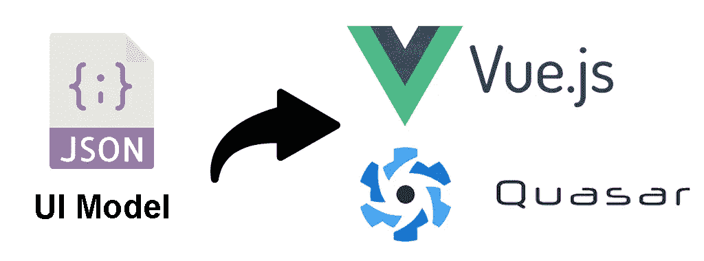
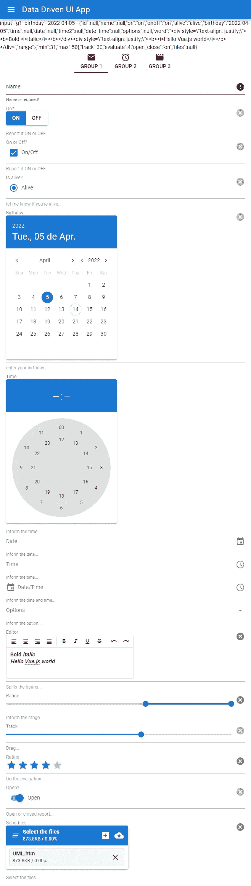

# 使用 Vue.js 和 Quasar 生成数据驱动的动态 UI

> 原文：<https://blog.devgenius.io/data-driven-ui-with-vue-js-and-quasar-fb9062899493?source=collection_archive---------2----------------------->



## 描述

在 2020 年 3 月中旬，我们开始了动态 UI 生成的第一次尝试，基于 JSON 中的模式定义(**数据驱动 UI** )，使用框架 **Vue.js + Quasar** 。

**数据驱动 UI** 概念支持有趣的解决方案，例如:

*   定义与动态生成 UI 的数据库表和视图相关的 UI 模型定义模式；
*   创建与技术和框架无关的 UI 模型定义模式(一个可以为 **Vue+Quasar** 开发一个生成器，另一个在 **React+Material UI** 中，等等)。

这个想法是链接到数据库模式 API，这个 API 为与数据库中的表和视图(实体)相关的表单提供 UI 定义。这些 UI 定义将以 JSON 格式构建，客户端解释器将基于 JSON 信息生成 UI(当时在**vue . js 2.0+Quasar framework 1.0**)。

动态生成的表单将为数据库中的每个对应实体字段呈现字段定义模式，该模式具有该字段的编辑控件组件的类型(以及其他相关属性)。这些控件将一个接一个地呈现，或者呈现在组内(选项卡、卡片、展开等)。该方案还提供了与它们相互依赖相关的查找字段(*例如国家、州、城市*)。编辑控件基于 ***Quasar 框架的表单控件*** ，并做了一些调整，例如使用 ***事件总线*** 进行事件通信，使用 ***作用域插槽*** 进行表单、编辑控件和包装组件之间的属性通信。还实现了一些使用 JSON 模式中的插槽的复杂组件组合。还提供了 ***无渲染包装组件*** 用于与 RESTful/GraphQL API 交互，以与数据库中相应实体/查找的数据交互。

出于简单的原因，大多数功能都从原始代码中排除，只关注主要组件的动态呈现，即表单、组和编辑控件(*，这是本文*的重点)。我们只保留了字段分组在选项卡中的表单的实现。

## 先决条件

我们假设你对 **git cli** 、 **javascript** 、 **Vue.js** 和 **Quasar 框架**有很好的了解。您的系统上必须安装有 **Vue cli** 和 **quasar cli** 。本教程是在一个 ***linux 环境*** 中运行的，但是你可以很容易地为你喜欢的操作系统进行调整。

## JSON 模式结构

JSON 的结构相当简单。定义每个组项目中的组和字段列表。

然而，定义字段属性可以像支持的 Quasar UI 控件所允许的那样复杂(*要了解支持哪些属性，请参见相应的****Quasar****控件*的文档)。

模式中的字段属性允许您为字段输入的值定义验证规则、编辑掩码、许多可视化方面等等。

JSON 的结构如下:

*   >***group model:string***=>(目前仅支持‘tab’)；
*   > ***组:数组*** = >组 itens 的数组:
*   >>主组属性( ***名称，标签，图标***)；
*   >>其他可选的分组控制类型特定属性
*   > > ***字段:数组*** = > UI 控件定义字段列表:
*   >>>主字段属性( ***名称，id，字段类型***)；
*   >>>其他可选字段控件类型的特定属性。

下面是本文中使用的一个 JSON 模式示例:

```
export default {
  /*
   * Group type: Only 'tab' is currently supported
   */
  groupModel: "tab",
  /*
   * List of group itens
   */
  groups: [
    {
      /*
       * Main properties (name, label, icon)
       */
      name: "Group 1",
      label: "Group 1",
      icon: "mail",

      /*
       * Control type specific properties
       */
      flat: true,
      "expand-separator": true,

      /*
           * Field list: name, id and fieldType 
             are the main properties, the others are 
             UI control specific properties.
           */
      fields: [
        {
          /*
           * Main field properties
           */
          name: "id",
          id: "g1_id",
          fieldType: "inputtext",
          /*
           * Control type specific properties
           */
          label: "id",
          dense: false,
          readonly: true,
          hidden: true,
        },
        /*
         * Other fields definitions...
         */
        {
          name: "name",
          id: "g1_name",
          fieldType: "inputtext",
          label: "Name",
          placeholder: "Name...",
          hint: "Inform the name...",
          dense: true,
          clearable: true,
          "clear-icon": "close",
          /*
           * Validation rules can be defined as in the example below
           */
          rules: [
            {
              params: ["val"],
              exp: '!!val || "Name is required!"',
            },
          ],
        },
        {
          name: "on",
          id: "g1_on",
          fieldType: "btntoggle",
          label: "On?",
          hint: "Report if ON or OFF...",
          dense: false,
          clearable: true,
          "stack-label": true,
          filled: false,
          options: [
            { label: "On", value: "on" },
            { label: "Off", value: "off" },
          ],
        },
        {
          name: "onoff",
          id: "g1_onoff",
          fieldType: "checkbox",
          "outer-label": "On or Off?",
          label: "On/Off",
          hint: "Report if ON or OFF...",
          "indeterminate-value": null,
          "true-value": "on",
          "false-value": "off",
          dense: false,
          clearable: true,
          "stack-label": true,
          filled: false,
        },
        {
          name: "alive",
          id: "g1_alive",
          fieldType: "radio",
          "outer-label": "Is alive?",
          label: "Alive",
          hint: "let me know if you're alive...",
          val: "alive",
          dense: false,
          clearable: true,
          "stack-label": true,
          filled: false,
        },
        {
          name: "birthday",
          id: "g1_birthday",
          fieldType: "datepicker",
          label: "Birthday",
          hint: "enter your birthday...",
          mask: "YYYY-MM-DD",
          titleFormat: "ddd., DD [de] MMM.",
          dense: false,
          clearable: true,
          "stack-label": true,
          filled: false,
        },
        {
          name: "time",
          id: "g1_time",
          fieldType: "timepicker",
          label: "Time",
          hint: "Inform the time...",
          format24h: true,
          dense: false,
          clearable: true,
          "stack-label": true,
          filled: false,
        },
        {
          name: "date",
          id: "g1_date",
          fieldType: "inputdate",
          label: "Date",
          placeholder: "Date...",
          dateMask: "DD/MM/YYYY",
          mask: "##/##/####",
          hint: "Inform the date...",
          titleFormat: "ddd., DD [de] MMM.",
          dense: true,
          clearable: true,
        },
        {
          name: "time2",
          id: "g1_time2",
          fieldType: "inputtime",
          label: "Time",
          placeholder: "Time...",
          timeMask: "HH:mm:ss",
          mask: "##:##:##",
          hint: "Inform the time...",
          format24h: true,
          withSeconds: true,
          dense: true,
          clearable: true,
        },
        {
          name: "date_time",
          id: "g1_date_time",
          fieldType: "inputdatetime",
          label: "Date/Time",
          placeholder: "Date/Time...",
          dateMask: "DD/MM/YYYY HH:mm:ss",
          mask: "##/##/#### ##:##:##",
          hint: "Inform the date and time...",
          dateTitleFormat: "ddd., DD [de] MMM.",
          format24h: true,
          withSeconds: true,
          dense: true,
          clearable: true,
        },
        {
          name: "options",
          id: "g1_options",
          fieldType: "select",
          label: "Options",
          hint: "Inform the option...",
          dense: true,
          clearable: true,
          transitionShow: "flip-up",
          transitionHide: "flip-down",
          options: ["Google", "Facebook", "Twitter", "Apple", "Oracle"],
        },
        {
          name: "word",
          id: "g1_word",
          fieldType: "editor",
          label: "Editor",
          hint: "Spills the beans...",
          clearable: true,
          "stack-label": true,
          "min-height": "5rem",
        },
        {
          name: "range",
          id: "g1_range",
          fieldType: "range",
          outerLabel: "Range",
          hint: "Inform the range...",
          clearable: true,
          "stack-label": true,
          min: 0,
          max: 50,
          label: true,
        },
        {
          name: "track",
          id: "g1_track",
          fieldType: "slider",
          outerLabel: "Track",
          hint: "Drag...",
          clearable: true,
          "stack-label": true,
          min: 0,
          max: 50,
          step: 5,
          label: true,
        },
        {
          name: "evaluate",
          id: "g1_evaluate",
          fieldType: "rating",
          label: "Rating",
          hint: "Do the evaluation...",
          clearable: true,
          "stack-label": true,
          max: 5,
          size: "2em",
          color: "primary",
        },
        {
          name: "open_close",
          id: "g1_open_close",
          fieldType: "toggle",
          "outer-label": "Open?",
          label: "Open",
          hint: "Open or closed report...",
          dense: false,
          clearable: true,
          "stack-label": true,
          filled: false,
          color: "primary",
          "true-value": "on",
          "false-value": "off",
        },
        {
          name: "files",
          id: "g1_files",
          fieldType: "uploader",
          "outer-label": "Send files",
          label: "Select the files",
          hint: "Select the files...",
          dense: false,
          clearable: true,
          multiple: true,
          "stack-label": true,
        },
      ],
    },
    {
      name: "Group 2",
      label: "Group 2",
      icon: "alarm",

      flat: true,
      "expand-separator": true,
    },
    {
      name: "Group 3",
      label: "Group 3",
      icon: "movie",

      flat: true,
      "expand-separator": true,
    },
  ],
};
```

## 神奇是如何发生的

## 框架中所需的资源

为了让它工作，框架必须支持动态地、有条件地创建组件的可能性，并且还支持在一系列定义上的迭代。好在 **Vue.js** 很擅长这些东西！

**Vue.js** 支持 [**条件渲染—(v-if/v-else/v-else-if)**](https://vuejs.org/guide/essentials/conditional.html)， [**列表渲染— (v-for)**](https://vuejs.org/guide/essentials/list.html) 。这些特性允许您迭代 JSON 模式，并有条件地呈现 UI 组件。

对于一些类型的控件来说，有条件的重新呈现是可以的，但是当你有很多这样的控件时，这就不是最好的选择了(在本文中，我们定义了大约 20 种不同类型的表单控件作为奖励！)

对于这种类型的挑战 **Vue.js** 支持 [**动态组件创建— (:is)**](https://v2.vuejs.org/v2/guide/components-dynamic-async.html) 。此功能允许您引用动态导入的组件实例。

还记得上一节我们提到的每个控件类型都有不同的属性集。为了工作， **Vue.js** 需要允许批量链接一个对象的所有属性。Vue.js 对此也有解决方案: [**传递一个对象的所有属性— (v-bind)**](https://v2.vuejs.org/v2/guide/components-props.html#Passing-the-Properties-of-an-Object) 。

在下一节中，我们将看到如何在 **FormGenerator.vue** 的`template`部分中使用上述所有功能，以创建一个简洁明了的问题解决方案。

## 组件基础设施

***src/components***文件夹有一系列源代码。让我们分析它们，以了解整个事情是如何实现的:

## **_ component map 01 . js**

这个 [**mixin 对象**](https://v2.vuejs.org/v2/guide/mixins.html?redirect=true) 被注入到 **FormGenerator.vue** 中。它的功能是提供一个数据字典( **componentMap[]** )，其中每个组件名解析为一个工厂，该工厂动态导入并返回该名称的组件实例:

```
/**
 * A mixin object that mantain a dictionary de components
 */

export default {
  data() {
    return {
      componentMap: {},
    };
  },
  methods: {
    initComponentsMap() {
      this.componentMap = {
        // Group components
        card: () => import("./Card01"),
        tabs: () => import("./Tabs01"),
        tab: () => import("./Tab01"),
        tabpanel: () => import("./TabPanel01"),
        expansion: () => import("./Expansion01"),

        // Form component
        form: () => import("./Form01"),

        // From field components
        inputtext: () => import("./Input01"),
        inputdate: () => import("./DateInput01"),
        inputtime: () => import("./TimeInput01"),
        inputdatetime: () => import("./DateTimeInput01"),
        select: () => import("./Select01"),
        checkbox: () => import("./CheckBox01"),
        radio: () => import("./Radio01"),
        toggle: () => import("./Toggle01"),
        btntoggle: () => import("./ButtonToggle01"),
        optgroup: () => import("./OptionGroup01"),
        range: () => import("./Range01"),
        slider: () => import("./Slider01"),
        datepicker: () => import("./DatePicker01"),
        timepicker: () => import("./TimePicker01"),
        rating: () => import("./Rating01"),
        uploader: () => import("./Uploader01"),
        editor: () => import("./Editor01"),

        // Other
        icon: () => import("./Icon01"),
      };
    },
  },
};
```

之后，该字典用于在`template`中创建动态组件，其名称如下:

```
<!-- Create a dynamica TABS type component -->
<component :is="componentMap['tabs']"></component>
```

## **FormGenerator.vue**

它完成了基于 JSON 模式动态组装 UI 的大部分工作。

它有一系列用于内部服务的功能，所以让我们把重点放在真正重要的部分。

*   首先，它导入 componetMap，这样它就可以作为 mixin 注入，并且可以在模板中访问；
*   创建并提供事件总线，以便与组件生态系统进行通信；
*   定义将接收 JSON 架构的属性；
*   定义 formData 数据以维护输入字段内容。

```
...

import componentMap from "./_componentMap01";

...

export default {
  name: "FormGenerator",

  mixins: [componentMap],

  provide() {
    return {
      // The event bus to comunicate with components
      eventBus: this.eventBus,
    };
  },
  props: {
    // The schema placeholder property
    schema: {
      type: Object,
    },
  },
  data() {
    return {
      // The event bus instance
      eventBus: new Vue(),
...
      // Form data with input field contents
      formData: {},
...
    }
  }

...

}
```

最后是创建动态组件的`template`——模板中的注释清楚地解释了 **Vue.js** 功能是如何协同工作的:

```
<template>
  <!--
        Dynamic wrapper `form` component
        `fixedSchema` is the ajusted version of property `schema`
      -->
  <component v-if="fixedSchema" :is="componentMap['form']" ref="form">
    <!--
        ==================  
        Groups with fields
        ==================
        -->
    <div v-if="fixedSchema.groups && fixedSchema.groups.length > 0">
      <!--
          ==========
          TAB Model
          ==========
          -->
      <!--
            Dynamic `tabs` component
          -->
      <component
        v-if="fixedSchema.groupModel == 'tab'"
        :is="componentMap['tabs']"
        v-model="selectedGroup"
        dense
      >
        <!--
              Dynamic `tab itens` components  
            -->
        <component
          v-for="(group, index) in fixedSchema.groups"
          :is="componentMap['tab']"
          :key="index"
          v-bind="group"
        >
        </component>
      </component>

      <q-separator />

      <!--
            Dynamic `tabpanel` component
          -->
      <component
        v-for="(group, index) in fixedSchema.groups"
        :is="componentMap['tabpanel']"
        :key="index"
        :selected="selectedGroup"
        v-bind="group"
      >
        <div v-if="group.fields && group.fields.length > 0">
          <!--
                And finally all UI field controls:
                - Component type specified by `componentMap[field.fieldType]`
                - Data contents linked to `formData[field.name]` by `v-model`
                - All `field` properties linked by `v-bind`
              -->
          <component
            v-for="(field, index) in validFieldComps(group.fields)"
            :key="index"
            :is="componentMap[field.fieldType]"
            v-model="formData[field.name]"
            v-bind="field"
            v-show="!field.hidden"
          >
          </component>
        </div>
      </component>
    </div>
  </component>
</template>
```

## **其他”。/src/components 中的 vue "文件**

其他组件基本上封装了一个或多个原始的**类星体组件**，以提供所需的功能。它们通过`event bus`将事件传递回 **FormGenerator.vue** ，并通过`v-on="$listners"`和`v-bind="$attrs"`从父节点接收事件处理程序和数据。

例如，我们有来自 **input.vue** 的以下源代码:

```
<template>
  <q-input
    v-bind="$attrs"
    v-on="$listeners"
    @input="onInput"
    @clear="onClear"
    @focus="onFocus"
    @blur="onBlur"
  >
    <template
      v-for="(_, slot) of $scopedSlots"
      v-slot:[slot]="scope"
    >
      <slot
        :name="slot"
        v-bind="scope"
      />
    </template>
  </q-input>
</template>

<script>
import compInfo from './_compInfo'

export default {
  mixins: [compInfo],
  inject: ['eventBus'],
  methods: {
    onInput (value) {
      this.eventBus.$emit('input', this, value)
    },
    onClear (value) {
      this.eventBus.$emit('clear', this, value)
    },
    onFocus (evt) {
      this.eventBus.$emit('focus', this, evt)
    },
    onBlur (evt) {
      this.eventBus.$emit('blur', this, evt)
    }
  },
  inheritAttrs: false
}
</script>
```

## 如何使用表单生成器

现在简单的部分来了，在`src/pages/FormTest.vue`中，我们有了加载 JSON 模式并将其传递给 **FormGenerator** 组件的页面——就这样！

```
<template>
  <form-generator :schema="schema" />
</template>

<script>
import FormGenerator from "../components/FormGenerator";
import jsonSchema from "../data/schema.js";

export default {
  components: { FormGenerator },
  data() {
    return {
      schema: {},
    };
  },
  created() {
    this.schema = jsonSchema;
  },
};
</script>
```

通过使用以下命令运行示例:

```
# Run the Quasar/Vue application
$ yarn quasar dev
```

然后在您的首选浏览器中输入以下 URL:

[***http://localhost:8080***](http://localhost:8080)

你会得到这个令人印象深刻的结果:



## 运行本教程中的示例

## 装置

```
# Clone tutorial repository
$ git clone https://github.com/maceto2016/VueDataDrivenUI

# access the project folder through the terminal
$ cd VueDataDrivenUI

# Install dependencies
$ npm install
```

## 运行应用程序(从 NestJSDynLoad 文件夹)

```
# Run the Quasar/Vue application
$ yarn quasar dev
```

## 测试应用程序

在您的首选浏览器中输入以下 URL

[***http://localhost:8080***](http://localhost:8080)

## 结论

在本文中，我们提出了**数据驱动 UI** 的概念，它只不过是基于定义数据中的信息动态创建 UI。本文展示了定义一个 **JSON 模式**并使用 **Vue.js + Quasar 框架**创建一个基础设施来动态创建组件是多么容易。作为**的额外奖励**，我们基于 **Quasar 框架 UI** 组件提供了大约 **20 个 UI 组件**。

请随意使用这里提供的源代码和思想。有巨大的改进空间，包括迁移到 **Vue.js 3、Quasar 2 和 Typescript** 。现在就看你的了！

感谢您的阅读。我很高兴听到你的反馈！