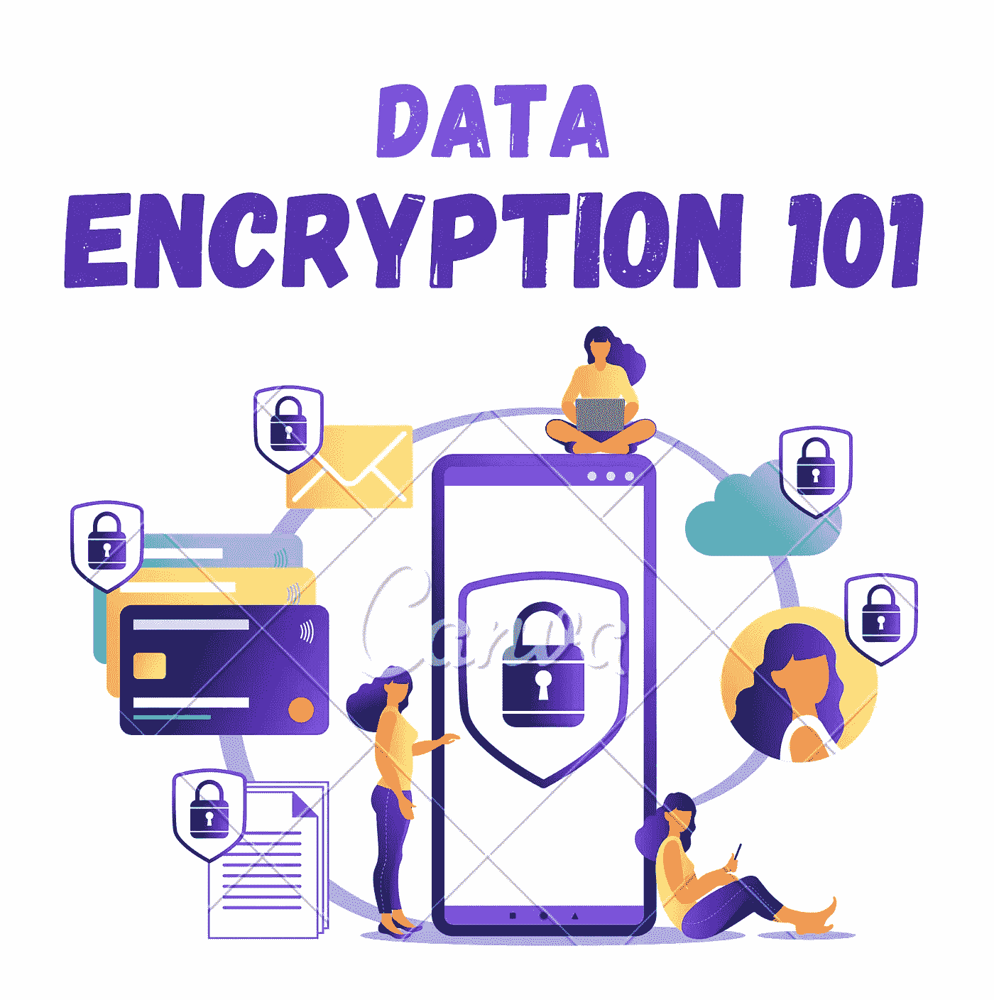
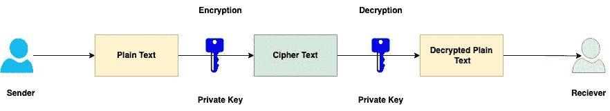
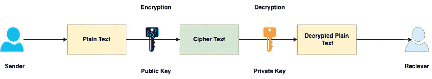
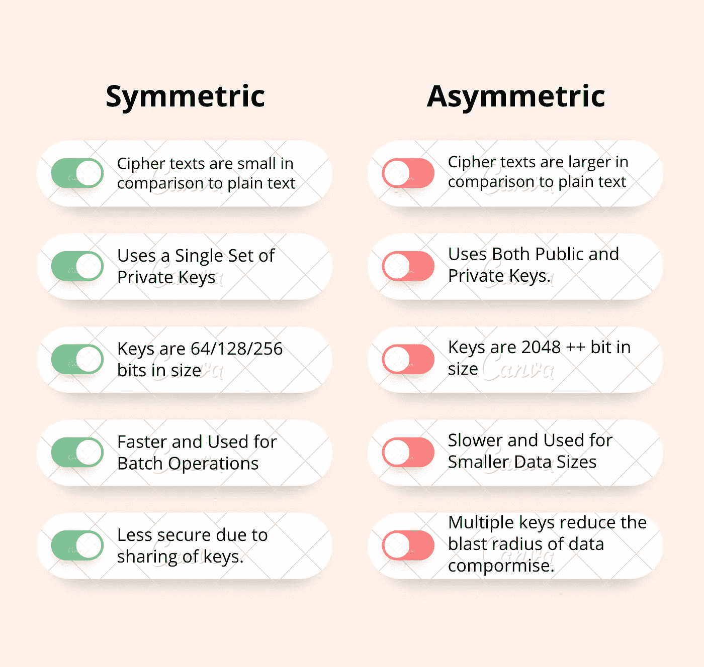

# 数据加密:101

> 原文：<https://blog.devgenius.io/data-encryption-101-f0a25db7d913?source=collection_archive---------7----------------------->

这篇博客是我们从零开始讨论 101 个概念的系列文章的一部分，读者的入门知识有限。这篇文章属于 ***基础*** 系列，因为它涉及了解**数据加密**的基础知识及其作为客户信息安全支柱的重要性。

101 系列中的一些早期博客如下:

[**内容交付网络 101**](/content-delivery-network-101-7e24ff59be2e)[**数据库复制 101**](/database-replication-101-d148514598a7)[**数据库分片 101**](/database-sharding-101-4ef36046c29c)[**缓存策略 101**](/caching-strategy-101-3bc974d2a6cd)[**Kubernetes 部署 101**](http://kubernetes-deployments-101/)

# 什么是数据加密？

**数据加密**是一种借助公/私钥将敏感信息从**明文**转换为**密文**的方法。转换回纯文本的过程称为**解密**。不同的算法，如 **AES-256、DES、RSA 等。**根据密钥的长度和整个加密过程中的迭代次数而变化，

加密与其他安全控制(如**网络防火墙、用户访问角色&权限**)一起构成了数据安全需求的支柱，由安全策略(如 **PCI、HIPAA 等)强制规定。**

# 对称加密

在**对称加密**中，发送方和接收方都有相同的一对私钥来加密/解密敏感数据。它被称为私钥加密方法。

鉴于其**速度和加密处理强度**，它主要用于保护大批量数据。然而，同时，**密钥分发和各方之间的轮换**是使用这种方法保护数据的主要限制。

## 算法

*   **DES —** 由美国国防部制定，**数据加密标准**是一种广泛使用的加密算法。它使用 64 位长的密钥，并将 64 位的文本块加密成相应大小的密文。然而，最近在不到 24 小时内**破解 DES 加密的攻击**，使得它成为一种过时的保护数据的方法。
*   **AES** — **高级加密标准**是 DES 算法的高级版本，使用 **128、192 和 256 位**的密钥大小。要打破这种模式，需要 **2.61*1⁰年**到 **2.29*1⁰年**，取决于所用钥匙的大小。

# 不对称加密

**非对称加密**在整个过程中使用两套不同的密钥——一套**公钥**加密数据，一套**私钥**解密数据。虽然公钥与所有客户端共享，但私钥仅由服务器保护访问安全。

一个例子是用于 HTTPS 流量的 **TLS 握手**，它使用非对称密钥通过网站证书中的公钥和私钥来验证服务器-客户端之间的身份。

## 算法

*   **RSA —** 代表 **Rivest-Shamir-Adleman** 。主要的加密逻辑是基于两个大素数乘积的因式分解。与其他非对称算法相比，它的加密速度更快，但解密速度更慢。
*   **DSA** —代表**数字签名算法，**主要用于签名验证。加密原理使用模幂运算和离散对数。与 RSA 算法相比，它的加密速度较慢，解密速度较快。

# 差异

# 静态加密与传输加密

*   鉴于有限的暴露半径**，静态数据**比传输中的数据更不容易受到攻击。然而，为了保护存储的数据，一些技术是**数据磁盘完全加密，离线存储加密密钥，双因素访问控制等。**
*   **传输中的数据**更容易受到攻击者的网络拦截，因此需要更多的控制来避免客户数据泄露。一些方法是使用安全的网络协议，如 **SSL、HTTPS、mutual-TLS；经过身份验证的 API 端点；使用客户端证书等验证身份。**

# 摘要

加密使用现代的**对称和非对称**算法保护敏感和高度敏感的客户数据。然而，加密数据的决策必须与客户流的**性能/延迟**的非功能性需求相平衡。

大多数云供应商( **AWS/Azure/GCP** )目前都提供预启用的解决方案来加密静态数据，使用**供应商/自我管理的**密钥来优化开发人员编写**应用/库**代码来加密/解密数据的工作效率。

*如需反馈，请留言至****Amit[dot]894[at]Gmail[dot]com****或联系 https://about.me/amit_raj**中的任何一个链接。*