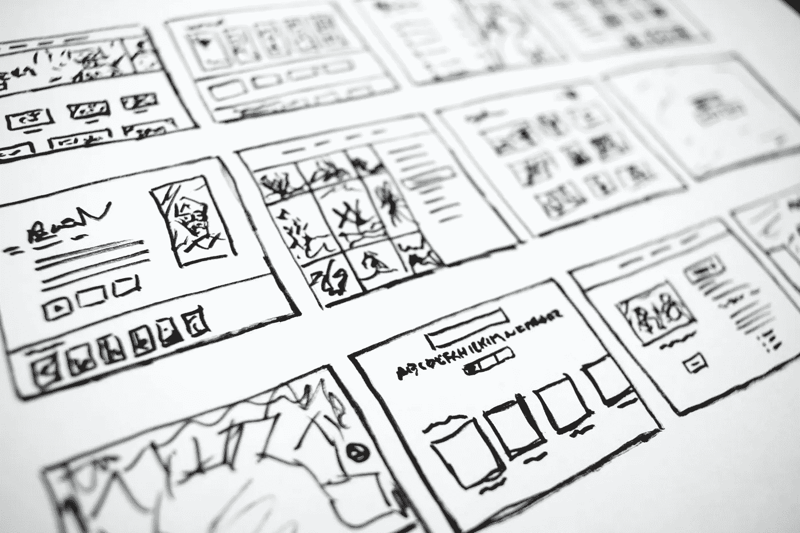

# 数据工程师—学习路径

> 原文：<https://blog.devgenius.io/data-engineer-learning-path-6286e537a9c2?source=collection_archive---------0----------------------->

哈尔·盖特伍德在 [Unsplash](https://unsplash.com/s/photos/plan?utm_source=unsplash&utm_medium=referral&utm_content=creditCopyText) 上拍摄的照片

成为数据工程师所需的技能

通常，数据工程师执行以下任务:

1.  从不同来源获取业务相关数据集
2.  创建高效存储和检索数据的数据模型
3.  编写算法，将数据转化为可操作的信息
4.  使用数据管道自动完成上述任务
5.  为测试创建新的数据验证方法
6.  确保符合公司的数据治理和安全政策
7.  将数据作为服务/产品公开
8.  为 BI/ba 的查询和仪表盘提供技术支持

要执行这些任务，数据工程师需要具备一定的技能。让我们来了解一下数据工程师角色所需的常见和基本技能。

# 程序设计语言

数据工程在未来会产生各种角色，如数据分析师、数据科学家、ML 工程师和 BI 开发人员。所以选择正确的语言很重要。Python 更加多样化，因为它在前面提到的所有工作中被广泛使用。

*   **Python** / Scala / Java
*   对于 python 熊猫，Numpy & Matplotlib，Scipy
*   YAML / JSON / Jinja

*注意:如果你想长期坚持数据工程，那么你需要同时使用 Java (Kafka、Flink、Nifi、Storm 和 Datahub 都是基于 Java 的)和 Scala (spark 是用 Scala 编写的)。所以知道这一点很好。另一方面，如果你打算从事机器学习，Python 和 PySpark 将是你的首选。*

# 操作系统基础

数据工程师使用分布式工具，并且几乎总是在 linux 系统上运行。所以了解 Linux 是调试和理解流程的必备条件。此外，数据工程师处理大量的文件，因此文件操作是一项重要的技能。

*   Linux(文件系统与对象存储，NFS，进程，SIGTERM 与 SIGKILL)
*   外壳脚本(vi，jq)
*   文件操作(grep、sed、awk)
*   Nohup & screen(因为数据工程师运行较长的作业，所以知道如何在后台运行进程并在等待结果时使用活动的终端是很好的)
*   网络— TCP、IP、DNS、SSH、防火墙

较新的数据平台现在托管在云/虚拟化环境中，因此了解虚拟化是一项很好的技能。

## 虚拟化

*   码头工人 /LXC
*   **Kubernetes /** Mesos

# 目录系统代理(Directory System Agent)

作为一名数据工程师，你应该编写快速和可伸缩的解决方案。如果你对数据结构和算法有很好的理解，这是可以实现的。一般倾向于可以分布式的算法。

*   数组、链表、字符串、堆栈、队列、堆、树
*   DP，图表(BFS 和 DFS)

# 数据存储

作为一名数据工程师，您将经常使用数据库作为源或汇。因此需要了解数据库管理系统的基础知识。这些主题还有助于您在数据库中存储或组织数据(数据建模)。

## 数据库管理系统

*   SQL 和 DBMS 概念
*   MySQL / Postgres

## 关键话题

*   [归集](https://faun.pub/spark-joins-a-refresher-2b0995c1336d)，聚合(分组依据)，[窗口功能](https://asrathore08.medium.com/sql-window-function-d39858e52784)
*   酸性和正常化
*   索引、垂直和水平分区
*   子查询、相关查询、CTE(递归)

## NoSQL 数据库

在数据工程中，大多数数据没有确定的结构，或者具有变化的结构和查询模式。因此，作为一名数据工程师，你需要了解 NoSQL 数据库。这是基于需求的。

*   卡桑德拉
*   MongoDB
*   弹性搜索

## 数据仓库

数据工程师将构建和组织供消费的数据，大部分输出存储在数据仓库中，因为它适合于分析和汇总结果。因此，了解数据仓库的基础知识是构建合适的仓库所必需的。

*   星形与雪花形模式
*   SCD(类型)
*   **Hive**/big query/红移/雪花

除了了解 SQL 和数据库引擎的工作方式，我们还需要了解如何以编程方式与这些系统进行交互。我们需要了解 ORM ( **SQLAlchemy** )、数据库驱动程序如 **psycopg2、pyhive 和 cassandra-driver** 等。

# 数据处理/存储框架

数据工程师读取、清理、丰富、转换和存储数据。为了在大型数据集上进行这种活动，我们需要一个分布式计算框架，为此，我们有许多框架。我们需要了解这些框架是如何运作的。

*   Hadoop 和 HDFS 或分布式对象存储，如 S3、ADLS、GCP 云存储或 IBM GPFS
*   **火花** /火花/光线

# 队列/消息代理

当数据工程师处理大量数据时，中间的失败会导致大规模的重新计算，我们需要一个缓冲或队列系统来分离某些子系统。此外，在许多情况下，数据工程师必须处理大量的小事件。对于这些用例，我们需要一个强大的消息传递平台。

*   **卡夫卡/** 脉冲星/小熊猫
*   由外界刺激引起的不随意运动

# 管弦乐演奏家

数据工程师处理不断流入的数据，对他们来说，工作需要按照正确的时间表运行，并且应该自动化。为此，我们有许多数据工程师需要了解的编排引擎。

*   **气流**
*   阿帕奇尼菲
*   阿兹卡班
*   Oozie(一些大企业仍然拥有这些管道，尽管趋势是用其他替代品来取代它们)
*   阶跃函数
*   卡蒙达

# 设计(系统)

作为一名数据工程师，您需要构建可扩展、可靠且容错的解决方案。所以了解系统设计技巧会派上用场。

*   退耦
*   后退/重试/回填
*   分片/网络分区
*   分布式设计
*   上限和空间 c
*   [λ&卡帕架构](https://asrathore08.medium.com/data-processing-architectures-aaa4cd2437e)

# 云

如今，大多数数据平台都托管在云中，并使用其提供的辅助服务来丰富平台的功能。了解云增加了数据工程师的就业能力。

*   **AWS** / GCP /蔚蓝

每个人都有不同的学习过程。这些技能不是第一天就需要的。一个好的起点是掌握要领。随着时间和经验，一个人应该学习先进的技能。

快乐学习！！