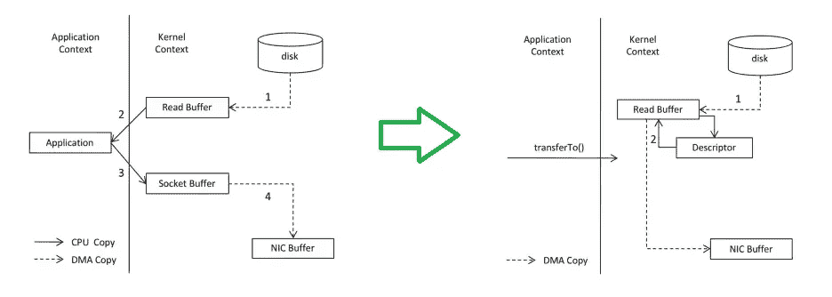
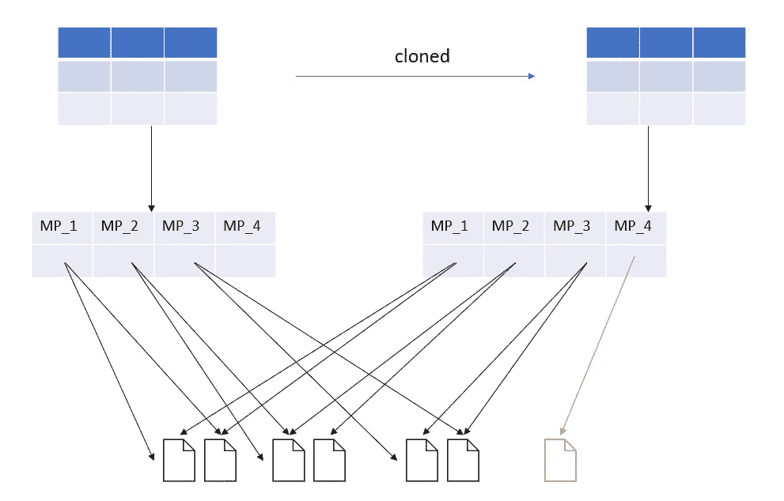
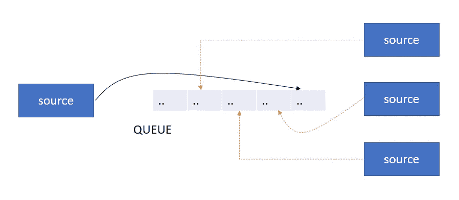

# 数据工程设计模式

> 原文：<https://blog.devgenius.io/data-engineering-design-patterns-91dabc9abb90?source=collection_archive---------0----------------------->

## 一些想法放在一起

在以前关于数据工程的博客中，我讨论了 ETL、ELT 和 CDC 设计模式，在这个博客中，我将讨论一些我在行业中见过的设计模式。

# 数据传送

## 零拷贝数据传输

系统级—零拷贝是指不需要应用程序，直接将数据从磁盘文件拷贝到网卡设备。

在新方法中，避免了多重上下文切换。`*transferTo*`在 Java 中使用 Linux 系统的`*sendfile()*` *。*这种方法现在已经在 NGINX 和KAFKA ***中作为一种支持的数据传输技术被广泛使用。***

**元数据级别** —该零拷贝是指需要克隆或替换时，数据的元数据而不是实际数据的拷贝。这是基于解耦存储和计算的基础之上的。计算是指通过元数据而不是直接通过数据进行存储。为微分区保留元数据，因此在更新的情况下，只更新某些特定的元数据。

**队列 n 路数据传输**

多个应用程序使用相同的数据。源不是将数据发送到多个系统，而是将数据发送到队列/主题，然后消费者分别使用这些数据。

# 数据建模

随着各种数据源和消费模式的增加，一个好的数据建模策略对成功非常关键。

## 正常化

*   模拟数据源
*   删除冗余
*   基于存储效率的设计
*   通常与数据集市一起使用
*   涉及很多连接

## 反规格化

*   也称为维度建模
*   基于消费/业务需求的设计
*   星形模式与雪花模式
*   维度—表示可能性
*   事实表——代表可能性的实现
*   缓慢变化的尺寸

## 数据仓库

*   中枢——代表核心业务概念及其元数据
*   链接—表示中枢之间的关系
*   卫星-背景/描述性值，变化类似于 II 型 SCD
*   原始层、业务层和表示层
*   适合莱克豪斯模式

## 宽表

*   宽非规范化表
*   也称为一张大桌子
*   矩阵化将事实和维度表连接成一个 OBT
*   示例-大查询

# 自动化数据管道

*   使用 Liquibase 或 Flyway 作为数据库对象的光盘方法。
*   将气流和 DBT 等工具用于管道和转换，作为代码。

# 仓库

## 星形模式上的并行加载

在能够加载任何事实表之前顺序加载维度表是星型模式的瓶颈之一。

*   维度表的 varchar(32)代理键
*   禁用外键约束
*   计算临时区域中维度表的密钥的 MD5 哈希
*   并行加载维度和事实表
*   重新启用外键约束

## 事实表子集设置

基于大型事实表的访问模式，我们可以创建第二个事实表，它只包含具有过滤数据的子集。我们可以在填充较大的事实表的同一批中填充较小的事实表。

# 数据结构

## 梅达莲湖屋建筑

medallion 架构分层组织数据。每一层表示存储在湖边小屋中的不同质量的数据。每一层都连续提高后续层中的数据质量。

> 青铜级—原始(原样，增量)
> 白银级—干净的&符合要求(经过验证)
> 黄金级—随时可以消费数据(丰富)