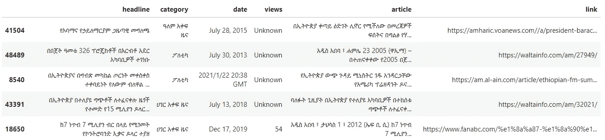
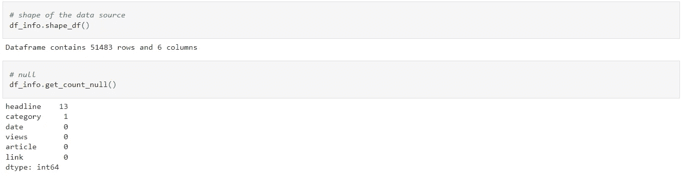
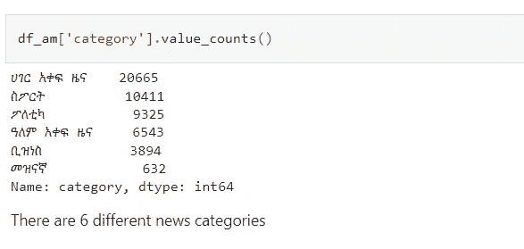
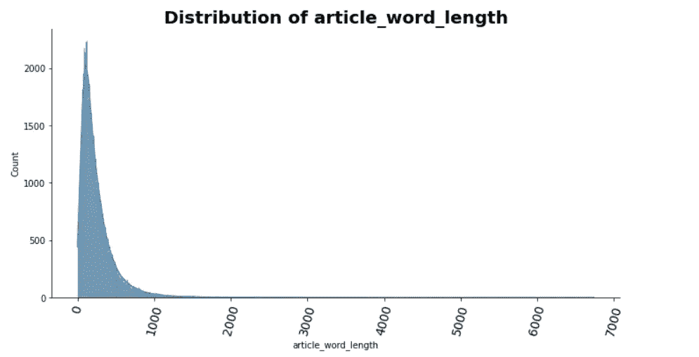
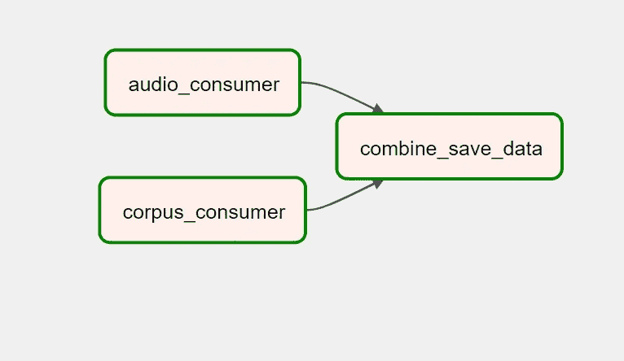
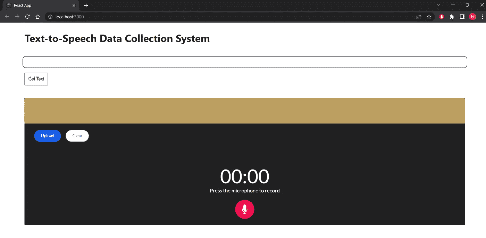

# 数据工程:语音转文本数据收集

> 原文：<https://blog.devgenius.io/data-engineering-text-to-speech-data-collection-b6caa0f44d25?source=collection_archive---------15----------------------->

## 卡夫卡、气流和火花

**业务需求**

本周的挑战是团队合作挑战，重点是数据工程和数据管道。认识到大型数据集对于语音转文本数据集的价值，看到阿姆哈拉语和斯瓦希里语有许多文本语料库的机会，并理解复杂的数据工程技能。本周的任务很简单:设计并构建一个健壮的、大规模的、容错的、高可用的 Kafka 集群，可以用来发布一个句子，接收一个音频文件。
在这个项目结束时，你应该开发出一个工具，可以用来处理从数据湖发送和接收文本和音频文件，以分布式方式应用转换，并以合适的格式将其加载到仓库中，以训练语音到文本的模型。本周挑战的目的是建立一个数据工程管道，允许记录数百万讲阿姆哈拉语和斯瓦希里语的人在应用程序中和网络平台上阅读数字文本。

**数据**
我们将使用大量的大型文本语料库，但出于测试后端开发的目的，您可以使用最近发布的具有基线性能的阿姆哈拉语新闻文本分类数据集[***datase***](https://github.com/IsraelAbebe/An-Amharic-News-Text-classification-Dataset)***t***:一个阿姆哈拉语新闻文本分类数据集(github.com)
您可以在这里阅读数据的简要说明[](https://arxiv.org/pdf/2103.05639.pdf)

# *第一件事:EDA*

*当你得到一个数据集时，你必须首先研究数据的行为。你必须明白这些数据是关于什么的。EDA 在这里起着至关重要的作用。给定的数据集包含六个要素。对于我们的项目，我们更关注标题和文章。(这是用户将以音频形式发送的内容)。*

**

*抽样资料*

*然后我们检查数据的数量，看是否有空数据。我们注意到我们有 51000 多行 6 列，其中只有 14 行是空的。实在是无足轻重的价值。所以我们可以继续删除这些数据。*

**

*根据我们的分析。我们有下面列出的六个类别*

**

```
*# English translation
ሀገር አቀፍ ዜና - National News
ስፖርት - Sport
ፖለቲካ - Politics
ዓለም አቀፍ ዜና - International News
ቢዝነስ - Business
መዝናኛ - Entertainment*
```

*文章字长的分布主要集中在较低的数字上*

**

*我们很好地理解了数据是什么，以及它是如何构成的。现在我们可以继续应用工具来使我们的项目听起来更好。*

# *技术*

*正如本文副标题所述，我们将在这个项目中使用 Kafka、Airflow、Spark、React 和 FastAPI 作为后端。我们将详细了解每种工具。先说卡夫卡。*

***卡夫卡***

> *Apache Kafka 是一个开源的分布式事件流平台，被数千家公司用于高性能数据管道、流分析、数据集成和任务关键型应用程序。*

*Kafka 是一个分布式系统，由通过高性能 TCP 网络协议通信的**服务器**和**客户端**组成。它可以部署在本地和云环境中的裸机硬件、虚拟机和容器上。*

*Kafka 作为一个或多个服务器的集群运行，可以跨越多个数据中心或云区域。其中一些服务器构成了存储层，称为代理。其他服务器运行 [Kafka Connect](https://kafka.apache.org/documentation/#connect) 以事件流的形式持续导入和导出数据，从而将 Kafka 与您现有的系统(如关系数据库以及其他 Kafka 集群)集成。为了让您实现任务关键的用例，Kafka 集群具有高度的可伸缩性和容错性:如果它的任何一个服务器出现故障，其他服务器将接管它们的工作，以确保连续运行而不会丢失任何数据。*

***气流***

*我在我的一篇文章(进入数据工程)中对什么是气流以及如何安装气流做了一个简要的概述。让我在下面重述一下。*

> *Apache Airflow 是一个用于数据工程管道的开源工作流管理平台。只需五个步骤，您就可以为您的本地机器设置气流。*
> 
> *安装 Docker 和 Docker-compose。在您的 shell 上运行以下命令*

```
*curl -LfO '[https://airflow.apache.org/docs/apache-airflow/2.4.0/docker-compose.yaml'](https://airflow.apache.org/docs/apache-airflow/2.4.0/docker-compose.yaml')*
```

> *如果您是 windows 用户，只需转到链接并下载 yaml 文件。*
> 
> *在项目目录中创建一个名为“airflow”的新目录*
> 
> *将 docker-compose.yaml 文件放在这个目录中*
> 
> *从您的终端(确保您在气流目录中)运行以下命令*

```
*docker-compose up airflow-init
docker-compose up -d*
```

> *现在，如果一切顺利，您应该让您的 airflow 服务器在本地主机端口 8080 上运行。转到 127.0.0.1:8080 查看 docker 映像提供的 Dag 示例。*

*[](https://medium.com/@natnaelmasresha/into-the-data-engineering-34d2457cdc03) [## 进入数据工程

### 数据仓库:PostgreSQL、Airflow、dbt 和 redash

medium.com](https://medium.com/@natnaelmasresha/into-the-data-engineering-34d2457cdc03) 

**火花**

Spark 也获得了 Apache 的许可。当单独使用或与其他分布式计算技术结合使用时，数据处理框架 Spark 可以在非常大的数据集上快速执行操作，并将操作分布在几台机器上。这两个特征对于大数据和机器学习领域至关重要，这些领域需要调动巨大的计算机能力来处理庞大的数据仓库。Spark 提供了一个直观的 API，可以抽象出分布式计算和大型数据处理的大部分繁琐工作，同时也减轻了开发人员与这些活动相关的一些编程责任。

我们还将使用 AWS EC2 实例和 S3Buckets 来存储已处理和未处理的数据。

两个科技栈分别是*反应*和 *FastAPI* 。我在以前的文章中讨论过这些技术栈。

# **方法论**

我们先通过创造一些话题，生产者，消费者，让自己熟悉卡夫卡。一个非常好的指南是来自 Confluent 的官方的一步一步的指导

[](https://developer.confluent.io/get-started/python/#introduction) [## Apache Kafka 和 Python -入门教程

### 如何运行用 Python 编写的 Kafka 客户端应用程序，该应用程序从 Kafka 集群中生成和使用消息…

developer.confluent.io](https://developer.confluent.io/get-started/python/#introduction) 

这是创造话题和生产者/消费者互动的一种方式。让我们用 python 来创建它。

先安装 Kafka-python

`pip install kafka-python`

使用上面的片段，创建一个 Kafka 主题，然后运行消费者和生产者。任何从生产者端产生的消息都必须出现在消费者端。

**这一切是为什么？**

如前所述，我们正在建立一个完整的端到端的数据收集管道。我们接受从 S3 桶中随机选择的文本(阿姆哈拉语文本)。然后，我们将该文本提供给消费者*。然后，用户将发回该文本的音频等效版本。同样，我们制作供听众消费的音频*。

因此，这里我们需要两个消费者，一个用于文本，一个用于音频。因此，这些消费者将从两个不同的主题消费。这就是气流发挥作用的地方。计划任务将调用这两个消费者。在使用传输的文本/音频后，我们可以将它们组合在一起，并保存到 S3(未处理的存储)。



简单消费者 DAG

接下来呢？接下来，我们将准备另一个编排，使用 Airflow 将文本和音频数据发送到 Apache spark。我们可以使用 Apache Spark 进行一些转换。然后消耗要保存到 S3 存储桶(已处理存储)的数据。单个文本文件和相应的音频文件应该具有相同的文件名。

# 用户界面

我们用 react 准备了一个简化的单页 WebApp(更像网页)。使用`react-voice-recorder`包，创建一个具有录音机功能的界面非常简单。下面的代码片段应该会给您一个声音界面。您可以尝试为处理程序添加更多的功能。

现在是时候用 FastAPI 连接我们的前端应用程序了。API 做的事情很简单。它获取文本，生成文本，从用户那里获取音频，然后最终以 base64 格式生成获取的音频。



我们建立了一个非常容易使用的界面。用户只需点击获取文本，然后 API 会提供一个。然后记录他/她阅读文本，然后点击上传发送到 Kafka 主题。

# 外卖食品

通过这种努力，我获得了一些非常重要的技能。我开始在工作中使用尖端的数据工程技术。我现在非常适应与卡夫卡、气流和火花一起工作。我还利用了 AWS EC2 实例，这些实例真正帮助我发展了我的云计算技能。我真的很感激能参与这个项目。我建议你继续试验这个项目。我在参考资料部分附上了 GitRepo。

# 未来的工作

我想加强现在应用的调度和编排系统。而且，用 Apache Spark 最好有更多的处理和转换动作。我希望在不久的将来添加这些功能。

## 参考

1.  GitHub[Repository][https://GitHub . com/IsraelAbebe/An-Amharic-News-Text-classification-Dataset](https://github.com/IsraelAbebe/An-Amharic-News-Text-classification-Dataset)
2.  https://kafka.apache.org/documentation/[卡夫卡](https://kafka.apache.org/documentation/)
3.  汇合 Python【指南】[https://developer . confluent . io/get-started/Python/#简介](https://developer.confluent.io/get-started/python/#introduction)

**附录**

**本项目附录一(**个人)GitHub 资源库:[此处](https://github.com/Nathnael12/Data-Engineering_text-to-speech_data-collection.git)

**附录二(**团队)GitHub 库，用于这个项目(我们在一个团队中工作来制作这个项目):[这里](https://github.com/TenAcademy/Data-Engineering_text-to-speech_data-collection.git)*