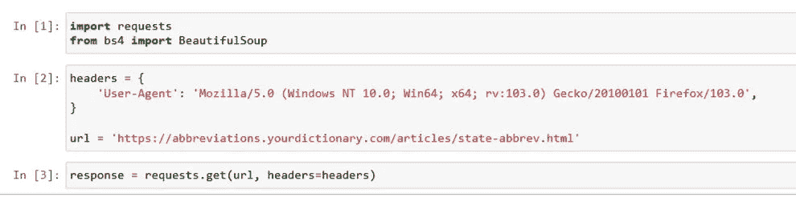
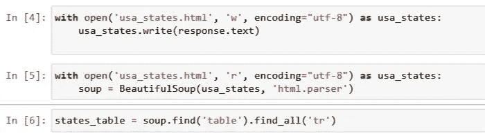
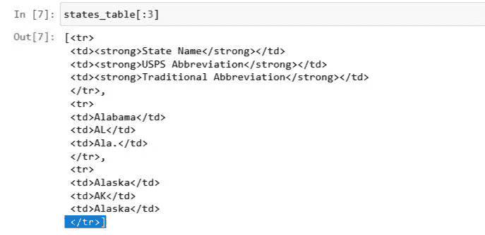
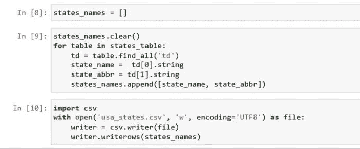
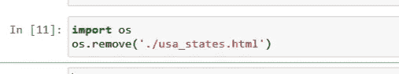

# 用 Python 和 BeautifulSoup 进行数据提取

> 原文：<https://blog.devgenius.io/data-extraction-with-python-and-beautifulsoup-7fb4d79d1cca?source=collection_archive---------5----------------------->


罗曼·辛克维奇·🇺🇦在 [Unsplash](https://unsplash.com?utm_source=medium&utm_medium=referral) 上拍摄的照片

数据驱动决策的一个必要步骤是获取数据。

数据提取或数据收集是获取有助于数据分析的相关数据的过程。并非所有数据都相关，因此需要注意收集对数据分析最有用的相关数据。

这篇文章的目的是提供一个简单的指南，说明如何从提供 HTML 元素的网站中提取数据。并不是每个网站都有可以用来获取数据的公共 API。因此，在没有 API 的情况下，从网站上搜集数据可能会成为一种趋势。

# 安装所需的库

开始之前，请确保您的计算机上安装了 python。python==3.7 或更高版本会更好。

创建一个文件夹，并启动指向创建的文件夹的命令提示符。

一旦命令提示符指向文件夹位置，请键入以下内容

```
pip install beautifulsoup4pip install requestspip install jupyter
```

对于本教程，我将提取美国所有州的列表及其缩写州名的网站内容。

网站可以在这里找到[美国和 ABBR](https://abbreviations.yourdictionary.com/articles/state-abbrev.html)

安装成功后，在命令提示符下键入

```
jupyter notebook
```

这将启动一个 jupyter 编码环境的实例。



要获得您的浏览器用户代理，请使用您的浏览器搜索引擎键入不带引号的“我的用户代理”。

在第 1 行，导入所需的库。在第 2 行和第 3 行，设置标题和要抓取的网站的 URL，并使用请求库向网站发出请求。来自网站的响应被保存到名为 response 的变量中。



在第 4 行，使用 python 和 open()命令，来自网站的响应被保存到 usa_states.html。这是为了避免对网站进行重复的 HTTP 调用。

在第 5 行，读取保存的文件，并使用 BeautifulSoup 库，解析转换成 python 对象的网站内容。

在第 6 行，使用 soup.find()方法搜索元素。找到后，搜索作为 table 元素的子元素的所有标签。



结果是一个保存在 states_table 变量中的列表。



因为结果是一个列表，所以我们遍历 states_table 列表来查找作为元素的子元素的元素。找到后，将结果追加到声明的 states_names 变量中。states_names.clear()方法用于删除任何以前保存的列表内容，以避免重复。

在第 10 行，使用 CSV 内置模块，将结果写入名为 usa_states.csv 的 CSV 文件。



最后，我们删除 usa_states.html 文件，该文件用于存储 html 网站的内容。

在这里，这是一个简单的抓取网站数据的方法。虽然网站抓取有时很难处理，但我希望这篇文章能给你一个如何抓取网站的基本知识。