# 使用 EMQX 云和 ClickHouse 云接收数据

> 原文：<https://blog.devgenius.io/data-ingestion-with-emqx-cloud-and-clickhouse-cloud-e93e6c53bf52?source=collection_archive---------11----------------------->

几天前，ClickHouse 宣布[推出 ClickHouse Cloud](https://clickhouse.com/blog/clickhouse-cloud-public-beta) ，这是一个闪电般快速的基于云的数据库，可以简化和加速现代数字企业的洞察和分析。

ClickHouse 在物联网行业也越来越受欢迎。在这个分步教程中，我将向您展示如何使用[EMQX Cloud](https://www.emqx.com/en/cloud)的本地数据集成功能将数据从 MQTT 代理接收到 ClickHouse。

EMQX 还提供名为 [EMQX Cloud](https://www.emqx.com/en/cloud) 的完全托管云服务，在本教程中，我将同时使用 EMQX Cloud 和 ClickHouse Cloud，您将看到使用这两种云服务获取和持久存储物联网数据是多么容易。

# **演示场景**

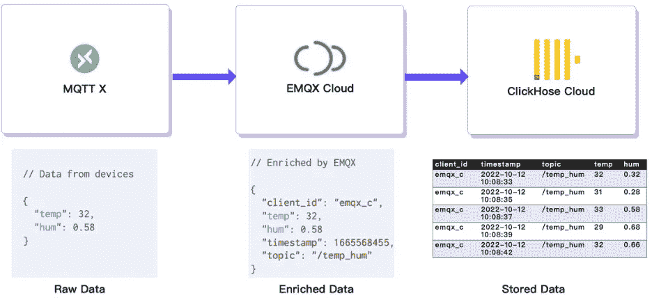

将数据从 EMQX 云接收到 ClickHouse 云

本教程将使用最流行的桌面 MQTT 客户机 MQTT X 来模拟发布温度和湿度数据的传感器。这两个指标都将通过 MQTT 协议发送到 EMQX Cloud。原始数据将通过 EMQX Cloud 的规则引擎得到丰富。客户机 ID、MQTT 主题和接收时间将被添加到消息中。最后，转换后的消息将被持久化到 ClickHouse 云中。

从本教程中，你会看到这是多么容易完成！

# 获取您的 ClickHouse 云服务

[ClickHouse Cloud](https://clickhouse.com/) 正在公测，你可以在 ClickHouse 官方网站申请免费试用。它提供 14 天的免费试用。

## 创建 ClickHouse 云服务

ClickHouse 提供了一个快速入门工具，只需按照文档上的步骤操作，几分钟内您就可以启动并运行一个实例。在我的设置过程中，我在 N. Virginia (us-east-1)的 AWS 上部署了我的 ClickHouse 实例，因为我的 EMQX 云实例也部署在同一地区。

在设置过程中，您还需要注意连接设置。在本教程中，我们使用“任何地方”，但是如果您选择一个特定的位置，您将需要将您从 EMQX 云部署中获得的 NAT 网关 IP 地址添加到白名单中。

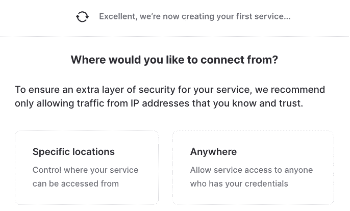

调配之后，您应该能够看到服务正在运行:

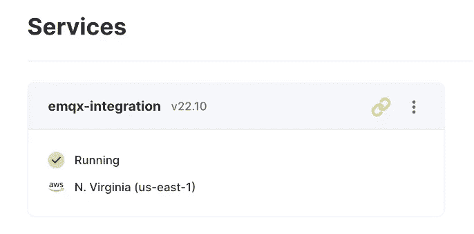

ClickHouse 云服务正在运行

单击面板中的链接，您将找到连接字符串，这是在设置与 EMQX Cloud 的集成时需要的。

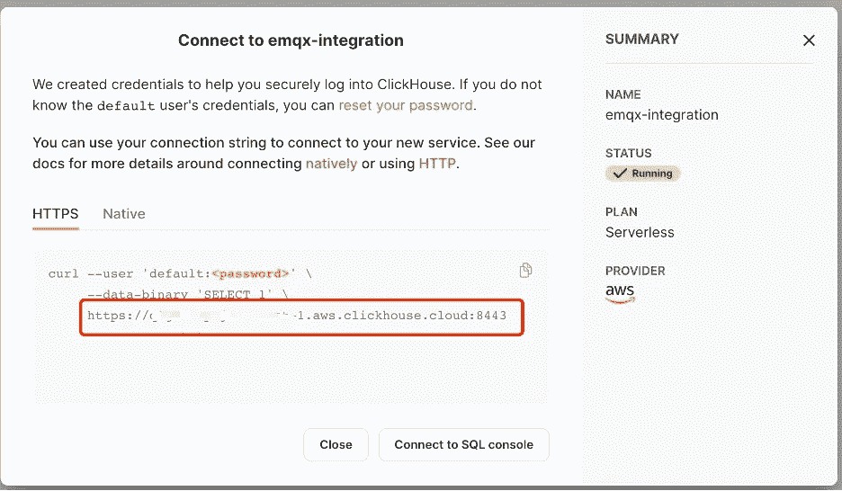

从 ClickHouse Cloud 获取服务 URL

集成也需要您创建的凭据。

## 设置数据库和表

单击“连接到 SQL 控制台”按钮，让我们创建一个数据库和表。

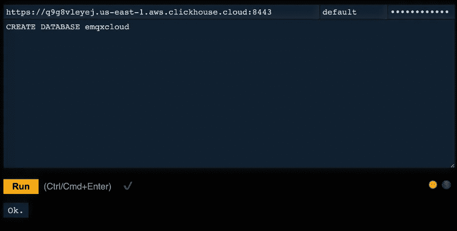

创建数据库:emqxcloud

```
CREATE DATABASE emqxcloud
```

在本教程中，我创建了一个名为“ *emqxcloud* ”的数据库。

然后创建一个名为“ *temp_hum* 的表来存储来自 EMQX cloud 的温度和湿度数据。

```
CREATE TABLE emqxcloud.temp_hum
(
  client_id String,
  timestamp DateTime,
  topic String,
  temp Float32,
  hum Float32
)
ENGINE = MergeTree()
PRIMARY KEY (client_id, timestamp)
```

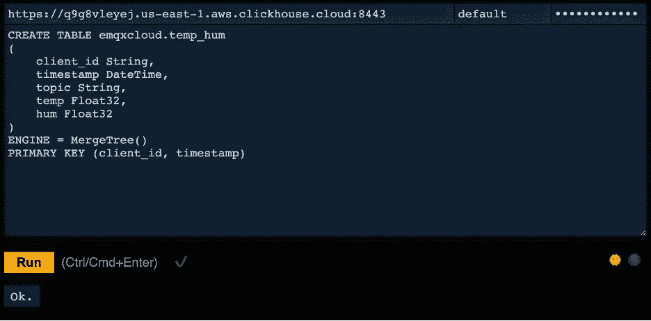

创建表:temp_hum

如您所见，这个表有 5 列，除了温度和湿度，它还记录了主题名称、客户机 id 和时间戳。

现在我们有了 ClickHouse 服务的所有设置。让我们转到 EMQX 云部分。

# 在 EMQX 云上创建 MQTT 服务。

在 EMQX Cloud 上创建一个专门的 MQTT 代理就像点击几下鼠标一样简单。

## 获得一个帐户

如果您是 EMQX Cloud 的新用户，请访问 [EMQX Cloud](https://www.emqx.com/en) 并点击开始免费注册帐户。

## 创建一个 MQTT 集群

登录后，点击帐户菜单下的“云控制台”，您将能够看到绿色按钮来创建一个新的部署。

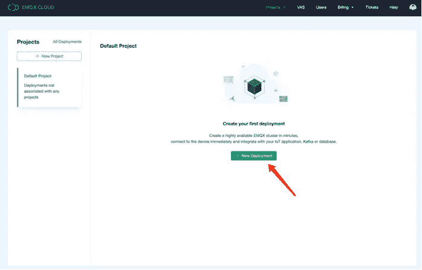

在 EMQX 云上创建 MQTT 服务

EMQX Cloud 为标准计划和专业计划提供 14 天免费试用。在本教程中，我们将使用 Professional 计划，因为只有这个计划提供数据集成功能，它可以将 MQTT 数据直接发送到 ClickHouse，而无需一行代码。

选择专业版，并选择“弗吉尼亚”地区，然后单击“立即创建”。几分钟后，您将获得一个完全托管的 MQTT 代理:

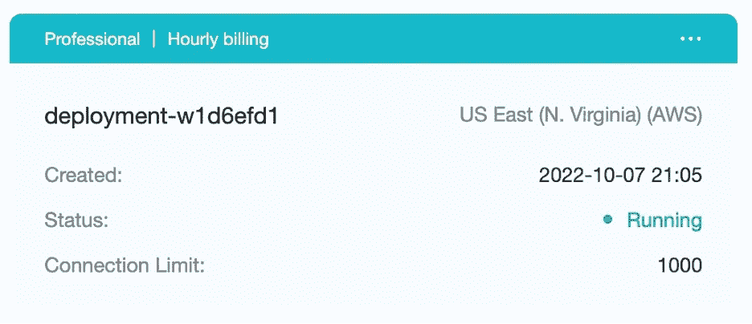

MQTT 服务正在运行

现在，单击面板转到集群视图。

在这个仪表板上，您将看到 MQTT 服务的概述。

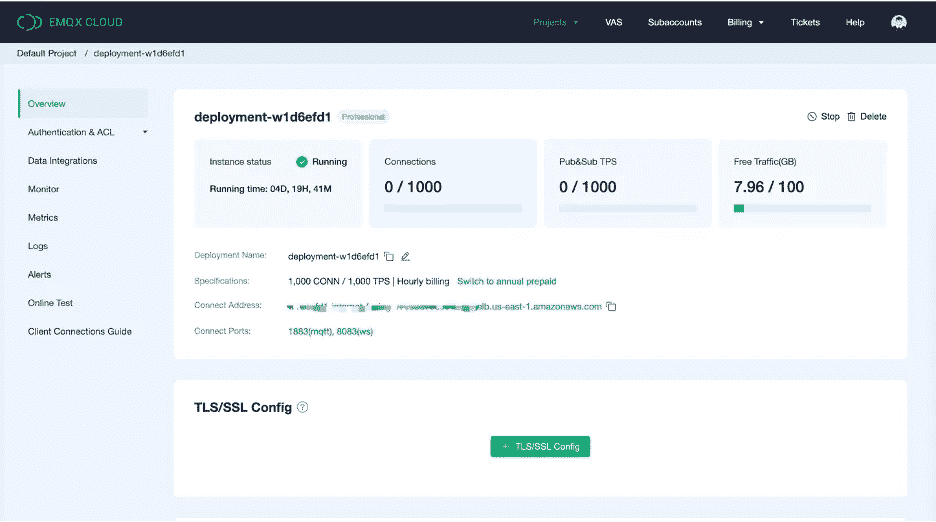

EMQX 云服务仪表板

## 添加客户端凭据

现在，让我们添加一个客户机凭证，这样我们就可以使用 MQTT 客户机工具向这个代理发送数据。

点击左侧菜单中的“认证和 ACL ”,然后点击子菜单中的“认证”。

单击右边的“Add”按钮，稍后给出 MQTT 连接的用户名和密码。这里我将使用“test”和“clickhouse”作为用户名和密码。

单击“Confirm ”,现在我们已经准备好了一个完全托管的 MQTT 代理。

# 将 EMQX 云与 ClickHouse 云集成

现在，我们来看看如何将数据从 EMQX Cloud 获取到 ClickHouse Cloud。

EMQX Cloud 提供了 30 多种与流行数据系统的本机集成。ClickHouse 就是其中之一。

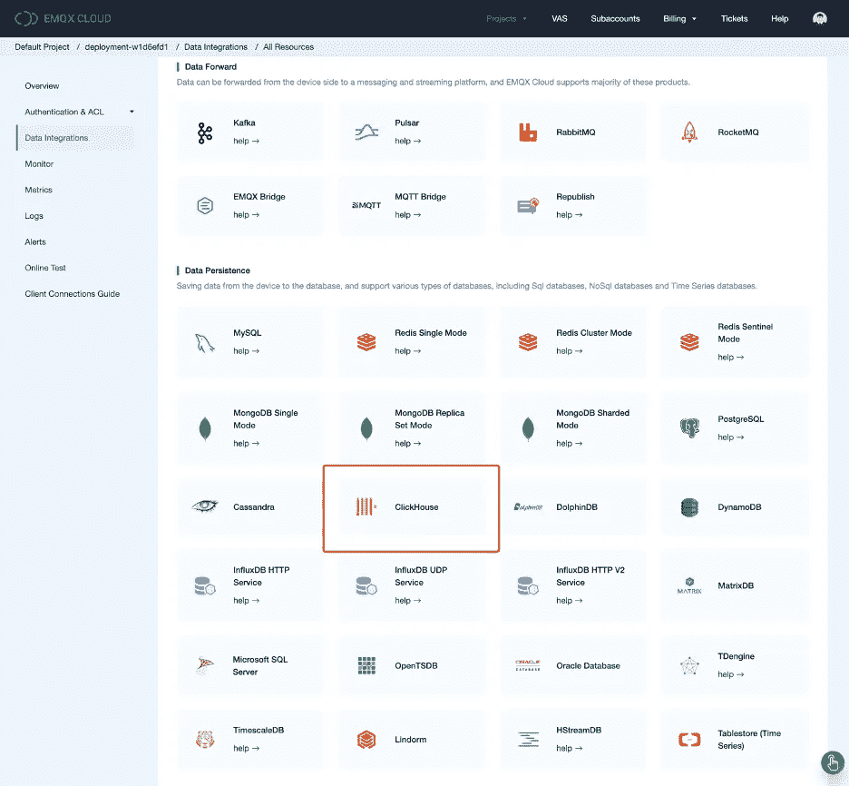

EMQX 云数据集成

但是在我们开始设置 ClickHouse 集成之前，首先我们需要启用 NAT 网关。默认情况下，MQTT 代理部署在私有 VPC 中，不能通过公共网络向第三方系统发送数据。有两种方法可以解决这个问题。一种是启用 NAT 网关，并允许代理通过该网关向 ClickHouse 发送数据。另一个解决方案是设置 VPC 对等，这取决于目标云服务是否支持 VPC 对等。在本教程中，我们将使用第一种解决方案。

创建 NAT 网关

返回概览页面，向下滚动到页面底部，您将看到 NAT 网关小部件。点按“订阅”按钮，并按照说明进行操作。请注意，NAT Gateway 是一项增值服务，但它也提供 14 天的免费试用。

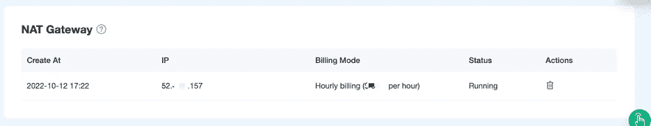

NAT 网关

一旦创建完成，您将在小部件中找到公共 IP 地址。请注意，如果您在 ClickHouse Cloud 设置期间选择了“从特定位置连接”,您需要将此 IP 地址添加到白名单中。

## 数据集成

现在让我们创建 ClickHouse 本机集成。

单击左侧菜单上的“数据集成”，然后单击“查看所有资源”。您可以在数据持久性部分找到 ClickHouse，也可以搜索 ClickHouse。

单击 ClickHouse 卡创建新资源。


创建 ClickHouse 资源

1.  备注:为该资源添加备注
2.  服务器地址:这是你的 ClickHouse 云服务的地址，切记不要忘记端口。例:[https://q 9g XXXXXX . us-east-1 . AWS . click house . cloud:8443](https://q9gXXXXXX.us-east-1.aws.clickhouse.cloud:8443)
3.  数据库名称:我们在上述步骤中创建的“emqxcloud”。
4.  用户:连接到您的 ClickHouse 云服务的用户名。
5.  Key:连接的密码。

单击“测试”查看连接是否正常。如果验证通过，您可以单击“新建”按钮来创建资源。

现在我们刚刚创建了一个 ClickHouse 资源，我们仍然需要告诉如何发送数据到这个资源，所以我们需要创建一个规则。

在创建资源的过程中，您会看到一个弹出窗口，单击“新建”会将您带到规则创建页面。

EMQX 提供了一个强大的规则引擎，可以在将原始 MQTT 消息发送给第三方系统之前对其进行转换和丰富。你可以在这里了解更多关于规则引擎[的使用信息。](https://docs.emqx.com/en/cloud/latest/rule_engine/rules.html)

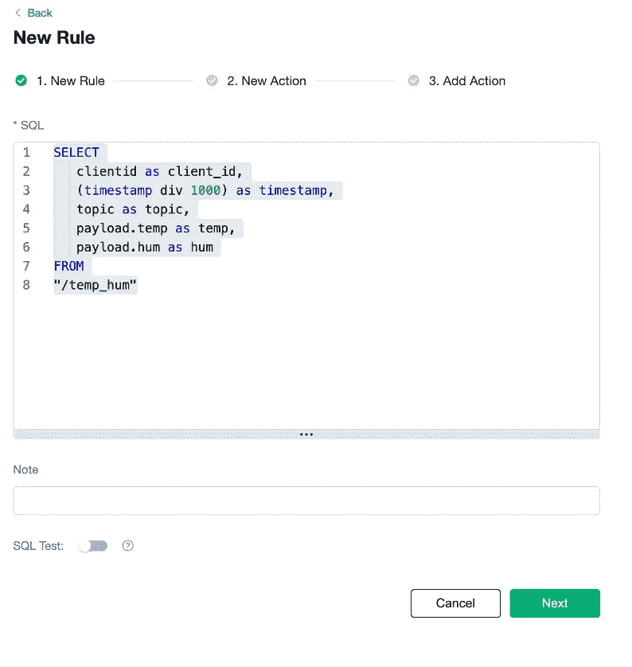

创建规则

以下是本教程中使用的规则:

```
SELECT
   clientid as client_id,
   (timestamp div 1000) as timestamp,
   topic as topic,
   payload.temp as temp,
   payload.hum as hum
FROM
"/temp_hum"
```

它将从“/temp_hum”主题中读取消息，并通过添加 client_id、主题和时间戳信息来丰富 JSON 对象。

因此，您发送给主题的原始 JSON:

```
{“temp”: 28.5, “hum”: 0.68}
```

将被转换为:

```
{
   “client_id”: “c_emqx”,
   “hum”: 0.68,
   “temp”: 28.5,
   “timestamp”: 1665568455,
   “topic”: “/temp_hum”
}
```

现在点击“下一步”按钮。这一步是告诉 EMQX Cloud 如何将细化的数据插入到你的 ClickHouse 数据库中。

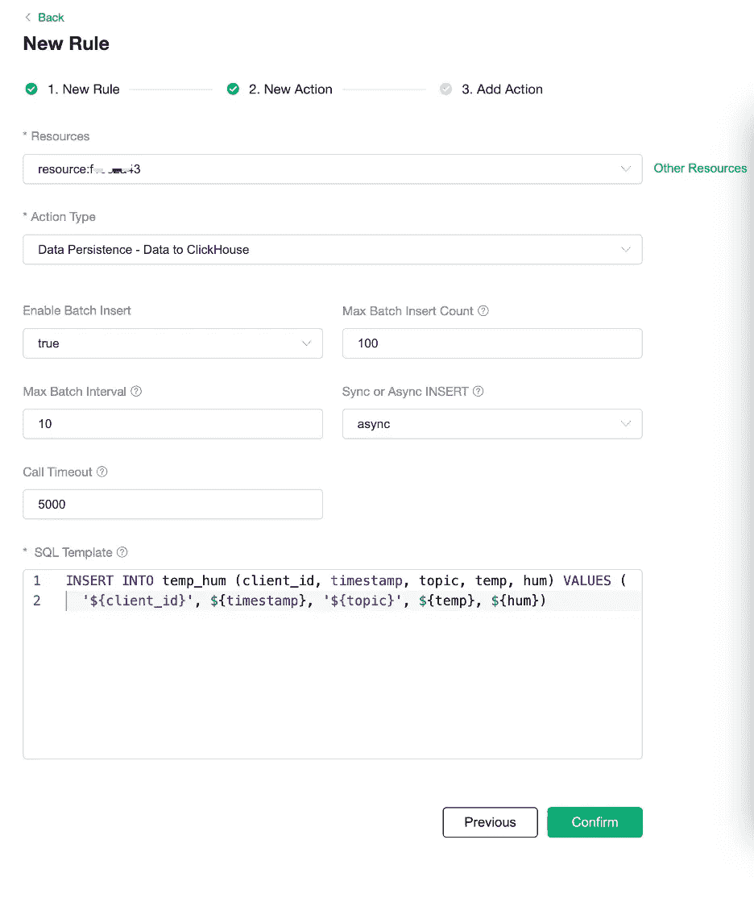

创建一个操作

如果只有一个资源，则不需要修改“资源”和“活动类型”。

您只需要设置 SQL 模板。以下是用于本教程的示例:

```
INSERT INTO temp_hum (client_id, timestamp, topic, temp, hum) 
VALUES (‘${client_id}’, ${timestamp}, ‘${topic}’, ${temp}, ${hum})
```

这是一个将数据插入 Clickhouse 的模板，你可以看到这里使用的变量。

点击“确认”和“查看详细信息”

现在，一切都应该设置好了。您可以从规则详细信息页面看到数据集成的工作。

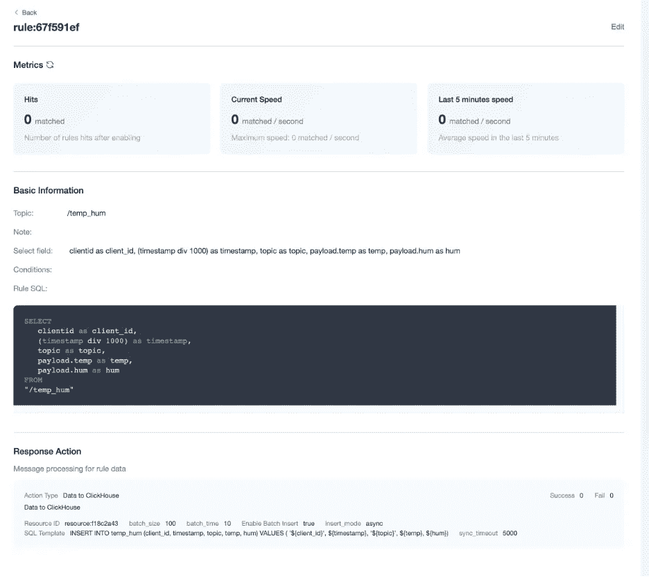

规则概述

发送到“/temp_hum”主题的所有 MQTT 消息都将被丰富并持久化到您的 ClickHouse 云数据库中。

现在，让我们试一试！

# 确认

## 将 MQTT 消息发布到 EMQX 云

您可以使用任何 MQTT 客户机或 SDK 来发布消息。在本教程中，我们将使用由 EMQ 提供的用户友好的 MQTT 客户端应用程序 [MQTTX](https://mqttx.app/) 。

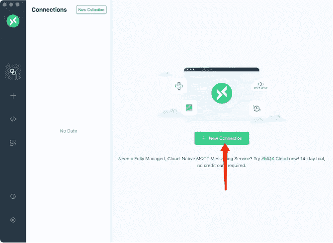

创建连接

单击 MQTTX 上的“新建连接”并填写连接表单:

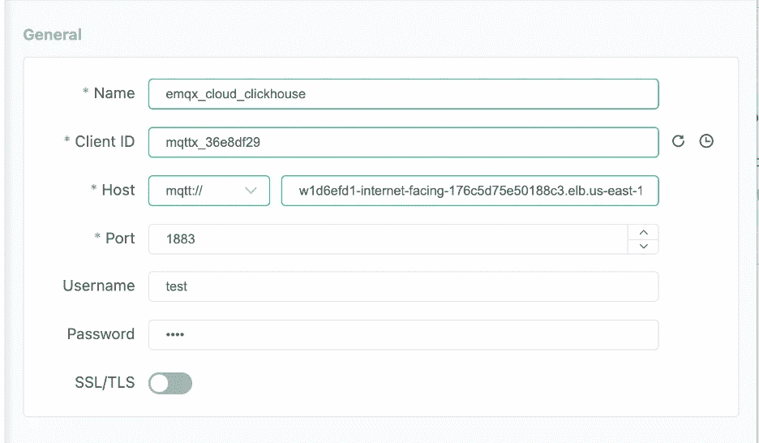

连接设置

1.  名称:连接名称。想用什么名字就用什么名字。
2.  主机:MQTT 代理连接地址。您可以从 EMQX 云概述页面获得它。
3.  端口:MQTT 代理连接端口。您可以从 EMQX 云概述页面获得它。
4.  用户名/密码:使用上面创建的凭证，在本教程中应该是“test”和“clickhouse”。

点击右上角的“连接”按钮，连接应该会建立。

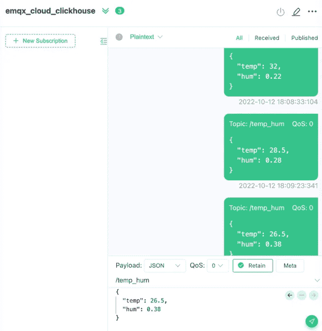

向 EMQX 云发送数据

现在，您可以使用这个工具向 MQTT 代理发送消息。

1.  将有效负载格式设置为“JSON”。
2.  设置为 topic: /temp_hum(我们刚刚在规则中设置的主题)
3.  JSON 正文:

```
{
   “temp”: 26.5,
   “hum”: 0.38
}
```

点击右边的发送按钮。您可以更改温度和湿度值，并向 MQTT 代理发送更多数据。

所有发送到 EMQX Cloud 的数据都要经过规则引擎的处理，自动插入 ClickHouse Cloud。

## 检查数据的持久性

现在是时候看看 ClickHouse 云上的数据了。理想情况下，您使用 MQTTX 发送的数据将进入 EMQX 云，并在原生数据集成的帮助下持久存储到 ClickHouse 云的数据库中。

您可以连接到 ClickHouse Cloud panel 上的 SQL 控制台，或者使用任何客户端工具从您的 ClickHouse 获取数据。在本教程中，我们使用了 SQL 控制台。

通过执行 SQL“SELECT * FROM emqx cloud . temp _ hum”

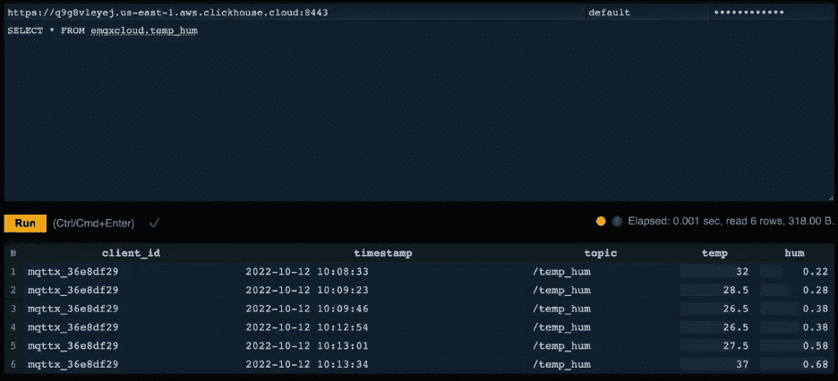

在 ClickHouse Cloud 上进行查询

您将看到您发布到 EMQX 云的数据现在存储在 ClickHouse 云中。

就这么简单。

# 摘要

我们没有编写任何代码，现在我们已经将 MQTT 数据从 EMQX 云转移到了 ClickHouse 云。

使用 EMQX 云和 ClickHouse Cloud，您无需管理基础架构，只需专注于将您的物联网应用与安全存储在 ClickHouse Cloud 中的数据连接起来。

如果您有兴趣了解更多关于集成的知识。随时给我发邮件: [ben@emqx.io](mailto:ben@emqx.io)