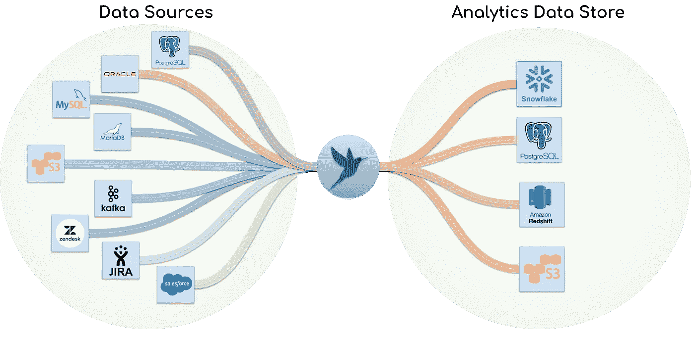

# 通过管道和气流接收数据

> 原文：<https://blog.devgenius.io/data-ingestion-with-pipelinewise-and-airflow-cdc69f72148f?source=collection_archive---------5----------------------->

欢迎来到我的第一篇文章！我猜你偶然发现了这个指南，因为在互联网上很少有关于 PipelineWise 的资源。我希望这个指南能帮助你实现你的目标。

所以我们开门见山吧！

# 管道方向和气流



管线式连接器(来源:管线式文件)

[PipelineWise](https://transferwise.github.io/pipelinewise/index.html) 是由 [TransferWise(现称 Wise)](https://wise.com/gb/blog/world-meet-wise) 于 2018 年打造的开源数据摄取工具。PipelineWise 构建在 [Singer.io](https://www.singer.io/) 规范之上，允许您将管道配置为 YAML 文件中的代码。在 ELT 范例中，PipelineWise 在数据管道的提取端扮演类似于 Airbyte、Meltano 和 Stitch 的角色。

[Airflow](https://airflow.apache.org/) 是一个流行的调度和数据编排工具，用于创建 Dag 形式的复杂工作流。Airflow 因数据工程管道而受欢迎，由 AirBnB 于 2014 年创建。

在本指南中使用这两个工具的目的是:
1。使用管道方式，定义将数据从源数据库移动到目标数据仓库的数据提取配置。
2。根据气流时间间隔安排提取管道运行。

# 假设

在继续阅读本指南之前，作者假设读者:
-具有 Unix/Linux Bash CLI 命令的基本知识。在本指南中，我们将使用 Ubuntu。
-具有气流设置，适合与 Dag 一起工作。
-对码头工人和集装箱有基本的了解。
-了解数据复制概念，如全负载、增量负载和基于日志的负载(CDC)。

这些概念将在本指南中使用。但是，如果它们对您来说是新的，则超出了本文的范围。你仍然可以继续前进，不需要面对很多挑战。请注意，所列概念面临的错误必须在各自的领域中解决。

# 管道式安装

PipelineWise 可以通过从源代码构建或使用 Docker 来安装。对于我们的用例，Docker 是管道式安装的更简单的方法。

首先，用`docker info`命令验证 Docker 是否安装，否则[为 Ubuntu 安装 Docker 引擎](https://docs.docker.com/engine/install/ubuntu/)。

其次，运行以下命令克隆 PipelineWise repo 并构建 docker 映像:

```
$ git clone https://github.com/transferwise/pipelinewise.git
$ cd ./pipelinewise
$ docker build --no-cache -t pipelinewise:latest .
```

第三，为 pipelinewise-docker 入口点创建一个别名。这将允许我们在不指定完整路径的情况下使用`pipelinewise`命令。将这行代码添加到您的`~/.bashrc` : `alias pipelinewise='<fullpath>/bin/pipelinewise-docker'`。将`<fullpath>`替换为克隆的 PipelineWise 安装文件夹的完整路径。您可以通过`source ~/.bashrc`来实现您的更改:

```
$ vi ~\.bashrc
$ source ~\.bashrc
```

最后，使用`pipelinewise status`命令验证安装是否成功。如果没有错误消息，您将看到关于 Tap ID、Tap 类型、目标 ID 和 co 的输出:

```
$ pipelinewise status
```

# 创建管道

管道方面的“管道”基本上是将数据从“分支”或源加载到“目标”或目的地的配置。这些配置是在 YAML 模板中定义的。

首先初始化一个新项目。这将为所有支持的连接器创建一个包含示例配置 YAML 文件的文件夹:

```
$ pipelinewise init --name samples
```

接下来，您将为您的点击(与源相同)和目标(与目的相同)复制一个样本。对于这个演示，我的 taps 将是 [MySQL](https://transferwise.github.io/pipelinewise/connectors/taps/mysql.html) 和 [PostgreSQL](https://transferwise.github.io/pipelinewise/connectors/taps/postgres.html) ，我的目标将是 [Redshift](https://transferwise.github.io/pipelinewise/connectors/targets/redshift.html) :

```
$ mv /samples/tap_mysql_mariadb.yml.sample tap_mysql_one.yml
$ mv /samples/tap_postgres.yml.sample tap_postgres_one.yml
$ mv /samples/target_redshift.yml.sample  target_redshift.yml
```

现在，您可以使用选择的文本编辑器修改配置 YAML 文件。你可以查看文档中关于[的真实例子](https://transferwise.github.io/pipelinewise/installation_guide/creating_pipelines.html#example-replication-mysql-to-snowflake)。

完成后，您的项目结构应该如下所示:

```
└── pipelinewise_samples
    ├── samples
    ├── .gitignore
    ├── README.md
    ├── tap_mysql_connectel.yml
    ├── tap_mysql_odoo_erp.yml
    ├── target_redshift.yml
```

## 加密密码(可选)

PipelineWise 使用 Ansible Vault python 库对配置 YAML 文件中使用的机密进行加密。首先，您将创建一个包含主密码的文件。然后，您可以使用主密码文件散列任何秘密字符串(例如 DB password ),并将其添加到配置 YAML 文件中。

要创建主密码文件，请使用以下命令:

```
$ echo "M@st3rP@ssw0rd" > vault-password.txt
```

要使用主密码散列秘密字符串，请使用以下命令:

```
$ pipelinewise encrypt_string --secret vault-password.txt --string "D@t@baZEpassMord"
```

然后，您可以将加密的密码复制并粘贴到您的配置 YAML 文件中。点击在文档[中找到更多关于加密秘密的细节。](https://transferwise.github.io/pipelinewise/user_guide/encrypting_passwords.html)

# 导入 YAML 配置

每当**创建或修改**一个配置 YAML 文件时，它必须在使用前被导入。`pipelinewise import`命令在当前用户的`~/.pipelinewise`目录下生成 JSON 文件。Singer 组件使用 JSON 文件。

要将配置 YAML 文件导入当前目录，请使用`.`目录字符。如果你一直遵循我的方法，这个命令应该对你有用。

```
$ pipleinewise import --dir .
```

要在不同的目录中导入配置 YAML 文件，请指定该目录的路径:

```
$ pipleinewise import --dir ~/documents/pipelinewise_project/
```

**如果*配置 YAML 文件的任何*包含散列密码**，在命令中添加`--secret`参数:

```
$ pipleinewise import --dir . --secret vault-password.txt
```

一旦配置 YAML 文件被导入，您可以用`pipelinewise status`命令来验证管道。

# 运行管道

首先，使用命令检查导入管道的列表:

```
$ pipelinewise status
```

您可以使用`pipelinewise run_tap`命令触发管道运行。您必须指定一个 **tap_id** 和一个 **target_id** ，其格式如下:

```
$ pipelinewise run_tap --tap <TAP-ID> --target <TARGET-ID>
```

然后，您可以使用示例命令触发管道:

```
$ pipelinewise run_tap --tap mysql-one --target company-warehouse
```

这将根据导入的配置 YAML 文件加载您的数据。默认情况下，PipelineWise 将使用 [FastSync](https://transferwise.github.io/pipelinewise/concept/fastsync.html#) 组件进行*更快的*初始加载。基于您的[复制方法](https://transferwise.github.io/pipelinewise/concept/replication_methods.html)的未来负载将使用 Singer 组件。

# 气流调度

编排管道式管道的最简单方法是使用 Unix Cron 作业。但是，如果您在一个具有复杂数据工作流的企业环境中工作，您将需要一个像 Airflow 这样的 orchestrator。

要在气流中安排管线式管道，你需要:
-指定管线式-码头入口点的完整路径。这是因为气流无法识别`pipelinewise`命令。
-使用 bash 运算符

下面的 Github Gist 中显示了一个 DAG 示例:

瞧啊。只需刷新您的气流用户界面，照常运行 DAG。

# 管道式打嗝

从 PipelineWise 版本 0.48.3 开始，FastSync 组件与 MySQL 8 不完全兼容。我遇到的一些问题是数据库连接问题、散列密码问题和不成功的数据类型解析。这只会影响初始加载，因为使用了 FastSync。

这是目前正在努力，可能会被修复。然而，Singer 组件对于后续加载工作良好。

# 结论

我开始使用 PipelineWise，因为我的公司已经使用它多年，我必须开始维护它。最初，我想改用 Airbyte，但我也想了解 PipelineWise 是如何工作的。然而，在这两者之间，我确实喜欢 PipelineWise 的直截了当的 YAML 配置文件。

对于数据提取工具的新手来说，Airbyte 或 Meltano 是不错的选择。它们配置更简单，提供更多的连接器，并且有更多的维护人员。如果您使用的是通用连接器，并且熟悉配置代码，那么 PipelineWise 将很好地为您服务。

祝贺您走到这一步，祝您在数据之旅中好运！

# 证明文件

*   [https://transferwise.github.io/pipelinewise/index.html](https://transferwise.github.io/pipelinewise/index.html)