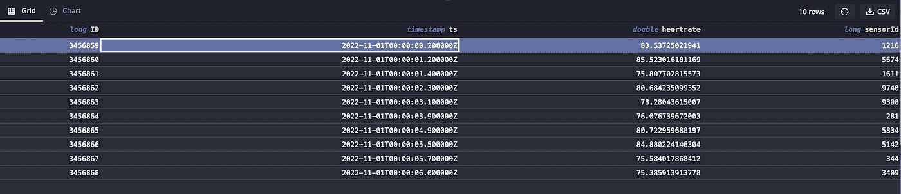

# QuestDB 的数据生命周期

> 原文：<https://blog.devgenius.io/data-lifecycle-with-questdb-cdd95789ca5f?source=collection_archive---------7----------------------->


斯蒂芬·菲利普斯-Hostreviews.co.uk 在 Unsplash[拍摄的照片](https://unsplash.com?utm_source=medium&utm_medium=referral)

对于大多数处理时间序列数据的应用程序，每个数据点的值都会随着时间的推移而减少，因为数据集的粒度会随着其变得陈旧而失去相关性。例如，当应用实时异常检测模型时，更细粒度的数据(例如，以第二分辨率收集的数据)将产生更好的结果。然而，为了以后训练预测模型，以如此高的频率记录数据可能是不需要的，并且在存储和计算方面是昂贵的。

当我在一家物联网公司工作时，为了解决这个问题，我们将数据存储在三个独立的数据库中。为了显示最新的价值，最新的更新被推送到 NoSQL 实时数据库。与此同时，所有的数据都被添加到一个时间序列数据库和一个 OLAP 数据库中，前者可存储长达 3 个月的数据以供快速分析，后者可长期存储。为了防止时间序列数据库的规模爆炸，我们还运行了一个夜间作业来删除旧数据。随着物联网设备的数据量呈指数级增长，这种设计导致了维护三个不同数据库的操作问题。

QuestDB 解决了这个问题，它提供了简单的方法来缩减数据采样，并在不再需要旧数据时分离或删除分区。这有助于将大多数操作的所有数据保存在单个数据库中，并将陈旧数据移动到更便宜的存储中，以符合成熟的数据保留策略。

为了说明这一点，让我们重温一下涉及心率数据的[物联网应用](https://questdb.io/blog/2021/02/05/streaming-heart-rate-data-with-iot-core-and-questdb/)。不幸的是，谷歌决定[关闭其云物联网核心服务](https://techcrunch.com/2022/08/17/google-cloud-will-shutter-its-iot-core-service-next-year/)，因此我们将在本次演示中使用随机数据。

# 填充心率数据

让我们从通过 Docker 运行 [QuestDB 开始:](https://questdb.io/docs/get-started/docker/)

```
docker run -p 9000:9000 \
-p 9009:9009 \
-p 8812:8812 \
-p 9003:9003 \
-v “$(pwd):/var/lib/questdb” \
questdb/questdb
```

我们将通过控制台在`localhost:9000`创建一个简单的心率数据表，其中包含时间戳、心率和按月划分的传感器 ID:

```
CREATE TABLE heart_rate AS(
  SELECT
    x ID,
    timestamp_sequence(
      to_timestamp('2022–10–10T00:00:00', 'yyyy-MM-ddTHH:mm:ss'),
      rnd_long(1, 10, 0) * 100000L
    ) ts,
    rnd_double(0) * 100 + 60 heartrate,
    rnd_long(0, 10000, 0) sensorId
  FROM
    long_sequence(10000000) x
) TIMESTAMP(ts) PARTITION BY MONTH;
```

现在，我们已经从 10，000 个传感器获得了超过 2 个月的随机数据(1000 万个数据点)。假设我们不断地从数据流中追加到这个数据集，那么如此频繁的更新将有助于检测心率异常。这可能有助于检测和警告可能出现的健康问题。

# 对数据进行下采样

然而，如果没有检测到异常，如果我们只是想记录一段时间内的总体趋势，那么每秒收集一次心率数据集是没有用的。相反，我们可以以一小时为间隔记录平均心率，以压缩数据。例如，如果我们对特定传感器每小时采样的最小、最大和平均心率感兴趣，我们可以调用:

```
SELECT
  min(heartrate),
  max(heartrate),
  avg(heartrate),
  ts
FROM
  heart_rate
WHERE
  sensorId = 1000 SAMPLE BY 1h FILL(NULL, NULL, PREV);
```

一旦您对向下采样的结果感到满意，我们可以将这些结果存储到单独的 sampled_data 表中，以便在其他数据科学时间创建预测模型或进行进一步分析:

```
CREATE TABLE sampled_data (ts *timestamp*, min_heartrate *double*, max_heartrate *double*, avg_heartrate *double*, sensorId *long*) *timestamp*(ts);INSERT INTO sampled_data (ts, min_heartrate, max_heartrate, avg_heartrate, sensorId);SELECT ts, min(heartrate), max(heartrate), avg(heartrate), sensorId FROM heart_rate SAMPLE BY 1h FILL(NULL, NULL, PREV);
```

这种下采样操作可以周期性地(例如，每天、每月)进行，以填充新表格。通过这种方式，数据科学团队不必导入大量原始数据集，只需使用适当分辨率的采样数据即可。

# 数据保留策略

然而，光靠下采样并不能解决不断增长的数据量。原始传感器心率表的大小将继续增长。在这种情况下，我们在 QuestDB 中有一些选项来分离甚至删除分区。

因为我们按月份对原始数据集进行了分区，所以我们有 3 个分区:2022–10、2022–11 和 2022–12。这可以在/db/heart_rate/目录下看到，还有保存元数据的其他文件。

```
/db/heart_rate
├── 2022–10
├── 2022–11
├── 2022–12
```

对数据进行缩减采样后，我们可能不再需要旧月份的数据。在这种情况下，我们可以[分离](https://questdb.io/docs/reference/sql/alter-table-detach-partition/)这个分区，使其不可用于读取。

```
ALTER TABLE ‘heart_rate’ DETACH PARTITION LIST ‘2022–10’;
```

现在，2022–10 分区被重命名为 2022–10。在 heart_rate 表中分离并运行查询将返回 2022–11 以后的数据:

```
SELECT * FROM ‘heart_rate’ LIMIT 10;
```



然后，我们可以压缩这些数据，并将其移动到更便宜的块存储选项，如 S3 或 GCS:

```
tar cfz — ‘/db/heart_rate/2022–10.detached’ | aws s3 cp — s3://my-data-backups/2022–10.tar.gz
```

如果我们需要恢复这个分区进行进一步的分析，我们可以将 tar 文件重新下载到一个名为<partition-name>的新目录中。可附加在/db/(或 QuestDB 数据的其余部分)下，并解压缩 tar 文件:</partition-name>

```
mkdir 2022–02.attachable | aws s3 cp s3:/my-data-backups/2022–10.tar.gz — | tar xvfz — -C 2022–10.attachable — strip-components 1
```

数据就绪后，只需使用[附加](https://questdb.io/docs/reference/sql/alter-table-attach-partition/)命令:

```
ALTER TABLE heart_rate ATTACH PARTITION LIST ‘2022–10’;
```

我们可以通过运行 count 查询并查看 1000 万条记录来验证该分区是否已被附加回去:

```
SELECT count() FROM heart_rate;
```

或者，如果我们想简单地删除分区，我们可以使用 [DROP](https://questdb.io/docs/reference/sql/alter-table-drop-partition/) 命令来完成。与分离命令不同，此操作是不可逆的:

```
ALTER TABLE heart_rate DROP PARTITION LIST ‘2022–10’;
```

# 简化操作

随着数据量持续爆炸式增长，考虑一种对依赖该数据的团队既经济又有用的数据保留策略非常重要。时间序列数据，就其本质而言，非常适合按时间进行聚合和划分。我们可以利用这种质量为需要实时决策的团队提供原始数据，然后转移到下采样数据集以满足其他分析需求。最后，为了控制时间序列数据库的成本和性能，我们可以分离分区并将其存储在更便宜的长期存储选项中。

QuestDB 通过内置的支持使这些操作变得简单，这样团队就不必构建定制的数据管道来手动删除和复制数据到不同的数据库中。此处显示的心率数据用例可以轻松应用于具有高频时间序列数据的其他行业(如金融市场、基础设施监控)。