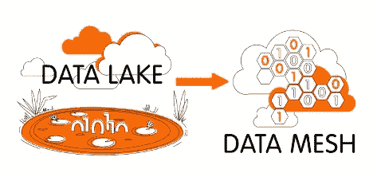
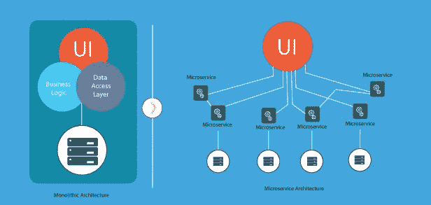
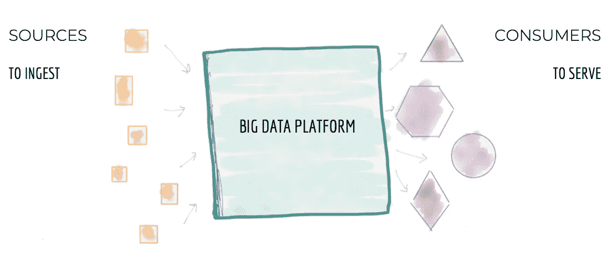
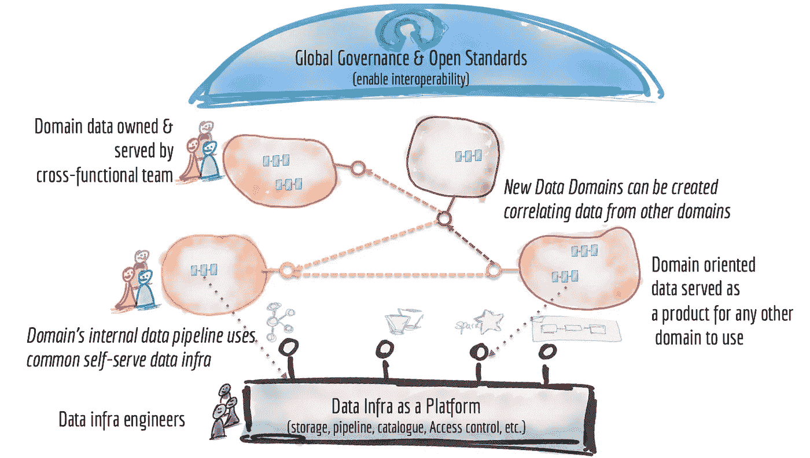
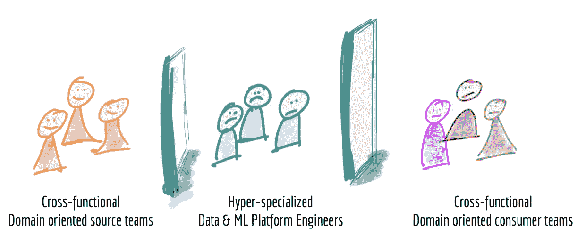
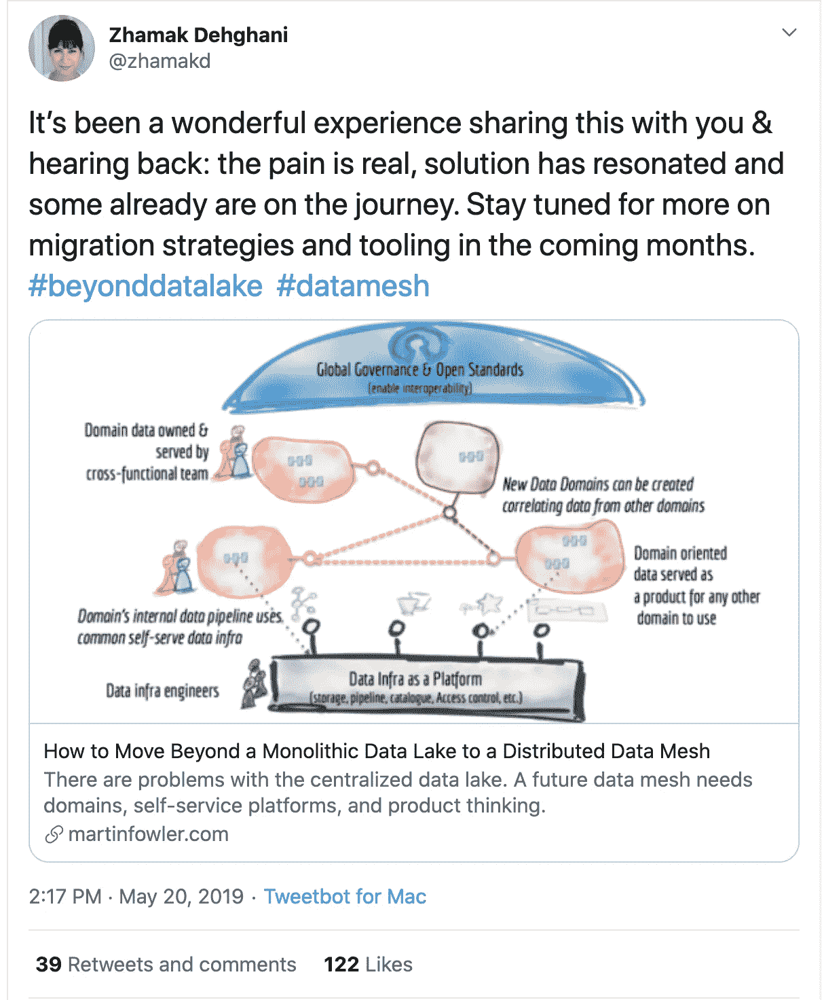

# “据我所知”的数据网格

> 原文：<https://blog.devgenius.io/data-mesh-as-i-know-it-d30d9fc1ea69?source=collection_archive---------3----------------------->

数据网格是当今数据概念的后起之秀之一，但它真正意味着什么呢？也许有一天我会在数据工程师的工作中用到这个“东西”?或者这只是另一个我在日常工作中可能不需要的花哨概念？

我们将试着一起回答这些问题，不再赘言，让我们先来为这个简短的探索奠定一些基础。

## **整体架构与微服务架构:**

在软件工程中，整体架构被认为是传统的模型，它将应用程序构建为一个独立于其他应用程序的统一单元。

这种架构对于任何项目生命周期的早期阶段都非常方便，可以简化代码开发和部署。换句话说，整块石方法允许一切立刻被释放，就像这一生中的一切一样，这种方法有它的流程，包括

*   **较慢的开发速度**——大型、单一的应用程序使开发变得更加复杂和缓慢。
*   **新技术采用** —所用技术的任何变化或升级都会影响整个应用程序，这使得决策变得昂贵而艰难。
*   **开发和部署可伸缩性** —随着系统的增长，升级单个组件将非常困难，而且对整体应用程序的任何微小更改都需要重新部署整个整体。

另一方面，微服务方法是一种依赖于一系列可独立部署的服务的架构方法。这些服务有自己的业务逻辑和数据库，并有特定的目标。更新、测试、部署和扩展发生在每个服务中。这消除了单一方法的缺点，但“一如既往”会产生新的缺点。例如:

*   **增加开发复杂性** —与整体架构相比，微服务增加了更多复杂性，因为多个团队在更多地方创建了更多服务。如果开发蔓延没有得到适当的管理，就会导致开发速度变慢，运营绩效变差。
*   **高昂的基础设施成本** —每个新的微服务都有自己的测试套件、部署行动手册、托管基础设施、监控工具等成本。
*   **调试挑战** —每个微服务都有自己的一组日志，这使得调试更加复杂。
*   **缺乏明确的所有权** —随着更多服务的引入，运行这些服务的团队数量也在增加。随着时间的推移，很难知道团队可以利用的可用服务以及联系谁来获得支持。

当然，这两个概念之间的差异的详细演示将超出本文的范围，但是我们需要知道这两种方法的简要介绍，因为这将是我们真正理解数据网格真正含义的入口。

## **什么是数据网格？**

与软件工程团队从单一方法过渡到微服务架构的方式相同，数据网格是微服务的数据平台版本。

正如 ThoughtWorks 的顾问和该术语的最初设计者 Zhamak Dehghani 所说:“数据网格是一种数据平台架构，通过利用面向领域的自助式设计，它包含了企业中无处不在的数据。借用 Eric Evans 的[领域驱动设计](https://www.domainlanguage.com/ddd/)理论，一种灵活的、可扩展的软件开发范式，将你的代码的结构和语言与其对应的业务领域相匹配”。

更简单地说，与在一个中央数据湖中处理数据的接收、存储、转换和输出的传统整体数据基础设施不同，数据网格支持分布式的、特定于域的数据消费者，并将“数据视为产品”，每个域处理自己的数据管道。连接这些域及其相关数据资产的组织是一个通用的互操作性层，它应用相同的语法和数据标准。

让我们将数据网格的主要概念归结为三个要点:

1.  **面向领域的数据所有者和管道** —数据网格在负责提供数据产品的 data domain 所有者之间分离数据所有权，同时促进不同位置的分布式数据之间的通信。
2.  **自助功能** —正如 Zhamak 所说，面向领域设计的主要关注点之一是维护每个领域中的数据管道和基础设施所需的重复工作和技能。为了解决这一问题，数据网格收集并提取与域无关的数据基础架构功能到一个中央平台，该平台处理数据管道引擎、存储和流基础架构。同时，每个域负责利用这些组件来运行定制的 ETL 管道，给予它们必要的支持来轻松地服务它们的数据，以及真正拥有该过程所需的自主权。
3.  **通信的互操作性和标准化** —每个领域的基础都是一套通用的数据标准，有助于在必要时促进领域间的协作，而且通常如此。不可避免的是，一些数据(原始数据源和经过清理、转换和服务的数据集)对多个领域都有价值。为了支持跨域协作，数据网格必须对格式、治理、可发现性和元数据字段以及其他数据特性进行标准化。此外，就像单个微服务一样，每个数据域都必须定义并同意它将向其消费者“保证”的 SLA 和质量措施。

## **我需要使用数据网格吗？**

到目前为止，许多公司利用连接到许多商业智能平台的单个数据仓库。这种解决方案经常导致由一小组数据工程师维护中央管道的大量技术债务，这在组织的数据平台中造成了瓶颈。

对于许多组织来说，数据整体架构有许多流程，包括:

*   中央 ETL 管道使数据工程团队对不断增长的数据量的控制更少。
*   不同的数据用例需要不同类型的转换，这给中央平台带来了沉重的负担。

这种集中的数据湖会导致数据生产者脱节、数据消费者失去耐心，更糟糕的是，积压的数据工程团队难以跟上业务需求的步伐。相反，面向领域的数据架构，比如数据网格，给团队带来了两个世界的好处:一个集中的数据库(或者一个分布式数据湖),域(或者业务区域)负责处理他们自己的管道。[正如 Zhamak 所说](https://martinfowler.com/articles/data-monolith-to-mesh.html#DomainDataAsAProduct)，数据架构可以通过分解成更小的、面向领域的组件来最容易地扩展。

简而言之，您公司的数据基础设施需求越复杂、越苛刻，您的组织就越有可能从数据网格中受益。

## **资源:**

*   [微服务与整体架构](https://www.atlassian.com/microservices/microservices-architecture/microservices-vs-monolith)
*   [什么是数据网格——以及如何不对其进行网格划分](https://www.montecarlodata.com/blog-what-is-a-data-mesh-and-how-not-to-mesh-it-up/)
*   [如何从单一数据湖转移到分布式数据网格。](https://martinfowler.com/articles/data-monolith-to-mesh.html)
*   [为什么 Zalando 要过渡到数据网格](https://databricks.com/session_na20/data-mesh-in-practice-how-europes-leading-online-platform-for-fashion-goes-beyond-the-data-lake)？