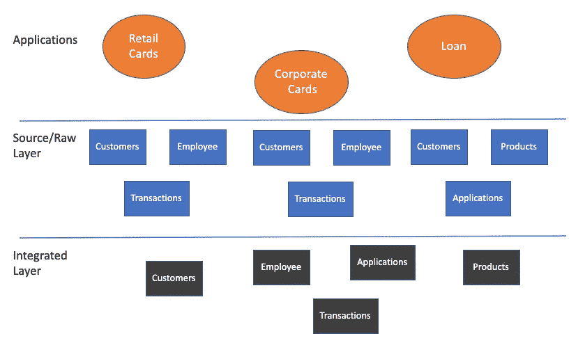
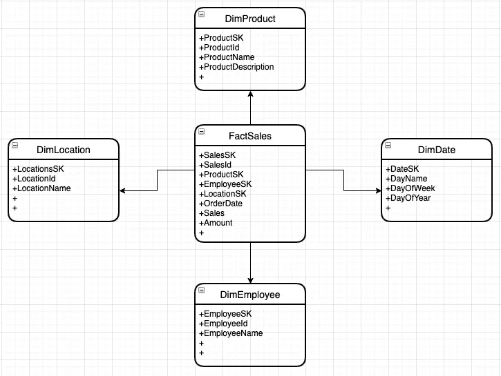
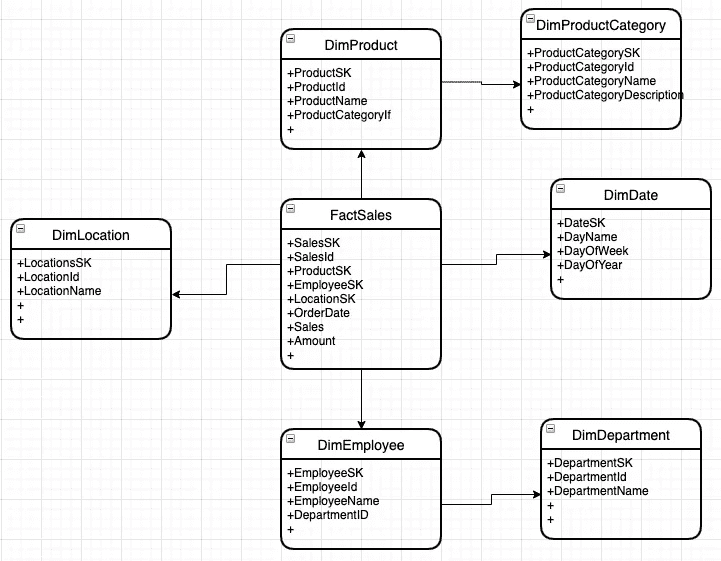

# 数据仓库和数据集市中的数据建模

> 原文：<https://blog.devgenius.io/data-modelling-in-data-warehouse-and-data-mart-257a2948d38?source=collection_archive---------0----------------------->

数据建模不同于传统的应用程序数据建模设计。

[万花筒](https://unsplash.com/@kaleidico?utm_source=medium&utm_medium=referral)在 [Unsplash](https://unsplash.com?utm_source=medium&utm_medium=referral) 上拍摄的照片

数据建模是设计数据仓库的详细和概括信息的模式的过程。数据仓库建模的目标是开发一个描述现实的模式，或者至少是数据仓库需要支持的事实的一部分。

数据建模可以在两种不同的上下文中解释，一种是在应用程序数据库设计中，另一种是在数据仓库设计中。尽管在高层次上，两者都涉及数据的存储方式及其关系，但在数据的存储和使用/消费方式上有很大的不同。在本文中，我们将在数据仓库的上下文中讨论数据建模。

# 通用数据建模阶段:

提到了可以进行数据建模的不同环境，有 3 种通用的建模技术。这些不是相互替代的，而是更像是设计完整工作数据模型的阶段/过程。

**概念数据建模:**这是一个“大图”模型，它代表了数据计划的整体结构和内容，而不是细节。它是数据建模的典型起点，识别组织中的各种数据集和数据流。

**逻辑数据建模:**它与“数据模型”的一般定义关系最为密切，因为它描述了数据流和数据库内容。逻辑模型向概念模型中的整体结构添加了细节，但不包括数据库本身的规范，因为该模型可以应用于各种数据库技术和产品。

**物理数据建模:**物理数据库模型描述了如何实现逻辑模型的细节。它必须包含足够的细节，使技术人员能够在硬件和软件中创建实际的数据库结构，以支持将使用它的应用程序。

# 数据仓库中的数据建模:

谈到数据仓库中的数据建模，主要有两种数据模型。

**企业数据模型:**

企业数据模型是整个组织中生产和消费的数据的集成视图。它包含了适当的行业视角。企业数据模型(EDM)代表数据的单一集成定义，不受任何系统或应用程序的影响。

该数据模型由两层组成，源/原始层和集成层。

***源/原始层数据模型:***

在这一层，来自整个组织的所有来源的数据将被带入，而不管它们属于哪个部门。数据模型将与源应用程序数据库中的数据模型非常相似，只是有一些细微的差别。因为存储可能不是 RDBMS 系统，而是像 Hadoop、S3 等分布式存储系统。此外，由于将有应用于数据存储的 SCD 逻辑，主键/引用键约束可能不被维护。但是，会有一个代理键将用于建立表之间的唯一性和关系。

***集成图层数据模型:***

数据集成层包含最低粒度的数据，这些数据在统一和一致的数据集中结合了整个组织的多个来源。这消除了分布在不同应用程序/部门(如客户、员工、产品等)的相同数据的模糊性。因此，它被称为企业级数据的黄金来源。

下面是一个 EDM 图示例:

**数据集市或维度数据模型:**

众所周知，数据集市由数据集组成，数据集是数据仓库的一个子集，它是通过使用数据仓库或直接从相关的源系统获取数据，或者组合来自仓库和源系统的数据而创建的。此外，由于创建数据集市是为了解决特定部门或用例的特定问题，因此所遵循的数据建模会有所不同，这被称为维度数据建模。

***构件的尺寸数据建模:***

1.  **维度:**维度是包含一个或多个业务度量数据的信息分类。
2.  **事实:**事实是测量、度量、事务等的集合。，来自不同的业务流程。
3.  **属性/度量:**属性是维度表的元素。
4.  **事实表:**事实表用于存储业务中的措施或交易。
5.  **维度表:**维度表存储来自业务的维度，并为事实建立上下文。

***维度数据建模中的维度类型:***

在处理维度数据建模时，有 9 种类型的维度/指标。它们在下面给出，关于它们的进一步细节可以在所附的参考文献中找到:

*   符合尺寸。
*   悬臂梁尺寸。
*   缩小的尺寸。
*   角色扮演维度。
*   维度到维度表。
*   垃圾维度。
*   退化维度。
*   可切换维度。
*   步长尺寸。

***以下是尺寸数据建模的步骤:***

**确定业务流程:**这是建立维度模型的第一步，首先要弄清楚为什么要建立这个数据集市。因为这将给出关于我们试图解决什么业务问题以及需要什么维度和事实数据集的精确信息。

**识别颗粒:**这是识别数据中可以实现多少标准化(最低级别的信息)的过程。

**确定维度:**维度是维度数据建模过程中的关键组成部分。它包含关于对象的详细信息，如日期、商店、姓名、地址、联系人等。

**识别事实:**这是应该与相关维度链接的度量/事务。

**构建模式:**这是将确定的维度和事实具体化到模式/表中的最重要的步骤。这可以通过以下两种方式实现:

***星形模式:***

这是维度数据建模的最基本形式。在星型模式中，事实表围绕着一系列维度表。每个维度代表一个维度表。这些维度表没有完全标准化。在这个模式中，维度表将包含一组描述维度的属性。下面是一个例子:

***雪花模式:***

雪花模式是星型模式的扩展，包含更多维度。与星型模式不同，维度是完全规范化的，并被分解到更多的表中。这个模式使用较少的磁盘空间，因为它们已经被规范化了。向该模式添加维度很容易，并且由于复杂的模式设计，数据冗余也较少。下面是一个例子:

**数据建模的优势:**

1.  质量更高。
2.  降低成本。
3.  更快的上市时间。
4.  更清晰的范围。
5.  更快的性能。
6.  更好的文档。
7.  数据错误更少。
8.  可控风险。

总之，数据建模是建立数据仓库和数据集市的基础。当数据建模正确完成时，这些数据存储的价值和结果将如预期的那样。希望这篇文章给出所需的细节。

参考资料:

https://www . data bricks . com/blog/2022/06/24/data-warehousing-modeling-techniques-and-these-implementation-on-the-the-data bricks-lake house-platform . html

[https://medium . com/nerd-for-tech/fundamental-data-modeling-and-data-warehousing-b 599183d 998 a](https://medium.com/nerd-for-tech/fundamental-data-modeling-and-data-warehousing-b599183d998a)

[https://www . Java point . com/Data-warehouse-modeling #:~:text = Data](https://www.javatpoint.com/data-warehouse-modeling#:~:text=Data)仓库建模是必须的，需要仓库来支撑。

[https://www . astera . com/type/blog/data-modeling-for-data-warehouse/](https://www.astera.com/type/blog/data-modeling-for-data-warehouse/)

[https://www . phdata . io/blog/how-to-model-and-choose-the-right-data-model/](https://www.phdata.io/blog/how-to-model-and-choose-the-right-data-model/)

[https://www . Alibaba cloud . com/topic-center/knowledge/3/gddtqgvwfj-what-is-a-integrated-data-model](https://www.alibabacloud.com/topic-center/knowledge/3/gddtqgvwfj-what-is-an-integrated-data-model)

[数据模型有很多好处——以下是其中的 10 个——数据多样性](https://www.dataversity.net/data-models-many-benefits-10/)

[https://hevodata.com/learn/dimensional-data-modelling/](https://hevodata.com/learn/dimensional-data-modelling/)

 [## 通过我的推荐链接加入媒体

### 阅读 Gururaj Kulkarni(以及媒体上成千上万的其他作家)的每一个故事。您的会员费直接…

medium.com](https://medium.com/membership/@guru.nie)