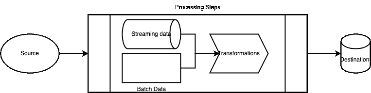

# 数据管道和它应该具备的所有功能？

> 原文：<https://blog.devgenius.io/data-pipeline-and-what-all-the-features-it-should-have-cfb6b30132df?source=collection_archive---------9----------------------->

让数据流动的最佳方式！！

现在我们已经学习了数据工程的基础知识和一些重要的主题，我们可以开始学习更多的实践、逻辑或面向过程的主题。首先，我们可以看看如何建立一个理想的数据管道。我们可以从定义什么是数据管道开始，架构考虑，它应该有什么特性，它与 ETL 有什么不同，以及一些例子的工具和技术。

在 [Unsplash](https://unsplash.com?utm_source=medium&utm_medium=referral) 上由 [Rodion Kutsaiev](https://unsplash.com/@frostroomhead?utm_source=medium&utm_medium=referral) 拍摄

**什么是数据管道:**

数据管道是一系列自动化、连续的数据处理步骤，涉及从源接收原始数据并将其移动到目的地。数据管道由三个要素组成:一个源、一个或多个处理步骤(大多数情况下是自动执行的)和一个目的地。这些处理步骤可以包括聚集、增加、数据转换、浓缩、过滤、分组和运行算法。

**架构考虑:**

在构建数据管道时，这也是一个大数据管道，我们需要做很多考虑，以使其更具功能性和可持续性。例如，数据是基于流还是批处理？数量是多少？我们接收的速率是多少？数据的类型/格式是什么？它是在哪里产生的？它应该去哪里？使用什么技术堆栈？将如何使用或消费？等等。

考虑到这些因素，高级体系结构如下图所示，源和目的地位于所涉及的多个处理步骤的两端。

**必须具有数据管道的特征:**

既然我们已经讨论了什么是数据管道以及什么是架构考虑因素，我们可以讨论数据管道应该具有的重要特性，以便在技术和功能上产生更大的影响。以下是其中的一些特征:

***实时数据处理和分析:*** 大部分数据管道都是基于批处理的，但是如果数据加载、转换和分析可以实时进行，那么业务部门就可以快速发现洞察并采取行动。它可以让公司意识到社交媒体的兴起、高峰和衰落，实时发现安全威胁，识别欺诈活动等。

***可扩展的云架构:*** 由于传统的数据管道缺乏灵活性和可扩展性，遵循云架构是必须具备的特性。公司可以根据要处理和分析的数据的趋势来添加或删除资源。

***容错架构:*** 数据管道应能容忍数据在静止或传输过程中可能发生的任何故障。它应该具有复制、警报和自动故障转移机制，以确保数据始终可用，如果节点在处理或分析时出现故障，应该可以恢复，并具有适当的警报以发现潜在问题。

***恰好一次处理(E1P):*** 这是确保在防止数据丢失和复制数据方面保持平衡的另一个重要特征。它应该具有高级检查点功能，确保没有事件被遗漏或处理两次，因为它跟踪处理的事件，以及它们在各种数据管道中的传输距离。

***自助服务管理:*** 此功能与运营和可维护性相关，因为我们知道添加任何新的资源、新的处理步骤或与外部系统和服务集成是多么费时费力。因此，如果数据管道可以使用工具和自动化流程使其能够自助服务，那么它将为数据工程师节省大量时间，并且也可以使非技术成员做出贡献。

***处理大量数据(各种格式):*** 由于进入仓库的大部分数据要么是非结构化的，要么是具有各种格式的半结构化数据，因此管道应该有足够的处理能力。

***精简的数据管道开发:*** 由于我们在应用/软件开发中有 devops，我们需要在数据管道中有一个数据 ops。使用适当的技术和流程来缩短开发和部署时间。简化管道开发和部署使得修改或扩展管道以适应新的数据源变得更加容易。

**数据管道与 ETL 有何不同:**

我们经常混淆 ETL 和数据管道，并交替使用这两个术语，但它们之间有一点点不同。ETL 是一个从数据源提取数据、根据需要转换数据并将其加载到目的地的过程。数据管道是一个更通用的术语，指的是将数据从源移动到目的地的任何处理步骤，无论是否经过转换。

**数据管道中使用的一些工具和技术:**

基于数据工程能力，组织可以选择使用第三方数据管道工具，如 Stitch、Keboola、Hevo Data 等。或者建造他们自己的。无论哪种方式，主要需要以下工具和技术:

1.  诸如 Tivoli 或 Autosys 之类的调度工具来触发工作流。
2.  数据提取工具，如 Sqoop，Flume 等。
3.  有安全的 SFTP 批处理或使用消息工具，如 Kafka，RabbitMq 从基于流的数据传输。
4.  有端到端的工作流工具，如气流，Luigi，AWS 步骤功能等。
5.  Spark、Map Reduce 等数据处理引擎。
6.  您将需要度量、日志和跟踪的监控工具来确保它按预期工作。

**数据管道示例:**

一些示例数据管道如下:

1.  从所有应用程序中提取关于客户、产品、交易数据、静态参考数据的数据，以构建用于报告和分析的数据仓库。
2.  提取患者数据、疾病及其症状、医院详情、医生专业知识等，以探索弱点、医药创新、研究等
3.  从社交媒体、观众和读者的兴趣、好恶等方面提取数据，以建立分析和推荐模型。

总之，数据工程就是要建立有效和可持续的数据管道，因为没有这一点，就没有办法将数据放入数据仓库。无论是基于批处理还是基于流，都应该相应地选择工具和技术。有很多选项，也必须有功能，所以选择选项是很重要的，这些选项必须有复选框。希望这能让你对数据管道有一个很好的理解。感谢您的参与，请分享您的意见和评论，以便在必要时进行改进。

参考资料:

[https://www . striim . com/blog/what-a-data-pipeline-and-must-have-features-of-Modern-data-pipelines/#:~:text = Modern](https://www.striim.com/blog/what-is-a-data-pipeline-and-must-have-features-of-modern-data-pipelines/#:~:text=Modern)数据管道应该加载消息系统%2C 和日志文件。

【https://hazelcast.com/glossary/data-pipeline/ 

[https://www.heavy.ai/technical-glossary/data-pipeline](https://www.heavy.ai/technical-glossary/data-pipeline)

[https://www . integrate . io/blog/ETL-pipeline-vs-data-pipeline/](https://www.integrate.io/blog/etl-pipeline-vs-data-pipeline/)。

[https://www . project pro . io/article/data-pipeline-definition-architecture-examples/528](https://www.projectpro.io/article/data-pipeline-definition-architecture-examples/528)。

 [## 通过我的推荐链接加入媒体

### 阅读 Gururaj Kulkarni(以及媒体上成千上万的其他作家)的每一个故事。您的会员费直接…

medium.com](https://medium.com/membership/@guru.nie)