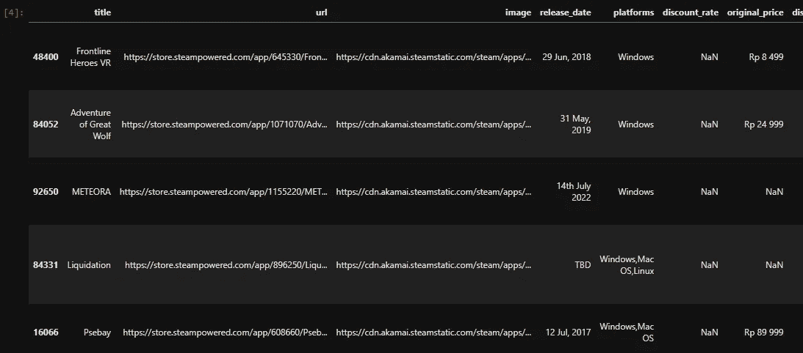
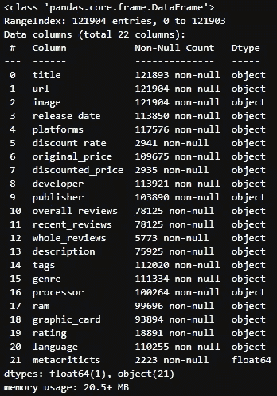
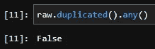

# Steam 数据集的数据预处理

> 原文：<https://blog.devgenius.io/data-preprocessing-of-steam-dataset-8522524a7c72?source=collection_archive---------10----------------------->

## 从原始数据和脏数据到干净数据


照片由 [**米卡鲍梅斯特**](https://unsplash.com/@mbaumi) **上**[**Unsplash**](https://unsplash.com/)

在我的上一篇文章中，我对使用 Python、Scrapy 和 VS 代码收集的 Steam 数据集进行了分析。在我进行分析之前，数据仍然是原始的，有许多缺失值、错误的数据类型等。在本文中，我将展示如何清理和预处理用于分析的数据

# 导入库并加载数据集

首先，我导入了预处理和分析数据所需的所有库。

```
import pandas as pd **#to read the file and manipulate data**
import numpy as np **#powerful libary to do mathematical equation**
import matplotlib.pyplot as plt **#basic data visualization**
import seaborn as sns **#visualization style based on matplotlib**
import re **#regular expression to filter strings**raw = pd.read_csv('steam_games.csv') #
raw.sample(5)
```



数据集的样本

# 数据理解

在我开始对数据进行预处理之前，我必须先了解数据。通过理解数据，我可以决定需要为每一列(或特性)做哪种预处理。

```
raw.info()
```



数据集信息

*   几乎所有的特征都在`object` 中，尽管其中一些实际上是`integer,`我将纠正每个特征的数据类型
*   `url`、`image`、`discount_rate`、`discounted_price`、`description, processor`和`graphic_card` 将不会在此数据分析中使用，因此我将删除所有这些特性
*   `release_date`:提取月份和年份
*   `original_price`:更改数据类型(提取价格)
*   `text_reviews :`提取评分(`user_rating`)和总用户评论(`total_reviews`)
*   `language :`提取支持的语言数量(`language`
*   `metacriticts :`缺少太多值。该功能将被删除

# 检查重复的行

重复的数据会给出错误的分析，这就是为什么我们必须首先删除它们。让我们使用这个简单的代码来检查数据集

```
raw.duplicated().any()**#This will return boolean value**
```



它返回`False`，这意味着没有重复的行。但是，如果确实有重复的行，我们可以使用下面的代码来删除它

```
raw.drop_duplicates(inplace=True)
```

# **移除未使用的列**

不是每个列都可以用于分析，例如，我们不能从`url` 和`image`中提取任何信息。因此，我们将删除一些不会在此分析中使用的列。我总是试图为每一步设置检查点，这就是为什么我会在进行任何更改之前创建一个包含原始数据集副本的新变量。

```
df_drop = raw.copy()
drop = ['url','image','discount_rate','discounted_price','description','metacriticts','processor','graphic_card'] 
df_drop = df_drop.drop(labels=drop,axis=1)
```

# 数据提取和格式化

## 提取月份和年份

我们提取的第一个特征将是来自`release_date.` 的`month`和`year`，未处理的发布日期看起来像这个`25 Mar, 2015`，使用`pandas.Series.str.findall('(\d+)')`我们可以提取所有的数字，但是正如我们可以看到的，除了年份之外还有另一个数字，它是日期数字，这意味着它将返回一个列表而不是单个元素。这就是为什么我将创建另一个函数来提取有 4 个数字的元素。

```
def extract_year(x): **#function to extract year from list of numbers**
    year = None
    if type(x) == list:
        for i in x:
            if len(i) == 4:
                year = i
                return year
            else: 
                year = None
        return year
    else:
        year = x
    return yeardf_extract = df_drop.copy()df_extract['year'] = df_extract['release_date'].str.findall('(\d+)').apply(lambda x: extract_year(x)).astype(float)
```

为了提取月份，我们将使用`pandas.Series.str.findall(“[a-zA-Z]+”).str[0]`。它将从字符串对象中提取所有的字母。有些行具有不同的格式，例如，它们没有写出月份的缩写，如 Jan、Feb 和 Mar，而是写出整个单词，如 August 和 June，我们必须更改该值，以便所有行都具有相同的格式。我们将使用`pandas.DataFrame.replace() it` 来修复错误的值。然后我们还必须将没有发布日期的行更改为`None`。我们要做的最后一件事是删除原来的`release_date` 列。

```
df_extract['month'] = df_extract['release_date'].str.findall("[a-zA-Z]+").str[0]df_extract['month'] = df_extract['month'].replace(['August','June'],['Aug','Jun'])month = ['Jan','Feb','Mar','Apr','May','Jun','Jul','Aug','Sep','Oct','Nov','Dec']df_extract.loc[~df_extract['month'].isin(month),'month'] = None
df_extract = df_extract.drop('release_date', axis=1) 
```

## 提取用户评级和总评论

我们进行的第二次提取将是`user_rating_all`和`total_review_all`。原列`whole_reviews` 长这样`86% of the 469,045 user reviews for this game are positive`。像前面的提取一样，我们将使用`pandas.Series.str.findall(‘(\d+)’)` ，但是我们必须首先使用`pandas.DataFrame.replace(',', '')`删除评论数量中的逗号

```
df_extract_2 = df_extract.copy()
df_extract_2['whole_reviews'] = df_extract_2['whole_reviews'].str.replace(',','')
df_extract_2['user_rating_all'] = df_extract_2['whole_reviews'].str.findall('(\d+)').str[0].astype(float)
df_extract_2['total_review_all'] = df_extract_2['whole_reviews'].str.findall('(\d+)').str[1].astype(float)
df_extract_2 = df_extract_2.drop('whole_reviews',axis=1)
```

## 提取支持的语言数量

接下来，我们将提取游戏或`supported_language`支持的语言数量。`language` 的原列是这样的`English,Simplified Chinese`。我们使用的方法是使用`pandas.Series.str.split(',')`将值分割成一个列表，然后计算列表中元素的数量。

```
df_extract_3 = df_extract_2.copy()
df_extract_3['supported_language'] = df_extract_3['language'].str.split(',').apply(lambda x: len(x) if type(x) == list else x)
df_extract_3 = df_extract_3.drop('language',axis=1) 
```

## 提取价格

列`original_price`的原始值是这样的，`Rp 108 999.`我们将删除所有的字母和空格，然后将数据类型更改为`float`。但是因为 float 不能处理丢失的值，所以我们把丢失的值变成了`0`。

```
df_price = df_extract_3.copy()
df_price[‘price’] = df_price[‘original_price’].str.lower().str.replace(r’\D’,’’).astype(int,errors=’ignore’)
df_price.loc[df_price[‘price’]==’’,’price’] = 0
df_price[‘price’] = df_price[‘price’].astype(float)
df_price = df_price.drop(‘original_price’,axis=1)
df_price.sample(5)
```

## 提取年龄评级

`rating`的初始值是一个图片 URL，看起来像这个`[https://store.akamai.steamstatic.com/public/shared/images/game_ratings/PEGI/16.png](https://store.akamai.steamstatic.com/public/shared/images/game_ratings/PEGI/16.png).`，从那个字符串中，我们可以去掉所有的字母和符号，得到`age_rating`。

```
df_pegi = df_price.copy()
df_pegi['age_rating'] = df_pegi['rating'].str.replace(r'\D','')
df_pegi = df_pegi.drop('rating',axis=1) 
```

## 制作新列(Windows、Mac、Linux 和 VR)

对于 OS 和 VR 可用性，我们将创建一个具有布尔值的新列。使用`numpy.where`我们可以创建 4 个新列。例如，如果游戏支持 Windows，则`windows`的值为“1 ”,否则为“0”。原始值是这样的`Windows, Mac OS, Linux`

```
df_platform = df_pegi.copy()
df_platform['windows'] = np.where(df_platform['platforms'].str.contains('Windows',na=False), 1, 0)
df_platform['mac'] = np.where(df_platform['platforms'].str.contains('Mac OS',na=False), 1, 0)
df_platform['linux'] = np.where(df_platform['platforms'].str.contains('Linux',na=False), 1, 0)
df_platform['VR'] = np.where(df_platform['platforms'].str.contains('VR Supported',na=False), 1, 0)
df_platform = df_platform.drop('platforms',axis=1) 
```

## 重新映射列 RAM 的值

列`ram`的值变化太大，这就是为什么我们必须检查每个不同的值并正确标记它们。例如，一些值看起来像这样`6 gb` 和`6000 mb`，尽管它们看起来不同，但它们实际上是相同的，这就是为什么我们必须将它们标记在一起。我不会把所有的代码都放在这里，因为它很长，但是如果有人想看完整的代码，我会给出 GitHub 回购的链接

`df_ram = df_platform.copy()
df_ram.loc[df_ram[‘ram’].str.lower().str.contains(‘8 gb|8000 mb|８ gb|8gb|8.0 gb|8\+ gb’, na=False),’ram’] = ‘8 GB’
df_ram.loc[df_ram[‘ram’].str.lower().str.contains(‘4 gb|4096 mb|4000 mb|4gb|４ gb|4.00 gb|4g|4 ram gb’, na=False),’ram’] = ‘4 GB’
df_ram.loc[df_ram[‘ram’].str.lower().str.contains(‘2 gb|2048|2000 mb|2gb|1536 mb|2.0 gb|2000 gb|２ gb|1.5gb|2.0gb|2g’, na=False),’ram’] = ‘2 GB’
df_ram.loc[df_ram[‘ram’].str.lower().str.contains(‘1 gb|1024|1000 mb|1gb|800 mb|750 mb|1280 mb|700 mb|900 mb|１ gb|1\+’, na=False),’ram’] = ‘1 GB’`

这是我在数据分析之前做的一些预处理。完整的代码可以在这里访问[。](https://github.com/triesonyk/data-analysis-steam-games)