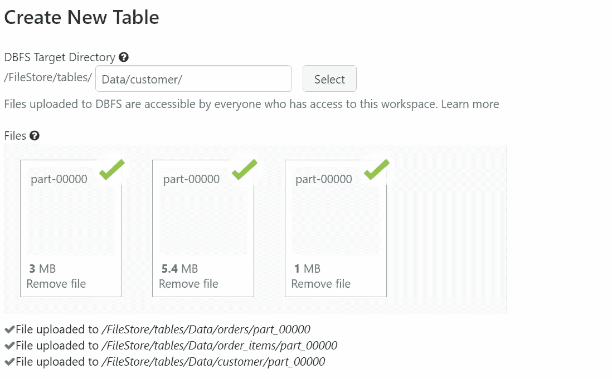

# 使用 Spark | Spark 项目-1 进行数据处理和分析

> 原文：<https://blog.devgenius.io/data-processing-and-analysis-using-spark-spark-project-1-3f52516272a7?source=collection_archive---------1----------------------->


设计概述

在这篇博文中，我们将了解如何使用 Apache Spark 在关系数据库上执行简单的操作，以获得有价值的见解。

## 问题陈述:

我们有三个 CSV 类型的数据表。我们在这些表中执行基本的连接，并创建一个不完整的数据框架，这样我们就可以在数据的基础上执行一些处理和分析。

## 数据集:

对于这个项目，我们将使用[零售数据集](https://github.com/sidharth1805/Data-Processing-and-Analysis-using-Spark-Spark-Project-1/tree/main/Data)。这些数据集由三个表组成:customer、orders 和 order_items。

## 使用的技术组合/技能:

1.  火花
2.  结构化查询语言

## 设置工作空间:

我们将使用免费的 Databricks Community Edition 来执行 spark 操作，如果您更喜欢在本地或 Hadoop 集群中使用 Spark，也没问题。

参考:【https://www.databricks.com/product/faq/community-edition】T4

设置工作区后，创建一个集群并打开一个工作簿。你已经准备好出发了。

## 项目:

现在是时候将我们的数据添加到数据块中了。


通过创建适当的文件夹上传数据在下面的例子中，我创建了一个文件夹数据，在它下面我创建了一个文件夹订单并上传了数据文件。



既然我们已经完成了在数据块中设置数据，现在是时候写一些代码了。

**步骤 1:** 检查是否所有需要的文件都已放置

```
%fs ls dbfs:/FileStore/tables/Data
```


**步骤 2:** 为订单、order_items 和客户创建数据框架。我们使用的 CSV 文件没有模式，因此在创建数据框时我们定义了模式。

**第三步:**查看数据帧

```
order_items_df.show(2)
```


**步骤 4:** 将我们的表连接到一个新的数据框架(oreder_details)中，以创建一个非规范化的数据框架。

*   最初连接客户和订单表。

```
customers_orders_df=customer_df.join(orders_df,customer_df['customer_id']==orders_df['order_customer_id'])
```

*   使用 SELECT 子句投影所需的数据。

```
customers_orders_df.select('customer_id','order_id','order_date','order_status').orderBy('customer_id').show(10)
```


*   将 order_id、order_date 和 order_status 合并为结构化数据类型。

```
from pyspark.sql.functions import structcustomers_orders_df.select('customer_id',struct('order_id','order_date','order_status').alias('order_details')).orderBy('customer_id').show(10)
```


*   生成一个结构数组。使用 order_details 字段。这里我们将 customer_id 分组，并以数组的形式存储 order_details。

```
customer_order_struct=customers_orders_df.select('customer_id',struct('order_id','order_date','order_status').alias('order_details'))from pyspark.sql.functions import collect_listfinal_df=customer_order_struct.groupBy('customer_id').agg(collect_list('order_details').alias('order_details')).orderBy('customer_id')
```


**第五步:**将数据帧导出到 JSON 文件中。

```
final_df.coalesce(1).write.json('dbfs:/FileStore/tables/Data/final')
```


之前，我们已经对订单和客户进行了反规范化。现在我们将为三张桌子表演。

将数据框导出到 JSON 文件中。

```
denorm_df.coalesce(1).write.json('dbfs:/FileStore/tables/Data/denorm')
```

现在我们有了进行分析所需的数据。现在是使用 Spark 分析反规范化数据的时候了。

我们将对我们的数据进行以下分析

1.  获取客户在 2014 年 1 月 1 日下的订单的详细信息
2.  计算每月客户收入

## 问题陈述— 1:

读取数据帧。

```
json_df=spark.read.json('dbfs:/FileStore/tables/Data/denorm/part-00000-tid-4357456608139543307-49cdb4fe-37a2-4435-be01-b6711f29eb3d-211-1-c000.json')json_df.show(2)
```


```
json_df.select('customer_id','customer_fname',explode('order_details').alias('order_details')). \
filter('order_details.order_date LIKE "2014-01-01%"'). \
orderBy('customer_id'). \
select('customer_id','customer_fname','order_details.order_id','order_details.order_date','order_details.order_status'). \
show(10)
```


## 问题陈述— 2:

*   为了计算每月的客户收入，我们需要对 order_items 表中的 order_item_subtotal 执行聚合(SUM)。
*   在我们的输入数据中，我们已经将所有的细节包装到一个 struct 数据类型中，因此是时候展平所有的细节了。


*   展平数据后，让我们编写逻辑来获得月收入


这个项目将让你了解如何去规格化数据表，并使用 Spark 在数据上执行分析。这里请参考。