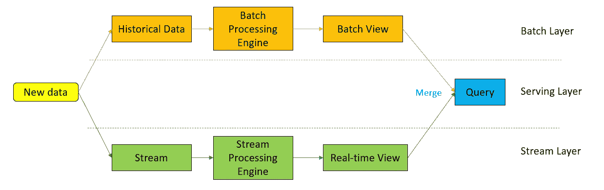

# 数据处理架构

> 原文：<https://blog.devgenius.io/data-processing-architectures-aaa4cd2437e?source=collection_archive---------6----------------------->

克劳迪奥·施瓦兹在 [Unsplash](https://unsplash.com/s/photos/pipelines?utm_source=unsplash&utm_medium=referral&utm_content=creditCopyText) 上的照片

λ和κ

除了更传统的数据管道之外，现代数据处理平台还需要处理实时流事件。决定正确的架构，Lambda 或 Kappa 是迈向良好平台战略的重要一步。

# 数据处理架构的设计目标:

*   读取一致的数据
*   从大型表/数据集中增量读取
*   反转
*   回放历史事件的能力
*   数据迟到的处理

让我们来看看这两种架构。

# 希腊字母的第 11 个

Lambda 架构是一种处理大数据的混合(流和批处理)方法。lambda 架构本身由 3 层组成:

*   批处理图层-定期处理数据
*   流图层-处理不包括在最后一个批处理窗口中的数据
*   服务层—从批处理和流中获取数据的统一层

## 赞成的意见

*   Lambda 架构的批处理层是容错的，因为它使用分布式存储。
*   它在速度和可靠性之间取得了平衡。
*   因为流和批处理是分开的，所以我们可以分别对它们进行缩放。

## 骗局

*   编码开销。
*   它会在下一个批处理周期重新处理流中的数据。
*   难以迁移。

# 卡帕

Kappa 架构被认为是 Lambda 架构的更简单版本。

> 在卡帕，一切都是溪流。

Kappa 架构通过单一技术堆栈(流)执行实时和批处理。在这个设计中，传入的一系列数据首先存储在一个消息引擎中，比如 Apache Kafka(也可以使用类似的工具，比如 Pulsar、Kinesis 和 EventHub)。流处理引擎将读取数据并将其转换为所需的格式，然后将其存储在分析数据库中供最终用户查询。

在 Kappa 架构中，读取和写入是分离的。读写模型只是一个投影。

## 赞成的意见

*   由于使用了单个处理堆栈，代码开销更少
*   没有事件的重复处理
*   查询只需要查看单一视图，无需创建统一视图。
*   Kappa 架构已在 Twitter、优步、网飞、迪士尼和 Shopify 等公司实施。因此，从良好的文档和实践经验开始。

## 骗局

*   需要复杂的设置来处理重复事件、交叉引用事件或维护顺序。
*   困难的回填，但有了像 Iceberg 这样的新表格格式，就简单了。
*   需要实现一个全局水印。
*   通常的元数据解决方案不能用于治理。

Kappa 不是 Lambda 的替代品，它是批处理层的活动性能不需要满足标准服务质量的情况下的替代方案。在大多数情况下，您将从 lambda 层开始，并剥离一些最适合 Kappa 架构的用例。