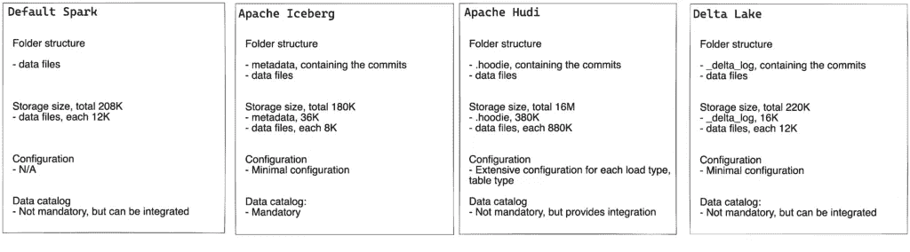

# 使用 Spark 进行数据处理:酸性合规性

> 原文：<https://blog.devgenius.io/data-processing-with-spark-acid-compliance-be89464073d9?source=collection_archive---------5----------------------->

在之前的 Spark 文章中，我讲述了如何[设置 Spark](https://ownyourdata.ai/wp/data-processing-with-spark-intro/) ，如何设置 [Hive 数据目录](https://ownyourdata.ai/wp/data-processing-with-spark-data-catalog/)以及如何处理[模式演化](https://ownyourdata.ai/wp/data-processing-with-spark-schema-evolution/)。现在是时候经历 ACID 和截至 2022 年 9 月 Spark 有哪些选择:阿帕奇胡迪，三角洲湖和阿帕奇冰山。

# 酸

在*管理的*环境中数据处理的 4 个特征:

1.  原子数
2.  一致性
3.  隔离
4.  持久性

即使从 Spark 的文献中，也指出不尊重原子数，这影响了酸的其他特性。阅读文档区中链接的第二篇文章，它很好地解释了这种情况。

什么时候应该关心酸？在我看来，数据处理的所有步骤都不需要 ACID。在用户层，需要确保数据管理、合规性以及并发和一致的访问，ACID 是圣杯。但是，如果我们的目标是临时/暂存区，ACID 就不那么重要了，因为它不会影响流程/用户。

当我们谈到覆盖模式时，Spark 中的 ACID 被破坏了，因为 Spark 将首先删除数据，然后再写入数据。因此，本文将只关注这种保存模式。

# 概念验证设置

首先，我需要一些虚拟数据，这些数据是我随机生成的，并用 pandas 保存到磁盘上:

```
def get_some_data():     start_date = date(2021, 1, 1) end_date = date(2022, 6, 30)
    record_list = [] while start_date <= end_date:
        start_datetime = datetime(
            start_date.year, start_date.month, start_date.day, 
            random.randrange(6, 8), random.randrange(0, 59), random.randrange(0, 59)
        )
        start_kwh = 0.0
        record_list.append([start_datetime, start_kwh])
        for i in range(1, random.randrange(2, 15)):
            record_list.append(
                [
                    start_datetime+timedelta(minutes=i*45), 
                    round(i*random.uniform(1.10, 1.15), 2)
                ]
            )
        start_date = start_date + timedelta(1)

    df = pd.DataFrame(record_list)
    df.columns = ['time', 'produced_kwh']
    df.to_csv('/app/input_data/acid_example_data.txt', sep='\t', index=False)
```

为了正确展示 Spark 上的写操作，我将按报告月份对数据进行分区，并开发了两种方法:1 用于快乐流，1 用于中断 Spark:

```
def get_input_df(spark_session):
    return spark_session.read.option(
        'delimiter', '\t').option(
        'header', 'true').csv(
        'input_data/acid_example_data.txt'
    ) def get_happy_flow(df_input):
    return df_input.withColumn(
        "time", to_timestamp("time")).withColumn(
        "produced_kwh", col("produced_kwh").cast("decimal(18,2)")).withColumn(
        "reporting_date", to_date(col("time"),"yyyy-MM-dd")).withColumn(
        "reporting_month", date_format(col("reporting_date"),"yyyyMM")) def get_error_flow(df_input):
    return df_input.withColumn(
        "produced_kwh", col("produced_kwh").cast("decimal(18,2)")).withColumn(
        "reporting_date", to_date(col("time"),"yyyy-MM-dd")).withColumn(
        "reporting_month", date_format(col("reporting_date"),"yyyyMM"))def get_data(spark_session, flow_type):
    df_input = get_input_df(spark_session)
    if flow_type == 'error':
        df_input = get_error_flow(df_input)
    else:
        df_input = get_happy_flow(df_input)

    return df_input
```

记住:Spark 是惰性的，所以 get_error_flow 在删除后会失败，因为时间戳不匹配。

# 默认火花设置

如何获得默认的 spark 会话:

```
def get_default_spark_session():
    spark_session = SparkSession.builder.appName('default').config(
        'spark.ui.enabled', 'false').getOrCreate()
    spark_session.sparkContext.setLogLevel('ERROR')
    return spark_session
```

加载数据:

```
def load_default_spark(flow_type='happy'):
    spark_session = get_default_spark_session()
    df_input = get_data(spark_session, flow_type) df_input.write.\
        partitionBy("reporting_month").\
        mode('overwrite').\
        format('parquet').\
        save(path)
```

读取数据:

```
def read_data():
    spark_session = get_default_spark_session()

    number_of_records = spark_session.read.\
        format('parquet').\
        load(path).\
        count() print(f"Number of records: {number_of_records}") spark_session.read.\
        format('parquet').\
        load(path).\
        filter("reporting_date = '2022-03-01'").\
        show()
```

那么快乐流上发生了什么？

```
In [1]: from acid.data_processing_acid_default_spark import load_default_spark, read_dataIn [2]: load_default_spark('happy')

In [3]: read_data()
Number of records: 4481
+-------------------+------------+--------------+---------------+
|               time|produced_kwh|reporting_date|reporting_month|
+-------------------+------------+--------------+---------------+
|2022-03-01 07:25:20|        0.00|    2022-03-01|         202203|
|2022-03-01 08:10:20|        1.11|    2022-03-01|         202203|
+-------------------+------------+--------------+---------------+
```

关于错误的那一个呢？

```
In [4]: load_default_spark('error')
22/09/22 09:20:18 ERROR Executor: Exception in task 0.0 in stage 10.0 (TID 14)
org.apache.spark.SparkUpgradeException: You may get a different result due to the upgrading to Spark >= 3.0: Fail to parse '2021-01-01 07:54:21' in the new parser. You can set spark.sql.legacy.timeParserPolicy to LEGACY to restore the behavior before Spark 3.0, or set to CORRECTED and treat it as an invalid datetime string.In [5]: read_data()
AnalysisException: Unable to infer schema for Parquet. It must be specified manually.
```

上述错误是由于路径中不再有数据这一事实造成的，因为 Spark 首先删除了数据，然后试图写入新数据。因此，原子性特征没有得到尊重，我们丢失了数据和一致性。

在我写这篇文章的时候，围绕着 data lakehouse 和 Spark 是否比其他数据库技术更好还有争议。我承认我更喜欢数据库，因为在 Spark 用 null 替换数据的情况下，它们会在 write 时失败。但我确实认为它们可以结合起来创建一个强大的数据平台，以备不时之需！


启用 ACID for Spark 的实用程序还附带了其他功能:插入、删除和时间旅行。在本文中，我将介绍每个实用程序所需的设置，但重点是测试原子性。

# 阿帕奇胡迪

如何与胡迪产生火花？我们需要确保在我们的会话中拥有 jar 依赖性以及胡迪特定的配置:

```
def get_hudi_spark_session():
    spark_session = SparkSession.builder.appName('hudi').config(
        'spark.ui.enabled', 'false').config(
        'spark.jars.packages', 'org.apache.hudi:hudi-spark3.3-bundle_2.12:0.12.0').config(
        'spark.serializer', 'org.apache.spark.serializer.KryoSerializer').config(
        'spark.sql.catalog.spark_catalog', 'org.apache.spark.sql.hudi.catalog.HoodieCatalog').config(
        'spark.sql.extensions', 'org.apache.spark.sql.hudi.HoodieSparkSessionExtension').getOrCreate()
    spark_session.sparkContext.setLogLevel('ERROR')
    return spark_session
```

加载数据:

```
def load_hudi_spark(flow_type='happy'):
    spark_session = get_hudi_spark_session()
    df_input = get_data(spark_session, flow_type)

    hudi_options = {
        'hoodie.table.name': 'acid_hudi_spark',
        'hoodie.datasource.write.recordkey.field': 'time',
        'hoodie.datasource.write.partitionpath.field': 'reporting_month',
        'hoodie.datasource.write.table.name': 'acid_hudi_spark',
        'hoodie.datasource.write.operation': 'insert_overwrite',
        'hoodie.datasource.write.precombine.field': 'time',
        'hoodie.upsert.shuffle.parallelism': 2,
        'hoodie.insert.shuffle.parallelism': 2,
        'hoodie.datasource.write.hive_style_partitioning': 'true'
    } df_input.write. \
        options(**hudi_options). \
        mode("append"). \
        format("hudi"). \
        save(path)
```

请注意，胡迪需要处理大量的配置:

1.  记录键，这是主键
2.  分区路径，要分区的字段
3.  写操作，可以是 upsert、bulk_insert 等
4.  预组合字段，对于时间旅行和重复数据删除非常重要
5.  hive_style_partitioning，已启用，以便为分区自动发现创建文件夹结构

注意胡迪有它自己的写操作模式。通过将 Spark 模式设置为 append，将胡迪模式设置为 insert_overwrite，我们确保了原子性。

读取数据:

```
def read_data():
    spark_session = get_hudi_spark_session() number_of_records = spark_session.read.\
        format('hudi').\
        load(path).\
        count() print(f"Number of records: {number_of_records}") spark_session.read.\
        format('hudi').\
        load(path).\
        filter("reporting_date = '2022-03-01'").\
        show()
```

快乐之流:

```
In [1]: from acid.data_processing_acid_hudi import load_hudi_spark, read_dataIn [2]: load_hudi_spark('happy')

In [3]: read_data()
Number of records: 4481
+-------------------+--------------------+------------------+----------------------+--------------------+-------------------+------------+--------------+---------------+
|_hoodie_commit_time|_hoodie_commit_seqno|_hoodie_record_key|_hoodie_partition_path|   _hoodie_file_name|               time|produced_kwh|reporting_date|reporting_month|
+-------------------+--------------------+------------------+----------------------+--------------------+-------------------+------------+--------------+---------------+
|  20220922115641825|20220922115641825...|  1646119520000000|  reporting_month=2...|bb571e5b-6d19-473...|2022-03-01 07:25:20|        0.00|    2022-03-01|         202203|
|  20220922115641825|20220922115641825...|  1646122220000000|  reporting_month=2...|bb571e5b-6d19-473...|2022-03-01 08:10:20|        1.11|    2022-03-01|         202203|
+-------------------+--------------------+------------------+----------------------+--------------------+-------------------+------------+--------------+---------------+
```

我们看到胡迪向数据中添加了一些审计列，这些列在内部用于数据操作。

错误流上发生了什么？

```
In [4]: load_hudi_spark('error')
22/09/22 12:01:57 ERROR Executor: Exception in task 0.0 in stage 50.0 (TID 212)
org.apache.spark.SparkUpgradeException: You may get a different result due to the upgrading to Spark >= 3.0: Fail to parse '2021-01-01 07:54:21' in the new parser. You can set spark.sql.legacy.timeParserPolicy to LEGACY to restore the behavior before Spark 3.0, or set to CORRECTED and treat it as an invalid datetime string.In [5]: read_data()
Number of records: 4481
+-------------------+--------------------+------------------+----------------------+--------------------+-------------------+------------+--------------+---------------+
|_hoodie_commit_time|_hoodie_commit_seqno|_hoodie_record_key|_hoodie_partition_path|   _hoodie_file_name|               time|produced_kwh|reporting_date|reporting_month|
+-------------------+--------------------+------------------+----------------------+--------------------+-------------------+------------+--------------+---------------+
|  20220922115641825|20220922115641825...|  1646119520000000|  reporting_month=2...|bb571e5b-6d19-473...|2022-03-01 07:25:20|        0.00|    2022-03-01|         202203|
|  20220922115641825|20220922115641825...|  1646122220000000|  reporting_month=2...|bb571e5b-6d19-473...|2022-03-01 08:10:20|        1.11|    2022-03-01|         202203|
+-------------------+--------------------+------------------+----------------------+--------------------+-------------------+------------+--------------+---------------+
```

🎉成功！我们有原子性，我们的数据不会因为处理管道中的一些错误而消失！

# 三角洲湖

与胡迪一样，Delta Lake 在 spark 会话中需要一个额外的依赖项:

```
def get_delta_spark_session():
    spark_session = SparkSession.builder.appName('delta').config(
        'spark.ui.enabled', 'false').config(
        'spark.jars.packages', 'io.delta:delta-core_2.12:2.1.0').config(
        'spark.sql.extensions', 'io.delta.sql.DeltaSparkSessionExtension').config(
        'spark.sql.catalog.spark_catalog', 'org.apache.spark.sql.delta.catalog.DeltaCatalog').getOrCreate()
    spark_session.sparkContext.setLogLevel('ERROR')
    return spark_session
```

加载数据:

```
def load_delta_spark(flow_type='happy'):
    spark_session = get_delta_spark_session()
    df_input = get_data(spark_session, flow_type) df_input.write.\
        partitionBy("reporting_month").\
        mode("overwrite").\
        format("delta"). \
        save(path)
```

读取数据:

```
def read_data():
    spark_session = get_delta_spark_session() number_of_records = spark_session.read.\
        format('delta').\
        load(path).\
        count() print(f"Number of records: {number_of_records}") spark_session.read.\
        format('delta').\
        load(path).\
        filter("reporting_date = '2022-03-01'").\
        show()
```

这很简单，所以让我们运行快乐流程:

```
In [1]: from acid.data_processing_acid_delta import load_delta_spark, read_dataIn [2]: load_delta_spark('happy')

In [3]: read_data()
Number of records: 4481
+-------------------+------------+--------------+---------------+
|               time|produced_kwh|reporting_date|reporting_month|
+-------------------+------------+--------------+---------------+
|2022-03-01 07:25:20|        0.00|    2022-03-01|         202203|
|2022-03-01 08:10:20|        1.11|    2022-03-01|         202203|
+-------------------+------------+--------------+---------------+
```

错误的那个呢？

```
In [4]: load_delta_spark('error')
...
AnalysisException: Failed to merge fields 'time' and 'time'. Failed to merge incompatible data types TimestampType and StringTypeIn [5]: read_data()
Number of records: 4481
+-------------------+------------+--------------+---------------+
|               time|produced_kwh|reporting_date|reporting_month|
+-------------------+------------+--------------+---------------+
|2022-03-01 07:25:20|        0.00|    2022-03-01|         202203|
|2022-03-01 08:10:20|        1.11|    2022-03-01|         202203|
+-------------------+------------+--------------+---------------+
```

非常简单！

# 阿帕奇冰山

如果说胡迪和德尔塔不需要数据目录(但它们可以集成在一起)，那么冰山就需要。同样对于 Iceberg，我们需要确保将正确的依赖项添加到我们的会话中:

```
def get_iceberg_spark_session():
    spark_session = SparkSession.builder.appName('iceberg').config(
        'spark.ui.enabled', 'false').config(
        'spark.jars.packages', 'org.apache.iceberg:iceberg-spark-runtime-3.3_2.12:0.14.1').config(
        'spark.sql.extensions', 'org.apache.iceberg.spark.extensions.IcebergSparkSessionExtensions').config(
        'spark.sql.catalog.spark_catalog', 'org.apache.iceberg.spark.SparkSessionCatalog').config(
        'spark.sql.catalog.spark_catalog.type', 'hive').config(
        'spark.sql.catalog.local', 'org.apache.iceberg.spark.SparkCatalog').getOrCreate()
    spark_session.sparkContext.setLogLevel('ERROR')
    return spark_session
```

我们还需要创建表，然后才能向其中写入数据:

```
def create_table():
    spark_session = get_iceberg_spark_session() spark_session.sql(
        "CREATE or REPLACE TABLE iceberg_acid_example (  \
            time timestamp,  \
            produced_kwh decimal(18,2),  \
            reporting_date date, \
            reporting_month string ) \
        USING iceberg \
        PARTITIONED BY (reporting_month) \
        LOCATION '/app/output_data/acid_example/iceberg_spark'"
    )
```

加载数据:

```
def load_iceberg_spark(flow_type='happy'):
    spark_session = get_iceberg_spark_session()
    df_input = get_data(spark_session, flow_type) df_input.write.\
        mode("overwrite").\
        format("iceberg"). \
        save('iceberg_acid_example')
```

读取数据:

```
def read_data():
    spark_session = get_iceberg_spark_session() number_of_records = spark_session.read.\
        format('iceberg').\
        table('iceberg_acid_example').\
        count() print(f"Number of records: {number_of_records}") spark_session.read.\
        format('iceberg').\
        table('iceberg_acid_example').\
        filter("reporting_date = '2022-03-01'").\
        show()
```

现在让我们🚀：

```
In [1]: from acid.data_processing_acid_iceberg import create_table, load_iceberg_spark, read_dataIn [2]: create_table()In [3]: load_iceberg_spark('happy')

In [4]: read_data()
Number of records: 4481
+-------------------+------------+--------------+---------------+
|               time|produced_kwh|reporting_date|reporting_month|
+-------------------+------------+--------------+---------------+
|2022-03-01 07:25:20|        0.00|    2022-03-01|         202203|
|2022-03-01 08:10:20|        1.11|    2022-03-01|         202203|
+-------------------+------------+--------------+---------------+
```

而错误流呢？

```
In [5]: load_iceberg_spark('error')
...
AnalysisException: Cannot write incompatible data to table 'spark_catalog.default.iceberg_acid_example':
- Cannot safely cast 'time': string to timestampIn [6]: read_data()
Number of records: 4481
+-------------------+------------+--------------+---------------+
|               time|produced_kwh|reporting_date|reporting_month|
+-------------------+------------+--------------+---------------+
|2022-03-01 07:25:20|        0.00|    2022-03-01|         202203|
|2022-03-01 08:10:20|        1.11|    2022-03-01|         202203|
+-------------------+------------+--------------+---------------+
```

# 结论

虽然 Spark 不能确保 ACID 合规性，但我们可以利用阿帕奇胡迪、阿帕奇冰山或德尔塔湖来实现这一点。这 3 个工具带来的不仅仅是 ACID:基于数据湖存储解决方案的完整数据仓库技术。

那么，在这个概念验证中，它们之间的基本区别是什么呢？



有趣的是，根据我使用的数据，胡迪将初始存储增加了大约 8 倍。存储规模的增长是有意义的，因为胡迪将审计信息附加到每个记录中。

从他们三个中，三角洲湖是最容易建立的。最难的是 Apache Iceberg，因为它依赖于 Hive(以及不支持 Java 11 的 Hadoop)。同样，有趣的是观察到 Apache Iceberg 附带了对 Hadoop 的依赖，据传闻，这种依赖即将结束。

Apache 胡迪带来了另一个挑战:不是设置，而是在编写代码时需要考虑物理数据模型(主键、分区等)。我认为这是积极的，因为它促使您在部署到产品之前考虑您的数据模式。

哪个最好？这么小的 POC 都难说，你说呢？

请随意查看 Github repo，并自行试用！

# 证明文件

1.  [ACID](https://en.wikipedia.org/wiki/ACID)
2.  [火花:是否符合 ACID 标准](https://blog.knoldus.com/spark-acid-compliant-or-not/)
3.  [火花保存模式](https://spark.apache.org/docs/latest/sql-data-sources-load-save-functions.html#save-modes)
4.  [建设数据湖库](https://www.databricks.com/p/ebook/building-the-data-lakehouse)
5.  [阿帕奇胡迪](https://hudi.apache.org/)
6.  [三角洲湖](https://delta.io/learn/getting-started)
7.  [阿帕奇冰山](https://iceberg.apache.org/docs/latest/getting-started/)
8.  [Data Lakehouse 电子书](https://www.databricks.com/p/ebook/building-the-data-lakehouse?utm_medium=paid+search&utm_source=google&utm_campaign=17159505560&utm_adgroup=137123059355&utm_content=ebook&utm_offer=building-the-data-lakehouse&utm_ad=596310483100&utm_term=data%20lakehouse%20databricks&gclid=Cj0KCQjwj7CZBhDHARIsAPPWv3d2fVr8yAoMM5gbCsd89dsgttYJwAKcYJf_BYT_SvUVSOZoQlRKORgaAozVEALw_wcB)
9.  [Github 回购](https://github.com/acirtep/ginlong-data-processing-spark)

文章最初发表于@ [ownyourdata.ai](https://ownyourdata.ai/wp/data-processing-with-spark-acid-compliance/) 。