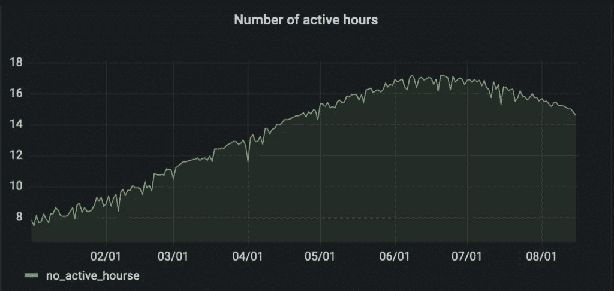

# Spark 数据处理:模式进化

> 原文：<https://blog.devgenius.io/data-processing-with-spark-schema-evolution-4d6032e3737c?source=collection_archive---------1----------------------->

在我之前的文章中，我已经讲述了如何设置 Spark 以及如何使用它进行数据处理和使用 T2 数据目录 T3。我们从短暂的默认 Spark 数据目录开始，并从那里开始配置持久的 Hive metastore。

那么这个每个人都在谈论的模式是什么，为什么我们会关心它呢？(如果你来自于一个繁重的数据库背景，schema 就是表结构。)它是数据的结构，主要包含关于数据外观的信息(元数据):字段/列名、字段/列类型、字段/列描述。我在这里有意使用结构，因为即使数据是半结构化的，通过定义一个模式，我们倾向于结构化它，以便更好地理解它。

# 概述

让我们回顾一下使用案例。每天我都从网站上下载一个 xls 文件。该文件包含记录我的太阳能电池板产生的能量的一系列事件。我首先创建一个由 Hive 管理的表，它包含两列:

*   时间=事件发生的时间
*   生产的千瓦时=直到该时间当天生产的千瓦时数

```
spark_session.sql("describe table raw_electricity_data").show()
+------------+---------+-------+
|    col_name|data_type|comment|
+------------+---------+-------+
|        time|timestamp|   null|
|produced_kwh|   double|   null|
+------------+---------+-------+spark_session.sql("select * from raw_electricity_data").show()
+-------------------+------------+
|               time|produced_kwh|
+-------------------+------------+
|2022-06-29 06:48:44|         0.0|
|2022-06-29 07:33:44|        1.12|
|2022-06-29 08:18:44|        2.27|
...
```

根据原始数据，我创建了一个每日汇总表，以显示每天的发电量:

```
spark_session.sql("describe table daily_electricity_agg").show()
+--------------+---------+-------+
|      col_name|data_type|comment|
+--------------+---------+-------+
|reporting_date|     date|   null|
|  produced_kwh|   double|   null|
+--------------+---------+-------+ spark_session.sql("select * from daily_electricity_agg").show()
+--------------+------------+
|reporting_date|produced_kwh|
+--------------+------------+
|    2022-07-05|        3.45|
|    2022-07-02|        6.61|
|    2022-07-03|        9.01|
|    2022-07-04|       12.12|
|    2022-06-29|       11.06|
|    2022-07-01|        5.54|
|    2022-06-30|        7.92|
+--------------+------------+
```

# 图式进化

随着时间的推移，数据的模式可能会发生变化:添加新的字段/列或删除现有的字段/列、更改数据类型或空特征都是需要模式更改的事件。因此，模式演变与以下因素密切相关:

*   数据目录
*   存储数据的文件格式

另一个需要考虑的因素是我们应用什么样的变化。我们谈论向后和不向后兼容(中断)的变更。根据文件格式，我们可以在记录中间添加列，将字符串列类型更改为 int，或者从记录中间删除列。在本文中，我将展示仅向后兼容的变更。大多数情况下，重大更改需要重新创建模式和重新加载数据。

用例:我想在每日汇总表中添加我接收数据的小时数，基本上是一天的最大时间戳和一天的最小时间戳之间的小时差。该列应添加到文件的末尾。



# 非持久数据目录

首先，我创建一个 spark 会话，一个原始数据的临时视图，并实例化两个数据帧，其中包含我的请求的计算:

```
from data_processing_spark_schema import get_some_df
from pyspark.sql import SparkSession
spark_session = SparkSession.builder.getOrCreate()
input_df = get_some_df(spark_session)
input_df.createTempView('raw_electricity_data')initial_agg_df = spark_session.sql(
        "select to_date(time, 'yyyy-MM-dd') as reporting_date, \
            max(produced_kwh) produced_kwh \
        from raw_electricity_data group by 1"
    )altered_agg_df = spark_session.sql(
    "select reporting_date, \
        produced_kwh, \
        (max_unix_timestamp - min_unix_timestamp)/60/60 as no_active_hours \
    from (select to_date(time, 'yyyy-MM-dd') as reporting_date, \
        max(produced_kwh) produced_kwh, \
        min(unix_timestamp(time)) as min_unix_timestamp, \
        max(unix_timestamp(time)) as max_unix_timestamp \
    from raw_electricity_data group by 1) src"
)
```

## 覆盖模式

在这种模式下，模式演化与加载过程无关，因为我们完全替换了数据，并且没有存储任何元数据定义来考虑。新数据简单地覆盖了以前的数据，新模式的读取将自动进行。模式演变与我们数据的用户相关，他们需要意识到模式已经改变。

```
data_location = '/app/output_data/default_spark/temp/daily_electricity_agg'# the initial load
initial_agg_df.write.mode('overwrite').parquet(path=data_location)
spark_session.read.parquet(data_location).show()
+--------------+------------+
|reporting_date|produced_kwh|
+--------------+------------+
|    2022-06-29|        6.61|
|    2022-07-01|        7.99|
|    2022-07-02|        5.57|
|    2022-06-30|       14.94|
|    2022-07-05|       13.72|
|    2022-07-03|        9.99|
|    2022-07-04|         9.9|
+--------------+------------+# the altered loadaltered_agg_df.write.mode('overwrite').parquet(path=data_location)
spark_session.read.parquet(data_location).show()
+--------------+------------+---------------+
|reporting_date|produced_kwh|no_active_hours|
+--------------+------------+---------------+
|    2022-06-29|        6.61|            4.5|
|    2022-07-01|        7.99|           5.25|
|    2022-07-02|        5.57|           3.75|
|    2022-06-30|       14.94|           9.75|
|    2022-07-05|       13.72|            9.0|
|    2022-07-03|        9.99|           6.75|
|    2022-07-04|         9.9|           6.75|
+--------------+------------+---------------+
```

## 附加方式

在 append 模式下，Spark 在默认情况下不应用模式演化，它完全依赖于 Parquet 处理模式演化的方式。

```
data_location = '/app/output_data/default_spark/temp_append/daily_electricity_agg'initial_agg_df.write.mode('append').parquet(path=data_location)spark_session.read.parquet(data_location).show()
+--------------+------------+
|reporting_date|produced_kwh|
+--------------+------------+
|    2022-06-29|        6.61|
|    2022-07-01|        7.99|
|    2022-07-02|        5.57|
|    2022-06-30|       14.94|
|    2022-07-05|       13.72|
|    2022-07-03|        9.99|
|    2022-07-04|         9.9|
+--------------+------------+ altered_agg_df.write.mode('append').parquet(path=data_location)
spark_session.read.parquet(data_location).show()
+--------------+------------+
|reporting_date|produced_kwh|
+--------------+------------+
|    2022-06-29|        6.61|
|    2022-07-01|        7.99|
|    2022-07-02|        5.57|
|    2022-06-30|       14.94|
|    2022-07-05|       13.72|
|    2022-07-03|        9.99|
|    2022-07-04|         9.9|
|    2022-06-29|        6.61|
|    2022-07-01|        7.99|
|    2022-07-02|        5.57|
|    2022-06-30|       14.94|
|    2022-07-05|       13.72|
|    2022-07-03|        9.99|
|    2022-07-04|         9.9|
+--------------+------------+ spark_session.read.option("mergeSchema", "true").parquet(data_location).show()
+--------------+------------+---------------+
|reporting_date|produced_kwh|no_active_hours|
+--------------+------------+---------------+
|    2022-06-29|        6.61|            4.5|
|    2022-07-01|        7.99|           5.25|
|    2022-07-02|        5.57|           3.75|
|    2022-06-30|       14.94|           9.75|
|    2022-07-05|       13.72|            9.0|
|    2022-07-03|        9.99|           6.75|
|    2022-07-04|         9.9|           6.75|
|    2022-06-29|        6.61|           null|
|    2022-07-01|        7.99|           null|
|    2022-07-02|        5.57|           null|
|    2022-06-30|       14.94|           null|
|    2022-07-05|       13.72|           null|
|    2022-07-03|        9.99|           null|
|    2022-07-04|         9.9|           null|
+--------------+------------+---------------+
```

我们在上面看到的是，如果不启用合并模式，Spark 将不会显示新字段。

# 蜂巢数据目录

加载数据可能会容易一点，但是当我们在没有数据目录的情况下工作时，检索数据会更加困难。我们需要知道数据的位置，有时需要知道数据的格式，了解模式或其他可能发生的变化。这就是为什么在托管数据系统中，数据目录是任何数据活动的核心。

```
spark_session = SparkSession.builder.appName("My Spark ETL Session").config(
    'spark.hive.metastore.uris', 'thrift://localhost:9083'
    ).enableHiveSupport().getOrCreate()
```

# 覆盖模式

在这种模式下，模式演化非常简单。数据只是在存储区域中被刷新，但是我们需要注意 Hive 中的表定义，因为我们不能覆盖现有的表:

```
initial_agg_df.write.saveAsTable("daily_electricity_agg")
---------------------------------------------------------------------------
AnalysisException                         Traceback (most recent call last)
AnalysisException: Table `daily_electrivity_agg` already exists.
```

在数据完全刷新之前，可以删除并重新创建该表。请注意，使用这种方法，数据用户无法使用数据，因为在重新创建表时，表并不存在:

```
spark_session.sql("drop table daily_electricity_agg")initial_agg_df.write.saveAsTable("daily_electricity_agg")spark_session.sql("describe table daily_electricity_agg").show()
+---------------+---------+-------+
|       col_name|data_type|comment|
+---------------+---------+-------+
| reporting_date|     date|   null|
|   produced_kwh|   double|   null|
|no_active_hours|   double|   null|
+---------------+---------+-------+ spark_session.sql("select * from daily_electricity_agg").show()
+--------------+------------+---------------+
|reporting_date|produced_kwh|no_active_hours|
+--------------+------------+---------------+
|    2022-07-05|        3.45|           2.25|
|    2022-07-02|        6.61|            4.5|
|    2022-07-03|        9.01|            6.0|
|    2022-07-04|       12.12|           8.25|
|    2022-06-29|       11.06|            7.5|
|    2022-07-01|        5.54|           3.75|
|    2022-06-30|        7.92|           5.25|
+--------------+------------+---------------+
```

# 附加方式

当我们总是添加数据时，有两种方法来处理模式演变。我们可以利用数据定义语言来改变表格，或者利用视图来反映变化。

## 更改表定义

就像在任何其他数据管理系统中一样，我们也可以在 Hive 中修改表:

```
spark_session.sql("alter table daily_electricity_agg add column no_active_hours decimal(4,2)")spark_session.sql("describe table daily_electricity_agg").show()
+---------------+------------+-------+
|       col_name|   data_type|comment|
+---------------+------------+-------+
| reporting_date|        date|   null|
|   produced_kwh|      double|   null|
|no_active_hours|decimal(4,2)|   null|
+---------------+------------+-------+spark_session.sql("select * from daily_electricity_agg").show()
+--------------+------------+---------------+                                   
|reporting_date|produced_kwh|no_active_hours|
+--------------+------------+---------------+
|    2022-07-05|       10.31|           null|
|    2022-07-04|        6.83|           null|
|    2022-07-01|        4.51|           null|
|    2022-07-02|        5.68|           null|
|    2022-06-30|       12.18|           null|
|    2022-06-29|        7.89|           null|
|    2022-07-03|       14.78|           null|
+--------------+------------+---------------+
```

现在我们已经添加了字段，我们可以追加新数据:

```
altered_agg_df.write.mode("append").saveAsTable("daily_electricity_agg")

spark_session.sql("select * from daily_electricity_agg").show()
+--------------+------------+---------------+
|reporting_date|produced_kwh|no_active_hours|
+--------------+------------+---------------+
|    2022-07-05|       10.31|           6.75|
|    2022-07-04|        6.83|           4.50|
|    2022-07-01|        4.51|           3.00|
|    2022-07-02|        5.68|           3.75|
|    2022-06-30|       12.18|           8.25|
|    2022-06-29|        7.89|           5.25|
|    2022-07-03|       14.78|           9.75|
|    2022-07-05|       10.31|           null|
|    2022-07-04|        6.83|           null|
|    2022-07-01|        4.51|           null|
|    2022-07-02|        5.68|           null|
|    2022-06-30|       12.18|           null|
|    2022-06-29|        7.89|           null|
|    2022-07-03|       14.78|           null|
+--------------+------------+---------------+
```

## 视图方法

我们可以不添加新列，而是将数据加载到一个新表中，并创建一个视图来显示两个表中的数据:

```
spark_session.sql("drop table daily_electricity_agg")
initial_agg_df.write.saveAsTable("daily_electricity_agg")
altered_agg_df.write.saveAsTable("altered_daily_electricity_agg")spark_session.sql("create or replace view daily_electricity_agg_v as \
    select reporting_date, produced_kwh, null as no_active_hours from daily_electricity_agg \
    union all \
    select reporting_date, produced_kwh, no_active_hours from altered_daily_electricity_agg")spark_session.sql("select * from daily_electricity_agg_v").show()
+--------------+------------+---------------+
|reporting_date|produced_kwh|no_active_hours|
+--------------+------------+---------------+
|    2022-07-05|       10.31|           null|
|    2022-07-04|        6.83|           null|
|    2022-07-01|        4.51|           null|
|    2022-07-02|        5.68|           null|
|    2022-06-30|       12.18|           null|
|    2022-06-29|        7.89|           null|
|    2022-07-03|       14.78|           null|
|    2022-07-05|       10.31|           6.75|
|    2022-07-04|        6.83|            4.5|
|    2022-07-01|        4.51|            3.0|
|    2022-07-02|        5.68|           3.75|
|    2022-06-30|       12.18|           8.25|
|    2022-06-29|        7.89|           5.25|
|    2022-07-03|       14.78|           9.75|
+--------------+------------+---------------+spark_session.sql("describe table  daily_electricity_agg_v").show()
+---------------+---------+-------+
|       col_name|data_type|comment|
+---------------+---------+-------+
| reporting_date|     date|   null|
|   produced_kwh|   double|   null|
|no_active_hours|   double|   null|
+---------------+---------+-------+
```

我发现视图方法更容易开发，但随着时间的推移，我认为它更难维护，因为它会生成大量的对象。

# 结论

管理模式演变增加了数据管理系统的复杂性。不管加载模式如何，模式演变对数据用户都很重要。每当模式发生变化时，都需要通知用户，以便对模式变化的影响采取措施。

我们看到，无论何时处于覆盖模式，我们都不需要在加载时间注意*模式是如何变化的。*

当我们处于追加模式时，我们可以通过使用 Hive 来改变模式。默认情况下，Spark 不会合并模式。通过使用 Hive，我们可以创建健壮的数据管道，并且可以在写入时生成错误，这样我们就不会影响数据用户:

```
spark_session.sql("drop table daily_electricity_agg")
initial_agg_df.write.saveAsTable("daily_electricity_agg")

spark_session.sql("alter table daily_electricity_agg add column no_active_hours decimal(4,2)")from pyspark.sql.functions import litinitial_agg_df = initial_agg_df.withColumn('no_active_hours', lit('string'))initial_agg_df.write.mode("append").saveAsTable("daily_electricity_agg")
---------------------------------------------------------------------------
AnalysisException: Cannot write incompatible data to table 'daily_electricity_agg':
- Cannot safely cast 'no_active_hours': string to decimal(4,2)
```

Spark 系列的下一款是什么？我们如何操作数据(更新/删除)以及如何在 Spark 中启用 ACID。

# 文档:

1.  [半结构化数据](https://en.wikipedia.org/wiki/Semi-structured_data)
2.  [火花数据类型](https://spark.apache.org/docs/latest/sql-ref-datatypes.html)
3.  [HIVE DDL 文档](https://cwiki.apache.org/confluence/display/Hive/LanguageManual+DDL)
4.  [蜂巢数据类型](https://cwiki.apache.org/confluence/display/hive/languagemanual+types)
5.  [GitHub 代码模拟上面的](https://github.com/acirtep/ginlong-data-processing-spark)

文章首发@ own your data . ai。