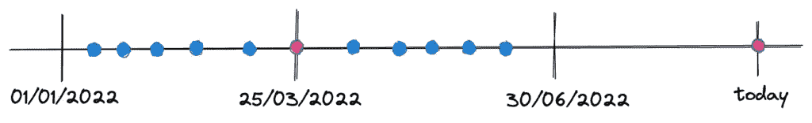
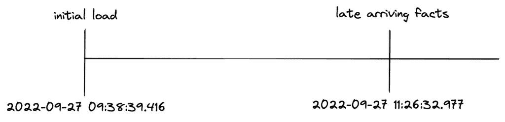

# 用 Spark 处理数据:时间旅行

> 原文：<https://blog.devgenius.io/data-processing-with-spark-time-traveling-55905f765694?source=collection_archive---------6----------------------->

使我们能够在火花中完成[酸的实用程序，不会空手而来。它们有许多特点，在这篇文章中，我将详述时间旅行。所以系好安全带，我们正在拜访过去！](https://ownyourdata.ai/wp/data-processing-with-spark-acid-compliance/)

为了展示时间旅行，我将利用最新的事实数据。用于概念验证的数据反映了太阳能电池板数据记录器发出的注册事件，包括:

*   时间，注册时间
*   produced_kwh，从当天的第一个事件到当前事件所产生的 kwh 量

迟到的事实是用来描述今天收到的事件的术语，但包含过去的信息。在 POC 情况下，迟到的事实将是注册时间在过去的事件，例如在 2022 年 3 月 25 日注册的事件今天到达(2022 年 9 月):



# 设置

让我们创建初始负载虚拟数据:

```
import pandas as pd
from acid.data_processing_acid_data import get_some_dataget_some_data()pd_df = pd.read_csv('/app/input_data/acid_example_data.txt', delimiter='\t')pd_df[pd_df.time.str.startswith('2022-03-25')] time  produced_kwh
590  2022-03-25 06:39:26          0.00
591  2022-03-25 07:24:26          1.14
592  2022-03-25 08:09:26          2.21
593  2022-03-25 08:54:26          3.36
594  2022-03-25 09:39:26          4.45
595  2022-03-25 10:24:26          5.51
596  2022-03-25 11:09:26          6.66
597  2022-03-25 11:54:26          7.75
598  2022-03-25 12:39:26          8.93
599  2022-03-25 13:24:26         10.08
```

从功能上讲，迟到的事实有两种类型:更正的或错过的。

更正的事件:伴随更新而来的事件

```
corrected_event = df_output.\
        filter("reporting_date = '2022-03-25'").\
        orderBy(desc("time")).limit(1).\
        withColumn('produced_kwh', col('produced_kwh')+1)
```

错过的事件:作为插页出现的事件

```
new_event = corrected_event.\
        withColumn('produced_kwh', col('produced_kwh')+1).\
        withColumn('time', col('time') + expr('interval 10 minutes'))
```

我们将处理以下记录和时间旅行，以提取 2022 年 3 月 25 日的发电量:

```
+-------------------+------------+--------------+---------------+
|               time|produced_kwh|reporting_date|reporting_month|
+-------------------+------------+--------------+---------------+
|2022-03-25 13:24:26|       11.08|    2022-03-25|         202203|
|2022-03-25 13:34:26|       12.08|    2022-03-25|         202203|
+-------------------+------------+--------------+---------------+
```

本练习的目的是能够根据查询时间检索 2022 年 3 月 25 日的不同指标。

# 三角洲湖

为了使用 delta lake 带来的所有功能，我们需要安装 delta-spark 软件包:

```
pip install delta-spark
```

Delta Lake 上的合并操作非常简单，与 SQL 非常相似:

```
path = 'output_data/acid_example/delta_spark'
    spark_session = get_delta_spark_session()
    laf = get_late_arriving_facts(spark_session)
    tab = DeltaTable.forPath(spark_session, path)

    tab.alias('tgt').\
        merge(
            laf.alias('src'), 
            'tgt.time = src.time'
        ).whenMatchedUpdateAll().\
        whenNotMatchedInsertAll().\
        execute()
```

Delta lake 保留操作的历史记录，可通过表级别的历史记录方法获得。默认情况下，保留期为 30 天:

```
tab.history().select('timestamp', 'operation').show(truncate=False)
+-----------------------+---------+
|timestamp              |operation|
+-----------------------+---------+
|2022-09-27 11:26:32.977|MERGE    |
|2022-09-27 09:38:39.416|WRITE    |
+-----------------------+---------+
```

为了时间旅行，德尔塔湖提供了两种选择:

*   时间戳截至，基于时间戳的旅行
*   版本截至，根据版本号，我们的 POC 中有 2 个版本

让我们试一试:

```
spark_session.read.\
    format('delta').\
    option("timestampAsOf", '2022-09-27 09:38:39.416').\
    load(path).filter("time = '2022-03-25 13:24:26'").show()+-------------------+------------+--------------+---------------+
|               time|produced_kwh|reporting_date|reporting_month|
+-------------------+------------+--------------+---------------+
|2022-03-25 13:24:26|       10.08|    2022-03-25|         202203|
+-------------------+------------+--------------+---------------+spark_session.read.\
    format('delta').\
    option("versionAsOf", 0).\
    load(path).filter("time = '2022-03-25 13:24:26'").show()+-------------------+------------+--------------+---------------+
|               time|produced_kwh|reporting_date|reporting_month|
+-------------------+------------+--------------+---------------+
|2022-03-25 13:24:26|       10.08|    2022-03-25|         202203|
+-------------------+------------+--------------+---------------+spark_session.read.\
    format('delta').\
    option("timestampAsOf", '2022-09-27 11:26:32.977').\
    load(path).filter("time = '2022-03-25 13:24:26'").show()
+-------------------+------------+--------------+---------------+
|               time|produced_kwh|reporting_date|reporting_month|
+-------------------+------------+--------------+---------------+
|2022-03-25 13:24:26|       11.08|    2022-03-25|         202203|
+-------------------+------------+--------------+---------------+spark_session.read.\
    format('delta').\
    option("versionAsOf", 1).\
    load(path).filter("time = '2022-03-25 13:24:26'").show()
+-------------------+------------+--------------+---------------+
|               time|produced_kwh|reporting_date|reporting_month|
+-------------------+------------+--------------+---------------+
|2022-03-25 13:24:26|       11.08|    2022-03-25|         202203|
+-------------------+------------+--------------+---------------+
```

从上面可以看出，我们可以根据增量加载的时间戳或版本来检索初始加载值或更新值。但是，如果我们不想保留这种技术属性的痕迹，而只是想进行时间旅行，该怎么办呢？让我们首先分析时间间隔:



如果我们试图使用不同于技术上的时间戳会发生什么？

## 在初始加载之前

```
before_initial_load = '2022-09-27 09:00:00'
spark_session.read.\
    format('delta').\
    option("timestampAsOf", before_initial_load).\
    load(path).filter("time = '2022-03-25 13:24:26'").show()AnalysisException: The provided timestamp (2022-09-27 09:00:00.0) is before the earliest version available to this
table (2022-09-27 09:38:39.416). Please use a timestamp after 2022-09-27 09:38:39.
```

## 在初始加载和更新之间

```
between_initial_load_and_update = '2022-09-27 10:38:39.416'
spark_session.read.\
    format('delta').\
    option("timestampAsOf", between_initial_load_and_update).\
    load(path).filter("time = '2022-03-25 13:24:26'").show()+-------------------+------------+--------------+---------------+
|               time|produced_kwh|reporting_date|reporting_month|
+-------------------+------------+--------------+---------------+
|2022-03-25 13:24:26|       10.08|    2022-03-25|         202203|
+-------------------+------------+--------------+---------------+
```

## 更新时

```
at_update = '2022-09-27 11:26:32.977'
spark_session.read.\
    format('delta').\
    option("timestampAsOf", at_update).\
    load(path).filter("time = '2022-03-25 13:24:26'").show()+-------------------+------------+--------------+---------------+
|               time|produced_kwh|reporting_date|reporting_month|
+-------------------+------------+--------------+---------------+
|2022-03-25 13:24:26|       11.08|    2022-03-25|         202203|
+-------------------+------------+--------------+---------------+
```

## 更新后

```
after_update = datetime.now().strftime("%Y-%m-%d %H:%M:%S.000")
spark_session.read.\
    format('delta').\
    option("timestampAsOf", after_update).\
    load(path).filter("time = '2022-03-25 13:24:26'").show()AnalysisException: The provided timestamp: 2022-09-28 09:34:50.0 is after the latest commit timestamp of
2022-09-27 11:26:32.977\. If you wish to query this version of the table, please either provide
the version with "VERSION AS OF 1" or use the exact timestamp
of the last commit: "TIMESTAMP AS OF '2022-09-27 11:26:32'".
```

根据我们得到的初始加载之前和更新之后的时间误差，我想指出的是，delta lake 上的时间旅行选项纯粹是技术上的，基于加载时间戳。

那么，如果我们用 overwrite 再次加载初始加载数据，会发生什么情况呢？

```
tab.history().select('timestamp', 'operation').show(truncate=False)
+-----------------------+---------+
|timestamp              |operation|
+-----------------------+---------+
|2022-09-28 09:41:07.422|WRITE    |
|2022-09-27 11:26:32.977|MERGE    |
|2022-09-27 09:38:39.416|WRITE    |
+-----------------------+---------+spark_session.read.\
     format('delta').\
     option("versionAsOf", 0).\
     load(path).filter("time = '2022-03-25 13:24:26'").show()
+-------------------+------------+--------------+---------------+
|               time|produced_kwh|reporting_date|reporting_month|
+-------------------+------------+--------------+---------------+
|2022-03-25 13:24:26|       10.08|    2022-03-25|         202203|
+-------------------+------------+--------------+---------------+spark_session.read.\
     format('delta').\
     option("versionAsOf", 1).\
     load(path).filter("time = '2022-03-25 13:24:26'").show()
+-------------------+------------+--------------+---------------+
|               time|produced_kwh|reporting_date|reporting_month|
+-------------------+------------+--------------+---------------+
|2022-03-25 13:24:26|       11.08|    2022-03-25|         202203|
+-------------------+------------+--------------+---------------+spark_session.read.\
     format('delta').\
     option("versionAsOf", 2).\
     load(path).filter("time = '2022-03-25 13:24:26'").show()
+-------------------+------------+--------------+---------------+
|               time|produced_kwh|reporting_date|reporting_month|
+-------------------+------------+--------------+---------------+
|2022-03-25 13:24:26|       10.08|    2022-03-25|         202203|
+-------------------+------------+--------------+---------------+
```

我们仍然能够检索以前的版本，因为覆盖没有删除和重新创建操作的元数据，但它添加了数据的新版本。检查 _delta_log 文件夹，查看 delta lake 为实现时间旅行而生成和使用的元数据。

Delta lake 不提供增量查询的可能性，所以让我们深入研究一下冰山！

# 阿帕奇 Icerberg

为了进行向上插入，我们可以使用 SQL 中的 merge into 操作:

```
from data_processing_time_traveling import get_late_arriving_facts
from acid.data_processing_acid_iceberg import get_iceberg_spark_sessionspark_session = get_iceberg_spark_session()
laf = get_late_arriving_facts(spark_session)
laf.createOrReplaceTempView('temp_laf_view')spark_session.sql('select * from temp_laf_view').show()
+-------------------+------------+--------------+---------------+
|               time|produced_kwh|reporting_date|reporting_month|
+-------------------+------------+--------------+---------------+
|2022-03-25 13:24:26|       11.08|    2022-03-25|         202203|
|2022-03-25 13:34:26|       12.08|    2022-03-25|         202203|
+-------------------+------------+--------------+---------------+ spark_session.sql('merge into iceberg_acid_example tgt \
    using temp_laf_view src on tgt.time=src.time \
    when matched then update set tgt.produced_kwh=src.produced_kwh \
    when not matched then insert *');
```

Apache Iceberg 记录了不同的元数据集合:

*   桌子的历史
*   快照
*   文件元数据

它们很容易通过 database . tablename . metadata _ table 访问，注意添加数据库，即使它是默认数据库！让我们检查一下历史记录和快照，因为我们需要它们来进行时间旅行:

```
spark_session.sql('select * from default.iceberg_acid_example.history').show(truncate=False)
+-----------------------+-------------------+-------------------+-------------------+
|made_current_at        |snapshot_id        |parent_id          |is_current_ancestor|
+-----------------------+-------------------+-------------------+-------------------+
|2022-09-27 09:37:15.035|2808282535513204040|null               |true               |
|2022-09-28 10:11:59.936|1489684618045694917|2808282535513204040|true               |
+-----------------------+-------------------+-------------------+-------------------+spark_session.sql('select * from default.iceberg_acid_example.snapshots').select('committed_at', 'snapshot_id', 'parent_id', 'operation').show(truncate=False)
+-----------------------+-------------------+-------------------+---------+
|committed_at           |snapshot_id        |parent_id          |operation|
+-----------------------+-------------------+-------------------+---------+
|2022-09-27 09:37:15.035|2808282535513204040|null               |overwrite|
|2022-09-28 10:11:59.936|1489684618045694917|2808282535513204040|overwrite|
+-----------------------+-------------------+-------------------+---------+
```

好奇看到 merge into 操作在快照表中保存为 overwrite(数据还在！).如果在三角洲湖，我们能够通过时间和版本进行时间旅行，那么在阿帕奇冰堡，我们可以通过时间和快照进行旅行。如果在 Delta Lake 中，我们的默认保留期是 30 天，那么在 Apache Iceberg 中，默认保留期是永远，您需要进行一些维护。

在我写这篇文章的时候，dataframe API 没有像预期的那样工作(as-of-timestamp 期望时间戳是 epoch，但是它没有正确地转换它)。因此，我将使用 SQL:

```
spark_session.sql(
    'select * from iceberg_acid_example TIMESTAMP AS OF "2022-09-27 09:37:15.035"'
).filter("time = '2022-03-25 13:24:26'").show()+-------------------+------------+--------------+---------------+
|               time|produced_kwh|reporting_date|reporting_month|
+-------------------+------------+--------------+---------------+
|2022-03-25 13:24:26|       10.08|    2022-03-25|         202203|
+-------------------+------------+--------------+---------------+spark_session.read.\
    format("iceberg").\
    option("snapshot-id", "2808282535513204040").\
    table('iceberg_acid_example').filter("time = '2022-03-25 13:24:26'").show()
+-------------------+------------+--------------+---------------+
|               time|produced_kwh|reporting_date|reporting_month|
+-------------------+------------+--------------+---------------+
|2022-03-25 13:24:26|       10.08|    2022-03-25|         202203|
+-------------------+------------+--------------+---------------+spark_session.sql(
    'select * from iceberg_acid_example TIMESTAMP AS OF "2022-09-28 10:11:59.936"'
).filter("time = '2022-03-25 13:24:26'").show()+-------------------+------------+--------------+---------------+
|               time|produced_kwh|reporting_date|reporting_month|
+-------------------+------------+--------------+---------------+
|2022-03-25 13:24:26|       11.08|    2022-03-25|         202203|
+-------------------+------------+--------------+---------------+spark_session.read.\
    format("iceberg").\
    option("snapshot-id", "1489684618045694917").\
    table('iceberg_acid_example').filter("time = '2022-03-25 13:24:26'").show()
+-------------------+------------+--------------+---------------+
|               time|produced_kwh|reporting_date|reporting_month|
+-------------------+------------+--------------+---------------+
|2022-03-25 13:24:26|       11.08|    2022-03-25|         202203|
+-------------------+------------+--------------+---------------+
```

Apache Iceberg 的数据加载时间间隔是:


让我们看看如何在 4 个场景中使用 Apache Iceberg 进行时间旅行:

## 在初始加载之前

```
before_initial_load = '2022-09-27 09:00:00'
spark_session.sql(
    f'select * from iceberg_acid_example TIMESTAMP AS OF "{before_initial_load}"'
).filter("time = '2022-03-25 13:24:26'").show()IllegalArgumentException: Cannot find a snapshot older than 2022-09-27 09:00:00.000
```

## 在初始加载和更新之间

```
between_initial_load_and_update = '2022-09-27 10:38:39.416'
spark_session.sql(
    f'select * from iceberg_acid_example TIMESTAMP AS OF "{between_initial_load_and_update}"'
).filter("time = '2022-03-25 13:24:26'").show()+-------------------+------------+--------------+---------------+
|               time|produced_kwh|reporting_date|reporting_month|
+-------------------+------------+--------------+---------------+
|2022-03-25 13:24:26|       10.08|    2022-03-25|         202203|
+-------------------+------------+--------------+---------------+
```

## 更新时

```
at_update = '2022-09-28 10:11:59.936'
spark_session.sql(
    f'select * from iceberg_acid_example TIMESTAMP AS OF "{at_update}"'
).filter("time = '2022-03-25 13:24:26'").show()+-------------------+------------+--------------+---------------+
|               time|produced_kwh|reporting_date|reporting_month|
+-------------------+------------+--------------+---------------+
|2022-03-25 13:24:26|       11.08|    2022-03-25|         202203|
+-------------------+------------+--------------+---------------+
```

## 更新后

```
after_update = datetime.now().strftime("%Y-%m-%d %H:%M:%S.000")
spark_session.sql(
    f'select * from iceberg_acid_example TIMESTAMP AS OF "{after_update}"'
).filter("time = '2022-03-25 13:24:26'").show()+-------------------+------------+--------------+---------------+
|               time|produced_kwh|reporting_date|reporting_month|
+-------------------+------------+--------------+---------------+
|2022-03-25 13:24:26|       11.08|    2022-03-25|         202203|
+-------------------+------------+--------------+---------------+
```

不错，在时间旅行方面已经有了改进:Apache Iceberg 正在检索上一个时间戳之后的时间戳的最新版本！

如果我们用初始负载数据覆盖会发生什么？

```
spark_session.sql('select * from default.iceberg_acid_example.history').show(truncate=False)
+-----------------------+-------------------+-------------------+-------------------+
|made_current_at        |snapshot_id        |parent_id          |is_current_ancestor|
+-----------------------+-------------------+-------------------+-------------------+
|2022-09-27 09:37:15.035|2808282535513204040|null               |true               |
|2022-09-28 10:11:59.936|1489684618045694917|2808282535513204040|true               |
|2022-09-28 10:58:56.345|8337576034982282960|1489684618045694917|true               |
+-----------------------+-------------------+-------------------+-------------------+spark_session.read.\
    format("iceberg").\
    option("snapshot-id", "2808282535513204040").\
    table('iceberg_acid_example').filter("time = '2022-03-25 13:24:26'").show()+-------------------+------------+--------------+---------------+
|               time|produced_kwh|reporting_date|reporting_month|
+-------------------+------------+--------------+---------------+
|2022-03-25 13:24:26|       10.08|    2022-03-25|         202203|
+-------------------+------------+--------------+---------------+spark_session.read.\
    format("iceberg").\
    option("snapshot-id", "1489684618045694917").\
    table('iceberg_acid_example').filter("time = '2022-03-25 13:24:26'").show()
+-------------------+------------+--------------+---------------+
|               time|produced_kwh|reporting_date|reporting_month|
+-------------------+------------+--------------+---------------+
|2022-03-25 13:24:26|       11.08|    2022-03-25|         202203|
+-------------------+------------+--------------+---------------+spark_session.read.\
    format("iceberg").\
    option("snapshot-id", "8337576034982282960").\
    table('iceberg_acid_example').filter("time = '2022-03-25 13:24:26'").show()
+-------------------+------------+--------------+---------------+
|               time|produced_kwh|reporting_date|reporting_month|
+-------------------+------------+--------------+---------------+
|2022-03-25 13:24:26|       10.08|    2022-03-25|         202203|
+-------------------+------------+--------------+---------------+
```

与 delta lake 一样，只有数据被覆盖，但元数据没有被覆盖:

```
spark_session.read.\
     format("iceberg").\
     option("snapshot-id", "2808282535513204040").\
     table('iceberg_acid_example').count()
1366spark_session.read.\
     format("iceberg").\
     option("snapshot-id", "1489684618045694917").\
     table('iceberg_acid_example').count()
1367spark_session.read.\
     format("iceberg").\
     option("snapshot-id", "8337576034982282960").\
     table('iceberg_acid_example').count()
1366
```

增量查询呢？当我们想要发现从一个负载到另一个负载的变化时，它们是有用的。目前，在 Apache Iceberg 上，只有当表是用 append 操作编写的时候，它们才起作用，所以，不幸的是，我不能在这个概念验证中展示它:

```
spark_session.read.\
     format("iceberg").\
     option("start-snapshot-id", "1489684618045694917").\
     option("end-snapshot-id", "8337576034982282960").\
     table('iceberg_acid_example').show()Py4JJavaError: An error occurred while calling o335.showString.
: java.lang.UnsupportedOperationException: Found overwrite operation, cannot support incremental data in snapshots (1489684618045694917, 8337576034982282960]
```

# 阿帕奇胡迪

如果对于 Delta Lake 和 Apache Iceberg，我们没有因为模式而遇到任何问题，那么在 Apache 胡迪中，由于模式不匹配，第一次尝试向上插入数据失败了:在最新到达的事实数据帧中，produced_kwh 被定义为 DecimalType(20，2)，而 parquet 模式将其定义为 DecimalType(18，2)。这需要在加载数据之前进行强制转换:

```
from data_processing_time_traveling import get_late_arriving_facts
from acid.data_processing_acid_hudi import get_hudi_spark_sessionspark_session = get_hudi_spark_session()
laf = get_late_arriving_facts(spark_session)
laf = laf.withColumn('produced_kwh', col('produced_kwh').cast(DecimalType(18,2)))hudi_options = {
    'hoodie.table.name': 'acid_hudi_spark',
    'hoodie.datasource.write.recordkey.field': 'time',
    'hoodie.datasource.write.partitionpath.field': 'reporting_month',
    'hoodie.datasource.write.table.name': 'acid_hudi_spark',
    'hoodie.datasource.write.operation': 'upsert',
    'hoodie.datasource.write.precombine.field': 'time',
    'hoodie.upsert.shuffle.parallelism': 2,
    'hoodie.insert.shuffle.parallelism': 2,
    'hoodie.datasource.write.hive_style_partitioning': 'true'
}laf.write. \
    options(**hudi_options). \
    mode("append"). \
    format("hudi"). \
    save(path)
```

在 Apache 胡迪中，并不强制启用元数据表，但是这样做是有用的。对于此 POC，我尚未启用它，因此我将从数据本身检索提交信息:

```
spark_session.read.\
    format('hudi').\
    load(path).groupBy('_hoodie_commit_time').count().show()+-------------------+-----+
|_hoodie_commit_time|count|
+-------------------+-----+
|  20220928094741555| 1365|
|  20220928114646719|    2|
+-------------------+-----+
```

对于时间旅行，我们只有即时选项:

```
spark_session.read.\
    format('hudi').\
    option('as.of.instant', '20220928094741555').\
    load(path).filter("time = '2022-03-25 13:24:26'").show()+-------------------+--------------------+------------------+----------------------+--------------------+-------------------+------------+--------------+---------------+
|_hoodie_commit_time|_hoodie_commit_seqno|_hoodie_record_key|_hoodie_partition_path|   _hoodie_file_name|               time|produced_kwh|reporting_date|reporting_month|
+-------------------+--------------------+------------------+----------------------+--------------------+-------------------+------------+--------------+---------------+
|  20220928094741555|20220928094741555...|  1648214666000000|  reporting_month=2...|162f4b20-bdd9-47b...|2022-03-25 13:24:26|       10.08|    2022-03-25|         202203|
+-------------------+--------------------+------------------+----------------------+--------------------+-------------------+------------+--------------+---------------+spark_session.read.\
    format('hudi').\
    option('as.of.instant', '20220928114646719').\
    load(path).filter("time = '2022-03-25 13:24:26'").show()+-------------------+--------------------+------------------+----------------------+--------------------+-------------------+------------+--------------+---------------+
|_hoodie_commit_time|_hoodie_commit_seqno|_hoodie_record_key|_hoodie_partition_path|   _hoodie_file_name|               time|produced_kwh|reporting_date|reporting_month|
+-------------------+--------------------+------------------+----------------------+--------------------+-------------------+------------+--------------+---------------+
|  20220928114646719|20220928114646719...|  1648214666000000|  reporting_month=2...|162f4b20-bdd9-47b...|2022-03-25 13:24:26|       11.08|    2022-03-25|         202203|
+-------------------+--------------------+------------------+----------------------+--------------------+-------------------+------------+--------------+---------------+
```

让我们看看如何在 4 个场景中使用阿帕奇胡迪进行时间旅行:


## 在初始加载之前

```
before_initial_load = '2022-09-28 09:00:00.000'
spark_session.read.\
    format('hudi').\
    option('as.of.instant', before_initial_load).\
    load(path).filter("time = '2022-03-25 13:24:26'").show()+-------------------+--------------------+------------------+----------------------+-----------------+----+------------+--------------+---------------+
|_hoodie_commit_time|_hoodie_commit_seqno|_hoodie_record_key|_hoodie_partition_path|_hoodie_file_name|time|produced_kwh|reporting_date|reporting_month|
+-------------------+--------------------+------------------+----------------------+-----------------+----+------------+--------------+---------------+
+-------------------+--------------------+------------------+----------------------+-----------------+----+------------+--------------+---------------+
```

## 在初始加载和更新之间

```
between_initial_load_and_update = '2022-09-28 10:38:39.416'
spark_session.read.\
    format('hudi').\
    option('as.of.instant', between_initial_load_and_update).\
    load(path).filter("time = '2022-03-25 13:24:26'").show()+-------------------+--------------------+------------------+----------------------+--------------------+-------------------+------------+--------------+---------------+
|_hoodie_commit_time|_hoodie_commit_seqno|_hoodie_record_key|_hoodie_partition_path|   _hoodie_file_name|               time|produced_kwh|reporting_date|reporting_month|
+-------------------+--------------------+------------------+----------------------+--------------------+-------------------+------------+--------------+---------------+
|  20220928094741555|20220928094741555...|  1648214666000000|  reporting_month=2...|162f4b20-bdd9-47b...|2022-03-25 13:24:26|       10.08|    2022-03-25|         202203|
+-------------------+--------------------+------------------+----------------------+--------------------+-------------------+------------+--------------+---------------+
```

## 更新时

```
at_update = '2022-09-28 11:46:46.719'
spark_session.read.\
    format('hudi').\
    option('as.of.instant', at_update).\
    load(path).filter("time = '2022-03-25 13:24:26'").show()+-------------------+--------------------+------------------+----------------------+--------------------+-------------------+------------+--------------+---------------+
|_hoodie_commit_time|_hoodie_commit_seqno|_hoodie_record_key|_hoodie_partition_path|   _hoodie_file_name|               time|produced_kwh|reporting_date|reporting_month|
+-------------------+--------------------+------------------+----------------------+--------------------+-------------------+------------+--------------+---------------+
|  20220928114646719|20220928114646719...|  1648214666000000|  reporting_month=2...|162f4b20-bdd9-47b...|2022-03-25 13:24:26|       11.08|    2022-03-25|         202203|
+-------------------+--------------------+------------------+----------------------+--------------------+-------------------+------------+--------------+---------------+
```

## 更新后

```
after_update = datetime.now().strftime("%Y-%m-%d %H:%M:%S.000")
spark_session.read.\
    format('hudi').\
    option('as.of.instant', after_update).\
    load(path).filter("time = '2022-03-25 13:24:26'").show()+-------------------+--------------------+------------------+----------------------+--------------------+-------------------+------------+--------------+---------------+
|_hoodie_commit_time|_hoodie_commit_seqno|_hoodie_record_key|_hoodie_partition_path|   _hoodie_file_name|               time|produced_kwh|reporting_date|reporting_month|
+-------------------+--------------------+------------------+----------------------+--------------------+-------------------+------------+--------------+---------------+
|  20220928114646719|20220928114646719...|  1648214666000000|  reporting_month=2...|162f4b20-bdd9-47b...|2022-03-25 13:24:26|       11.08|    2022-03-25|         202203|
+-------------------+--------------------+------------------+----------------------+--------------------+-------------------+------------+--------------+---------------+
```

多么令人惊讶:胡迪返回了一个带有模式的数据帧，甚至是第一次加载之前的时间戳。当我们执行 insert_overwrite 操作时，以前的加载在最新版本的数据中不再可用，但是我们仍然可以检索旧的数据:

```
spark_session.read.\
     format('hudi').\
     load(path).groupBy('_hoodie_commit_time').count().show()
+-------------------+-----+
|_hoodie_commit_time|count|
+-------------------+-----+
|  20220928121943982| 1366|
+-------------------+-----+ between_initial_load_and_update = '2022-09-28 10:38:39.416'
spark_session.read.\
     format('hudi').\
     option('as.of.instant', between_initial_load_and_update).\
     load(path).filter("time = '2022-03-25 13:24:26'").show()
+-------------------+--------------------+------------------+----------------------+--------------------+-------------------+------------+--------------+---------------+
|_hoodie_commit_time|_hoodie_commit_seqno|_hoodie_record_key|_hoodie_partition_path|   _hoodie_file_name|               time|produced_kwh|reporting_date|reporting_month|
+-------------------+--------------------+------------------+----------------------+--------------------+-------------------+------------+--------------+---------------+
|  20220928094741555|20220928094741555...|  1648214666000000|  reporting_month=2...|162f4b20-bdd9-47b...|2022-03-25 13:24:26|       10.08|    2022-03-25|         202203|
+-------------------+--------------------+------------------+----------------------+--------------------+-------------------+------------+--------------+---------------+ at_update = '2022-09-28 11:46:46.719'
spark_session.read.\
     format('hudi').\
     option('as.of.instant', at_update).\
     load(path).filter("time = '2022-03-25 13:24:26'").show()
+-------------------+--------------------+------------------+----------------------+--------------------+-------------------+------------+--------------+---------------+
|_hoodie_commit_time|_hoodie_commit_seqno|_hoodie_record_key|_hoodie_partition_path|   _hoodie_file_name|               time|produced_kwh|reporting_date|reporting_month|
+-------------------+--------------------+------------------+----------------------+--------------------+-------------------+------------+--------------+---------------+
|  20220928114646719|20220928114646719...|  1648214666000000|  reporting_month=2...|162f4b20-bdd9-47b...|2022-03-25 13:24:26|       11.08|    2022-03-25|         202203|
+-------------------+--------------------+------------------+----------------------+--------------------+-------------------+------------+--------------+---------------+ after_update = datetime.now().strftime("%Y-%m-%d %H:%M:%S.000")
spark_session.read.\
    format('hudi').\
    option('as.of.instant', after_update).\
    load(path).filter("time = '2022-03-25 13:24:26'").show()
+-------------------+--------------------+------------------+----------------------+--------------------+-------------------+------------+--------------+---------------+
|_hoodie_commit_time|_hoodie_commit_seqno|_hoodie_record_key|_hoodie_partition_path|   _hoodie_file_name|               time|produced_kwh|reporting_date|reporting_month|
+-------------------+--------------------+------------------+----------------------+--------------------+-------------------+------------+--------------+---------------+
|  20220928121943982|20220928121943982...|  1648214666000000|  reporting_month=2...|a19a92a5-6b5b-4c7...|2022-03-25 13:24:26|       10.08|    2022-03-25|         202203|
+-------------------+--------------------+------------------+----------------------+--------------------+-------------------+------------+--------------+---------------+
```

与 Apache Iceberg 一样，增量查询在覆盖后不会返回信息。

# 结论

所有 3 种文件格式，三角洲湖，阿帕奇冰山和阿帕奇胡迪，来与时间旅行的可能性。时间旅行是 100%技术性的，因为它取决于每个实用程序实现的提交时间和日志。从这三个中，我认为胡迪是最完整的:因为它返回任何时间戳的结果。

为什么时间旅行很重要？这都与再现性有关:您希望能够在某个时刻再现某个查询结果，而无需重新处理、回滚或恢复数据。技术时间旅行在操作、调试和传承中非常有用。


功能性时间旅行呢？对于维度，在函数时间间隔上实现 SCD 仍然是必要的，即使您正在使用 Spark 处理数据。迟到的事实呢？

1.  确定代表您的功能日期的列，在本例中我选择 load_date
2.  总是追加数据
3.  确保对数据进行相应的分区
4.  创建视图并利用窗口功能

```
from datetime import datetime
from pyspark.sql.functions import litload_date = datetime.now().strftime("%Y-%m-%d %H:%M:%S.000")
df_input = df_input.withColumn('load_date', lit(load_date))df_input.show(truncate=False)
+-------------------+------------+--------------+---------------+-----------------------+
|time               |produced_kwh|reporting_date|reporting_month|load_date              |
+-------------------+------------+--------------+---------------+-----------------------+
|2022-01-01 07:02:47|0.00        |2022-01-01    |202201         |2022-09-28 12:52:12.000|
|2022-01-01 07:47:47|1.11        |2022-01-01    |202201         |2022-09-28 12:52:12.000|
|2022-01-02 06:44:02|0.00        |2022-01-02    |202201         |2022-09-28 12:52:12.000|
+-------------------+------------+--------------+---------------+-----------------------+df_input.write.\
   partitionBy("reporting_month").\
   mode('overwrite').\
   format('parquet').\
   save(path)laf = get_late_arriving_facts(spark_session)
laf = laf.withColumn('load_date', lit(load_date))
laf.show(truncate=False)
+-------------------+------------+--------------+---------------+-----------------------+
|time               |produced_kwh|reporting_date|reporting_month|load_date              |
+-------------------+------------+--------------+---------------+-----------------------+
|2022-03-25 13:24:26|11.08       |2022-03-25    |202203         |2022-09-28 12:57:08.000|
|2022-03-25 13:34:26|12.08       |2022-03-25    |202203         |2022-09-28 12:57:08.000|
+-------------------+------------+--------------+---------------+-----------------------+laf.write.\
   partitionBy("reporting_month").\
   mode('append').\
   format('parquet').\
   save(path)spark_session.read.parquet(path).filter("reporting_date = '2022-03-25'").show(truncate=False)
+-------------------+------------+--------------+-----------------------+---------------+
|time               |produced_kwh|reporting_date|load_date              |reporting_month|
+-------------------+------------+--------------+-----------------------+---------------+
|2022-03-25 06:39:26|0.00        |2022-03-25    |2022-09-28 12:52:12.000|202203         |
|2022-03-25 07:24:26|1.14        |2022-03-25    |2022-09-28 12:52:12.000|202203         |
|2022-03-25 08:09:26|2.21        |2022-03-25    |2022-09-28 12:52:12.000|202203         |
|2022-03-25 08:54:26|3.36        |2022-03-25    |2022-09-28 12:52:12.000|202203         |
|2022-03-25 09:39:26|4.45        |2022-03-25    |2022-09-28 12:52:12.000|202203         |
|2022-03-25 10:24:26|5.51        |2022-03-25    |2022-09-28 12:52:12.000|202203         |
|2022-03-25 11:09:26|6.66        |2022-03-25    |2022-09-28 12:52:12.000|202203         |
|2022-03-25 11:54:26|7.75        |2022-03-25    |2022-09-28 12:52:12.000|202203         |
|2022-03-25 12:39:26|8.93        |2022-03-25    |2022-09-28 12:52:12.000|202203         |
|2022-03-25 13:24:26|10.08       |2022-03-25    |2022-09-28 12:52:12.000|202203         |
|2022-03-25 13:24:26|11.08       |2022-03-25    |2022-09-28 12:57:08.000|202203         |
|2022-03-25 13:34:26|12.08       |2022-03-25    |2022-09-28 12:57:08.000|202203         |
+-------------------+------------+--------------+-----------------------+---------------+spark_session.read.parquet(path).createOrReplaceTempView('default_spark_data')sql = 'select time, produced_kwh, reporting_date, reporting_month \
    from ( \
        select time, produced_kwh, reporting_date, reporting_month, \
        row_number() over (partition by time order by load_date desc) as rn \
        from  default_spark_data where load_date <= "{at_moment_in_time}") src where rn = 1'at_moment_in_time = '2022-09-28 12:00:12.000'
spark_session.sql(sql.format(at_moment_in_time=at_moment_in_time)).filter("time = '2022-03-25 13:24:26'").show()
+----+------------+--------------+---------------+
|time|produced_kwh|reporting_date|reporting_month|
+----+------------+--------------+---------------+
+----+------------+--------------+---------------+at_moment_in_time = '2022-09-28 12:55:12.000'
spark_session.sql(sql.format(at_moment_in_time=at_moment_in_time)).filter("time = '2022-03-25 13:24:26'").show()
+-------------------+------------+--------------+---------------+
|               time|produced_kwh|reporting_date|reporting_month|
+-------------------+------------+--------------+---------------+
|2022-03-25 13:24:26|       10.08|    2022-03-25|         202203|
+-------------------+------------+--------------+---------------+at_moment_in_time = '2022-09-28 12:57:08.000'
spark_session.sql(sql.format(at_moment_in_time=at_moment_in_time)).filter("time = '2022-03-25 13:24:26'").show()
+-------------------+------------+--------------+---------------+
|               time|produced_kwh|reporting_date|reporting_month|
+-------------------+------------+--------------+---------------+
|2022-03-25 13:24:26|       11.08|    2022-03-25|         202203|
+-------------------+------------+--------------+---------------+at_moment_in_time = datetime.now().strftime("%Y-%m-%d %H:%M:%S.000")
spark_session.sql(sql.format(at_moment_in_time=at_moment_in_time)).filter("time = '2022-03-25 13:24:26'").show()
+-------------------+------------+--------------+---------------+
|               time|produced_kwh|reporting_date|reporting_month|
+-------------------+------------+--------------+---------------+
|2022-03-25 13:24:26|       11.08|    2022-03-25|         202203|
+-------------------+------------+--------------+---------------+
```

# 证明文件

1.  [三角洲湖上插](https://docs.delta.io/latest/delta-update.html#upsert-into-a-table-using-merge&language-python)
2.  [三角洲湖泊检索表历史](https://docs.delta.io/latest/delta-utility.html#retrieve-delta-table-history)
3.  [三角洲湖时间旅行](https://docs.delta.io/latest/delta-batch.html#-deltatimetravel)
4.  阿帕奇冰山上升
5.  [阿帕奇冰山元数据](https://iceberg.apache.org/docs/latest/spark-queries/#inspecting-tables)
6.  [阿帕奇冰山推荐维护](https://iceberg.apache.org/docs/latest/maintenance/)
7.  [Apache 冰山增量查询](https://iceberg.apache.org/docs/latest/spark-queries/#incremental-read)
8.  [阿帕奇胡迪元数据表](https://hudi.apache.org/docs/metadata)
9.  [阿帕奇胡迪作家](https://hudi.apache.org/docs/writing_data#spark-datasource-writer)
10.  [阿帕奇胡迪增量查询](https://hudi.apache.org/docs/quick-start-guide#incremental-query)

文章首发@ own your data . ai。