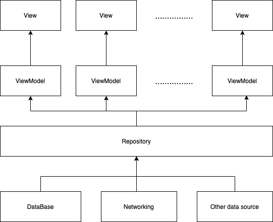

# iOS MVVM 中的数据存储层

> 原文：<https://blog.devgenius.io/data-repository-layer-in-ios-mvvm-562541b46f91?source=collection_archive---------1----------------------->

[Yura Fresh](https://unsplash.com/@mr_fresh?utm_source=medium&utm_medium=referral) 在 [Unsplash](https://unsplash.com?utm_source=medium&utm_medium=referral) 上的照片

在 iOS 应用程序开发中，我们必须从 API、数据库和其他数据源(物联网设备数据)中检索不同类型的数据

随着越来越多的开发人员开始应用 MVVM 架构，数据层显得杂乱无章。当构建代码库时，ViewModel 必须保存大量关于不同数据类型的数据源客户端。

在本文中，我们将讨论 MVVM 架构中的数据存储层，以了解如何正确处理第三方数据。

下面是这个应用程序的要求:应用程序必须在连接到互联网时从 API 获取数据，并在没有互联网时从数据库中检索数据。

## 1、总体结构

从下图中我们可以看到:

视图:UIView + ViewController。UIView 拥有 ViewController 拥有的所有静态视图代码。ViewController 协调 UIView 和 ViewModels。

ViewModel:处理所有逻辑，将可观察值绑定并公开给 ViewController。在 ViewModel 中进行的更新将自动显示在 ViewController 中。

数据存储库:包装所有数据库、网络和其他数据源处理逻辑。这仅向视图模型公开了必要的公共函数。

## 2、数据仓库层

1:这是我们在视图层提出的协议。

2: apiClient 是处理所有网络请求的网络客户端。

3:数据库容器包含数据库操作。

4:在 init()函数中，我们初始化网络客户端、数据库容器和其他数据源。

5:这些是私有数据库函数，处理数据获取和保存操作。

6:呈现给视图模型层的协议函数。基本上这个函数会首先调用 API。如果它获取数据成功，它将发送数据；否则，它将从数据库中检索并发送回 ViewModel 层。

添加数据存储层的优点:

*   **隐藏逻辑:**上层隐藏了取数据逻辑。ViewModel 初始化请求，不需要关心数据来自哪里。
*   易于测试:您所要做的就是创建一个模拟数据存储库，并根据需要模拟公共函数，仅此而已。
*   **易于更新:**如果您想要更新 ORM 模型层或更新逻辑，您不必对 ViewModel 逻辑进行更改，因为数据存储库协议不会改变

除了上述内容，您还可以阅读本文，使数据存储库通用化，以适应不同类型的视图模型

 [## 知识库设计模式

### 存储库模式是目前比较流行的模式之一。我喜欢它，它跟随固体…

medium.com](https://medium.com/@pererikbergman/repository-design-pattern-e28c0f3e4a30) 

## 3、视图模型层

1:我们有 DataRepositoryProtocol 类型的 dataRepo，这意味着我们只在这个视图模型中公开 initFetch()函数

2:有了这两个，我们就能够将数据绑定到视图层。当变量的值改变时，它将调用绑定到视图层的 didSet()中的闭包函数来执行一些视图操作。还有，我们可以用 RxSwift BehaviorRelay 和 Combine 来替换这些代码。

3:这是一个典型的依赖注入，我们将数据存储库注入到视图模型中。通过这样做，我们分离了数据层和视图模型层。逻辑功能更容易测试。

initFetch 函数暴露给 ViewController，在这个函数中，我们调用 DataRepositoryProtocol 中的 iniFetch()来获取和处理数据。

## 4、结论

如果你理解设计模式，你就会知道这是开发人员总是用来隐藏复杂细节和向外界暴露统一接口的门面模式。

与从可编码模型访问数据相比，这更符合 MVVM，因为我们只向逻辑发送必要的数据。

我希望你能从这篇文章中学到一些东西，这里是我在 [GitHub](https://github.com/lee197/MeteoriteRecordApp) 的源代码，请不吝赐教。