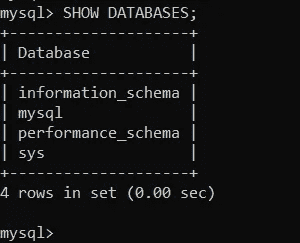

# 数据科学基础:SQL

> 原文：<https://blog.devgenius.io/data-science-essentials-sql-66c85e4c2b3e?source=collection_archive---------6----------------------->

# 1.简介:

> **数据科学领域是否需要 SQL？还是一般的数据相关的角色？**

> 这个问题的简短答案当然是肯定的！
> 
> 事实上，数据科学(DS)与 SQL 紧密相连，如果你想在这个领域发展，学习 SQL 是必不可少的。

> **正如字母表是英语的基础，同样，我们可以说 SQL 是 DS 的基础。**

> SQL 是一种到处都在使用的语言；因此，它的需求量很大，因为所有顶级公司都使用 SQL 来查询数据和执行分析。尽管有许多其他语言，SQL 的范围永远不会结束。

# 2.什么是 SQL？

*   SQL 代表 ***结构化查询语言。***
*   就是语言 ***【说话】*** 到数据库即 ***【查询】*** 到数据库
*   它是一种对数据库进行检索、添加、修改数据的查询语言。
*   SQL 用于与所有关系数据库/ RDBMS 对话。

# 3.SQL VS MYSQL？

> MySQL 是一个开源的关系数据库管理系统。它的名字是由“My”和“SQL”组合而成，前者是联合创始人迈克尔·维德纽斯的女儿 My 的名字，后者是结构化查询语言的缩写。
> 
> 关系数据库将数据组织成一个或多个数据表，在这些数据表中，数据可以彼此相关；这些关系有助于组织数据。
> 
> MySQL 使用 SQL 语言来查询数据库。

> 与 MySQL 相似，还有其他流行的 RDBMS，如 PostgreSQL、Oracle、MS-SQL、SQLite 等。

## 注意:

出于本教程的目的，我们将坚持使用 MySQL，您可以使用任何一种流行的 RDBMS &语法几乎是相似的，因此应该没有任何问题。

也见下图的数据库调查的所有类型的数据库。

# 4.MySQL 的安装

请遵循以下视频中展示的步骤:

> [如何在 Windows 10 上安装 MySQL 8.0.22 服务器和工作台最新版本](https://www.youtube.com/watch?v=OM4aZJW_Ojs)

假设安装是正确的，我们最终可以开始使用 SQL……耶！！！

是啊！

# 5.基本 SQL 查询

*我将从命令提示符下使用 mysql】*

复制 MySQL 服务器 bin 所在的路径。

> **CD C:\ Program Files \ MySQL \ MySQL Server 8.0 \ bin**

> **mysql -u root -p**

*   “-u”代表用户名，在本例中是“root:
*   “-p”代表密码
*   因此，一旦上面的命令正确运行，您将看到下面的输出

> **显示数据库；**
> 
> 我们通常以大写格式书写关键字，如上面我们写的命令**所示，数据库**都是 SQL 关键字&后跟**；(分号)**表示查询结束。
> 
> 显示数据库；*命令返回可用数据库列表*

> **求助；**顾名思义助你一臂之力

> **选择@ @主机名**

在我是 MSI 的情况下，返回您的 pc 的主机名

> **什么是数据库？**
> 
> 数据库是结构化信息或数据的有组织的集合，通常以电子方式存储在计算机系统中。数据库通常由[数据库管理系统](https://www.oracle.com/database/what-is-database/#WhatIsDBMS)控制。数据和 DBMS 以及与之相关的应用程序一起被称为数据库系统，通常简称为数据库。

> **创建数据库<DB _ NAME>；**

使用上面的命令，我们可以用我们选择的数据库名创建数据库

例:**创建数据库 cricket _ db**

正如我们在输出中看到的，cricket_db 已创建&现在在数据库列表中。

> **删除数据库<<DB _ NAME>>；**

删除指定的数据

例如:删除数据库 ipl _ db

> **使用<DB _ NAME>；**

选择数据库并开始使用它

> **选择数据库()；**

来获取我们当前使用的数据库。

> **什么是桌子？**
> 
> 数据库表是将数据组织成行和列的结构
> 
> 简单来说，它类似于包含行和列的电子表格

电子表格示例

让我们试着为印度队创建一个有三个字段的表:名、姓、年龄。

> 名字:最多 50 个字符限制
> 
> 名字:最多 50 个字符限制
> 
> 年龄:数量

> **创建表<TABLE _ NAME>(schema)；**

在上面的上面命令

VARCHAR(50):表示可变长度，最多 50 个字符

INT:意味着它可以是一个数字

我们能够创建表名为 indian_team 的表，该表包含上面讨论的 3 个字段

> **显示来自 indian_team 的列；**

使用上面的命令，我们可以获得表中更多的细节。

> **DESC 印第安队；**

使用上面的命令，我们也可以获得关于表的类似细节。

> **插入信号数据**
> 
> **插入到< table_name >(字段)VALUES()；**

看到下面的命令会更容易理解上面的内容

例如:插入 indian_team(名字，姓氏，年龄)值(' Rohit '，' Sharma '，33)；

因此，字段和值之间的顺序很重要，可以这样映射:

*   名字:“Rohit”
*   姓氏:“夏尔马”
*   年龄:33 岁

> **一次插入多个值:**
> 
> **插入印度团队(名，姓，年龄)**
> 
> **值(' KL '，' Rahul '，29)，**
> 
> **('Virat '，' Kohli '，32)，**
> 
> **(《苏亚库马尔》，《亚达夫》，28)；**

# 6.小心插入

> 考虑下面的命令，因为 age 有 INT 数据类型“28”可能会给出错误或警告，或者可能是正确的，所以让我们在运行命令后进行检查。
> 
> 插入 indian_team(名字，姓氏，年龄)值(' Hardik '，' Pandya '，' 28 ')；

> 有用！！

> 考虑下面的命令，因为名字有最多 50 个字符的限制
> 
> 插入 indian_team (first_name，last_name，age)值(' hakhdfkhskahfkhakshfkhkashfkhsakfkashkashfkhsakfkahkskfhskhafkhsakfdhksahf '，' Pandya '，' 28 ')；

> 这次不管用了..！

> **显示警告信息；**

我们可以运行上面的命令，得到与上面输出类似的查询错误。

我希望这能帮助你开始使用 SQL &基本语法。

# 7.参考资料:

 [## 什么是数据库？

### 数据库是结构化信息或数据的有组织的集合，通常以电子方式存储在计算机中…

www.oracle.com](https://www.oracle.com/database/what-is-database/)