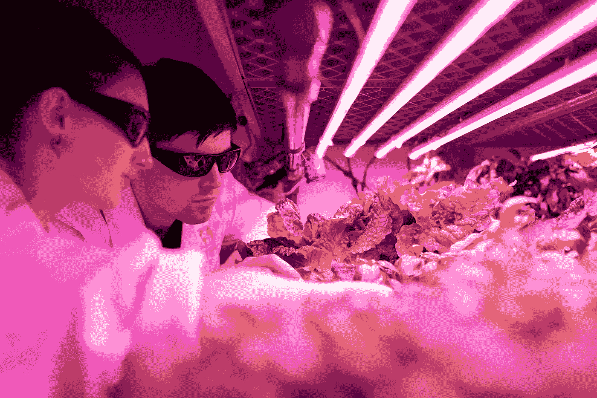
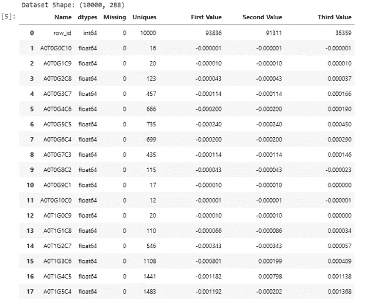
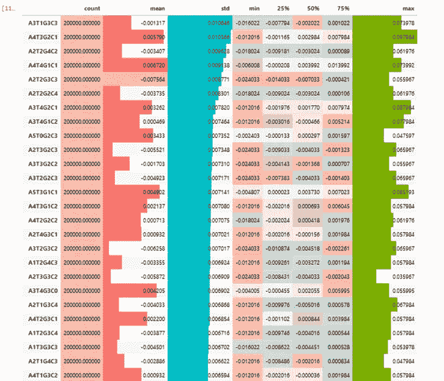
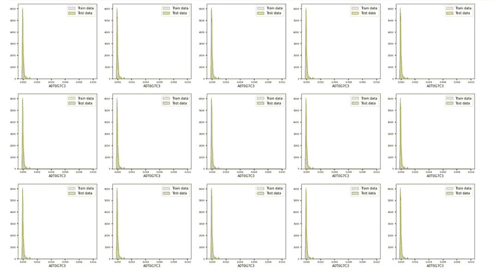
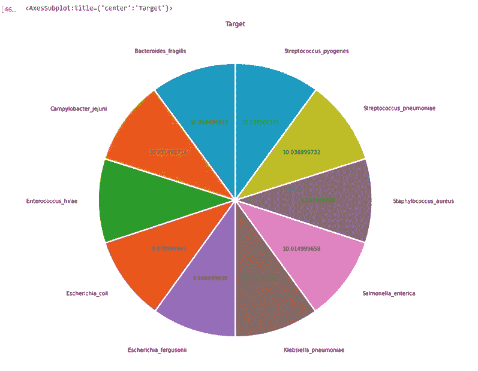
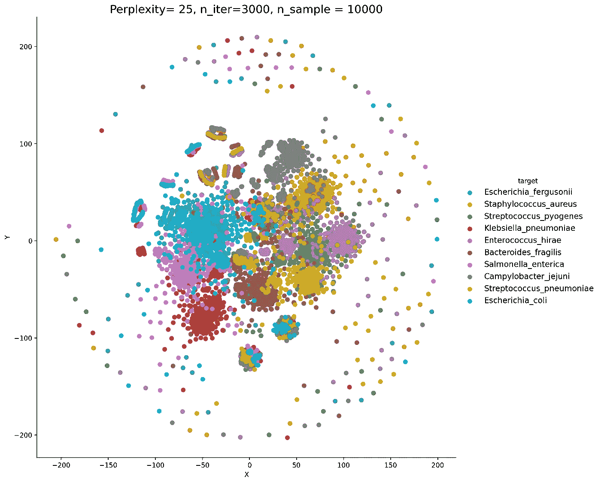
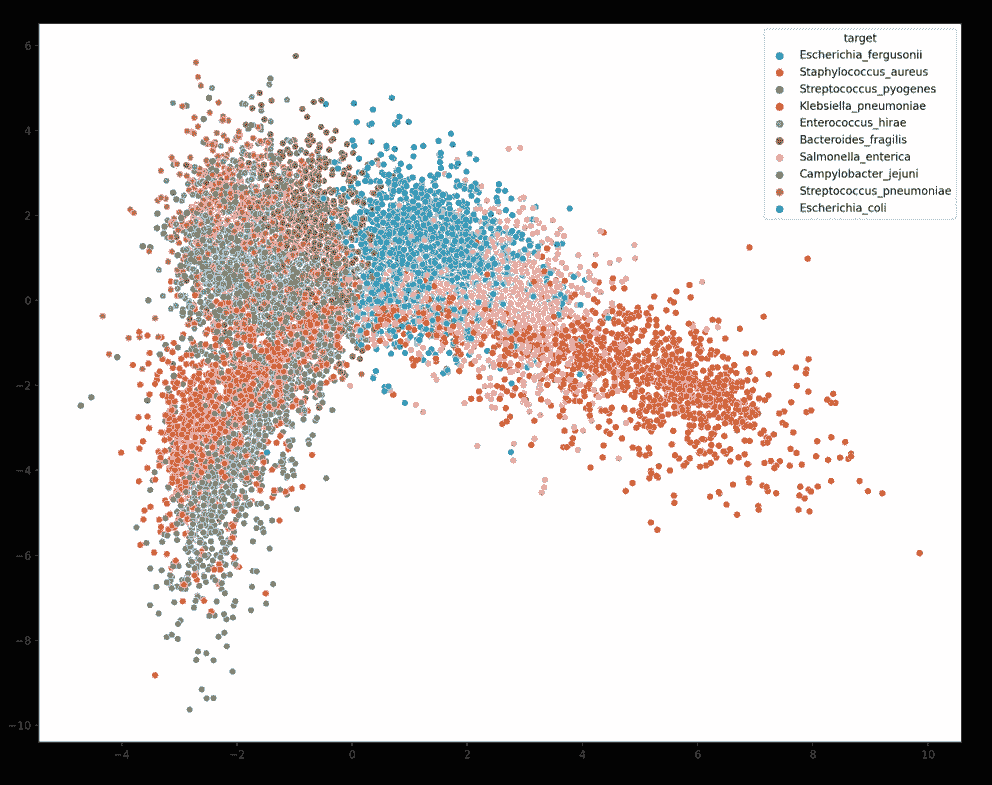

# 数据工程师使用的探索性分析代码块

> 原文：<https://blog.devgenius.io/data-science-exploratory-analysis-code-blocks-used-by-data-engineers-ce4529b70672?source=collection_archive---------10----------------------->

**“到无限远，甚至更远！”**


维特·哈默在 [unsplash](https://unsplash.com/photos/8FjAcgcWR4E?utm_source=unsplash&utm_medium=referral&utm_content=creditShareLink) 上拍摄的照片

寻找更快的 EDA 分析技巧是成为独角兽数据科学家的关键一步。Kaggle 是一个数据科学竞赛平台，开放了对各种 python、R 和 pyspark 代码的访问，用于开发机器和深度学习模型。从识别数据模式、编码数据类型方案、处理缺失值、塑造数据结构、分类值编码、设计新功能、理解功能之间的相关性，以及制作高效模型和创建模型推断的端点，EDA 过程对数据工程师来说极具挑战性。在本文中，我们将回顾用于细菌物种挑战的 EDA 的最佳短 python 代码。

这一 50k 美元的挑战基于 10 种细菌的基因组图谱(DNA 片段计数的直方图，例如，ATATGGCCTT DNA 片段等于 A2T4G2C2)对其进行分类。由 Wood、Ryan L .和 Jensen 等人创建的具有挑战性的[数据集](https://www.kaggle.com/competitions/tabular-playground-series-feb-2022)，用于寻找*细菌物种抗生素抗性基因*。更多详情在此[链接](https://www.frontiersin.org/articles/10.3389/fmicb.2020.00257/full)。



由 thisisengineering 在 [unsplash](https://unsplash.com/photos/FDzh1--azLM?utm_source=unsplash&utm_medium=referral&utm_content=creditShareLink) 上拍摄的照片

首先，我们需要使用下面的代码打开数据集:

```
import pandas as pd **#import pandas** train = pd.read_csv(“../input/tabular-playground-series-feb-2022/train.csv”)**#open the train dataset** test = pd.read_csv(“../input/tabular-playground-series-feb-2022/test.csv”)**#open the test dataset**
```

需要快速分析来检查训练和测试数据集，包括 head(前 3 个值)、info(类型)、shape(行数和列数)、unique(没有重复的值)、isna(缺失值的数量)、let's code:

```
**#Variable Description** def description(df):
print(f”Dataset Shape: {df.shape}”) **#check numbers of rows and columns** summary = pd.DataFrame(df.dtypes,columns=[‘dtypes’])
summary = summary.reset_index()
summary[‘Name’] = summary[‘index’]
summary = summary[[‘Name’,’dtypes’]] **#check data types** summary[‘Missing’] = df.isnull().sum().values **#check missing values** summary[‘Uniques’] = df.nunique().values **#check unique values** summary[‘First Value’] = df.iloc[0].values **#check first value** summary[‘Second Value’] = df.iloc[1].values **#Check second value** summary[‘Third Value’] = df.iloc[2].values **#check thrid value** return summary
description(df)
```



**数据集描述**(图片由作者提供)

该数据集包含 288 列，20k 行，5760000 个观察值，0 个缺失值和一个目标变量。此外，训练数据集包含 1 个 row_id 和 1 个目标列、8 个分类列和 278 个连续列。

根据类似的分析，测试数据集包含 100000 行，28700000 个观察值，以及 0 个缺失值。该数据集包含 1 个 row_id、8 个分类列和 278 个连续列。


在 [unsplash](https://unsplash.com/photos/fFQ19Vz_Mu8?utm_source=unsplash&utm_medium=referral&utm_content=creditShareLink) 上由[布鲁克林](https://unsplash.com/es/@brookelark?utm_source=unsplash&utm_medium=referral&utm_content=creditCopyText)拍摄的照片

1.  **统计分析**

在下面的代码中可以找到实现最多的分析之一:

```
train.drop([“row_id”, “target”], axis = 1 , inplace = True) **#drop the target variable**
FEATURES = [col for col in train.columns] **# select the features variables** 
train.describe().T.sort_values(by=’std’ , ascending = False)\ **#check standart deviation for each DNA segments**
 .style.background_gradient(cmap=’Pastel1')\
 .bar(subset=[“max”], color=’#7CAE00')\ **#check maximum values for each DNA segements**
 .bar(subset=[“mean”,], color=’#F8766D’)\ **#create a bar chart for the mean values**
 .bar(subset=[“std”,], color=’#00BFC4')**#create a bar chart for the std values**
```

它对每个细菌物种 DNA 片段的关键统计值进行了有趣的描述。



**统计分析**(图片作者提供)

我们可以观察到细菌 DNA 片段的相同值的复杂模式(最小 25%、50%、75%值的彩色蜡笔),需要进一步分析才能理解。


纳扎尔·穆罕默德在 [Unsplash](https://unsplash.com/photos/ANAGcyPUVwk?utm_source=unsplash&utm_medium=referral&utm_content=creditShareLink) 上的照片

**2。数字特征分布**

另一个 EDA 代码显示了 278 个细菌 DNA 片段的连续分布，代码如下:

```
**#Create a dataframe with both train and test datasets**
 df = pd.concat([train[FEATURES], test[FEATURES]], axis=0) **#Select categorical and continous features** cat_features = [col for col in FEATURES if df[col].nunique() < 25]
 cont_features = [col for col in FEATURES if df[col].nunique() >=\ 25]

**#Select the first 10 features** n_features = cont_features[:10]**#plot a seaborn density plots of both the train and test datasets** ncols = 5
 nrows = 10
 fig, axes = plt.subplots(nrows, ncols, figsize=(25, 50))for r in range(nrows):
 for c in range(ncols):
 col = n_features[ncols]
 sns.kdeplot(x=train[col], ax=axes[r, c], color=’#F8766D’, label=’Train data’ , fill =True)
 sns.kdeplot(x=test[col], ax=axes[r, c], color=’#7CAE00', label=’Test data’, fill =True)
 axes[r,c].legend()
 axes[r, c].set_ylabel(‘’)
 axes[r, c].set_xlabel(col, fontsize=10)
 axes[r, c].tick_params(labelsize=7, width=2)
 axes[r, c].xaxis.offsetText.set_fontsize(10)
 axes[r, c].yaxis.offsetText.set_fontsize(10)
 plt.show()
```



**数字特征分布**(图片由作者提供)

该分析显示了细菌 DNA 片段几乎相同的连续分布。

主要问题是我们如何从未知的 DNA 片段中识别细菌？为了找到解决方案，我们需要更深入地研究机器学习分析。

**3。目标分配**

机器学习工程之前最常见的分析之一就是研究我们训练数据集中的目标分布，我们来编码:

```
**# Define the pie figure size**
 pie, ax = plt.subplots(figsize=[18,12])
**# Group the trainning dataset by the target column only and plot a pie plot using matplotlib** train.groupby(‘target’).size().plot(kind=’pie’,autopct=’%0.9f’,title=’Target’, ylabel=’’, startangle=90, labeldistance=1.15, wedgeprops = { ‘linewidth’ : 3, ‘edgecolor’ : ‘white’ })
```



**目标分布分布**(图片作者提供)

我们可以观察到 10 种不同的细菌类型，几乎有 10%的代表性。


菲利普·布阿齐兹在 [Unsplash](https://unsplash.com/photos/gY60AYAh7Jw?utm_source=unsplash&utm_medium=referral&utm_content=creditShareLink) 上拍摄的照片

**4。使用 tsne** 进行聚类分析

很难同时理解 256 个变量。为了以简化的方式通过 DNA 片段对细菌进行聚类，通常使用 t-SNE 分解法。

```
**#Import the tsne and standardscaler package** from sklearn.manifold import TSNE
from sklearn.preprocessing import StandardScaler
**#Define a sample dataframe of 10000 rows** train_subset = train.sample(10000, random_state= 42)
**#Define the tsne with 2 components** tsne = TSNE(n_components=2, random_state=0, perplexity= 50, n_iter=3000)
**#Fit the tsne with the normalized dataset**transformed_data = tsne.fit_transform(StandardScaler()\
.fit_transform(train_subset[cols].values))
**#Design a dataset with both the previous features and target variables** tsne_data = np.vstack((transformed_data.T, train_subset.target)).Ttsne_df = pd.DataFrame(data=tsne_data, columns=(“X”, “Y”, “target”))
**# Plot the previous dataframe with color palets (hue) bacteria species** sns.FacetGrid(tsne_df, hue=”target”, height=6).map(plt.scatter, ‘X’, ‘Y’).add_legend()plt.title(‘Perplexity= 50, n_iter=3000’)
 **# Title** plt.show()
```



**使用** tsne 进行聚类分析(图片由作者提供)

上图显示，最佳方法不是线性模型。

**5。使用 LDA 进行聚类分析**

根据数据集中 DNA 片段的相似性对细菌进行分类的另一种方法是线性判别分析法。让我们编码:

```
from sklearn.discriminant_analysis import LinearDiscriminantAnalysis as LDA **#Import the LDA** train_sub = train.sample(50000, random_state= 42) **# Sample the train dataset
# Define the LDA with 3 components and fit it to the train sample** lda_data = LDA(n_components=3).fit_transform(train_sub\
 .drop(columns=’target’),train_sub.target)
plt.figure(figsize=(15,12))**#Define the figure size** sns.scatterplot(x = lda_data[:, 0], y = lda_data[:, 1], hue = ‘target’, data=train_sub) **#Plot the components** plt.savefig(‘LDA.png’, dpi=200) **#Save plot**
```



**使用 LDA 进行聚类分析**(图片由作者提供)

对于我们数据集的 50k 多行，可以在几秒钟内观察到清晰的聚类。我们可以看到金黄色链球菌(橙色)和空肠弯曲杆菌(灰色)具有相似的 DNA 片段。

**求和**

使用这些简化的 python 代码对细菌 DNA 片段进行完整的 EDA 分析，请参考此 [**链接**](https://jovian.ai/yeonathan/bacteria-tps-022) 。

这个简短的概述提醒了数据工程师使用 python 进行探索性数据分析的重要性。这篇文章的范围涵盖了 5 个简化的 Python EDA 代码，以便为复杂的近期 Kaggle 竞赛数据集制作一个有用的探索工作流程。

**希望你喜欢，继续探索:-)**


Philippe Bouaziz 在 [Unsplash](https://unsplash.com/photos/zB_hYYqhMb8?utm_source=unsplash&utm_medium=referral&utm_content=creditShareLink) 上的照片