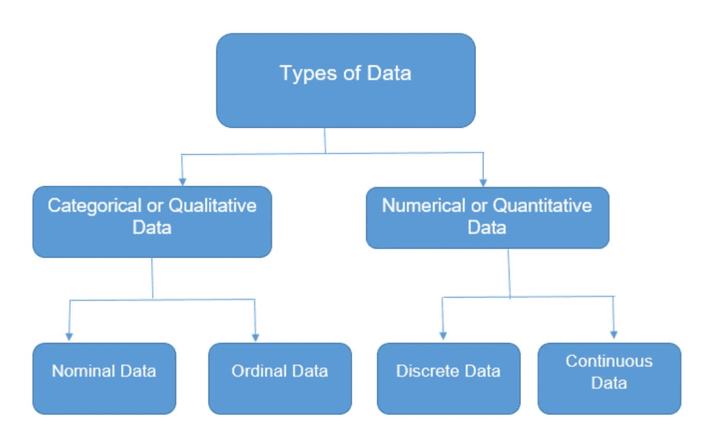

# 初学者的数据科学

> 原文：<https://blog.devgenius.io/data-science-for-beginners-6238821ae60a?source=collection_archive---------13----------------------->

一个**变量**是一个值或特征，它对于群体中的每一个成员都是变化的，这是一个代表巨大的**数据点**的符号，我们也称之为**值**

变量的类型

1.  数字的
2.  绝对的
3.  日期时间
4.  混合的

# 数据

它包括所有数字系统计算指标。

它可以分为两种类型

**连续数值数据**:数据可以在每个区间定义，处理连续量和分数量

例如南加州城市的华氏温度模板、贷款利率、学习期间课堂上消耗的时间和精力以及个人体重

**离散数值数据:**通常由整数数据组成

例如，城市中不同社区的房屋数量，门的高度，以及你所在州每个 TMCA 的椭圆机数量

# 分类变量

分类变量数据包括序数和名词性数据

**有序分类变量:**与顺序相关联的变量，尽管顺序很重要。这个顺序只是在一个特定变量的值中被观察到。邪恶的笑（Evil Grin 的缩写）

> 工作日、教育学位(O 级、A 级、副学士学位)、成绩等级(A+、A、A-、B+、F)和编号

**名义** **分类变量**:与订单无关的变量，它只是一个描述或信息

例如城市、国家、性别、显示类型

# 日期时间变量

它主要处理时间和日期

此类别可以包含下面提到的值类型:

1.  只是在约会。
2.  只有时间。
3.  有日期和时间的。

例如申请提交日期、工作开始日期、汽车租赁

# 混合变量数据

## 参数 Vs **分类变量:**

## 因素

特征总体的数字描述。

它汇总了所有人群的数据。

参数通常是已知的。

它实际上代表了我们想要了解的群体

## 样品特盏

特征样本的数字描述。

它是更大人口群体的一个子集。为了检验和观察的目的，我们通常从较大的人群中抽取少量的数据

它实际上代表了我们所知道的群体

统计数据一般是未知的。

图片来自 vectorstock.com

# 识别参数和统计数据

让我们来看一些可能对识别人口和统计数据有很大帮助的示例问题

欲了解详情，请访问[https://www2.southeastern.edu/](https://www2.southeastern.edu/)

让我们看看每个问题的解释。

首先

**统计学的分支**

**数据收集**

**描述统计学:**它是统计学的一个分支，主要关注数据的呈现。描述性统计的基本目的是“以可理解的方式呈现数据”。这可以通过两种形式实现

1.  图形、图表等直观表示
2.  数字表示均值、中值和一些平均值

**推断统计学:**这个分支主要处理用数据做出结论。这就好比问自己“这个数据在告诉我们什么，我们应该怎么做”。利用你所掌握的数据，做出一个推论或结论。

推断统计学有两个主要领域:

1.  估计参数。这意味着从你的样本数据中提取一个[统计量](https://www.statisticshowto.com/statistic/)(例如[样本均值](https://www.statisticshowto.com/probability-and-statistics/statistics-definitions/sample-mean/))，并用它来说明某个总体参数(即总体均值)。
2.  [假设检验](https://www.statisticshowto.com/probability-and-statistics/hypothesis-testing/)。这是您可以使用样本数据来回答研究问题的地方。例如，你可能想知道一种新的抗癌药物是否有效。或者早餐是否有助于孩子在学校表现更好。

# 例子

例如，你可能站在一个购物中心，问 100 个人是否喜欢在西尔斯购物。你可以用[条形图](https://www.statisticshowto.com/probability-and-statistics/descriptive-statistics/bar-chart-bar-graph-examples/)表示是或否的答案(这将是[描述性统计](https://www.statisticshowto.com/probability-and-statistics/descriptive-statistics/))或者你可以用你的研究(和推断性统计)推断出大约 75-80%的人(**所有**购物中心的所有**购物者**)喜欢在西尔斯购物。

**数据分类**

图片来自 coolgyan.org

数据主要可以分为两大类

1-定性

2-定量

**定量:**由计数和测量组成的数字数据，如高度、重量和气体泄漏。邪恶的笑（Evil Grin 的缩写）

*   高度
*   重量
*   脉搏率
*   年龄
*   体温
*   学分
*   测验分数
*   平均降雨量

**定性:**由标签和描述组成的分类数据，例如

*   眼睛颜色
*   性别
*   宗教偏好
*   是/否
*   家乡
*   最喜欢的食物
*   身份证号码

# 测量水平

测量的间隔水平的数据是可以以有意义的顺序排列的定量数据，并且数据条目之间的差异是有意义的

有 4 个测量级别:

*   **名义:**数据只能分类
*   **序数:**可以对数据进行分类和排序
*   **间隔:**数据可以被分类，排列，并均匀分布
*   **Ratio:** 数据可以分类，可以排名，可以均匀分布，有自然零点。

***名义层:数据可以用标签*** 分类，类别之间没有先后顺序

性别、婚姻状况、汽车品牌、国家

***序数级:*** *数据也可以进行分类和排序*

*   前五名奥运奖牌获得者
*   语言能力(例如，初级、中级、流利)

***区间层次:*** 你可以对相邻数据点进行分类、排序、推断等间隔，但是没有真正的零点。

任何两个相邻温度之间的差异都是一样的:1 度。但是零度根据不同的尺度有不同的定义——它并不意味着绝对没有温度。

*   测试分数(如智商或考试)
*   个性量表
*   华氏温度或摄氏温度

***比值水平:*** 可以对相邻数据点进行归类、排序、推断等间隔，并且存在真零点。

*   高度
*   年龄
*   重量
*   开尔文温度

在两个测量水平上的变量的例子你可以在序数或比率水平上测量收入的变量。

*   **序数级:**你创建收入范围的等级:0-19，999 美元，20，000-39，999 美元，40，000-59，999 美元。你要求参与者选择代表他们年收入的类别。括号用 1-3 的数字编码。
*   比率水平:你收集参与者的确切年收入数据。

参与者收入(顺序级别)收入(比率级别)收入 1 12，550 美元收入 2 39，700 美元收入 3 40，300 美元

在比率水平上，你可以看到 A 和 B 的收入差远远大于 B 和 C 的收入差。

然而，在一个序数层次上，你只知道每个参与者的收入等级，而不知道他们的确切收入。由于您无法准确说出数据集中每项收入与其他收入的差异有多大，因此您只能对收入水平进行排序，并对参与者进行分组。

这篇文章主要是为新手提供一个前进的方向，我希望你们能从中学习。一如既往，欢迎分享您的想法和反馈。

Syeda Marium Faheem。