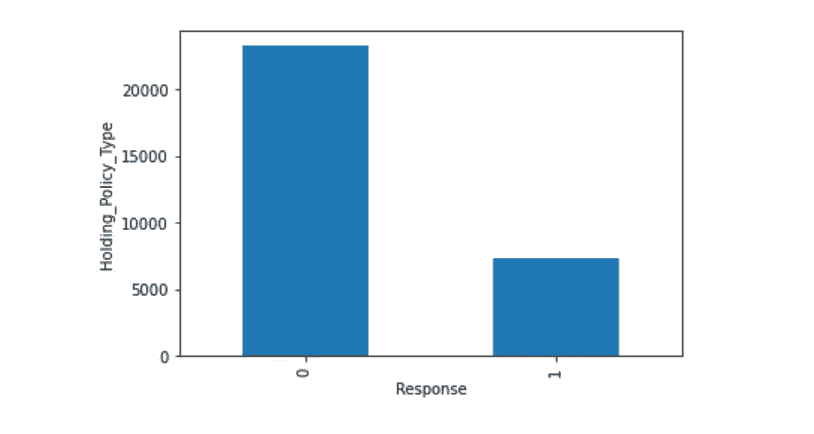
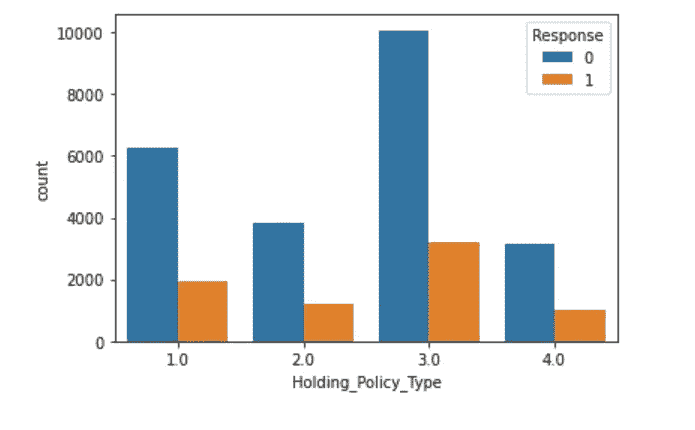
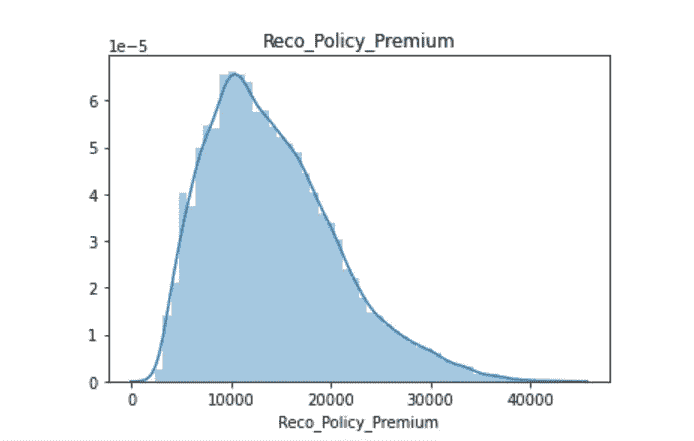

# 数据科学黑客马拉松实施

> 原文：<https://blog.devgenius.io/data-science-hackathon-implementation-25d07d5e5d56?source=collection_archive---------6----------------------->

2021 年 2 月，我参加了由 AnalyticsVidhya 举办的数据科学黑客马拉松。成为如此有趣的挑战的一部分是一次令人惊奇的经历，我从我的第一次经历中学到了很多东西。

这些挑战确实有助于激发疯狂的能量来封装所有已知的数据科学概念，通过多种功能组合来解决手头的问题，并破坏大脑和神经以获得绝对最重要的结果。

所以让我们开始吧！！！


**问题陈述:**fin man a**金融服务公司提供贷款、投资基金、保险等各种金融服务。给它的顾客。FinMan 希望向现有客户交叉销售保单，这些客户可能持有该公司的保单，也可能不持有。**

**目标结果:**该公司需要建立一个模型，在给定以下信息的情况下，预测该人是否会对其提议的健康计划/政策感兴趣:

*   人口统计(城市、年龄、地区等。)
*   关于客户持有政策的信息
*   推荐的政策信息

实现细节如下:

# **A .数据探索**

1.  使用的库:Pandas，Numpy，Seaborn，Matplotlib
2.  使用 info()、describe()和 shape 等函数分析数据
3.  使用以下代码检查每个特性中缺失值的数量:

```
df.isnull().sum()
```

4.检查每个特征的 ***相关性*** 与目标变量

```
sns.heatmap(df.corr())
```

5.分离数字和分类特征

```
#Numerical Features
num_fields=[feature for feature in df.columns if df[feature].dtypes!=’O’ ]#Categorical features
cat_feature=[feature for feature in df.columns if df[feature].dtypes=='O']
```

6.对于每个数值特征，检查它是一个 ***离散*** 数值特征还是一个 ***连续*** 数值特征。这里，唯一值小于 30 的所有特征被视为离散的，否则被视为连续的特征

```
#Number of unique values 
for feature in num_fields:
 print(‘{}: {} Unique values’.format(feature,df[feature].nunique()))#Discrete Numerical Features
discrete_feature=[feature for feature in num_fields if df[feature].nunique()<30]#Continuous Numerical Features
continuous_feature=[feature for feature in num_fields if df[feature].nunique()>30]
```

7.检查离散特征与目标列的关系

a.这里的“响应”是目标(因变量),我们将“持有策略类型”计数分组到收到的相应响应中



```
for feature in discrete_feature:
 data.groupby(‘Response’)[feature].count().plot.bar()
 plt.xlabel(‘Response’)
 plt.ylabel(feature)
 plt.show()
```

b.下面，我们将比较每个“Holding_Policy_Type”类别的回应数量



```
sns.countplot(x=df[‘Holding_Policy_Type’],hue=df[‘Response’])
```

9.分析 ***数据的分布*** 为连续特征。它帮助我们了解数据是否有偏差，以及是否需要应用任何转换，如对数转换



```
for feature in continuous_feature:
 sns.distplot(df[feature])
 plt.title(feature)
 plt.show()
```

10.对于分类特征，我们分析每个特征中唯一值的数量，以了解要实现的编码类型

# **B .特色工程**

**1。通过删除基于**的特征来执行特征选择

*   缺失值百分比高的要素
*   共线(高度相关)要素
*   基于树的模型中重要性为零的特征
*   具有单一唯一值的要素

**2。插补**

*   插补是用替代值替换缺失数据的过程
*   ***分类特征*** 中缺失值有多种处理方式。在这种情况下，每个分类特征中缺失的值被识别并替换为“新类别”

```
df[‘Health Indicator’]=np.where(df[‘Health Indicator’].isnull(),’XN’,df[‘Health Indicator’])
```

*   对于 ***数值特征*** ，缺失的数值被替换为 0

```
df[‘Holding_Policy_Type’]=df[‘Holding_Policy_Type’].fillna(0)
```

*   其中一个字符串类型的类别包含数值，因此特征值被转换为浮点型，缺少的值被替换为 0

```
#Converting the string value into numeric value
df[‘Holding_Policy_Duration’]=df[‘Holding_Policy_Duration’].apply
(lambda x: float(x))#Replacing the missing values by 0
df['Holding_Policy_Duration']=df['Holding_Policy_Duration'].
fillna(0)
```

**3。编码**

*   在处理分类数据以将值转换为数值类型时，编码是必需的预处理步骤
*   **一键编码:**包含较少类别值的分类特征使得应用一键编码更有效，以避免维数灾难

```
pd.get_dummies(df[[‘Accomodation_Type’,’Reco_Insurance_Type’,’Is_Spouse’]],drop_first=True)
```

*   **目标编码:**我们不能对包含更多类别的分类特征实施一键编码，因为这会增加维度的数量。为此，对这些特征实施了目标编码，其中评估了根据目标列的每个类别的平均值，并且每个标签被其各自的值替换

```
values_city_code=round(df.groupby(‘City_Code’)[‘Response’].mean(),3)
df[‘City_Code’]=df[‘City_Code’].map(values_city_code)
```

**4。缩放比例**

*   机器学习中的特征缩放是在创建机器学习模型之前的数据预处理期间最关键的步骤之一
*   机器学习算法只看到数字——如果范围有很大的差异，比如几千范围内的差异和几十范围内的差异，它可能会做出潜在的假设，即更高范围内的数字具有某种优势。所以这些更重要的数字在训练模型时开始起更决定性的作用。因此，需要将所有的特征值都放在同一范围内
*   最常见的特征缩放技术是规范化和标准化
*   为这个问题语句实现的特征缩放是使用 MinMaxScaler 库的标准化

```
from sklearn.preprocessing import MinMaxScaler
minmax=MinMaxScaler()
minmax.fit(df[features])
```

**5。存储数据**

*   遵循所有特征工程步骤后，我们以 pickle 格式或任何其他合适的格式保存数据，以避免每次使用相同数据运行代码时执行上述步骤

# C.型号选择

1.  当应用模型时，我们需要分离独立特征和从属(目标)特征
2.  这是一个分类问题陈述，实现了诸如 DecisionTreeClassifier、XGBoostClassifier 和 RandomForestClassifier 之类的算法，并且基于准确性分数和 Roc Auc 分数，相应地选择了 XGBoostClassifier
3.  为了算法和参数的最佳选择，使用了超参数调谐
4.  **算法选择:**实现 TPOTClassifier 库，以便了解数据集的最佳可能算法

```
from tpot import TPOTClassifier
tpot=TPOTClassifier()
tpot = TPOTClassifier(generations=5, population_size=20, cv=5,random_state=42, verbosity=2)
tpot.fit(X_train, y_train)
```

5.**参数选择:**

*   可以使用 RandomSearchCV 和 GridSearchCV 等超参数技术
*   RandomSearchCV 可以通过以下方式实现，以了解算法中要使用的最佳参数组合:

```
#Hyperparameter optimization
params={
 “learning_rate” : [0.05, 0.10, 0.15, 0.20, 0.25, 0.30 ] ,
 “max_depth” : [ 3, 4, 5, 6, 8, 10, 12, 15],
 “min_child_weight” : [ 1, 3, 5, 7 ],
 #The value should be less than 1
 “gamma” : [ 0.0, 0.1, 0.2 , 0.3, 0.4 ],
 #The value should be less than 1
 “colsample_bytree” : [ 0.3, 0.4, 0.5 , 0.7 ]
}#Implementing RandomSearchCV for hyperparameter tuning
random_search=RandomizedSearchCV(classifier,param_distributions=params,n_iter=5,scoring='roc_auc',n_jobs=-1,cv=5,verbose=3)random_search.fit(X_train,y_train)
random_search.best_estimator_
```

6.从随机搜索中获得的结果用作 XGBoostClassifier 中的参数值，然后执行 fit 方法

```
import xgboostclassifier=xgboost.XGBClassifier(base_score=0.5, booster='gbtree', colsample_bylevel=1,colsample_bynode=1, colsample_bytree=0.5, gamma=0.0, gpu_id=-1,importance_type='gain', interaction_constraints='', learning_rate=0.05, max_delta_step=0, max_depth=4,min_child_weight=3,  monotone_constraints='()', n_estimators=100, n_jobs=0, num_parallel_tree=1, random_state=0, reg_alpha=0, reg_lambda=1, scale_pos_weight=1, subsample=1, tree_method='exact', validate_parameters=1, verbosity=None)classifier.fit(X_train,y_train)
```

7.然后，我们检查在训练数据上实现的模型的准确性。这是一个分类问题，我们将使用准确性得分和 ROC AUC 得分来确定模型效率

```
from sklearn.metrics import accuracy_score,roc_auc_score
y_pred=classifier.predict(X_train)#Accuracy Score
acc_score=accuracy_score(y_test,y_pred)
print('Accuracy Score: ',acc_score)#ROC AUC Score
roc_auc_score=roc_auc_score(y_test,y_pred)
print('ROC AUC Score: ',roc_auc_score)
```

# D.预测测试数据的目标值

1.  在模型选择之后，我们将预测测试数据的目标值
2.  为训练数据遵循的所有特征工程步骤也需要为测试数据实现
3.  我们使用在训练阶段创建的模型对象的预测方法来评估分类问题输出

```
test_pred=classifier.predict(X_test)
```

希望这篇文章有深刻的见解，是一个有用的倡议，从解决数据科学问题开始。