# 数据科学项目:预测性维护分类，第一部分

> 原文：<https://blog.devgenius.io/data-science-project-predictive-maintenance-classification-part-i-70dcc2c7a516?source=collection_archive---------4----------------------->

在一个阳光明媚的周六，来自一个新的数据科学项目的问候。你好吗我希望你一切都好。上周，我们在与我的朋友[杰姆·özçeli̇k](https://medium.com/u/e7aec74cd6ed?source=post_page-----70dcc2c7a516--------------------------------)交谈时关注了当前的问题，并准备了一些关于数据科学的网络文章。

随后，我们想到了以下问题:当生产工作台、计算机(它们是工厂或任何企业中用于生产服务或产品的固定装置)进入任何故障状态时，它们会给企业或工厂造成多大的成本？或者，从另一个角度来看，如果我们提前知道组织中使用的生产工具可能会失败，我们可以为组织避免多大的生产成本？

在这篇文章中，我们和我的朋友一起关注了一个机器学习模型，该模型将机器可能犯的错误分类为错误类型，并对机器的故障进行预测。

在这项研究的实现过程中，我们在一个班级中使用了多个机器学习模型。在这项研究中，我们通过只查看准确度分值来衡量我们使用的不同机器学习算法的预测能力。在我们接下来的研究中，我们将通过检查其他性能指标(召回率、RMSE、MSE、AUC 分数等)来使用最准确的模型。)的既定算法。

现在我们可以继续学习了。首先，我们导入将在研究中使用的库:

导入库后，我们导入要在研究中使用的数据集:

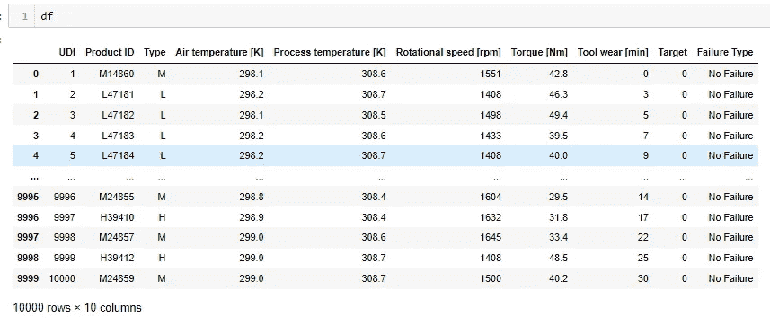

当我们查看数据集时，我们看到它由不同的列组成。我认为解释数据集中的列是有用的:

*   数据集由 10，000 行和 14 个不同的列组成。
*   UID:范围从 1 到 10000 的唯一标识符
*   ProductID:由字母 L、M 或 H 组成，代表低(所有产品的 50%)、中(30%)和高(20%)产品质量变量和特定于变量的序列号
*   空气温度[K]:使用随机游走过程生成，随后在 300 K 左右归一化为 2 K 的标准偏差
*   过程温度[K]:使用标准偏差为 1 K 的随机游走过程生成，加上空气温度加上 10 K。
*   转速[rpm]:根据 2860 W 的功率计算，叠加正态分布噪声
*   扭矩[Nm]:扭矩值通常分布在 40 Nm 左右，μ= 10Nm，没有负值。
*   工具磨损[分钟]:质量变量 H/M/L 会使过程中使用的工具增加 5/3/2 分钟的工具磨损。以及“机器故障”标签，该标签指示机器在该特定数据点中是否因以下故障模式中的任何一种而出现故障。

关于数据集的另一个要点是有 2 个目标变量:

*   目标:失败与否。
*   故障类型:故障的类型

由于将这些作为预测模型中的任何变量可能会影响模型性能，因此我们将它们都用作因变量。

解释完数据集中的变量后，我们创建一个新变量，一个新列，用于我们的模型。在创建该列时，我们使用了**“总磨损量”**和**“扭矩”**变量。同时，它从数据集中删除数据集中的 ID 和 ProductID 变量。

特征工程-数据清理

现在我们根据数据集中的目标变量进行可视化:

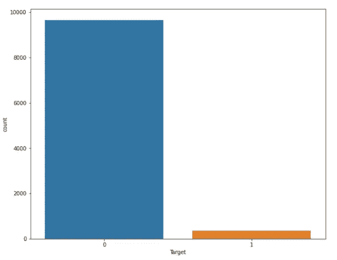

使用目标特征的数据可视化

通过使用目标变量，我们根据错误类型获得错误的数量:

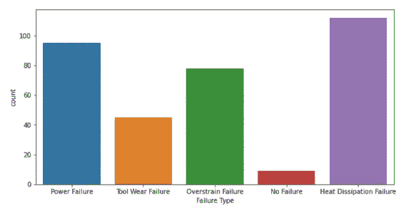

错误类型频率

现在，我们使用 pairplot 根据目标变量检查其他变量的分布:

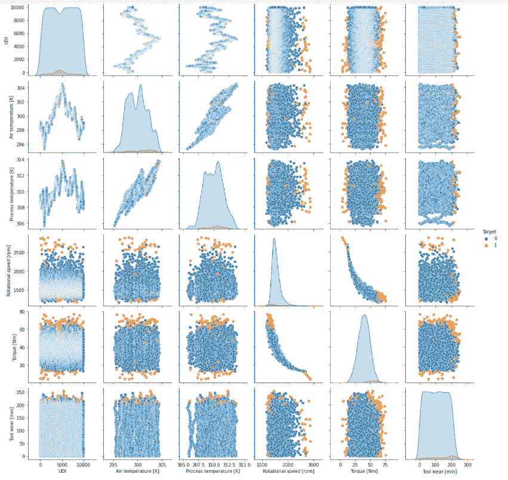

根据目标变量的变量分布

根据目标变量查看变量的分布后，我们使用热图查看变量之间的关系水平:

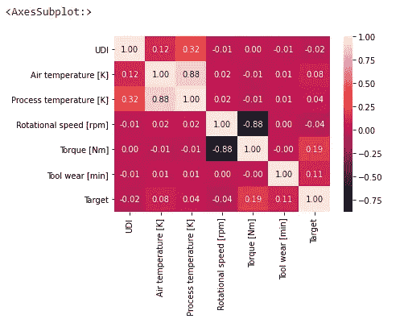

变量与目标变量以及变量之间的相关性

看到变量之间的相关水平和方向后，让我们根据目标变量用箱线图观察其他数值变量的可变性:

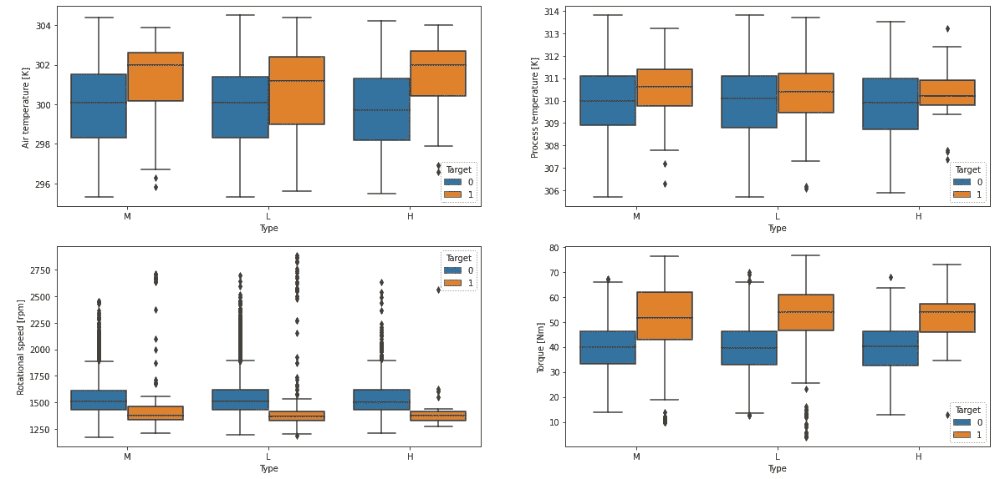

数字变量的可变性-1

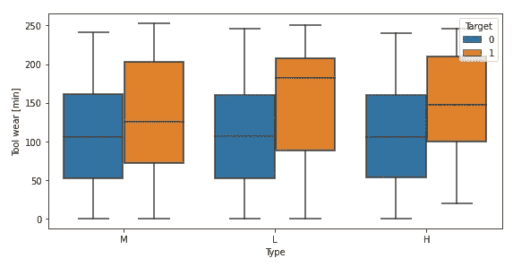

数字变量的可变性-2

根据数值变量用各种图形将目标变量的状态可视化后，根据“**扭矩**”、“**旋转功率**”、“**刀具磨损**变量在公共轴上进行可视化处理。为此，下面的 3D 图形:

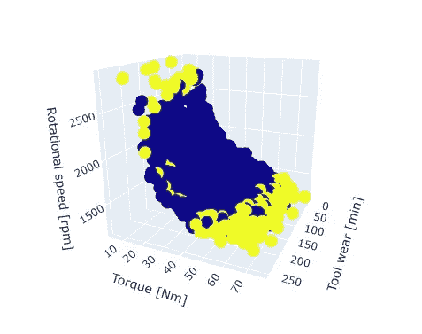

目标变量分布— 3D

## 模型的数据预处理

我们根据数据集中的变量进行可视化。完成探索性数据分析流程后，我们执行数据预处理流程，例如为机器学习算法的数据集进行编码:

我们将包含文本项的列更改为数字变量。我们将包含文本项的列更改为数字变量。现在，我们将数据集分为训练和测试两部分:

ML 算法的分割数据集

我们还导入了我们将在研究中使用的机器学习库。接下来，我们将创建一个显示每个 ML 算法的准确度分数的类。

导入算法

在我们为机器学习算法导入库之后，我们创建一个类，并列出每个机器学习算法的准确度分数。我还想补充一点，这种技术可以使数据科学家的工作变得更加容易，我们特别推荐将这种技术包含在项目流程中使用的模板中。

为显示 ML 算法的同义词而创建的类

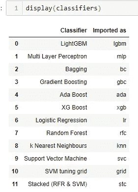

所用 ML 算法的同义词列表

我们拟合要使用的机器学习算法，并在列表中显示准确度分数:

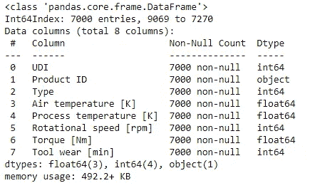

信息结果

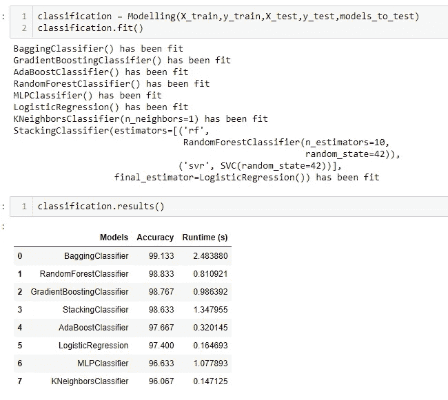

得分

我们可以在列表中看到各种机器学习算法的命中分数。好了，我们的学习已经到了尾声。在我们研究的这一部分中，我们通过编写一个包含第 1 部分中许多不同算法的类，专注于以一种非常简单的方式解决这个问题。我们还获得了不同 ML 算法的命中分数。在我们的下一个研究中，在第 2 部分，这将是本研究的继续，我们将尝试平衡数据集，并尝试不同的适合问题的度量标准。因此，正如我们在文章开头所说的，我们将具体地测量我们将应用于业务问题的 ML 算法的性能。

我希望这对你来说是一次愉快的阅读课。在我们研究的下一部分再见。