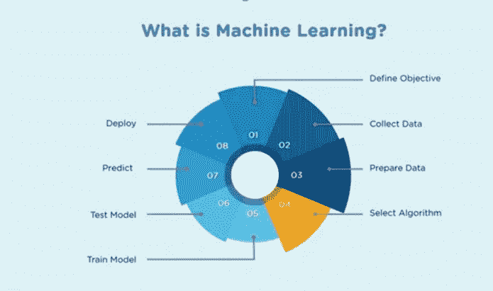
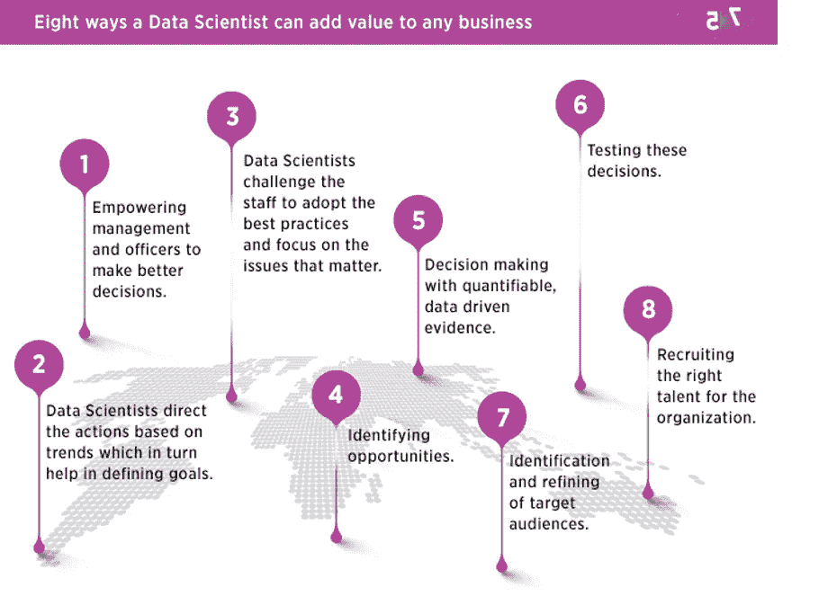

# 数据科学路线图:6 个阶段的硕士。

> 原文：<https://blog.devgenius.io/data-science-road-map-master-in-6-stages-6a3a1734e641?source=collection_archive---------8----------------------->

弗兰基·查马基在 [Unsplash](https://unsplash.com?utm_source=medium&utm_medium=referral) 上拍摄的照片

## 权威指南

## 数据科学路线图将指导您完成从数据科学基础到高级的每一步。

在21 世纪，计算机科学的进步、智能机器的发展和海量数据的产生导致了新的研究领域、术语、数据科学和机器学习的发展。从行业销售预测等简单任务到无人驾驶汽车等雄心勃勃的项目，通过使用数据科学的算法和技术，一切都变得可能。

在选择数据科学领域的正确方向时，我自己也困惑了很长时间，犯了很多错误。我希望在这篇文章结束时，我将帮助许多有抱负的数据科学家在学习数据科学时有一个清晰的路径选择。

> 谷歌的无人驾驶汽车和机器人受到了很多媒体的关注，但该公司真正的未来在于机器学习，这项技术可以让计算机变得更加智能和个性化。
> 
> *–埃里克·施密特(谷歌董事长)*

# 议程:

该路线图的议程是清除数据科学领域的噪音。对于数据科学领域的初学者和专业人员来说，这一直是一个困惑的来源。

## 数据科学路线图分为以下几个阶段

*   数学基础
*   编程；编排
*   SQL 和数据仓库
*   数据分析和可视化
*   机器学习算法
*   基于云的部署

# 数学基础:

数学是所有关键数据科学过程的基础。它包括统计学、线性代数、微分学、离散数学等。

**最佳资源:** - [数据科学专业数学](https://www.coursera.org/specializations/mathematics-for-data-science?ranMID=40328&ranEAID=AfpokvaRFDA&ranSiteID=AfpokvaRFDA-L74_CrBoEL9cQCxqnSwFmg&siteID=AfpokvaRFDA-L74_CrBoEL9cQCxqnSwFmg&utm_content=10&utm_medium=partners&utm_source=linkshare&utm_campaign=AfpokvaRFDA) (Coursera)

# 编程:

掌握一门与数据科学相关的编程语言是非常必要的，在数据科学领域最常用的语言是 Python 和 R 语言。最好学习 Python，因为与 R 语言相比，它更容易使用，使用率也更高。

**最佳资源:-** [人人专精的 Python](https://www.coursera.org/specializations/python?)(Coursera)

# SQL 和数据仓库:

SQL 和数据仓库概念是您需要开发的一些最重要的技能。大多数人都会犯低估 SQL 的错误，然后在以后的职业生涯中意识到它的重要性。因此，对这些概念建立一个坚实的理解总是更好的。

**最佳资源:-** [数据仓储](https://www.udemy.com/course/data-warehousing/)

# 数据分析和可视化:

数据分析是数据科学中一个非常重要的概念。它通过分析多个数据源来帮助找到有意义的数据。在不同组织中，数据源和数据类型可能不同。数据分析:**检查原始数据以得出信息的科学**。数据分析涉及应用算法或机械流程来获得洞察力。

**最佳资源:** [数据分析师与 Python](https://www.datacamp.com/tracks/data-analyst-with-python?tap_a=5644-dce66f&tap_s=443485-11cad3&utm_medium=affiliate&utm_source=bibinwilson3)

数据可视化将大量处理过的数据转化为对业务中的关键利益相关者有意义的视觉效果。业务分析师可以利用这些有用的信息来寻找业务增长的机会。

数据可视化是创建交互式视觉效果以了解趋势、变化并从数据中获得有意义的见解的过程。数据可视化主要用于数据检查和清理、探索和发现，以及向业务涉众传达结果。大多数数据科学家很少关注图表，只关注数字计算，这有时会产生误导

**最佳资源:-** [数据可视化:绝对初学者的实用方法](https://www.edx.org/course/data-visualization-a-practical-approach-for-absolu?source=aw&awc=6798_1600758377_c91fadcd37139d3e5abb1e75c8a7b47b&utm_source=aw&utm_medium=affiliate_partner&utm_content=text-link&utm_term=572811_devopscube)

# 机器学习算法

机器学习是对计算机进行编程，以使用示例数据或过去的经验来优化性能标准。机器学习是一种自动建立分析模型的数据分析方法。它是人工智能的一个分支，基于这样一种想法，即系统可以从数据中学习，识别模式并在最少的人工干预下做出决策。

**最佳资源:-** [机器学习 A-Z:数据科学中的动手 Python&R](https://www.udemy.com/course/machinelearning/?deal_code=2020ROW30&ranMID=39197&ranEAID=AfpokvaRFDA&ranSiteID=AfpokvaRFDA-fEsEGKo6rNawOjOBIKwZfQ&LSNPUBID=AfpokvaRFDA&utm_source=aff-campaign&utm_medium=udemyads)

图片由[速尾创投](http://www.speedtailventures.com/machine-learning-ai-students/)

## ***机器学习算法***

*   线性回归算法
*   逻辑回归算法
*   决策树算法
*   SVM 算法
*   随机森林算法
*   降维算法

以上是高度使用的机器学习算法的例子，人们最终需要知道并掌握它。

# 基于云的部署:

随着各种云供应商的最终增长，在云中部署机器学习模型已经成为现实，并且正在快速增长。因此，利用多家云供应商提供的各种机器学习 API 有助于大规模分析和部署。

像托管 Hadoop 环境和机器学习工作流框架这样的工具是一个真正的游戏规则改变者，因为它们确实使构建和部署大规模模型变得非常容易。

在此阶段，您将了解基于云的机器学习分析平台。此外，如何将它们用于 21 世纪的数据科学工作负载。

# 常见的数据科学相关问题

## 如何成为一名数据科学家？

1.  数据科学相关技术入门。
2.  获得特定技能的专精。
3.  获取一些**实践经验**参与一个公开的项目或者参加一个真实项目的课程。
4.  用好的项目建立一份非常好的简历
5.  创建一个投资组合。博客会很棒。你可以在那里发表你的经历和学习。

## 成为一名数据科学家需要具备哪些技能？

数据科学 it 编程、数据分析、机器学习、与统计相关的数学、分析等所需的通用技能集。

## 数据科学家工资是多少？

根据[薪级表](https://www.payscale.com/)，数据科学家的平均工资为 96，072 美元

图片由 [Exper](https://www.experfy.com/blog/the-two-sides-of-getting-a-job-as-a-data-scientist/) fy 提供

# 结论:

在这篇数据科学路线图文章中，我们看到了数据科学的关键阶段和相关资源。随着每天都有新的工具和技术出现以适应数据科学中不同的用例，这个列表将会越来越长。

请在评论区让我知道你的想法，为文章添加更多的见解。如果在选择课程或任何其他问题上有困惑，请在下面评论或通过下面提到的联系页面联系我。

[*https://pythonmanin.wordpress.com/contact/*](https://pythonmanin.wordpress.com/contact/)

*【领英:[https://www.linkedin.com/in/manan-b-shah-b6a9b2184/](https://www.linkedin.com/in/manan-b-shah-b6a9b2184/)*

# *参考资料:*

1.  *[https://datasciencepulse.com/](https://datasciencepulse.com/)*
2.  *[https://skillslane.com/](https://skillslane.com/)*
3.  *[https://www . exper fy . com/blog/the-two-sides-get-a-job-as-a-data-scientist/](https://www.experfy.com/blog/the-two-sides-of-getting-a-job-as-a-data-scientist/)*
4.  *[http://www . speedtailventures . com/machine-learning-ai-students/](http://www.speedtailventures.com/machine-learning-ai-students/)*