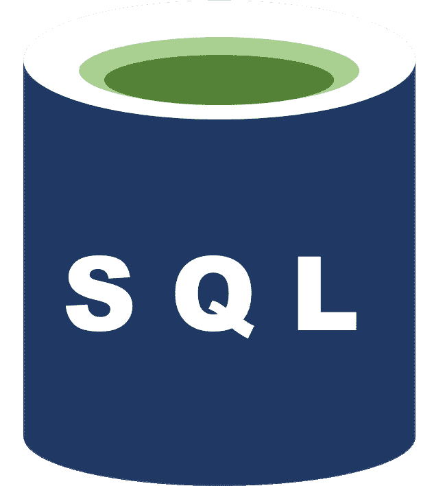
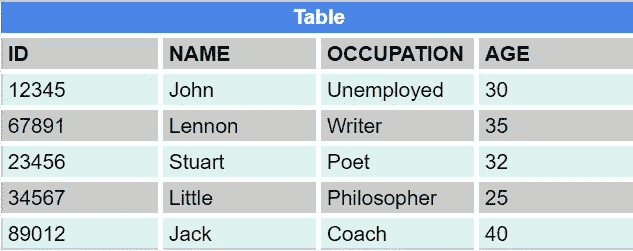
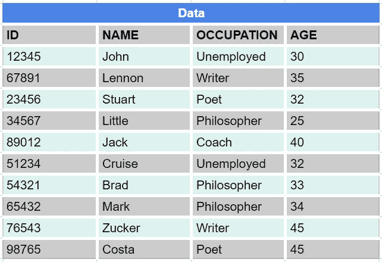
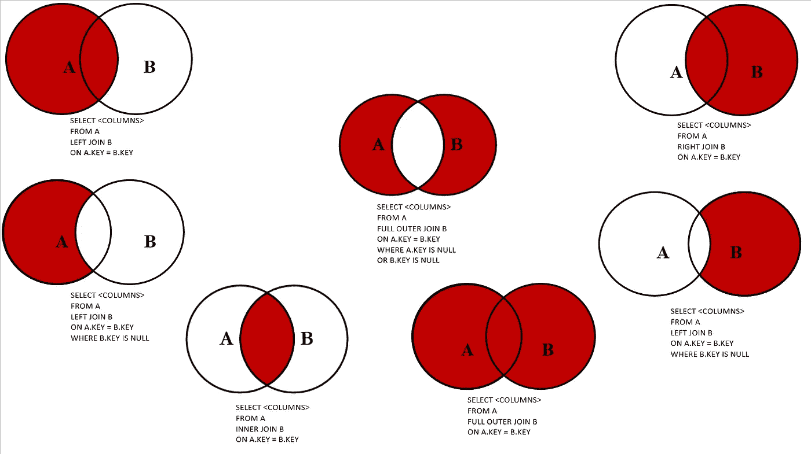

# 数据科学技能:为什么要学习 SQL？

> 原文：<https://blog.devgenius.io/data-science-skills-why-learn-sql-38492acf4f68?source=collection_archive---------10----------------------->

如果你是一名数据科学家或者你想成为一名数据科学家，这篇文章将帮助你理解学习 SQL 对于这个领域的重要性。



由作者设计

1.  [**语境**](#1356)
2.  [**选择*从**](#ed9e)
3.  [**按**](#c906) 顺序排列
4.  [**分组通过**](#bb18)
5.  [**加入**](#89fe)
6.  [**条件 if else(格当)**](#df37)
7.  [**在数据科学中的应用**](#c803)
8.  [**结论**](#4612)

这篇文章的灵感来自于[Francis ony ango](https://medium.com/analytics-vidhya/5-reasons-every-aspiring-data-scientist-must-learn-sql-2bab007a8d76)撰写的[每个有抱负的数据科学家必须学习 SQL](https://medium.com/analytics-vidhya/5-reasons-every-aspiring-data-scientist-must-learn-sql-2bab007a8d76) 的 5 个理由。在这里，我将以简单、说教和客观的方式向您展示这种编程语言的优势及其在数据科学领域的应用。

[](https://medium.com/analytics-vidhya/5-reasons-every-aspiring-data-scientist-must-learn-sql-2bab007a8d76) [## 每个有抱负的数据科学家必须学习 SQL 的 5 个理由

### 随着海量数据的出现，企业和行业正在收集和产生数十亿的数据…

medium.com](https://medium.com/analytics-vidhya/5-reasons-every-aspiring-data-scientist-must-learn-sql-2bab007a8d76) 

# 1.语境

[结构化查询语言](https://pt.wikipedia.org/wiki/SQL)，或简称 SQL，是 IBM 在 20 世纪 70 年代开发的面向关系数据基础的查询语言，它是基于[关系代数](https://en.wikipedia.org/wiki/Relational_algebra#:~:text=In%20database%20theory%2C%20relational%20algebra,Codd.)——从[一阶逻辑](https://en.wikipedia.org/wiki/First-order_logic)和[集合论](https://falcaojoaorenato.medium.com/math-concepts-for-sql-programming-232cb1da0d16)的降序派生而成。

随着时间的推移，SQL 变得如此流行，以至于现在它不局限于 IBM 的领域。很多流行的数据分析软件，如 [SAS](https://en.wikipedia.org/wiki/SAS_(software)) 、 [R](https://en.wikipedia.org/wiki/R_(programming_language)) 等，都用它来进行数据表的交叉和旋转。

# 2.SELECT * FROM

它的流行可以从它是一种简单直观的语言这一事实来解释。

假设我们有一个如下的数据表:



来源:作者

如果我们只想从表**表**中选择列(变量)**名**，我们使用以下命令:

`select Name from Table`

如果我们想选择职业(变量**职业**)，其中的人年龄在 30 到 40 岁之间，我们使用以下命令:

`select 'Occupation' from Table where Age between 30 and 40`

注意，为了指定要过滤的记录(表格行)，我使用了条件命令**，其中**。

如果我们想无限制地从表中选择所有变量，换句话说，选择整个表，我们有两个命令选项:

```
Option 1:
select ID, Name, 'Occupation', Age from TableOption 2:
select * from Table
```

上面的两个命令行创建相同的查询。主要区别在于，对于选项 1，数据分析师可以自由地以任何可变顺序查询表。选项 2 中的星号(`*`)在 SQL 中被理解为**从表**中选择所有列。

> **Obs** 。:这两种类型的查询还有一个性能问题。然而，这不是本文的主题。你可以点击查看 SQL [中的一些性能提示。](https://www.sisense.com/blog/8-ways-fine-tune-sql-queries-production-databases/)

**选择**命令是名为 [*数据操作语言*](https://www.ibm.com/docs/en/i/7.2?topic=programming-data-manipulation-language) (DML)的一组命令的一部分。其中有:

> 删除
> 
> 更新
> 
> 插入

现在你可能已经想到了，上面的每个命令都会导致**删除**、**更新**和**在数据表中插入**数据。

# 3.以...排序

在数据库中进行查询不限于只选择所需的列/行。通常，我们需要将按特定特征排序的数据可视化。

回到前面的例子。如果我们希望按年龄升序显示数据，我们将使用下面的代码行:

`select * from Table order by Age`

或者，如果我们想按年龄降序显示数据，我们有:

`select * from Table order by desc Age`

> ***Obs*** *。:由于 SQL 被许多不同的分析工具使用，在某种意义上，某些命令可能会有很小的变化，例如，****desc****可能在变量之后或括号之间。也就是说，重要的是用户(程序员、数据分析师、数据库管理员等。)知道所选环境工具中 SQL 语言的特性。*

请注意，SQL 中的每个功能基本上都是从表中选择(`select`)部分或全部(`*`)列(`from`)，这强化了这种语言有多简单的想法。

# 4.分组依据

现在，假设我们要处理的表如下:



来源:作者

如果我们想选择哲学家年龄的平均值，我们有以下代码选项:

```
Option 1:
select 
       sum(Age)/count(*) 
from Data
where 'Occupation' = 'Philosopher'
group by 'Occupation'Option 2:
select 
       avg(Age)
from Data
where 'Occupation' = 'Philosopher'
group by 'Occupation'
```

这两个命令将产生相同的查询。请注意，这一次，除了使用由分组的**之外，我们还必须使用条件 **where** ，因为我已经将查询限制为仅查询职业为哲学家`where 'Occupation' = 'Philosopher'`的记录。**

两个函数 **count()** 和 **sum()** 对于代数运算也非常重要。第一个函数计算特定列`count(column)`或整个表`count(*)`的行数。而函数 **sum()** 对所选列的值求和，在本例中是列年龄`sum(Age)`。这样，我们使用公式`sum(Age)/count(*)`获得年龄的平均值。

第二个代码行有函数 **avg()** ，from average。计算平均值的更简单的方法。

> **Obs** 。:SQL 中计算平均值的函数可能因软件而异，可以是`*avg()*`或`*mean()*`。程序员必须再次注意这个细节。

# 5.连接

假设我们有两个表，遵循上一个主题中的表的样式。让我们把这些桌子叫做 A 和 b。

假设这些表中有相同的记录。换句话说，表 A 中的信息也在表 b 中。这些信息被称为**交集**，我在上一篇文章中已经解释过了。

[](https://falcaojoaorenato.medium.com/math-concepts-for-sql-programming-232cb1da0d16) [## 集合论——从纯数学到 SQL

### 本文旨在解释应用于 SQL、概率和统计学的基本理论。

falcaojoaorenato.medium.com](https://falcaojoaorenato.medium.com/math-concepts-for-sql-programming-232cb1da0d16) 

然而，“连接”的优势超出了表间元素的交集。该功能对于连接、丢弃甚至比较数据表中的元素非常有用。



来源:[https://www . code project . com/Articles/33052/Visual-presentation-of-SQL-Joins](https://www.codeproject.com/Articles/33052/Visual-Representation-of-SQL-Joins)

您可以从下面的文章中了解更多关于联接的信息。

[](https://www.codeproject.com/Articles/33052/Visual-Representation-of-SQL-Joins) [## SQL 联接的可视化表示

### 我是一个很有视觉冲击力的人。作为一幅画，事情似乎更有意义。我在网上到处寻找一个好的…

www.codeproject.com](https://www.codeproject.com/Articles/33052/Visual-Representation-of-SQL-Joins) 

# 6.条件 If Else(条件 If)

假设我们想创建一个新的变量，从表数据中对年龄进行分类。如果我想创建“年轻”、“成年”和“老年”类别，根据年龄，我使用**当**子句，如下所示:

```
Option 1select 
  case
    when Age<30 then "young"
    when Age between 30 and 40 then "adult"
    when Age >= 40 then "senior"
  end as Age_range
from Data Option 2select 
  case
    when Age<30 then "young"
    when Age between 30 and 40 then "adult"
    else "senior"
  end as Age_range
from Data
```

请注意，CASE 命令有一个块结构。

`case when then end`

换句话说，CASE 命令需要 END 来关闭算法。`case`发生了一些事情，`then`一个新的专栏被创建。

此外，您可以使用与 if else 相同的逻辑来使用 ELSE 子句。

# 7.数据科学中的应用

将 SQL 用于数据科学的优势(或必要性)可以通过它的易用性以及从分析师的角度更好地理解数据集的能力来恢复。

毕竟，任何统计学家/数据科学家都知道，每一项分析，无论有多复杂，都是从数据的提取和探索开始的，包括清理、构建甚至跨越数据库表。

例如，在软件 **R** 中，有一个名为“sqldf”的包，通过它可以用 SQL 对[数据框](https://www.tutorialspoint.com/r/r_data_frames.htm)进行操作、交叉和/或重组。

 [## sqldf 包-r 文档

### sqldf()函数通常传递一个参数，这是一个 SQL select 语句，其中的表名是…

rdocumentation.org](https://rdocumentation.org/packages/sqldf/versions/0.4-11) 

对于 Python，我们有连接到数据库的 SQLite 库。您可以在下面了解更多信息。

 [## sqlite3 - DB-API 2.0 用于 sqlite 数据库的接口- Python 3.10.6 文档

### 源代码:Lib/sqlite3/ SQLite 是一个 C 库，它提供了一个轻量级的基于磁盘的数据库，不需要…

docs.python.org](https://docs.python.org/3/library/sqlite3.html) 

## 子查询

SQL 中一个非常有用的资源是**子查询**，它包括创建一个查询来提取现有查询的一部分。这可以在**命令时或**情况下**使用。**

```
Example 1:
select 
       avg(Age) as avg_age
from Data as a
where (select Age from Data where Id = a.Id)>30
group by 'Occupation'Example 2:
select case
       when Age < 
(select avg(Age) from Data where 'Occupation' = a.'Occupation') then 'New'
       else 'In average'
       end as compare_ages
from Data as a
```

**您可以看到，在两个示例中，使用了同一个表来比较其数据，在某种程度上，在比较算法中有一个查询。**

**在示例 3 中，我们将个人的年龄与所有年龄的平均值进行比较。**

```
Example 3:
select 
   case 
      when Age < (select avg(Age) from Data) then 'Smaller Age'
      else 'Age equal or bigger'
   end as compare_age_average
from Data
```

## **自动加入**

**由于它的关系特征，当在同一列中浏览/比较数据时有一个限制。**

```
Data2 = 
select * from Data order by Idselect 
       case
         when  a.Age < b.Age then 'younger'
         else 'older or same age'
       end compare_Age
from Data2 a left join Data2 b
on a.Id < b.Id
group by 'Occupation'
```

**在上面的例子中，我们比较了个人的年龄。请注意，表**的数据 2** 需要一个**左连接**。**

> ****Obs** 。:在这里，首先我们创建了按列 **Id** 排序的表 Data2。为了在变量上应用**自动连接**，这是必要的。**

**另一个例子是将哲学家的年龄与表中其他人的年龄进行比较。**

```
select 
    case
      when a.Age = b.Age then 'Same Age'
      when a.Age < b.Age then 'Smaller Age'
      when a.Age > b.Age  then 'Bigger Age'
    end as compare_age_philosopher
from Data a left join Data b on a.Id <> b.Id
where b.'Occupation' = 'Philosopher'
```

## **学习/培训 SQL 的平台**

**正如你已经知道的，了解我们知识差距的最好方法是测试我们自己。也就是说，我想推荐一个平台，我真的觉得这个平台对测试我的 SQL 技能很有意思:**

 **[## SQLZOO

### 跳转到导航跳转到搜索如何从数据库中读取数据。2 创建和删除如何创建表…

sqlzoo.net](https://sqlzoo.net/wiki/SQL_Tutorial)** 

## **给数据科学家的更多提示**

**我强烈推荐您阅读下面的文章，其中有关于这种语言在数据科学中的应用可能性的更多技巧和有价值的信息。**

**[](https://towardsdatascience.com/extra-4-sql-tricks-every-data-scientist-should-know-d3ed7cd7bc6c) [## 每个数据科学家都应该知道的额外 4 个 SQL 技巧

### 充分利用 SQL 加快您的分析工作

towardsdatascience.com](https://towardsdatascience.com/extra-4-sql-tricks-every-data-scientist-should-know-d3ed7cd7bc6c)** 

# **结论**

**这里您看到了 SQL 是如何容易学习和使用的。您还看到了它在处理数据探索和数据表交叉时是多么有用。**

**重要的是要强调，我们在此之前探索的代码示例非常简单，并且用于教学目的。一个**自动连接**或**子查询**可能会变得非常复杂，有几十行代码，这取决于应用程序(它们甚至可以嵌套，一个子查询在另一个子查询内)。**

**也就是说，我们可以得出这样的结论，对于一个数据科学家来说，懂 SQL 和二十一世纪任何懂英语的专业人士一样重要。现在有几个平台像 [Coursera](https://www.coursera.org/) 、 [Udemy](https://www.udemy.com/) 等都有无障碍课程，当然除此之外还有好又多 [stackoverflow](https://stackoverflow.com/) 。**

> **感谢您的阅读！**

# **保持联系**

*   **在 LinkedIn 上连接。**