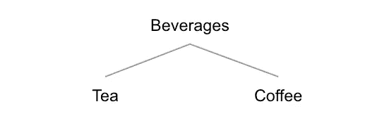
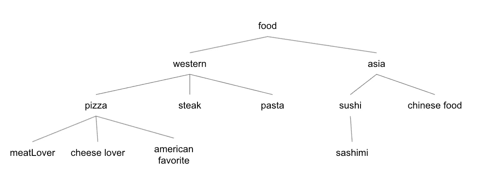

# Swift 中的数据结构:树

> 原文：<https://blog.devgenius.io/data-structure-in-swift-tree-192612915d33?source=collection_archive---------3----------------------->

真的吗？又是数据结构？让我告诉你关于树的事情:]

在 [Unsplash](https://unsplash.com?utm_source=medium&utm_medium=referral) 上由 [Fabrice Villard](https://unsplash.com/@fabulu75?utm_source=medium&utm_medium=referral) 拍摄的照片

在软件工程领域，树是一种重要的数据结构，在某些情况下使用:

*   表示分层数据关系
*   管理排序数据
*   提供快速搜索操作

树型数据结构根据所要解决的问题有不同的变体。在本文中，我们将尝试使用 swift 实现规则的树数据结构。

## 术语

*   节点
    类似于链表，树也由几个节点组成。节点具有类似数据及其子节点属性。
*   父子
    树数据结构是自上而下的，代表现实世界中的一棵树。除了最顶端的节点之外，所有节点都连接到其上的一个节点，该节点称为父节点。然后，节点可以连接到下面的一个或两个节点，这些节点称为子节点。在树形数据结构中，子节点只有一个父节点。
*   Root
    Root 是层次结构中最顶层的节点，没有父节点。
*   叶子是一个没有子节点的节点

## 履行

每个树节点保存一个值或数据，以及子节点。例如，我们有一个表示饮料数据的树。饮料有茶和咖啡之分，它代表了这样的等级:

## 横越

为了遍历一个线性数据结构中的所有数据，可以很容易地用数组或链表来实现。但是在树形数据结构中，遍历有点复杂。有一些遍历算法可以在树数据结构中实现，这取决于我们试图解决的问题。在实现一些遍历算法之前，让我们先创建树。

从上面的树中，这里是分层数据表示:

**深度优先遍历**
遍历技术，即从树根开始，直到探索到尽可能深的地方才回溯。

深度优先遍历可以使用递归实现。我创建的函数是接收闭包，我们以后可以根据需要使用它，在这个示例中，我们只需要分配闭包来打印节点值。遍历的结果如下所示:

**层次顺序遍历** 这种遍历技术是基于深度层次访问树中的每个节点。

为了进行层次顺序遍历，我使用了队列来使我们的工作变得更加容易。让我们看看它的结果如何:

**搜索**
我们现在有两种遍历算法，所以做搜索操作不再困难:]

搜索操作非常简单，只需使用深度优先遍历，就可以得到闭包中的节点。如果节点值与函数参数相同，则只需保存到结果变量并返回:】。

## 要点

*   树和链表有一些相似之处，它们之间的区别是链表只有一个对下一个节点的引用，而树数据结构有多个子节点。
*   除了根节点，每个树节点只有一个父节点
*   诸如深度优先和级别顺序的遍历算法可以在各种树上实现，并且实现可以根据我们如何创建树而不同。